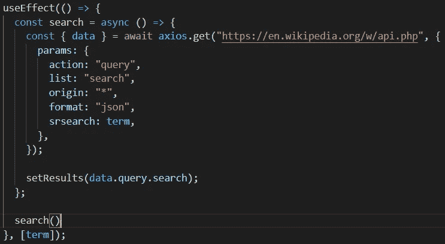
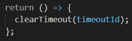

# 使用要点效果(反应)

> 原文：<https://javascript.plainenglish.io/useeffect-key-notes-react-8fa1b3d92ce4?source=collection_archive---------4----------------------->

如果您正在使用 React 的钩子系统，那么您正在使用 useEffect 生命周期方法来代替基于类的组件通常使用的 componentDidMount 方法。在这种方法中，几乎总是有与您发出的 HTTP 请求相关的代码。这篇文章的目的是展示和解释一些关于 useEffect 的简洁要点，为你的应用程序增添趣味。

## **useEffect 的第二个参数:**

与我在以前的文章中展示的每个示例一样，它将采用简单搜索组件的形式:

注意在最后还有第二个参数`[term]`。下面是 useEffect 的第二个参数的规则:

*   第二个参数只能是以下三种情况之一:**空白**、空数组**或元素在**内的**数组。**
*   如果第二个参数是 **blank** ，那么 useEffect 将只在组件的初始渲染上运行。
*   如果第二个参数是一个**空数组**，那么 useEffect 将在初始渲染和每次重新渲染时运行
*   如果第二个参数是一个填充了元素的**数组，那么如果**数组中的数据发生变化，useEffect 将在初始渲染和每次重新渲染**时运行。**

这与搜索功能有什么关系？

如果我们看一下第二个参数，它是一个数组，里面有一个元素叫做`term`。在这个假想的应用程序中的某个地方，有一个`onChange`事件记录着这个术语(每个字符的变化)。

第二个参数允许我们在不需要`onSubmit`事件的情况下发出请求。这是一个给你的应用程序添加一些特色的好方法。每次按键都会自动为你搜索。

**2。useEffect 的返回语句:**

`return`的使用效果非常独特。它只有一条规则:

*   只能返回一个箭头函数。

最初呈现组件时，不会调用`return`，但会保存对函数的引用。当组件重新呈现时，也就是在其他任何东西运行之前调用返回的时候。用`console.log`自己试试。

这个怎么用？

对于示例中的搜索组件，每次按键都会执行一次搜索，这会产生大量您不一定想发出的请求。为了解决这个问题，你可以做一个简单的`setTimeOut`来延迟按键后的搜索时间。但是，这样做的问题是，计时器不会每次按键都重置，而是从第一次按键开始，并在该按键的准确时间结束。因此，如果你键入“电动汽车”，它可能会在中间进行搜索，只搜索“电动”，因为计时器仍在运行。

我们如何解决这个问题？

嗯，你可以增加计时器的持续时间或者打得更快。但是在每次重新渲染后清除它会更实际。这就是上面例子中的 return 语句的作用。每次按键后，计时器会重置，这样你就可以输入长单词/句子，比如“我如何使用 useEffect？”而不需要计时器在中间调用搜索。试试看！

*更多内容尽在*[***plain English . io***](http://plainenglish.io/)