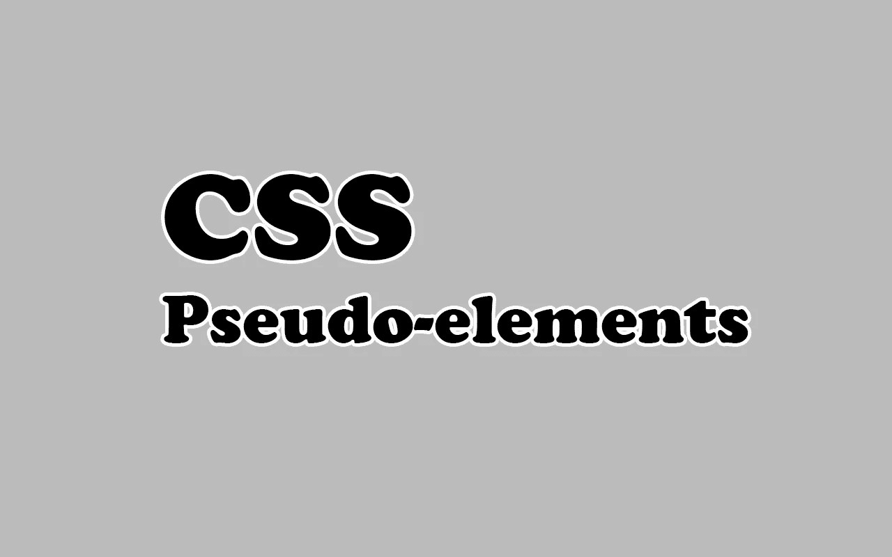
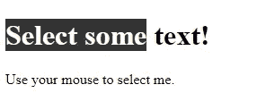

# 你需要知道的有用的 CSS 伪元素

> 原文：<https://javascript.plainenglish.io/useful-css-pseudo-elements-that-you-need-to-know-8819ad09a952?source=collection_archive---------17----------------------->

## 通过例子了解 CSS 中的伪元素。



Image created with ❤ ️️By [author](https://mehdiouss315.medium.com/).

# 介绍

作为一名 web 开发人员，CSS 是必须具备的技能。你会发现自己总是在和它一起工作。这是一个很棒的工具，可以同时控制多个网页的布局，并使它们响应迅速。CSS 有很多有用的特性，这使它成为 web 开发中一种强大的样式表语言。

在本文中，我们将用一些例子来介绍 CSS **伪元素**，以帮助你理解这个概念。让我们开始吧。

# 什么是伪元素？

CSS 伪元素用于样式化元素的指定部分。它们是网页上的可见元素，直接从 CSS 插入，不会弄乱标记。所有主流浏览器都支持伪元素，因为它们是 CSS2 的一部分。

例如，您可以在 CSS 中使用伪元素来样式化文本的首字母或首行，在前面或后面插入内容，等等。

下面是伪元素语法的一个示例:

```
selector**::pseudo-element** {
  property: value;
}
```

有不同类型的伪元素，我们将在下面介绍它们。

# 首字母伪元素

伪元素`::first-letter`用于为文本的第一个字母提供特殊的样式。

请看下面的例子，我们将为段落元素中的第一个字符提供一种特殊的样式:

```
<!DOCTYPE html>
<html>
<head>
<style>
p**::first-letter** {
  color: red;
  font-size: xx-large;
  font-weight: 900;
}
</style>
</head>
<body><p>CSS is a great stylesheet language.</p></body>
</html>
```

*输出:*


First-letter pseudo-element.

注意，`::first-letter`伪元素只能应用于块级元素。

# 第一行伪元素

伪元素`::first-line`用于将特殊样式应用到网页上文本的第一行。

看看下面的例子:

```
<!DOCTYPE html>
<html>
<head>
<style>.text**::first-line** {
  color: red;
  font-variant: small-caps;
}
</style>
</head>
<body><p class="text">Lorem ipsum dolor sit amet, consectetur adipiscing elit. Vivamus id dictum nunc. Mauris dolor urna, varius nec tristique nec, tincidunt eget ex. Suspendisse mollis mauris at lacinia congue. Praesent in mauris eget justo elementum malesuada ac non ante. Quisque eget vestibulum ante. Ut sed facilisis nisi. </p></body>
</html>
```

*输出:*


First-line pseudo-element.

# before 伪元素

伪元素`::before`用于在 HTML 元素的内容之前添加内容*。*

让我们看看下面的例子，我们在 HTML 中可用的所有元素`h1`之前插入了文本内容:

```
<!DOCTYPE html>
<html>
<head>
<style>
h1**::before** {
  **content: 'My name is ';**
}
</style>
</head>
<body><h1>John</h1><h1>Chris</h1></body>
</html>
```

*输出:*


The before pseudo-element.

您还可以插入不同类型的元素，如图像。

```
h1::before {
  **content: url('image.jpg');**
}
```

*输出:*


The before pseudo-element.

# after 伪元素

伪元素`::after`用于在 HTML 元素的内容之后添加内容*。*

这是我们上面使用的同一个例子的输出，我们只是用`after`替换了`before`:


# 选择伪元素

伪元素`::selection`匹配用户在网页上选择的元素部分。通过使用这个 CSS 伪元素，我们可以改变用户用鼠标选择的内容的样式。

这里有一个例子:

```
<!DOCTYPE html>
<html>
<head>
<style>**::selection** {
  color: white;
  background: black;
}
</style>
</head>
<body><h1>Select some text!</h1><p>Use your mouse to select me.</p></body>
</html>
```

*用户选择文本时的输出:*



The selection pseudo-element.

以下属性:`color`、`background`、`cursor`、`outline`可以应用于伪元素`::selection`。

# 结论

使用 CSS 时，伪元素非常有用和重要。所有主流浏览器都支持它们，你可以用它们实现很多很酷的东西。你只需要一点点创造力。

感谢您阅读本文，希望您觉得有用。

# 更多阅读

*如果你对 JavaScript 和 web 开发相关的更有用的内容感兴趣，也可以* [*订阅*](https://mehdiouss.ck.page/) *我的快讯。*

*下面是另一篇有用的文章，请点击链接查看:*

[](https://medium.com/javascript-in-plain-english/5-powerful-ides-that-nobody-is-talking-about-c20ed0ae83ee) [## 没有人谈论的 5 个强大的 IDEs

### 一些你可能需要使用的有用的文本编辑器。

medium.com](https://medium.com/javascript-in-plain-english/5-powerful-ides-that-nobody-is-talking-about-c20ed0ae83ee)