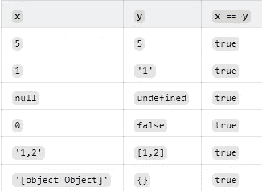
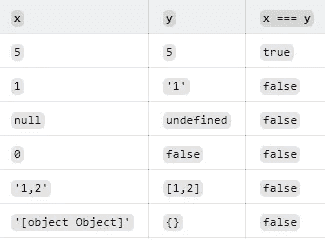

# 面试中你可能会遇到的有用的 JavaScript 问题

> 原文：<https://javascript.plainenglish.io/useful-javascript-questions-you-might-face-during-interviews-a7e0d64e3946?source=collection_archive---------10----------------------->

## 为你接下来的面试准备一些 JavaScript 问题。


Photo by [Michael DeMoya](https://unsplash.com/@demoya?utm_source=medium&utm_medium=referral) on [Unsplash](https://unsplash.com?utm_source=medium&utm_medium=referral)

雇主测试你的技术和非技术技能的方法之一是对你进行面试。作为一名开发人员，如果你想增加获得工作的机会，你应该在去面试之前做好准备。

面试的时候如果有什么不知道的，就骄傲的说我不知道。是的，说我不知道比给出一个愚蠢的答案要好得多。除此之外，你不必什么都知道。自信一点，向他们展示一个更好的你。

在本文中，我将回答一些您在面试中可能会遇到的 JavaScript 问题。让我们开始吧。

# JavaScript 中的作用域是什么？

范围是每个 JavaScript 开发人员都应该熟悉的重要概念之一。它是我们可以访问代码中的变量和函数的地方。

JavaScript 中有三种类型的作用域:

*   *全局作用域:*它是可以随处访问变量和函数的地方。如果一个变量或函数有一个全局范围，这意味着我们可以在代码的任何地方访问它。
*   *函数作用域:*只能访问函数内部变量和参数的区域。如果一个函数或变量有函数作用域，这意味着它只能在函数内部被访问。
*   *块范围:*只能在块`{}`内访问变量和函数的地方。用`let`和`const`声明的变量有一个块范围，这意味着它们只能在那个块范围`{}`内被访问。

看看下面的例子:

```
**var name = 'Mehdi';** //global scope(this variable can be accessed everywhere)function getInfo(){
    **var age = 19;**
//function scope(age is accessible only inside this function)
    return name + age;
} {
  **let text = 'pizza';**
//Block scope(text is only accessible inside this block)
}
```

这是怎么回答的，能举的总要举例子。

# 什么是吊装？

提升是 JavaScript 中的重要概念之一。它是在执行程序之前将变量和函数声明移到作用域顶部的过程。

让我们看看下面的例子:

*吊装发生前:*

```
**var name**  = "Mehdi";
**var age** = 19;**var isOnline** = function(){
    return true;
}
```

*吊装后:*

```
**var name;
var age;
var isOnline;**name  = "Mehdi";
age = 19;isOnline = function(){
    return true;
}
```

正如你所看到的，在提升之后，所有的声明都移动到了顶部。这就是为什么如果你在 JavaScript 中使用`var`，你可以在声明变量之前赋值。

这就是提升，当程序执行的时候，所有的声明都被移动到顶部。另外，请记住，用`let`和`const`声明的变量在 JavaScript 中不会被提升。

如果你想了解更多关于 JavaScript 提升的知识，可以看看我下面的文章:

[](https://medium.com/dev-genius/4-things-you-should-know-about-javascript-hoisting-8b53803a1ed0) [## 关于 JavaScript 提升你应该知道的 4 件事

### 用实例理解 JavaScript 提升

medium.com](https://medium.com/dev-genius/4-things-you-should-know-about-javascript-hoisting-8b53803a1ed0) 

# let var 和 const 的区别？

在 JavaScript 中，有三个关键字可以用于变量声明:`var`、`let`和`const`。

`let`和`const`有点类似，它们都是在 ES6 中引入的，它们都有一个 block 作用域，就像我上面给你展示的那样。这意味着它们在块范围`{}`之外是不可访问的。除此之外，用`let`和`const`声明的变量不会被提升。

所以`let`用于变化的变量，`const`用于我们不想改变的常量变量。

关键字`var`从 JavaScript 开始就已经存在了。它有一个功能范围，并且总是被提升。

# `==`和`===`的区别？

这两个运算符总是让很多初学者感到困惑。不过很简单，运算符`==`只比较两个值强制后的值。

运算符`===`在不强制的情况下比较两个值的值和类型。

根据我们比较的值，两个操作符都返回布尔值`true`或`false`。

这里有一个例子:

```
1 == '1'; //true1 === '1' //false
```

在上例中，`1`和`"1"`具有相同的值(1)。但是它们没有相同的类型，数字`1`有数字类型，字符串`"1"`有字符串类型。

由于运算符`==`只比较值，所以我们得到`true`，因为它们具有相同的值。但是操作符`===`比较类型和值，因为它们没有相同的类型，所以它返回`false`。

为了更好地理解，请看下面的例子:



x == y.



x === y.

# JSON 是什么？

JSON 代表 JavaScript 对象符号。这是一种我们用来从服务器向网页存储和传输数据的格式。

JSON 语法类似于 JavaScript 对象符号语法。但是 JSON 格式是纯文本的。

如果您想了解更多关于 JSON 的知识，请查看我下面的文章:

[](/how-to-work-with-json-in-javascript-60fd9a986cb1) [## 如何在 JavaScript 中使用 JSON

### 通过实际例子了解 JSON

javascript.plainenglish.io](/how-to-work-with-json-in-javascript-60fd9a986cb1) 

# 如何编写异步 JavaScript 代码？

JavaScript 是一种单线程同步语言，这意味着它一次只能执行一个任务。然而，我们仍然可以编写能够一次执行多个任务的异步 JavaScript 代码。

是的，通过回调、承诺或异步/等待，我们可以用 JavaScript 编写异步代码。

# 什么是 ES6 模块？

ES6 模块`export`和`import`允许您从一个文件共享、导出和导入代码到另一个文件。这是在 JavaScript 文件之间共享代码的好方法。

在普通的 JavaScript 中，你必须首先告诉浏览器你正在使用模块。你可以通过在 HTML 的 head 标签中放一个带有`type="module"`的模块脚本来实现。

```
**<script type="module" src="fileName.js"></script>**
```

比方说，你想从一个名为`index.js`的 JavaScript 文件导入一个函数到另一个名为`app.js`的文件中。为此，您必须先导出函数，然后再导入它。

这里有一个例子:

*导出:*

```
**export** const multiply = (a, b) => {
  return x * y;
}
```

*导入:*

```
**import** { multiply } from './index.js';
```

就这样，现在你可以使用文件`app.js`中的函数`multiply`了。

关于 ES6 模块的更多信息，您也可以查看我下面的文章:

[](/understand-javascript-modules-import-and-export-syntax-f231c5e2fafd) [## 理解 JavaScript 模块:导入和导出语法

### 通过实际例子理解 JavaScript ES6 模块

javascript.plainenglish.io](/understand-javascript-modules-import-and-export-syntax-f231c5e2fafd) 

# 结论

如您所见，这些只是您在面试中可能会遇到的一些随机的 JavaScript 问题。这就是为什么我决定在这篇文章中回答他们。如果您对本文的第二部分感兴趣，请告诉我，我将在第二部分回答更多的 JavaScript 面试问题。

感谢您阅读这篇文章。希望你觉得有用。

**更多阅读:**

[](/6-useful-github-repositories-for-all-web-developers-44f26912fd66) [## 6 个对所有 Web 开发者有用的 GitHub 库

### 每个 web 开发人员都应该知道的令人敬畏的 GitHub 库。

javascript.plainenglish.io](/6-useful-github-repositories-for-all-web-developers-44f26912fd66) 

[*更多内容看 plainenglish.io*](http://plainenglish.io/)