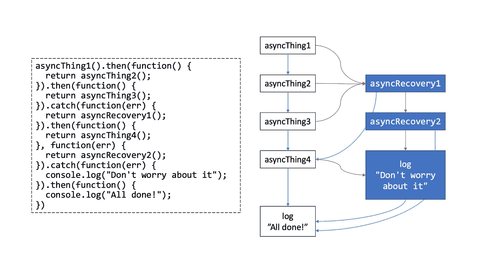

# 同步您的异步代码

> 原文：<https://javascript.plainenglish.io/useful-javascript-tips-tricks-and-best-practices-synchronize-your-asynchronous-code-4da04126c491?source=collection_archive---------9----------------------->

## 思维程序员

## 提高 web 开发的 JavaScript 技巧。


Photo by [Christina @ wocintechchat.com](https://unsplash.com/@wocintechchat?utm_source=medium&utm_medium=referral) on [Unsplash](https://unsplash.com?utm_source=medium&utm_medium=referral)

“*你好！*

*在加载脚本时，我们有一系列要一个接一个执行的异步任务。*

你怎么能给它编程呢？

在编码面试中，这是一个具有挑战性的问题。



the promise chain

目标是确保异步块的执行只能在前一个块完成时开始。

# 解决方案

“*承诺可以被链接*”，其中一个最重要的承诺是链接和管理异步操作序列的能力。

> 作为 ES6 的一部分，Promises 是 JavaScript 最重要的增强之一。

这种承诺能力包括同步操作的两个关键特性，如下所示(或者`then()`接受两个回调)。

*   得到结果后，调用`resolve()`，传递最终结果。
*   如有错误，请致电`reject()`。

这个想法是通过`.then()`处理程序链传递结果。

# 让我们来看看这是怎么回事……！

我们编写一个`wait()`函数，它返回一个`Promise`，该函数使用`setTimeout()` 函数延迟一段指定的时间。

```
const wait = (ms) => new Promise((res) => setTimeout(res, ms))
```

下面是一个非常基本的示例代码，演示了一个连锁承诺。

```
wait(3000).then(function () {
    console.log("promise 1")
}).then(function () {
    console.log("promise 2")
}).then(function () {
    console.log("promise 3")
})
```

代码的第二部分是链接发生的地方。我们首先调用刚刚创建的`wait()`;既然它会返回一个`Promise`，我们就可以对它调用`then()`。现在，既然那么回报一个承诺，我们可以链另一个然后调用它；这将在承诺解决后执行。

因为我们需要一个维护其内部状态的函数，这可以通过如下的闭包来实现。

```
const synchronize = (() => {
    let chain = Promise.resolve()
    return async (promise) => {
        return chain = chain.then(promise)
    }
})()
```

*   `Promise.resolve()`是`chain`的开始。每隔一个调用附加到这个`Promise`。
*   我们有`async`关键字，你把它放在一个函数声明的前面，把它变成一个异步函数。

# 应用程序

现在，当您调用以下函数时，后续调用将等待前面的完成。

*   第一区

```
synchronize(async () => {
    await wait(1000)
    console.log("Block 1 start")
    await wait(1000)
    console.log("Block 1 end")
})
```

*   第二区

```
 synchronize(async () => {
    await wait(1000)
    console.log("Block 2 start")
    await wait(1000)
    console.log("Block 2 end")
})
```

*   第三区

```
synchronize(async () => {
    await wait(1000)
    console.log("Block 3 start")
    await wait(1000)
    console.log("Block 3 end")
})
```

上述程序的输出会是什么？顺序是:`Block 1 -> Block 2 -> Block 3`。

```
Block 1 start
Block 1 endBlock 2 start
Block 2 endBlock 3 start
Block 3 end
```

# 结论

上面的例子展示了如何链接承诺，以便使用 then 将一个承诺的响应传递给下一个承诺。

我们可以看到，承诺为 JavaScript 中异步操作的链接提供了一个很好的机制。

这比`callback`方法要好。

很简单，对吧？

*更多内容看*[***plain English . io***](http://plainenglish.io/)