# 对初学者有用的 React 提示和技巧

> 原文：<https://javascript.plainenglish.io/useful-react-tips-and-tricks-for-beginners-69dd7f414588?source=collection_archive---------5----------------------->

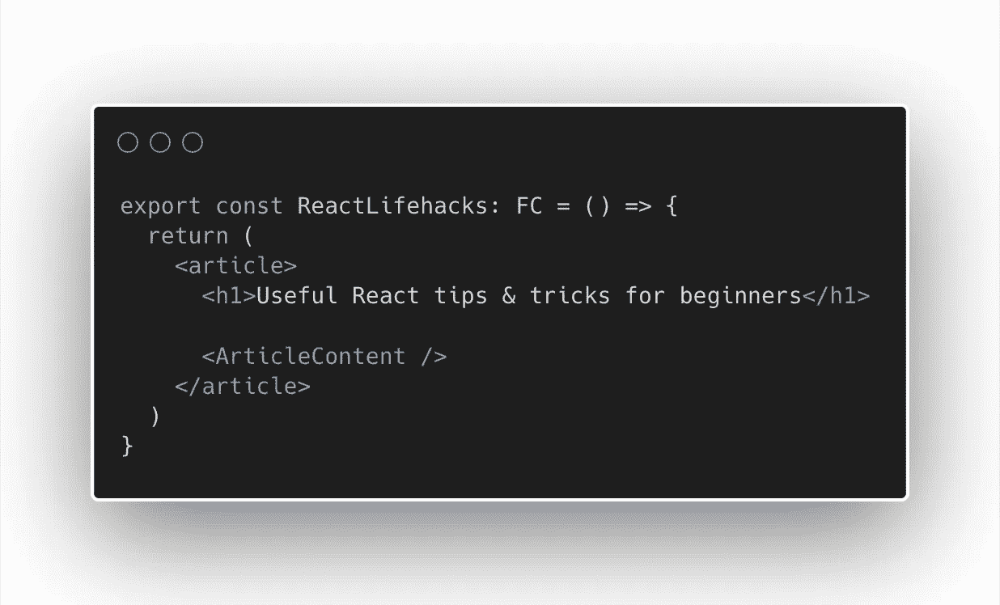

这里有一些简单的提示和技巧，供 React 初学者使用。其中一些是 React 的核心原则，一些只是帮助您进行开发的简单生活窍门。

# 渲染期间没有副作用

无论你是使用类还是 FCs，渲染体本身都不应该包含任何副作用，而且最好不要有昂贵的计算。

# 什么是副作用？

副作用是函数式编程中众所周知的一个术语，指的是除了返回值之外影响函数之外的任何东西的每一个操作。如果一个函数没有任何副作用，它的输出只依赖于它的参数，那么这个函数就叫做纯函数。

由于 React 呈现组件的方式，它可能会多次呈现组件，或者在不更新 DOM 的情况下呈现组件。这就是为什么组件的主体不应该包含任何副作用。在开发中尽可能增加额外的渲染来暴露任何副作用。

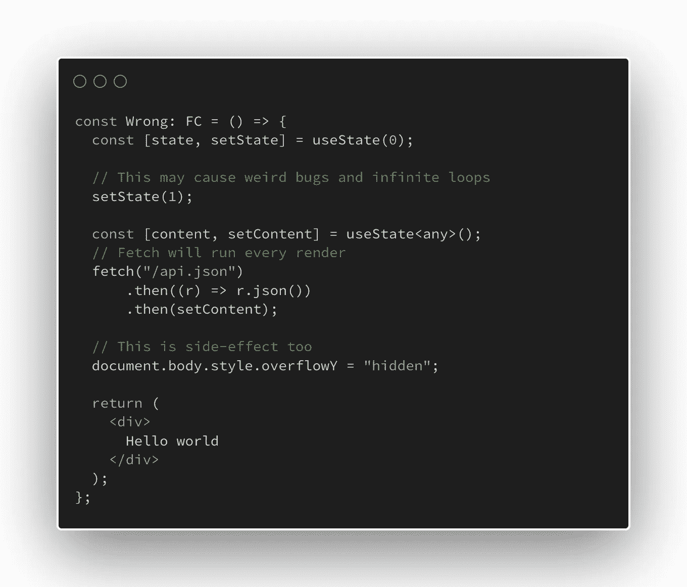

现在让我们清理组件:

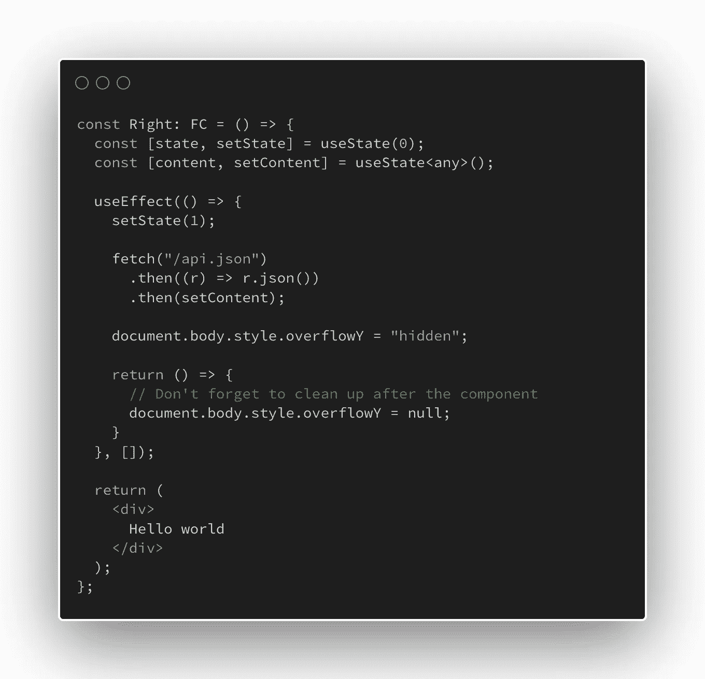

# 优化昂贵的计算

每当组件中的一个值改变时，React 都会重新渲染整个组件，这意味着组件的渲染应该尽可能的轻量级。

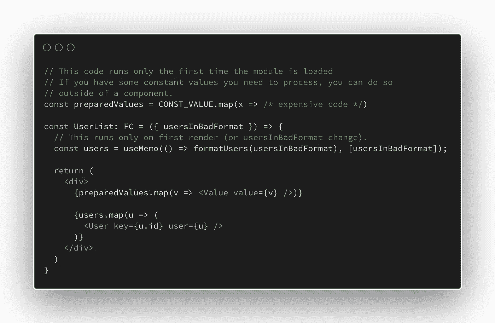

# 一个文件中的多个组件

许多人和许多代码库强制执行每个文件应该只包含一个组件的规则。这通常会导致混乱和糟糕的开发体验，因为人们不想将组件分割成多个文件。

当从数组呈现 UI 时，可能需要调用一个钩子。这可以通过在原始组件下创建一个新组件来轻松解决。

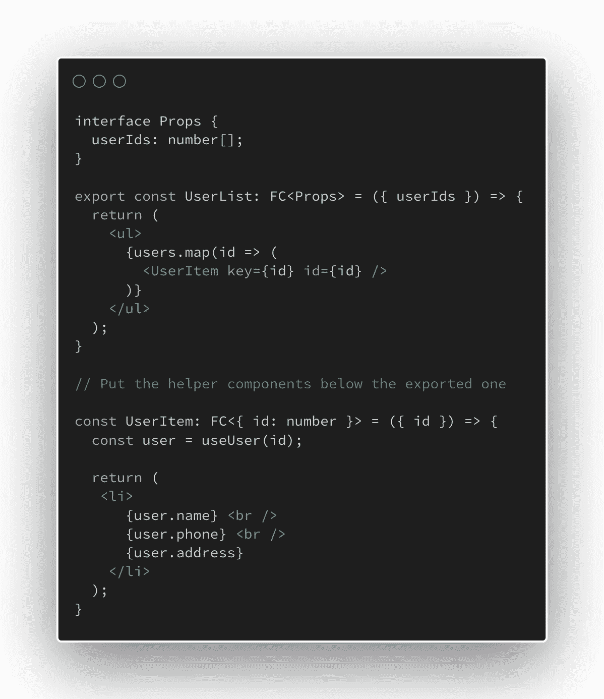

通常，我尝试每个文件只导出一个组件，但是在很多情况下，多个导出的组件是有意义的。

# Typescript: ReactNode 类型

当你使用 React 和 Typescript 来定义组件的属性时，许多人使用 string 作为类型来将内容传递给 React 将在内部呈现的组件。但是 React 可以呈现的不仅仅是字符串。ReactNode 是一个类型别名，包含 React 可以呈现的所有类型。

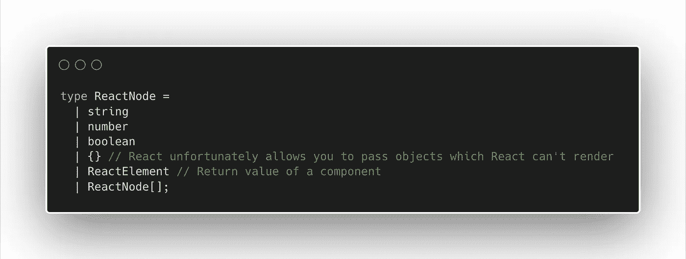

警告:ReactNode 将允许你传递 React 不能渲染和抛出的对象。

这将允许我们传递 React 可以显示的任何值，而不仅仅是一个字符串:

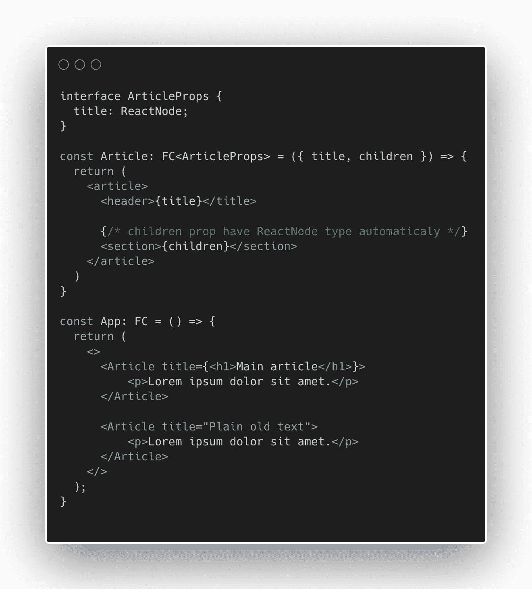

# 用以前的状态设置状态

在大多数情况下，你不需要状态钩子的前一个状态来设置它的值，但是如果你需要的话，你应该依赖于作用域中的值。不仅你不能经常接触到它，而且它可能已经过时了。

设想一个场景，您需要一次更新两次状态(例如在 onClick 事件中)。如果您只是调用 setState 两次，而没有使用函数来获得新的状态，React 将放弃第一次 setState 调用，因为作用域在 JS 中是如何工作的。

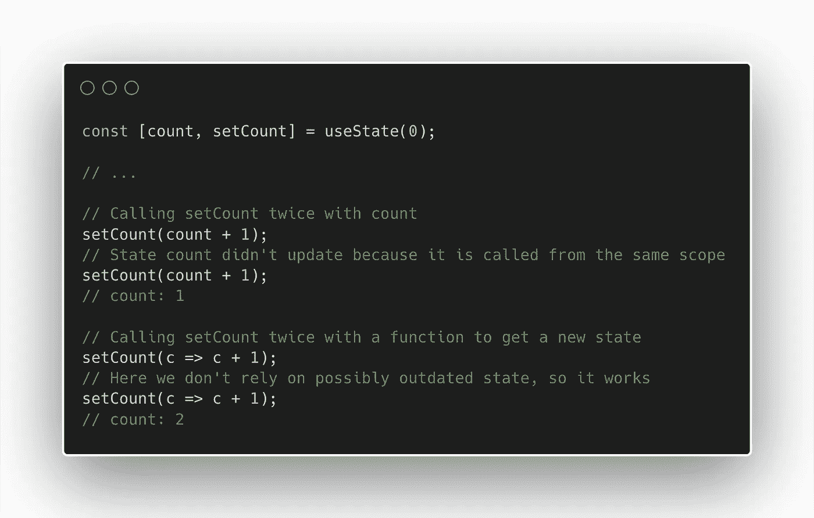

# JSX 的 Console.log

React 几乎可以渲染任何东西，包括 undefined。这意味着你可以在 JSX 调用任何没有返回值的函数。您通常不希望这样做，因为这些函数通常会带来副作用，但是对于调用 console.log 来说，这是非常理想的。

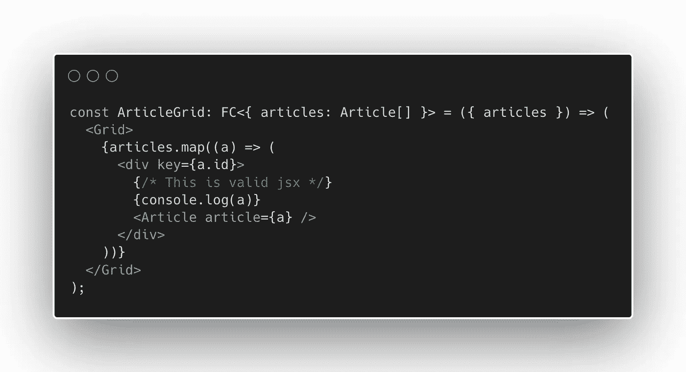

# 传播不是深度复制

ES6 带来了将属性从一个对象复制到另一个对象的能力。尽管这是一个很棒的特性，React 也非常依赖它，但它实际上经常被误解。这不是一个深刻的副本。如果复制带有对象的特性，则仅复制对象引用，而不复制对象本身，并且对象将共享它。这叫做浅拷贝。

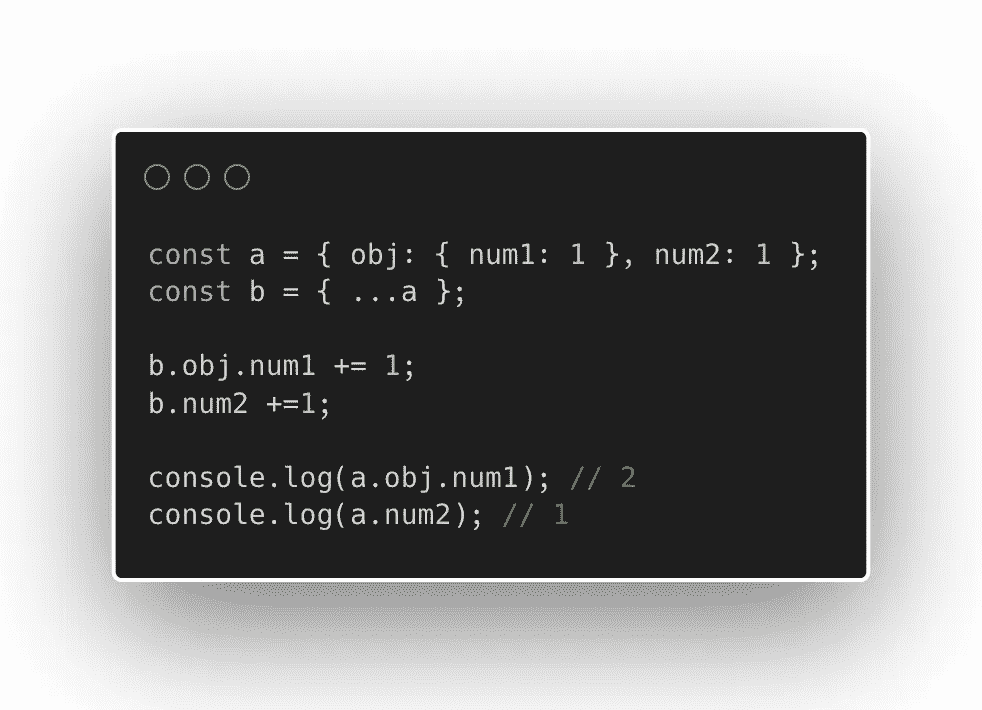

这意味着如果你变异了一个，另一个也会变异。当您在 React 中设置状态时，您希望避免它。您可以复制整个对象及其所有子对象，这很慢，并且您需要一个外部库(例如 lodash)，或者您可以只嵌套 spread 操作符，这只会创建您需要的副本。

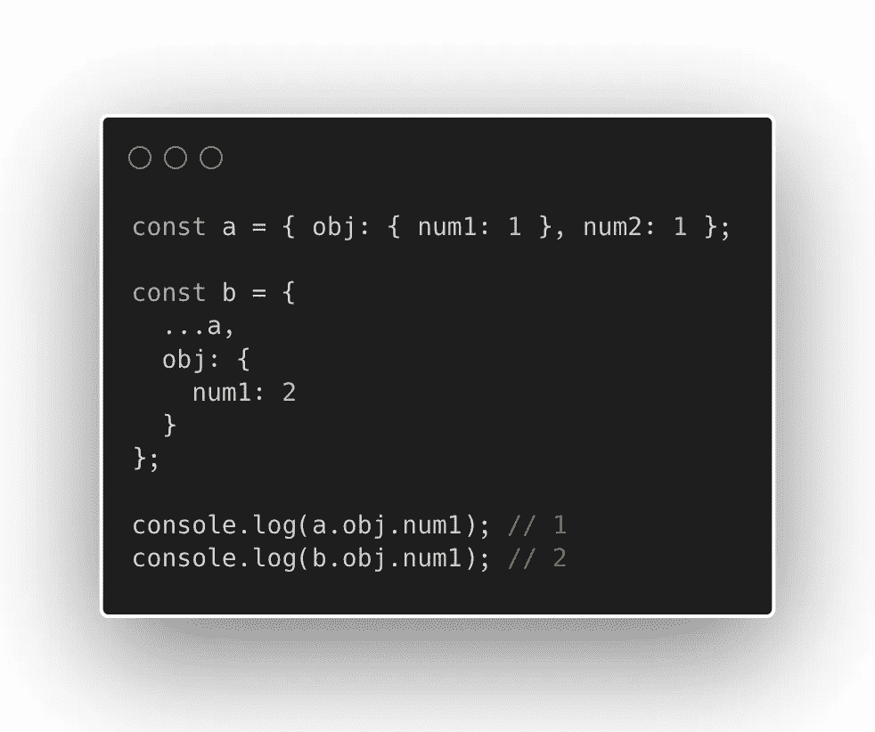

## 结论

就这些了，非常感谢你阅读这篇文章。如果你有任何反馈，一定要在评论里告诉我。

*更多内容看*[***plain English . io***](https://plainenglish.io/)