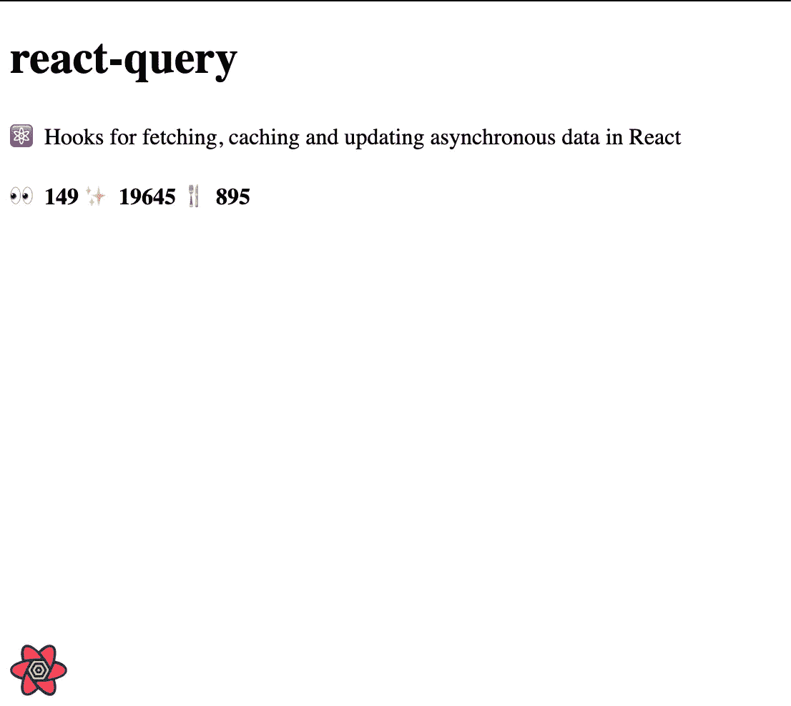
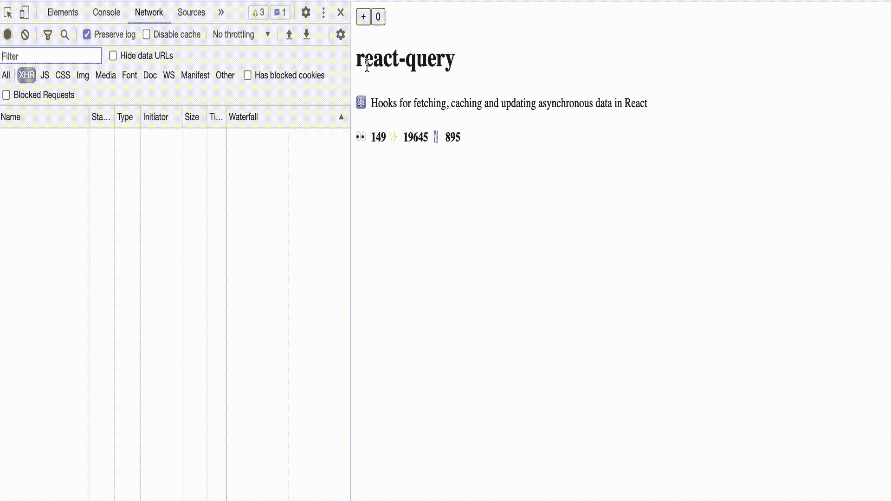

# 调用 API 时使用 Query 而不是 Fetch

> 原文：<https://javascript.plainenglish.io/usequery-instead-of-fetch-while-calling-an-api-ef12964457c5?source=collection_archive---------5----------------------->


# 介绍

与 Angular 不同，React 没有自己的抓取库。所以开发人员用他们自己的实现从服务器获取数据。但问题是，很难编写基于缓存的获取系统来有效地避免网络调用重复。

所以他们选择了一个非常简单的库来获取数据，比如`fetch`、`Axios`等等。

# 反应查询

React Query 经常被描述为 React 缺少的数据获取库。它用自己的缓存机制将数据提取到服务器。

它有自己的开发工具，名为`ReactQueryDevtools`


# 装置

通过 NPM 或纱线安装`react-query`

```
$ npm i react-query*# or*$ yarn add react-query
```

React Query 与 React v16.8+兼容，可与 ReactDOM 和 React Native 配合使用。

# 基本示例

在这个例子中，我们将通过使用`react-query`来调用 Github API

它给出了这样的输出



**性能测试**

在这里，我将测试网络呼叫重复避免系统。所以我添加了一个简单的带有反应状态的计数器。当状态更新时，组件应该重新呈现，因此`react-query`应该避免多个网络调用。

它会产生这样的输出。


让我们看看网络选项卡。



我们可以清楚地看到，`react-query`从缓存中加载数据，避免了多次网络调用。

请尝试使用 react-query 来获取数据。

# TL；速度三角形定位法(dead reckoning)

在 React 应用程序中，使用`useQuery`而不是`fetch`进行网络调用。它为缓存提供了极好的支持，避免了对同一个 API 的多次调用，记忆查询结果等等。

官方链接:[https://react-query.tanstack.com/](https://react-query.tanstack.com/)

安装命令:`npm install react-query`

**感谢您的阅读！**如果你喜欢这篇文章，可以考虑[在 Twitter 上关注我](https://twitter.com/NaveenDA_)，并与你的开发者朋友分享这篇文章🐋😀

*更多内容请看*[***plain English . io***](http://plainenglish.io)