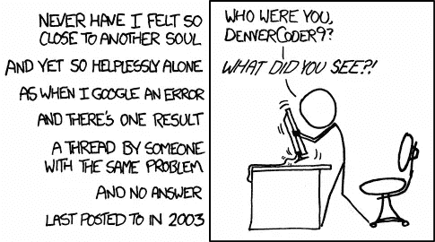
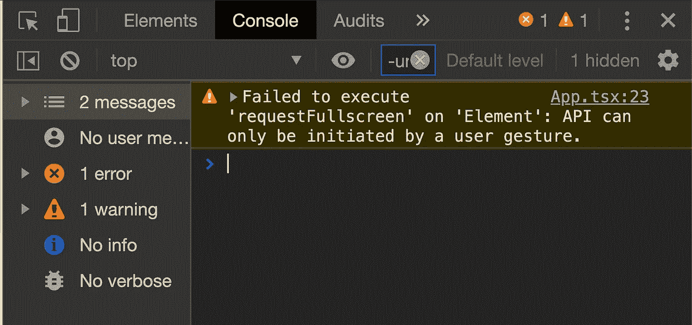

# 用户手势限制的 Web APIs

> 原文：<https://javascript.plainenglish.io/user-gesture-restricted-web-apis-d794454453f7?source=collection_archive---------1----------------------->

## API 只能通过用户手势来启动——这个错误意味着什么，如何修复它？



在处理 Web APIs 时，您会遇到以下错误:

```
API can only be initiated by a user gesture
```



为什么会出现这个错误，它到底意味着什么？

# 为什么会这样？

这个错误意味着您试图调用的 *API 不能仅仅在您的代码中调用，它需要通过用户手势*来启动。

让我们以[全屏 API](https://developer.mozilla.org/en-US/docs/Web/API/Fullscreen_API) 为例。这个 Web API 有一个方法`Element.requestFullscreen()`，它将目标`element`和整个浏览器的网页置于全屏模式。

下面是一个页面加载后立即调用`requestFullscreen`的例子:

这段代码将 ***不起作用*** ，因为动作不是由用户手势发起的。应用此限制是为了使您不能强制网站以全屏模式显示，您只能通过用户手势或动作进入全屏模式。

这种限制背后的主要原因是出于 ***安全*** 原因——想象一下，如果视频可以在您没有选择播放的情况下自动播放，或者恶意网站可以在您访问网页时占据您的整个屏幕。将这些 API 方法限制为用户手势确保它们是用户想要的*。*

# *我该怎么办？*

*为了修复这种类型的错误，需要在用户操作的事件监听器中调用 API 方法，比如一个`click`或`keydown`事件。*

*这里有一个例子，当点击一个按钮时，我们调用`requestFullscreen`来修复上面的错误:*

*[有效的用户手势](https://html.spec.whatwg.org/multipage/interaction.html#triggered-by-user-activation)包括:*

*   *`change`*
*   *`click`*
*   *`contextmenu`*
*   *`dblclick`*
*   *`mouseup`*
*   *`pointerup`*
*   *`reset`*
*   *`submit`*
*   *`touchend`*

*事件如`mousemove`或`mouseenter`是 ***不是*** 有效的用户手势。*

# *结论*

*总之，出于安全原因，浏览器阻止某些脚本运行，除非被用户操作触发。这也适用于除`Fullscreen`之外的方法，例如通过`[HTMLMediaElement.play()](https://developer.mozilla.org/en-US/docs/Web/API/HTMLMediaElement)`播放视频或音频。*

**希望这有所帮助！**