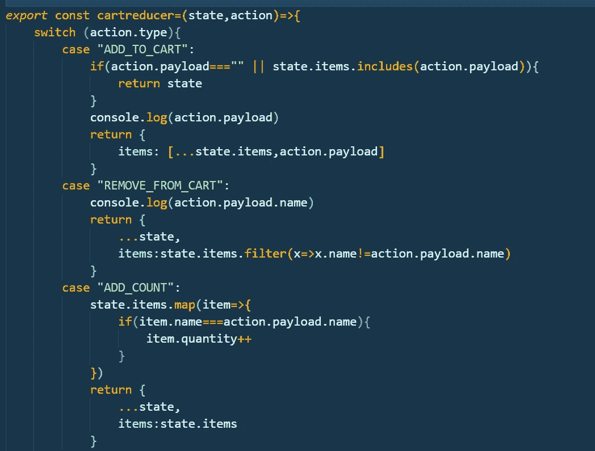

# 如何使用“useReducer”和“Use context”:React 挂钩教程

> 原文：<https://javascript.plainenglish.io/usereducer-along-with-usecontext-react-hooks-b558be82dd4d?source=collection_archive---------3----------------------->

一直在寻找学习 React hooks 的完美教程或资料，即`useReducer`和`useContext`。但是我没有发现任何有用的东西。所以我工作了一段时间，为你们所有人创造了这些内容。

在本教程中，我们将使用 useReducer 和 useContext 来维护一个全局状态，该状态在整个项目中都可用，并且可以从任何子组件中修改状态变量。

我们大多数人都知道上下文 API 可以用来维护一个全局变量，这个变量在整个代码中都是可用的。

然后用 reducers 来维护一个状态，并有一个调度方法来改变状态。

让我们将这两者结合起来，通过上下文发送状态和分派方法，这样状态和分派方法将在所有组件中可用，并且状态可以被使用和改变，这在 reducer 中提到过。

# 密码

让我们进入代码

我已经创建了一个具有添加到购物车功能的购物车，并改变了数量和代码如下所示。

1.  **创建状态和减速器**

这是我用 items 数组创建的初始状态。它包含我选择的项目。

使用以下方法创建异径管:

**2。创建上下文并结合 reducer】**

我已经创建了一个名为 **Usercontext** 的上下文，并初始化了返回状态和分派方法的 reducer。我已经通过上下文发送了状态和分派方法。

**3 .在子组件中使用状态和分派方法**

这是一个子组件，我在其中使用了带有参数 **Usercontext** 的 useContext 钩子。这里我可以使用 state 和 dispatch 方法来改变 reducer 中提供的全局状态。

另一个组件

**使用状态**

感谢您阅读文章。你可以在 GitHub 上找到完整的代码。

 [## GitHub-NaveenkumarMD/Cart-with-reducer-and-context

### 在 GitHub 上创建一个帐户，为 NaveenkumarMD/Cart with-reducer-and-context 开发做贡献。

github.com](https://github.com/NaveenkumarMD/Cart-with-reducer-and-context) 

*更多内容看* [***说白了. io***](http://plainenglish.io/)