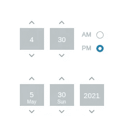
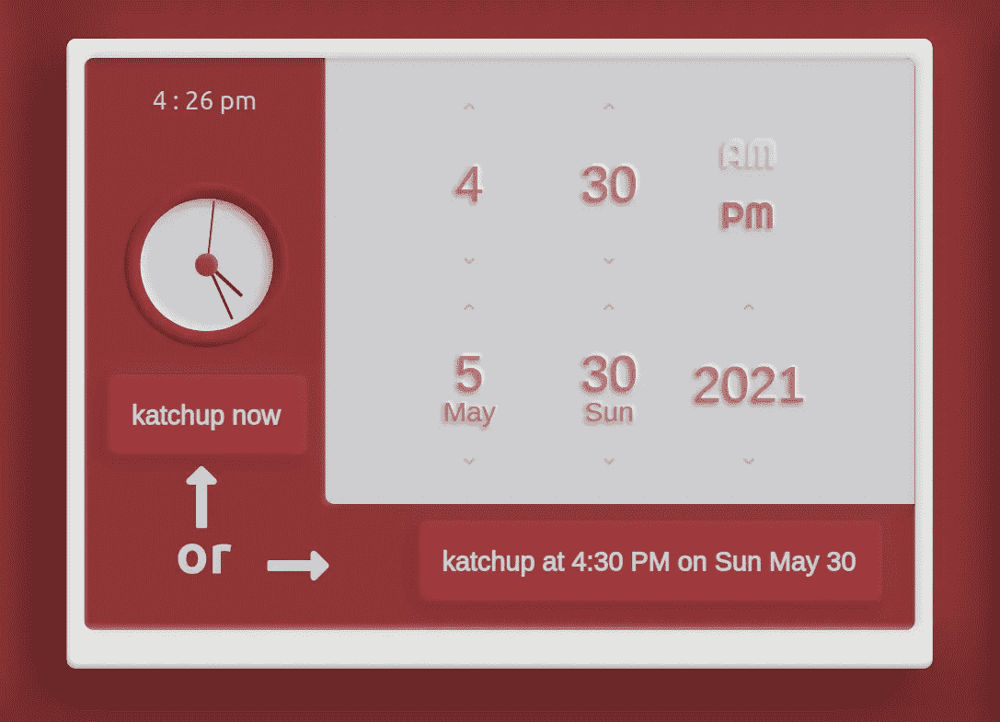
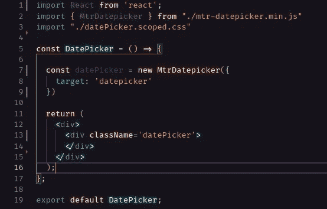
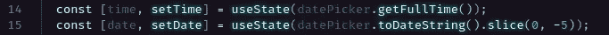
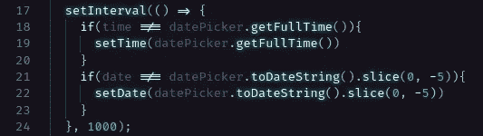
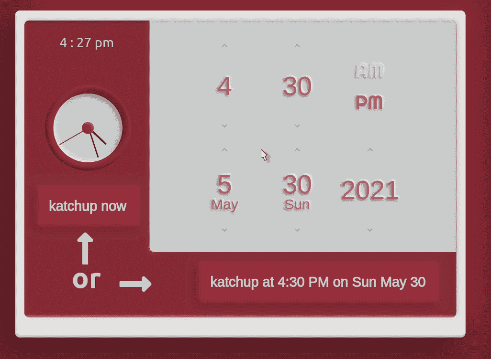
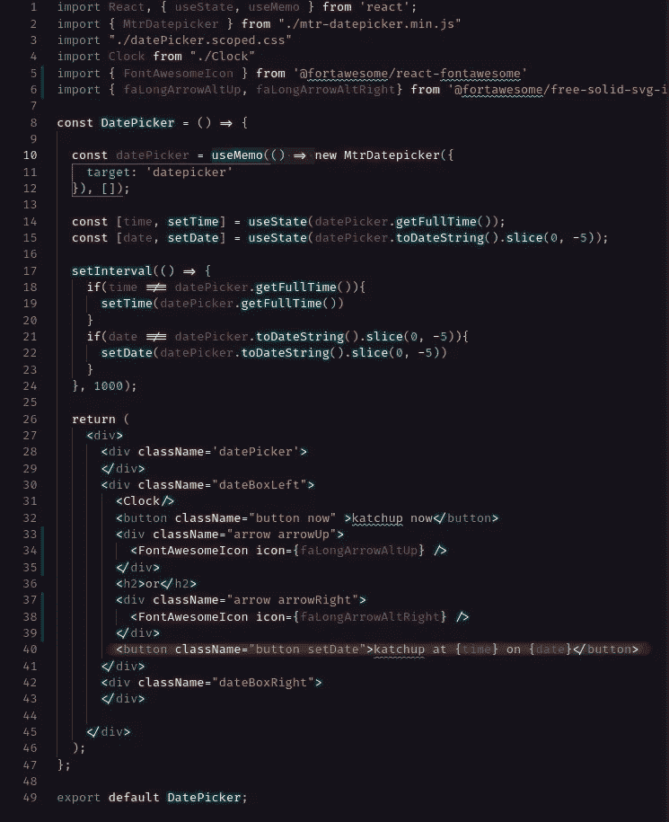
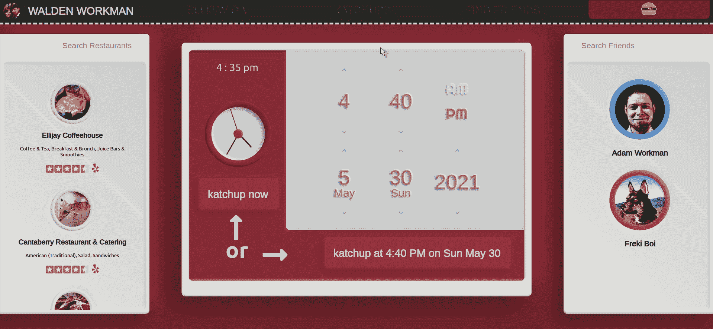

# 在 React 中使用纯 JavaScript 库:利用库中的信息重新呈现组件

> 原文：<https://javascript.plainenglish.io/using-a-pure-javascript-library-in-react-utilizing-information-from-the-library-to-re-render-a-8e6fab5a9449?source=collection_archive---------3----------------------->

我的文章中一个非常常见的主题是使用状态和/或状态钩子的正确方法。直接改变状态是一个大禁忌。如果我们在没有创建新对象的情况下改变状态，我们可能会失去功能并导致一些奇怪的行为。

那么，如果我们想在 React 应用中使用纯 JavaScript 库呢？纯 JavaScript 不使用状态。那么，在库不能利用状态或道具的情况下，我们如何使用这个库，获取更新的信息，并呈现我们的 React 组件呢？在本文中，我们将查看一个纯 JavaScript 日期/时间选择器，找到一种从库中获取所需信息的方法，并更新我们的 React 组件。

我们将使用 [MTR Datepicker](https://github.com/mtrdesign/mtr-datepicker) ，一个纯 JavaScript 编写的库来选择日期和时间。我不会去如何安装地铁日期选择器，只会简单地谈及它的使用。更详细的安装和使用说明，你可以点击查看 [GitHub。](https://github.com/mtrdesign/mtr-datepicker)

这里的目标是从 MTR Datepicker 中获取选定的时间和日期，并使用该信息定制确认按钮。

在安装和设置了 MTR Datepicker 之后，我们应该会看到类似这样的东西。⬇️

如果我们想要的只是日期选择器，而不需要确认按钮来显示日期和时间，我们可以就此打住。这将返回工作日期选择器。因为我们希望我们的应用程序感觉更加定制化，所以我们需要做更多的工作。

让我们首先从日期选择器中获取时间和日期，并将它们存储在状态变量中。这样，每当变量改变时，都会触发重新渲染。由于 DatePicker 是一个功能组件，我们将使用`useState` 钩子来完成这个任务。

现在，由于 MTR Datepicker 是一个纯 JavaScript 库，不能利用 state 或 props，并且如果我们决定将 MTR DatePicker 转换为 React 组件，它会中断(如果我们将库中的日期和时间变量转换为状态变量，它会无休止地循环)，我们需要一种方法在日期和/或时间改变时更新我们的状态变量(日期和时间)。在这种情况下，我们将进行脏检查。它被称为脏检查，因为它运行定期检查，而不是直接监听属性更改。

这里我们只是检查日期或时间是否每秒改变一次。如果有任何变化，我们更新相应的状态变量，这将触发组件的重新呈现。应该可以了，对吧？不完全是，原因如下。每次组件重新呈现时，我们的`datePicker` 变量都会创建一个新的 MtrDatepicker 对象。这导致了一个死循环，破坏了我们的组件。

为了解决这个问题，我们可以使用`useMemo`钩子。`useMemo`钩子简单地返回它所传递的“创建”函数的存储值。它还需要一组依赖项。`useMemo`只有当其中一个依赖关系改变时，才会重新计算记忆的值。这里我们将把依赖数组留空，因为我们出于任何原因都不想创建新的 MtrDatepicker 对象。

现在我们只需添加带有日期和时间变量的确认按钮。

就是这样！遵循最佳实践总是最好的，但我认为知道何时遵循规则以及何时可以变通规则也同样重要。这只是一个例子，在这种情况下，让一些东西工作可能需要一些创造力…我们可以不按按钮，或者我们可以放弃 MTR 日期选择器，使用一个更加反应友好的库，但这将使它失去所有的乐趣！编码快乐！

*更多内容尽在*[*plain English . io*](http://plainenglish.io/)