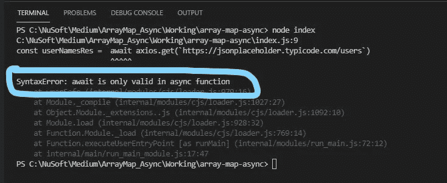

# 在 JavaScript 的 Array.map()方法中执行异步操作

> 原文：<https://javascript.plainenglish.io/using-asynchronous-operations-with-javascripts-array-map-method-1971e8093228?source=collection_archive---------5----------------------->

## JavaScript 技巧

## 这是关于信守承诺。


Photo by [marcos mayer](https://unsplash.com/@mmayyer?utm_source=medium&utm_medium=referral) on [Unsplash](https://unsplash.com?utm_source=medium&utm_medium=referral)

# 的。数组的 map()方法

> `**map()**`方法**创建一个新的数组**,用调用数组中每个元素的函数的结果填充。

的。map()方法遍历数组中的每一项，并执行函数、回调函数或箭头函数指定的任何操作。函数的结果可以返回到新的数组中，或者只在。map()方法。

一个常见的代码片段，其中回调函数可能看起来像这样，

```
const array1 = [1, 4, 9, 16]
// pass a function to map
const map1 = array1.map(x => x * 2)
```

在这个代码片段中，数组 map1 包含 2、8、18 和 32。

# 问题是

**如果我们传递的函数(回调或箭头)想要执行异步操作**，比如数据库查询或任何其他异步操作，该怎么办？

> 我们如何处理这些？他们回报承诺。

# 我们将做什么

我们将要求 id 为 2，4，6，8 和 10 的用户的名字从一个假的 [API，https://jsonplaceholder.typicode.com/](https://jsonplaceholder.typicode.com/)。

你可以在浏览器的地址栏中看到所有的用户。

```
[https://jsonplaceholder.typicode.com/users](https://jsonplaceholder.typicode.com/users)
```

对于本教程，请求的 id 将在一个数组中。我们将使用 Array.map()方法遍历该数组，并获取与该数组中的用户 id 相对应的每个用户的 **id** 和**名称**。**这将要求我们在。map()方法。****await**关键字用于等待异步操作的结果。

我们将分三部分构建解决方案。

*   第 1 部分是确保。map()方法有效
*   第 2 部分是确保我们能够成功运行异步操作
*   第 3 部分是将两者结合起来解决我们的问题

*尽管我们将从 API 获取数据，但这只是异步操作的一个例子。您当然可以将它应用到其他需要异步操作的情况中。*

# 我们开始吧

对于本教程，我将使用 [Visual Studio 代码](https://code.visualstudio.com/)。您当然可以使用任何您想要的代码编辑器。您还需要安装[节点](https://nodejs.org/en/)。

## 初始设置

1.  创建一个放置应用程序的目录。
2.  启动 VS 代码，打开刚刚创建的文件夹。
3.  打开一个终端窗口，输入以下代码启动一个节点项目。这将初始化一个新的节点项目(create package.json 等)。)并接受所有默认值。

```
npm init -y
```

我喜欢使用 [*axios*](https://axios-http.com/docs/intro) *来查询数据，所以我们将安装它。但是，如果您愿意，可以随意使用* [*获取 API*](https://developer.mozilla.org/en-US/docs/Web/API/Fetch_API) *或其他东西。*

4.在终端窗口中，键入以下内容。

```
npm install axios
```

你的 **package.json** 应该是这样的。注意它期望 **index.js** 作为默认的主文件。所以我们会创造一个。这是我们的代码将驻留的地方。


Initial Setup. Package.json with axios. index.js for our code.

5.从**文件**菜单使用**新建文件**创建一个名为 **index.js.** 的新文件

# 解决问题

对于我们的问题，我们只需要 id 为 2、4、6、8 和 10 的用户的 **name** 属性。

## 步骤 1—让 Array.map()工作

1.在 **index.js** 中，我们先用 **require** 导入 axios，并创建一个数组来存储所需用户的 id。

```
const axios = require('axios')const usersRequested = [2,4,6,8,10]
```

2.为了确保我们可以循环并从数组中获取每个用户 id，让我们在现有代码后添加以下代码。我们将使用一个箭头函数，并使用[模板文本向控制台输出一些信息。](https://developer.mozilla.org/en-US/docs/Web/JavaScript/Reference/Template_literals)

```
usersRequested.map(userId =>{
    console.log(`This is user ${userId}`)
})
```

*参数 userId 可以是任何值，取数组中的每个值。*

3.在终端中键入以下内容运行代码，并进行验证。map()管用。

```
node index
```


Result of our basic use of .map()

## 步骤 2—异步操作

为了运行异步操作，或者更具体地说，为了让**等待**异步操作的结果，我们需要将我们的代码包装在一个**异步**函数中。因此，如果我们在异步函数中没有这样的代码，这样的代码就会失败。

```
const userNamesRes =  await axios.get(`https://jsonplaceholder.typicode.com/users`)
```

*需要在异步函数中。否则我们会得到这个错误。*



我们要做的是创建一个异步函数 getUsers()，并将我们的查询放入其中。*注意。map()方法将被暂时注释掉，因此我们可以只关注异步查询。*

1.  像这样修改 **index.js** 中的代码。请注意注释。

```
const axios = require('axios')const usersRequested=[2,4,6,8,10]// usersRequested.map(userId =>{
//     console.log(`This is user ${userId}`)
// })// Async function to return all users **const getUsers = async () =>{
    const userNamesRes =  await axios.get(`**[**https://jsonplaceholder.typicode.com/users`**](https://jsonplaceholder.typicode.com/users`)**)
    // Destructure data out of the response.
    // Could use const users = userNamesRes.data
    const {data} = userNamesRes
    console.log(data)
}****getUsers()**
```

2.在终端窗口中运行这段代码，

```
node index
```


Asynchronous query

*你会注意到我在查询调用中使用了* ***反斜杠*** *而不是单引号。这个以后会派上用场的。*

此外，这是获得所有 10 个用户，而不仅仅是一个我们想要的。我们需要遍历数组。

## 第三步——把所有的东西放在一起

所以现在将我们的查询放在。map()方法，并将它放在异步函数中。

事实证明，仅此一项是行不通的。为什么？因为。map()方法使用了一个函数(在我们的例子中是 Arrow 函数)， ***，这个函数也需要异步。***

此外，

> 异步调用的结果是一个[承诺](https://developer.mozilla.org/en-US/docs/Web/JavaScript/Reference/Global_Objects/Promise)。的。map()方法返回一个新的数组，所以我们需要创建一个数组来存储每个查询返回的承诺，然后使用 promise.all()来全部解析。

**注意**:如果你很好奇，请不要评论下面的**console . log(promises array)**。你会看到一系列悬而未决的承诺。

```
[
  Promise { <pending> },
  Promise { <pending> },
  Promise { <pending> },
  Promise { <pending> },
  Promise { <pending> }
]
```

1.  修改 **index.js** 中的代码如下。

```
const axios = require('axios')const usersRequested=[2,4,6,8,10]// Async function to return all users
const getUsers = **async** () =>{// Return an array of Promises
    const **promisesArray** = usersRequested.**map**( **async** userId =>{
        const userNamesRes =  **await** axios.get(`[https://jsonplaceholder.typicode.com/users/${userId}`](https://jsonplaceholder.typicode.com/users/${userId}`))

        return userNamesRes
})**//   console.log(promisesArray)****// Resolve the Promises**
    const userInfo = **await** Promise.all(promisesArray)

    userInfo.map(promiseRecord=>{
        console.log(`ID - ${promiseRecord.data.id}, Name - ${promiseRecord.data.name}`)
    })}getUsers()
```

2.在终端窗口中运行这段代码，

```
node index
```

有用！漂亮！

```
ID - 2, Name - Ervin Howell
ID - 4, Name - Patricia Lebsack
ID - 6, Name - Mrs. Dennis Schulist
ID - 8, Name - Nicholas Runolfsdottir V
ID - 10, Name - Clementina DuBuque
```

# 唯一剩下的东西

唯一剩下的事情就是放入**错误处理**。我在最终代码中添加了一个简单的 **try/catch** 。

```
const axios = require('axios')const usersRequested=[2,4,6,8,10]// Async function to return all users
const getUsers = async () =>{
**try{**
    // Return an array of Promises
    const promisesArray = usersRequested.map( async userId =>{
        const userNamesRes =  await axios.get(`[https://jsonplaceholder.typicode.com/users/${userId}`](https://jsonplaceholder.typicode.com/users/${userId}`))

        return userNamesRes
}) **//   console.log(promisesArray)**
    // Resolve the Promises
    const userInfo = await Promise.all(promisesArray)

    userInfo.map(promiseRecord=>{
        console.log(`ID - ${promiseRecord.data.id}, Name - ${promiseRecord.data.name}`)
    })**}catch(err){
    console.log(err.message)
}**
}getUsers()
```

# 结论

要点是您可以**等待**在。数组的 map()方法。请记住，您的回调函数或箭头函数需要是异步的；记住，一个新的承诺数组被返回，这些需要被解决。

我鼓励您修改代码，并尝试其他循环。

*代码也可以在*[*GitHub*](https://github.com/Gravity-Well/array-map-async-ops.git)*上找到。*

**感谢您的阅读和编码！**

*想看就看，加入 Medium 帮我继续写*

[](https://bobtomlin-70659.medium.com/membership) [## 通过我的推荐链接加入灵媒——重力井(罗伯·汤姆林)

### 作为一个媒体会员，你的会员费的一部分会给你阅读的作家，你可以完全接触到每一个故事…

bobtomlin-70659.medium.com](https://bobtomlin-70659.medium.com/membership) 

***你也可以享受:***

[](/how-to-get-a-list-of-unique-values-from-a-javascript-array-of-objects-2e38f6cfd14) [## 如何从 JavaScript 对象数组中获取唯一值

### 使用带有 Spread 运算符和 JavaScript 数组方法的 JavaScript 集。map()和。排序()

javascript.plainenglish.io](/how-to-get-a-list-of-unique-values-from-a-javascript-array-of-objects-2e38f6cfd14) [](/javascript-multi-dimensional-arrays-7186e8edd03) [## JavaScript 多维数组

### 真相大白了

javascript.plainenglish.io](/javascript-multi-dimensional-arrays-7186e8edd03) [](/using-javascript-sets-37752330682d) [## 使用 JavaScript 集

### 一些有趣的用法、观察和陷阱

javascript.plainenglish.io](/using-javascript-sets-37752330682d) [](/back-ticks-are-not-single-quotes-eef4e014115c) [## 反引号与单引号

### 在 JavaScript 中使用重音符创建模板文字的演示

javascript.plainenglish.io](/back-ticks-are-not-single-quotes-eef4e014115c) 

*更多内容请看*[***plain English . io***](http://plainenglish.io)