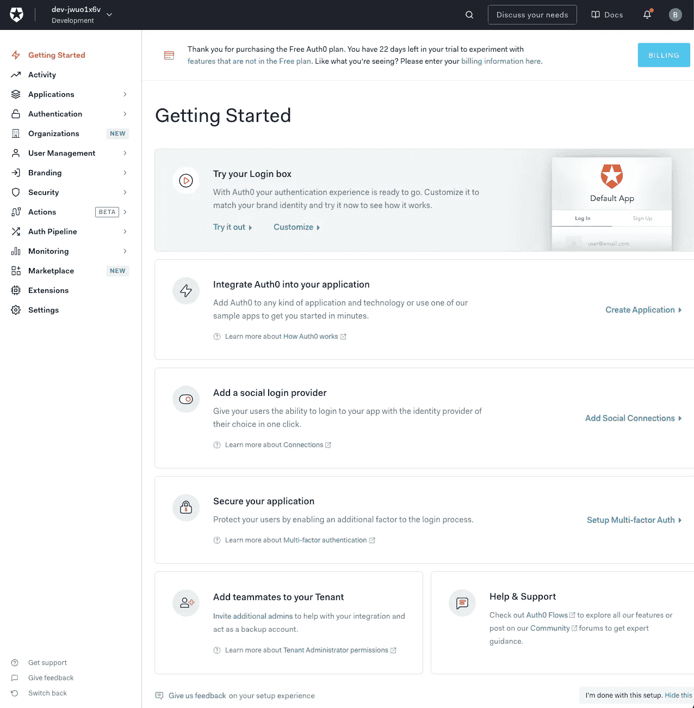
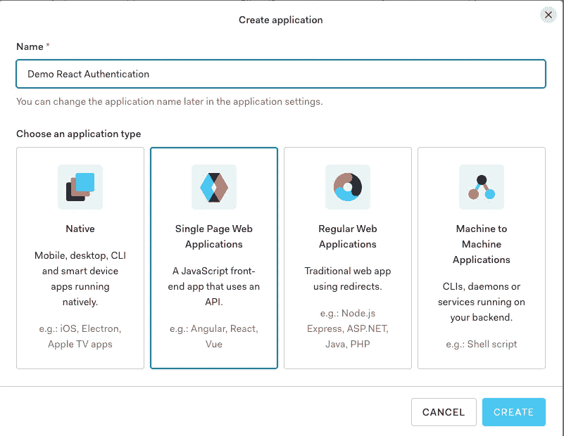
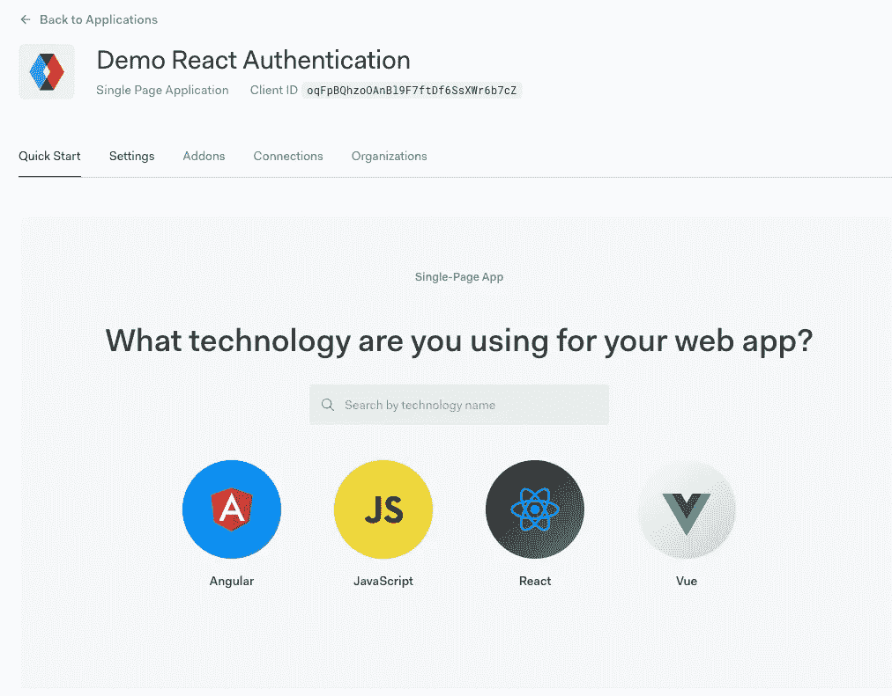
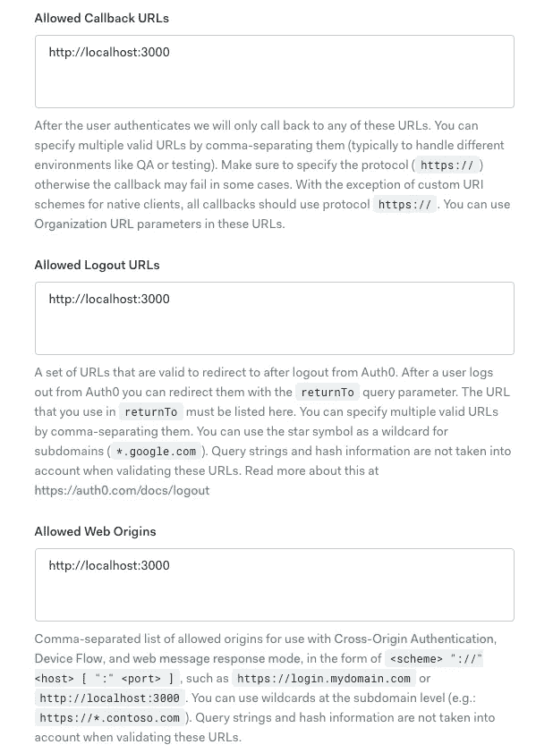
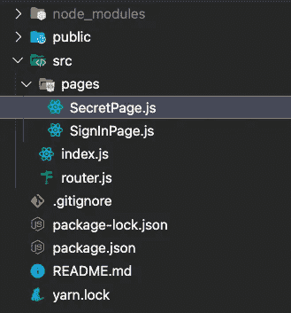

# 如何在 React 应用中使用 Auth0 进行身份验证

> 原文：<https://javascript.plainenglish.io/using-auth0-for-authentication-in-react-apps-2976f737b260?source=collection_archive---------13----------------------->

## 在 React 应用中设置身份验证比以往任何时候都更容易，这在很大程度上要归功于 Auth0


对于那些不知道的人来说，Auth0 是一个向开发者提供身份验证服务的工具。本质上，它将允许我们为用户提供安全的体验，而无需费力学习和理解有关身份验证和授权的一切。

# 先决条件

我们不需要太多就能完成这个教程。

*   反应的知识
*   安装在计算机上的节点和 NPM
*   积极的态度(这是最重要的)

# **我们开始吧**

## 创建帐户

首先，如果你还没有 Auth0 的帐号，你必须尽快创建一个。别担心。它非常简单而且免费。下面是他们网站的链接，你可以注册。

[](https://auth0.com) [## Auth0:每个人的安全访问。但不是任何人。

### 阅读客户案例→基本上，我们让您的登录框棒极了。了解更多→方便。隐私。安全。来自…

auth0.com](https://auth0.com) 

## 创建 Auth0 应用程序

创建好新帐户后，您应该会看到一个类似这样的屏幕。



别担心，这个屏幕看起来有点吓人，其实不然。我们需要点击侧边栏中的**应用**选项，然后点击下拉菜单中的**应用**。现在我们已经在我们需要的屏幕上，我们将创建一个新的应用程序。当您单击创建应用程序时，会出现一个弹出窗口。您可以继续进行设置，选择该屏幕截图中的选项，然后点击**“创建”**



## 配置 Auth0 身份验证

创建好我们的应用程序后，您应该会看到一个类似这样的屏幕。我们希望更改设置选项卡上的一些设置。



您可以继续并导航到设置选项卡。我们将需要更改回调*URL*、*注销**URL*和*允许**Web**Origins*以指向 *localhost:3000* 。你会在下面的截图中明白我的意思。



添加完这些设置后，您可以继续操作并单击 save，这样我们的 Auth0 应用程序就设置好了。我们只需再返回该站点一次，那就是从 React 应用程序中获取连接到 Auth0 的 API 所需的凭据。

# 让我们构建我们的 React 应用程序

我们将保持我们的应用程序非常简单，这样我们就可以真正展示在 React 应用程序中使用 Auth0 是多么容易。因此，我们的应用程序将由两个页面组成。第一页将是我们的登录页面，第二页将是我们的秘密页面(只有登录后才能访问)。

## 创建和设置 React 应用程序

好了，事不宜迟，让我们创建我们的应用程序。您可以通过在命令行(终端或命令提示符/powershell，取决于操作系统)中运行以下命令来开始。

```
npx create-react-app demo-auth0
```

在我们的应用程序完成安装后，我们将需要安装本教程的几个包，所以继续前进并导航到您的应用程序的目录。

```
cd demo-auth0
```

并用这个命令安装软件包。

```
npm install @auth0/auth0-react react-router-dom
```

在 react 应用程序中， *@auth0/auth0-react* 包将允许我们连接到 auth0 并执行不同的操作。 *react-router-dom* 包，顾名思义，将允许我们在 react 应用中实现路由。

安装并设置好我们的应用程序后，是时候在您选择的代码编辑器中打开我们的项目了(我将使用 VS 代码)。

对于那些有兴趣安装和使用 VS 的人，这里有一个 VS 代码的链接(免费)。

[](https://code.visualstudio.com/) [## Visual Studio 代码-代码编辑。重新定义的

### Visual Studio Code 是一个重新定义和优化的代码编辑器，用于构建和调试现代 web 和云…

code.visualstudio.com](https://code.visualstudio.com/) 

## 构建我们的项目

在我们开始编写代码之前，我们需要删除不必要的文件并添加必要的文件。

我们可以从我们项目的 **src** 文件夹中删除以下文件。

*   **index.css**
*   **App.css**
*   **App.test.js**
*   **App.js**
*   **logo.svg**
*   **reportWebVitals.js**
*   **setupTests.js**

我们也可以将下面的文件夹和文件添加到我们项目的 **src** 文件夹中。

*   **router.js**
*   **pages/SignInPage.js**
*   **pages/SecretPage.js**

下面是我们的项目应该是什么样子，当我们完成了截图。



## 将应用程序连接到 Auth0

现在我们已经设置好了一切，是时候开始编码了。我们要做的第一件事是替换我们的 **index.js** 文件中的内容，看起来像下面的代码。

这里需要注意的重要一点是，我们将整个应用程序包装在 *Auth0Provider* 中，这将允许我们在整个应用程序中使用 Auth0。您需要将这个标签中的*域*和 *clientId* 属性替换为应用程序的属性。这些可以在您创建的 Auth0 应用程序的设置选项卡的顶部找到。您还会注意到在我们的 index.js 文件中有一个名为*router provider**的东西，它将在我们的应用程序中负责路由，接下来我们将设置它。*

## *在应用程序中设置路线*

*这个应用程序的路由将非常简单。我们只有两页了。其中一页为*/登录，*，另一页为*/秘密*。不登录就无法访问机密页面。我们将更改我们的**路由器. js** 文件，使其看起来像下面的代码。*

*这里没什么大不了的，但我会解释我们有什么。我们有一个 *RouterProvider* 组件，负责为我们的应用程序提供路由。*

*这里需要注意的是，我们有一个 *Switch* 组件，我们使用它来确定屏幕上呈现的路线。我已经设置好了，如果我们现在不在前两条路线，它会自动将我们带到登录页面。*

*我们还有一个 PrivateRoute 组件，如果我们试图进入一个需要验证的页面，但我们没有登录，它将负责将我们重定向到登录页面。*

*这就是全部。*

*对于一个非常简单的应用程序来说，这是一个非常简单的路由器。实际上只剩下一步了，你可能已经猜到了。我们需要创建登录页面和机密页面。*

## *创建登录和机密页面*

*这里的顺序并不重要，但是我将创建的第一个页面是登录页面。下面是 **SignInPage.js** 文件的代码。*

*正如您在**第 5 行**中所看到的，我们现在正在利用*useut 0*钩子。有许多不同的函数和变量，我们可以从这个钩子中提取出来，但是对于这个页面，我们只对其中的一个感兴趣。*

*我们感兴趣的是 *loginWithPopup* 函数。这个函数将在被调用时在我们的浏览器中启动一个弹出窗口，这将允许我们使用 Auth0 的登录/签约页面进行登录。*

*您将看到这个函数在我们的“登录”按钮的 onClick 方法中被调用。*

*然后，我们将简单地等待该操作完成，并使用 *history.push* 方法返回我们的秘密页面。*

*我们还有最后一页要设置，这在我们的 **SecretPage.js** 文件中。*

*下面是我们的 **SecretPage.js** 文件的代码。*

*在这一页上，您将看到我们正在利用存在于*useut 0*钩子中的两个附加属性。我们正在进入*用户*属性，该属性返回关于登录用户的附加数据。*

*在这种情况下，一旦他们出现在此页面上，我们就会使用他们的电子邮件向他们显示问候消息。*

*我们使用的第二个属性是*注销*方法，顾名思义，这将允许我们注销用户。*

*您会注意到，我不需要告诉路由器在注销后返回到页面的*登录，这是因为我们有自己的路由器设置。**

*当用户未登录时，他们将被重定向回*登录*页面。有了我们的*秘密*页面的代码，我们简单的小认证应用就完成了。最后一步是运行我们的应用程序。*

## *运行应用程序*

*要运行该应用程序，您只需运行下面的命令。*

```
*npm start*
```

*或者你用的是纱线。*

```
*yarn start*
```

*就这样了。您会注意到，如果您试图在登录前导航到秘密页面，它不会让您这样做。仅此而已；我们已经用很少的代码成功地设置了 Auth0。*

# *结论*

*希望在阅读完本教程后，您会发现您不必再被身份验证所吓倒。像 Auth0 这样的工具使得使用认证变得轻而易举。*

*请关注本教程的第 2 部分，在那里我将演示如何向节点 API 发出经过身份验证的请求。*

**更多内容请看*[***plain English . io***](https://plainenglish.io/)*