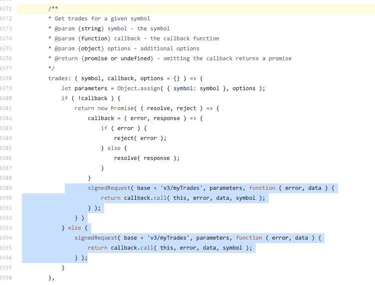

# 使用币安 API 获取用户的交易历史

> 原文：<https://javascript.plainenglish.io/using-binance-api-to-get-the-users-trading-history-e459c643878b?source=collection_archive---------17----------------------->

在这个项目中，我们感兴趣的是与用户以前的交易相关的用户记录。为什么需要获取用户的交易记录？例如，帮助会计或分析。请记住，这不是一个完整的数据处理示例，而是一个起点。

# 币安 API 和“my trades”rest 端点简介

我们的目标是获得用户的私人数据，交易历史。由于这是私人信息，它将取决于初始认证步骤。请记住，这些步骤取决于与币安 API 的交互([检查币安 API 文档，以检查 API 版本](https://github.com/binance/binance-spot-api-docs))。

暂时将必要的认证过程放在一边。假设通过了身份验证，访问该端点的最直接方式是使用 GET 方法进行 HTTP 调用:

```
GET [/api/v3/myTrades](https://github.com/binance/binance-spot-api-docs/blob/master/rest-api.md#account-trade-list-user_data)
```

开发人员通常在这些基本方法之上创建抽象。一个例子是下面的方法， [binance.trades](https://github.com/jaggedsoft/node-binance-api#get-your-trade-history) ，可从节点-币安-API NPM 模块获得:

```
[binance.trades](https://github.com/jaggedsoft/node-binance-api#get-your-trade-history)("SNMBTC", (error, trades, symbol) => {
  console.info(symbol+" trade history", trades);
});
```

你可以查看 *trades* 方法的[源代码](https://github.com/jaggedsoft/node-binance-api/blob/master/node-binance-api.js#L3571)——看到它使用了“api/v3/myTrades”端点:



# 使用节点币安 API 获取“我的交易”

您可能想要获取以下源代码:一个非常简单的 NodeJS 获取示例，它使用 Node-币安-API 提取两个交易事件。下面的源代码是在币安用一个名为“spot account”的用户帐户测试的。

[](https://github.com/taboca/binance-mytrades-accounting) [## 塔博卡/币安-我的贸易-会计

### 从币安-塔博卡/币安-我的交易-会计中检索现货和保证金账户的交易历史

github.com](https://github.com/taboca/binance-mytrades-accounting) 

让我们看一下非常简单明了的代码:

```
const Binance = require('node-binance-api');
const Keys    = require('./config.js');const binance = new Binance().options(Keys);// This example shows how to pass optionslet options = { 
  limit: 2 // Limit results to two entries
};binance.trades("BTCBRL", (error, trades, symbol) => {
  console.info(symbol+" trade history", trades);
}, options);
```

根据[币安 API myTrades 文档](https://github.com/binance/binance-spot-api-docs/blob/master/rest-api.md#account-trade-list-user_data)，也可提供其他选项。让我们看看这个例子做了什么:

*   它使用“节点-币安-api”来创建一个抽象，以帮助验证和 REST 协议细节。
*   它传递带有用户 APIKEY 和用户 APISECRET 的 Keys 对象。您将需要使用您的币安帐户来设置这些元素。参见这篇关于如何创建 API[密匙的支持文章。](https://www.binance.com/en/support/faq/360002502072)
*   它传递符号，在本例中使用“BTCBRL”。因此，如果你希望从上面的例子中得到数据，你需要使用 BTCBRL 对完成 2 笔交易，至少使用你的币安现货账户。
*   它超过了限制:2 —这意味着如果有 2 笔交易，它将只返回 2 个元素。

# API 响应的示例

您还可以在 myTrades 端点的[币安 API 文档中查看返回示例和附加选项参数。](https://github.com/binance/binance-spot-api-docs/blob/master/rest-api.md#account-trade-list-user_data)


Photo by [Bruna Araujo](https://unsplash.com/@brucaraujo?utm_source=unsplash&utm_medium=referral&utm_content=creditCopyText) on [Unsplash](https://unsplash.com/s/photos/old-monitor-crt-code?utm_source=unsplash&utm_medium=referral&utm_content=creditCopyText) — screenshot adapted by Marcio

## 显示有两笔交易的阵列的响应:


# 改善贸易结果

根据币安 API 文档，“所有时间和时间戳相关的字段都以毫秒为单位。”因此，这里的主要挑战是将时间属性转换成可读性更好的东西。在这种情况下，JavaScript 中日期函数的使用非常简单。其他属性不会被修改:

```
binance.trades("BTCBRL", (error, trades, symbol) => {  
  for(let k in trades) { 
    let trade = trades[k];
    let tradeDateTime = new Date(trade.time);
    console.log(`Trade event --------------------------------`);
    console.log(`time             : ${tradeDateTime}`);
    console.log(`symbol           : ${trade.symbol}`);
    console.log(`price            : ${trade.price}`);
    console.log(`quantity         : ${trade.qty}`);
    console.log(`commission fee   : ${trade.commission}`);
    console.log(`commission asset : ${trade.commissionAsset}`);
//    console.log(trade);
  }
}, options);
```

可能结果之一的示例:


**参考文献**

*   来自币安 API — [账户交易列表用户数据 API](https://github.com/binance/binance-spot-api-docs/blob/master/rest-api.md#account-trade-list-user_data)
*   从 Node-币安-API — [获取您的交易历史](https://github.com/jaggedsoft/node-binance-api#get-your-trade-history)

*更多内容请看*[***plain English . io***](https://plainenglish.io/)


*免责声明—这是从我自己的会议 id 0421981 a-d179–4a 27-a0d 1-Fe 1280 b5 e1e 5 中摘录的公开文档。我用这种方法来改进我自己的文档，因为我正在学习使用与交易系统相关的 API。请理解这篇文章是一篇教育性文章——它是以所谓的“原样”形式提供的，没有任何形式的保证。当然，这些内容不会包含任何财务建议。*