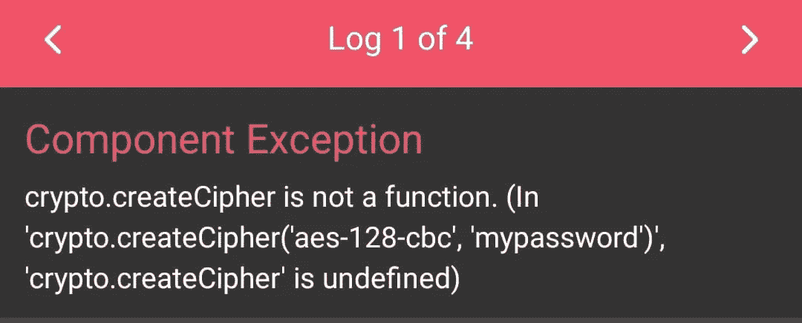

# 在 React 本地应用中使用核心 Node.js 模块

> 原文：<https://javascript.plainenglish.io/using-core-node-js-modules-in-react-native-apps-e6002a33b6ff?source=collection_archive---------4----------------------->


有时，在 React Native 中创建高级应用程序时，您可能希望对发送到 web 的数据进行加密，以实现安全的 web 通信。您也可以使用此模块对发送到支付网关的支付相关数据进行加密。

假设您想使用`[crypto](https://nodejs.org/api/crypto.html?ref=hackernoon.com#crypto_crypto)` 模块创建一些加密数据。这样做似乎很自然:

```
var crypto = require('crypto');

var mykey = crypto.createCipher('aes-128-cbc', 'mypassword');
var mystr = mykey.update('abc', 'utf8', 'hex')
mystr += mykey.final('hex');

console.log(mystr);//34feb914c099df25794bf9ccb85bea72
```

只需导入一个模块并创建一个加密字符串，对吗？对吗？没有。

**这个不行，**因为 crypto 是一个核心 Node.js 模块，也就是说它很可能是捆绑了 Node.js 二进制的 C++代码，而不是 JavaScript。React 本机打包程序不能将它[1]与您的应用程序的 JavaScript 包一起打包，因此您会得到一个运行时错误:

```
Unable to resolve module 'crypto' 
```

这使得核心模块如 crypto、stream 等，以及依赖它们的数千个 npm 模块对 React Native 不可用。幸运的是，这个问题有一个解决方案，但是需要一些工作。

# 解决办法

如果您熟悉模块捆绑器 [Browserify](http://browserify.org/?ref=hackernoon.com) ，您可能知道它允许您在使用 polyfills[2]的浏览器中使用核心 Node.js 模块，如`crypto` 。因此，让我们尝试创建一个独立的 JavaScript 文件，其中包含用于`crypto`模块的 polyfill，并在我们的应用程序中使用它:

1.首先安装`browserify` :这里我们是全局安装 browserify。如果您之前已经全局安装了它，则不需要执行下面的命令。

```
npm install -g browserify
```

2.在根目录下创建一个文件 crypto-in . js；

在 crypto-in.js 文件中，导入模块 crypto 并将其导出到同一个文件中。确保您没有在`node_modules`目录中创建 crypto-in.js。如果您在`node_modules`目录中创建它，那么每次执行`npm install`时，这个文件都会丢失。

```
var crypto = require("crypto");
module.exports=crypto 
```

3.使用`browserify`创建一个独立的 JavaScript 包`crypto-custom.js` 。

```
browserify crypto-in.js -o crypto-custom.js
```

这创建了一个文件`crypto-custom.js`，它包含大约 26，660 行代码(包含 polyfills)。最后几行包含我们来自`crypto-in.js`的代码。

```
// //26,656 lines above..
},{"indexof":100}],153:[function(require,module,exports){
  // Our code from crypto-in.js
  var crypto = require("crypto");
  module.exports = crypto;
},{"crypto":56}]},{},[153]);
```

在这一点上，它可能看起来像我们完成了，但我们没有！如果你替换这条线

```
const crypto = require('crypto');
```

在应用程序代码中

```
const crypto = require('./crypto-custom');
//here iam in root directory and crypto-custom.js file is also in 
//rootdirectory
```

并尝试运行该应用程序，您会得到以下错误:

`Unable to resolve module bn.js`

原来单词`require` 被 React 本机打包程序给予了特殊处理，并且您不能将其重新定义为其他意思，这正是 Browserify 试图在包中做的。如果你仔细观察`crypto-custom.js`内部，你会注意到它总是传入一个自定义的`require` 函数作为参数，而从来没有真正使用全局的`require`。有一个简单的方法可以解决这个问题，解释如下。

4.在文本编辑器中打开文件`crypto-custom.js` ，用其他东西替换单词`require`的所有实例，例如`req`。确保它是唯一的，这样它就不会与任何现有的代码冲突，也不会把事情弄糟。

如果您现在保存`crypto-custom.js` 并重新加载应用程序，之前的错误将会消失，但会出现新的错误:



打包程序无法找到方法`createCipher`，因为`crypto` 没有从`crypto-custom.js`中正确导出。如果你看看这个包的最后几行，你会发现这是因为我们没有在全局`modules`对象上设置`module.exports` ，而是在作为函数参数传入的其他对象上:

```
//26,656 lines above..
},{}],187:[function(req,module,exports){var crypto = req("crypto");module.exports = crypto;},{"crypto":71}]},{},[187]);
```

5.为了从`crypto-custom.js`中正确导出`crypto` ，我们需要对文件做一些修改:

*   在文件`crypto-custom.js`的顶部添加语句`var crypto`
*   将语句`var crypto = require('crypto');`替换为`crypto = require('crypto');` 来设置外部变量，而不是在函数体内创建局部变量。
*   将函数体外部的行`module.exports = crypto;`移动到文件的底部，使其引用全局`module` 对象。

修改后，`crypto-custom.js` 应该是这样的:

```
var crypto;  //at top of the file at line 1// Some 26,656 lines of polyfills..
},{"indexof":100}],153:[function(req,module,exports){
  crypto = req("crypto");
},{"crypto":56}]},{},[153]);

module.exports = crypto; 
```

**就是这样！**如果你现在运行这个应用程序，它应该可以完美运行:

> 有一个替代模块`expo-crypto`也可用于加密数据，但与核心加密模块相比，它的方法很少
> 
> 还有一个模块 [react-native-crypto](https://www.npmjs.com/package/react-native-crypto) 也可以使用，但是它没有 createCipheriv 方法。

## 感谢阅读！

# 参考

*   [1]—[https://github.com/facebook/react-native/issues/1871](https://github.com/facebook/react-native/issues/1871?ref=hackernoon.com)
*   [2]——【https://github.com/substack/browserify-handbook#builtins T2
*   [3]——【https://github.com/facebook/react-native/issues/6253 

*更多内容请看*[***plain English . io***](http://plainenglish.io/)