# 如何在 Node.js 中像 Pro 一样使用环境变量

> 原文：<https://javascript.plainenglish.io/using-environment-variables-like-a-pro-in-node-js-7fd2793808d3?source=collection_archive---------2----------------------->


NodeJS Server

# 介绍

有许多常量值需要存储在应用程序中，供以后使用时检索，比如数据库用户名、数据库密码、电子邮件密码和 API 密钥。这些值可能会在不同的情况下发生变化。当开发人员编写一段代码时，需要对代码进行测试。测试应该针对开发环境。开发人员不应该连接到生产数据库服务器。

开发人员通常使用本地数据库进行开发和测试，使用个人电子邮件帐户发送测试电子邮件。有时，在生产部署之前，应用程序会进入试运行环境，并由质量保证(QA)团队根据试运行环境进行测试。最后，在生产环境中，所有服务都应该为生产做好准备。因此，在创建应用程序时，我们需要维护两个或更多的环境。

存储一些在环境变化时不同的常数值是方便和常规的。可以将应用程序配置为基于其运行的环境来检索这些值。

# 环境变量

环境变量可以在应用程序或系统级别创建。

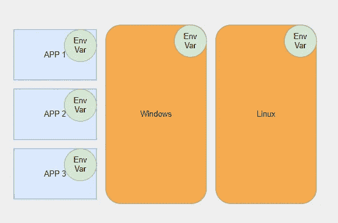

Different Levels

像 Windows 和 Linux 这样的操作系统管理它们自己的环境变量。Node.js 应用程序可以从宿主系统读取这些值。

但是等等！如果开发人员想读取存储在本地文件(例如，配置文件)中的这些值，该怎么办？Node.js 应用程序还可以管理存储在文件(在大多数其他编程语言中称为配置文件)中的自己的环境变量。Node.js 不能自己维护本地环境变量。它必须使用一个名为`dotenv`的包。

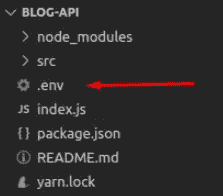

**dotenv** reads from **.env**

可以使用 NPM 命令安装包`dotenv`，它从名为`.env`的文件中读取信息。

## 设置应用程序

为了理解整个概念，我们将创建一个在多个环境上运行的 Node.js 服务器，以演示如何使用`dotenv`节点包来维护本地变量，并尝试在服务器上部署，以便在服务器上运行时读取系统变量。

设置应用程序的步骤:

*   创建 package.json 文件

```
npm init -y
```

*   安装`dotenv`

```
npm i -S dotenv
```

*   调用应用程序顶部的`dotenv`配置函数

```
require("dotenv").config();
```

*   在应用程序的根目录下创建包含以下内容的`.env`文件

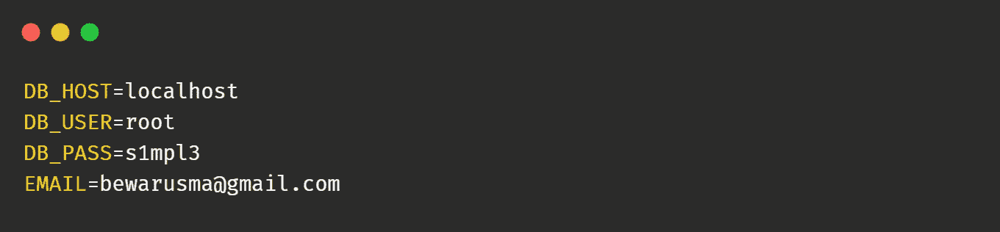

.env file

*   使用`process.env`访问数值

```
const DB_HOST = process.env.DB_HOST;
const DB_USER = process.env.DB_USER;
```

> 现在，如果我们在本地运行应用程序，dotenv 从**读取这些值。env** 文件并附加到`process.env`对象上。如果**。env** 不存在，node.js 试图从机器环境变量中读取这些值。

下面的应用程序从`.env`中读取值，并将其返回给用户。

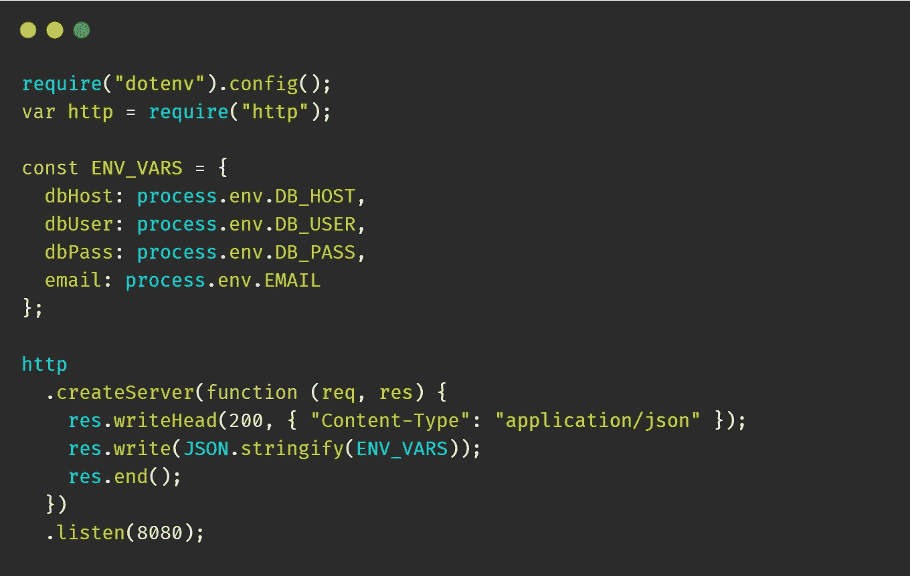

complete node.js server

# 在 Heroku 部署

我们将在 **Heroku** 上部署应用程序，并解释如何从**系统变量**中读取这些值。

在 Heroku 上部署应用程序有多种方式。我们将使用 **GitHub** 方法。

## 要求

*   Github 帐户
*   Heroku 帐户
*   安装在工作机器上的 Git

## 部署步骤

1.  创建一个 **GitHub** 帐户，并创建一个新的 git 存储库。

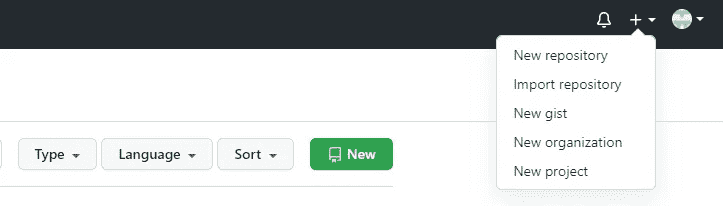

New Repository

在我们的例子中，应该填写存储库的名称，它是 **env_demo** 。如果项目是私有的，您需要选择**私有**选项。

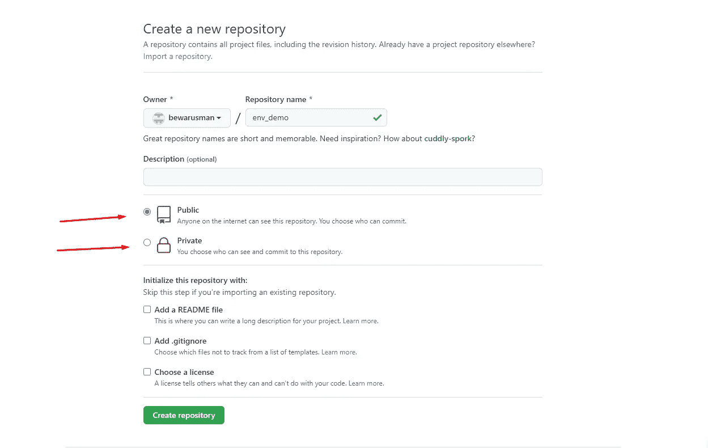

github — new repository

2.我们需要对 **package.json.** 做一些修改

*   添加引擎并指定节点版本——这是 **Heroku** 为应用程序安装节点所必需的。
*   为 Node.js 应用添加启动脚本`node index`、 **Heroku** runs `npm start`。

```
{
  *"name"*: "env_demo",
  *"version"*: "1.0.0",
  *"description"*: "",
  *"main"*: "index.js",
  *"scripts"*: {
    ***"start"*: "node index",**
    *"test"*: "echo \"Error: no test specified\" && exit 1"
  },
***"engines"*: {
    *"node"*: "14.x"
  },**
  *"keywords"*: [],
  *"author"*: "",
  *"license"*: "ISC",
  *"dependencies"*: {
    *"dotenv"*: "^10.0.0"
  }
}
```

此外，我们需要在 **index.js** 文件中指定运行应用程序的端口，如下所示。这是 **Heroku** 要求的。您不应该指定端口。

```
http
  .createServer(*function* (*req*, *res*) {
    *res*.writeHead(200, { "Content-Type": "application/json" });
    *res*.write(JSON.stringify(ENV_VARS));
    *res*.end();
  })
  .listen(**process.env.PORT**);
```

3.添加一个名为**的文件。gitignore** ，在项目的根目录下。我们可以指定不应该上传到 **GitHub** 服务器的文件。在我们的实例中，我们不想添加**。env** ，因为它包含我的个人详细信息和 **node_modules** 目录，因为它不被推荐， **Heroku** 创建 **node_modules** 并获取所需的 **npm** 包。

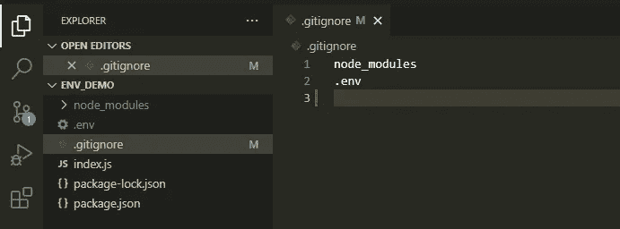

.gitignore file

4.在您机器上的项目目录中，编写以下命令。

```
git init
git add .
git commit -m "initial commit"
git remote add origin [https://github.com/bewarusman/env_demo.git](https://github.com/bewarusman/env_demo.git)
git push origin master
```

5.去 **Heroku** 创建一个账户

6.创建新应用程序


heroku — create new app

7.从**部署**选项卡中选择**连接到 Github** 。

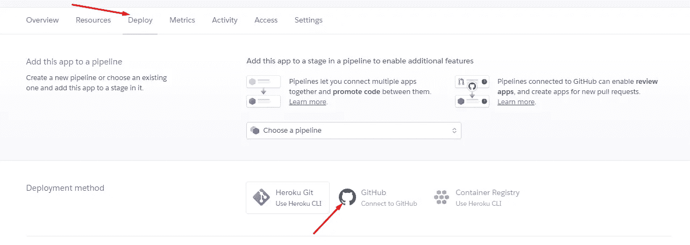

heroku — connect to github

8.找到仓库并选择**连接**，然后点击**部署分支**。部署完成后，点击**查看**按钮，在浏览器中查看应用。

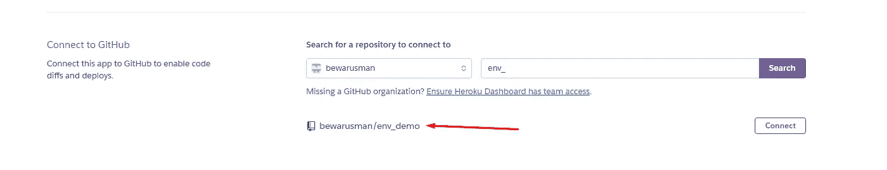

heroku — connect

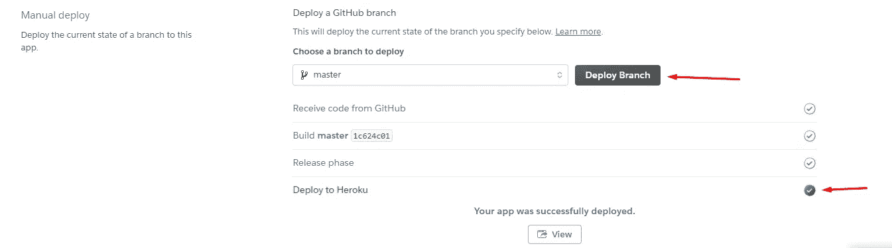

heroku — deploy branch

现在应用程序打开并显示一个空的 **JSON** 对象。为什么？因为我们没有指定 **Heroku** 生态系统中的环境变量。

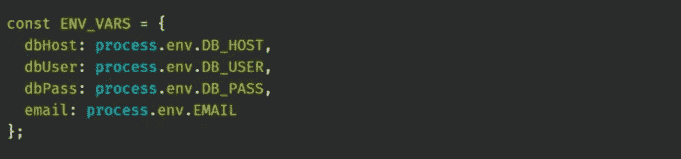

node — reading env variables

## 配置变量

*   在设置选项卡中，点击**显示配置变量**。

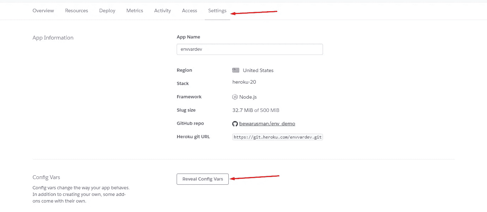

*   在那里添加变量。

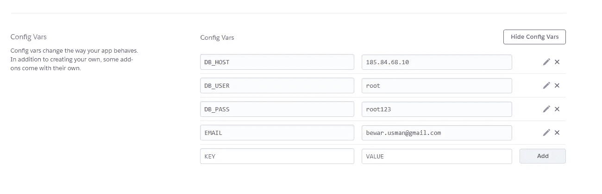

heroku — config vars

*   和测试...

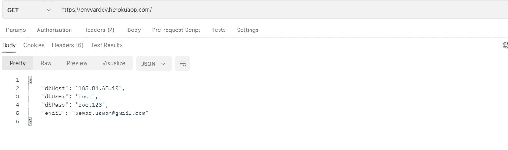

# 结论

在应用程序开发中，分离多个环境变量是非常关键的。使用 npm 包`dotenv`，在 Node.js 应用程序中维护多个环境变量很容易。它从名为`.env`的文件中读取数据。而一个**。env** 文件不存在， **process.env** 试图从机器环境变量中读取。

*更多内容请看*[***plain English . io***](http://plainenglish.io/)