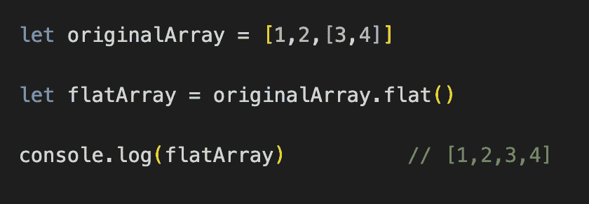
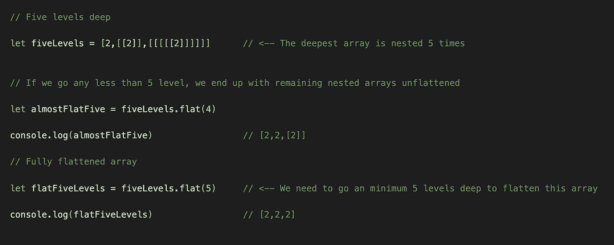
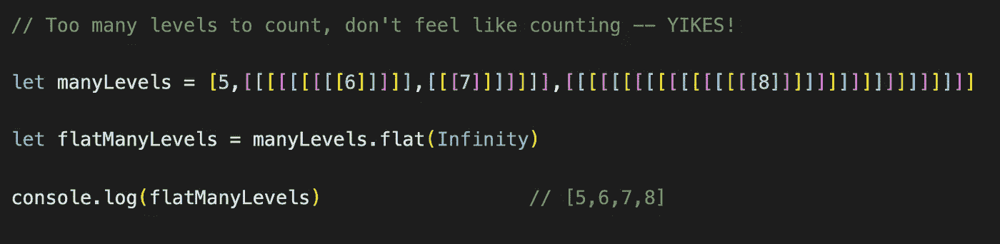

# 使用 Array.flat()征服 JavaScript 矩阵

> 原文：<https://javascript.plainenglish.io/using-flat-to-conquer-the-matrix-923479c23145?source=collection_archive---------11----------------------->

## 你不知道存在的方便的 JavaScript 方法。是时候吞下红色药丸了。

Image by Markus Spiske from Upsplash

最近，我发现自己在 MDN Web Docs 上浏览所有 JavaScript 数组原型是为了好玩——就像一个人做的那样——我遇到了一个我以前从未见过或听说过有人使用的方法:`.flat()`。

我很感兴趣，因为它简单的名字给了我足够的灵感去猜测它可能会做什么，但并不完全。深入研究之后，我意识到这个简单而有效的方法值得了解，并在特殊场合放在你的后兜里。如果你发现自己迷失在一个矩阵中，那么这个方法就适合你！

# 怎么会。平面()作品

在 ES2019 中引入的`.flat()`方法是 JavaScript 的一个相对较新的补充。顾名思义，它是用来展平多维数组或矩阵的。

`.flat()`方法最多接受一个参数，代表你希望展平一个矩阵的深度。您也可以选择不提供参数，在这种情况下，`.flat()`方法将默认为一个级别的数组展平。此外，这个方法创建了一个新的**数组，允许您轻松地访问原始数组的内容，而无需修改它。**

下面我们有一个数组的数组(AoA)的例子。我们可以使用`.flat()`将 AoA 减少到单个元素数组，使它们更容易遍历。

The .flat() method with no arguments defaults to flattening one level deep.

现在我们有了一个平面数组，元素更容易访问和操作，而不需要创建定制的函数来遍历它们。

# 使用参数

既然我们已经介绍了在没有参数的情况下使用`.flat()`方法，那么让我们来看看当我们给这个方法提供一个参数时，这个方法做了什么。

在下面的代码中，我们有一个数组，它包含由更多数组组成的数组——我们现在在矩阵的深处！

如果我们使用一个带有`.flat()`的参数，我们可以精确地指定我们想要展平的程度。在下面的代码中，我们传入`4`作为我们的参数，作为回报，我们得到一个由*和*扁平元素组成的数组。我们仍然使用单个嵌套数组，因为我们告诉`.flat()`方法只深入四层，第五层数组保持不变。

通过计算连续方括号(不包括最外面的方括号)的数量，可以很容易地判断出数组的嵌套深度。

# 使用无穷大

有时我们无法知道需要展平的数组嵌套有多深。当然，我们可以使用`100000`作为我们的参数，并希望得到最好的结果，但是当我们遇到一个数组中有`100001`个嵌套数组时会发生什么呢？这是我们可以利用`Infinity`的地方，以确保我们每次都尽可能深入。

We can pass Infinity as our argument to make sure we are always going to get a flat array.

Meme created by the author using Imgflip

# 结论

现在你知道如何利用`.flat()`的力量，你将能够征服任何出现在你面前的矩阵问题。

这种方法非常适合那些希望避免数组遍历的麻烦，只需要访问元素本身的人。有了这些元素，你现在可以很快地计算出元素的和，最小值或最大值，或者任何你想要的东西。关键是，你脱离了母体！

Meme created by the author using Imgflip

# 资源

 [## Array.prototype.flat()

### flat()方法创建一个新数组，所有子数组元素递归地连接到该数组中，直到指定的…

developer.mozilla.org](https://developer.mozilla.org/en-US/docs/Web/JavaScript/Reference/Global_Objects/Array/flat)