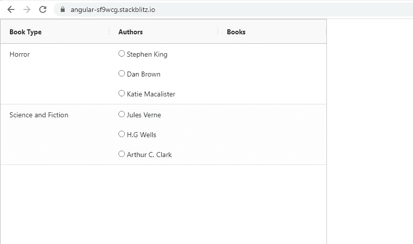
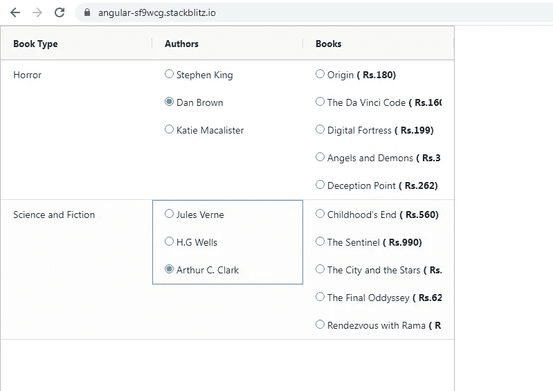
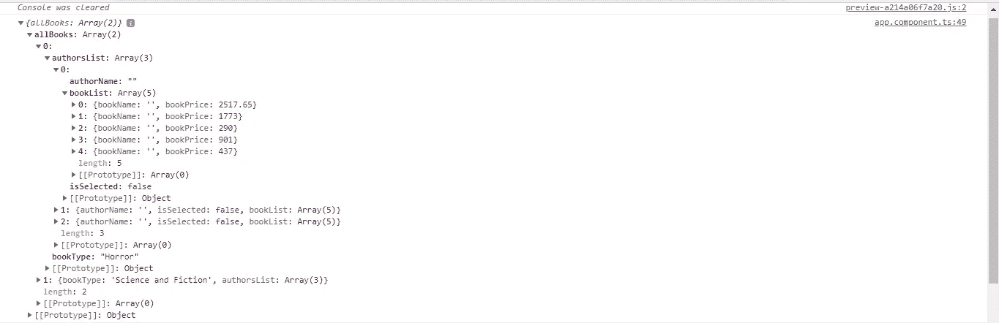
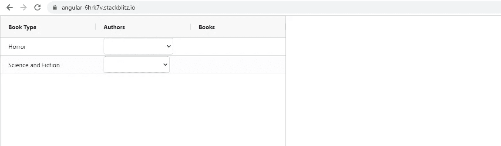
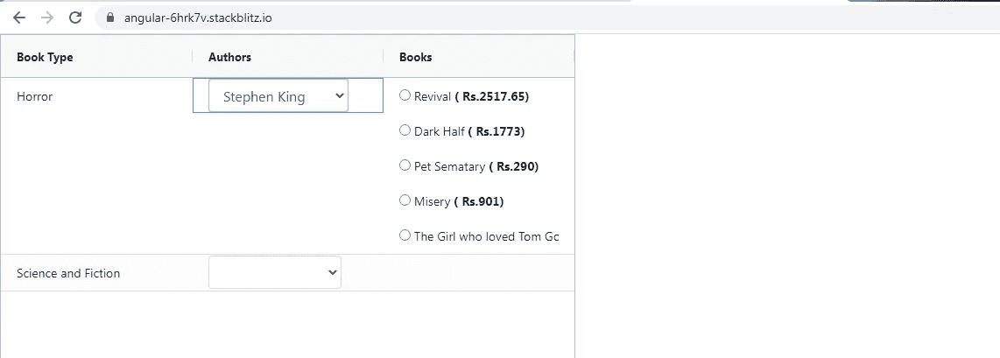
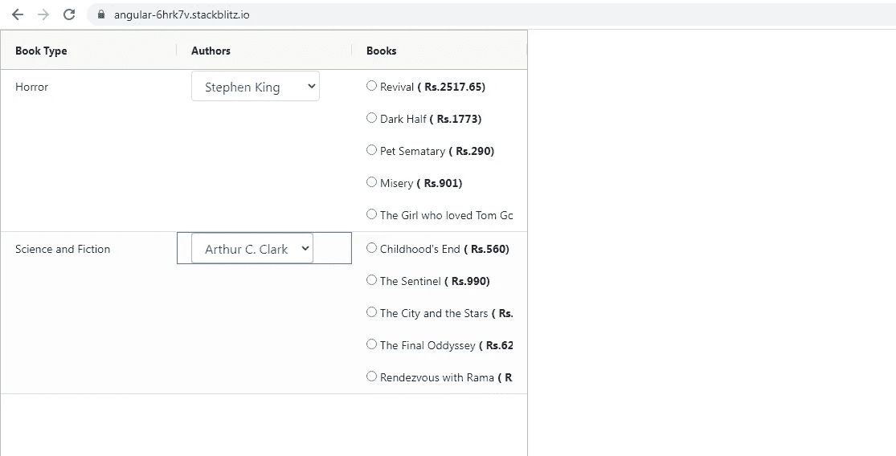

# 如何在 Ag-Grid 表格中使用表格数组和表格组

> 原文：<https://javascript.plainenglish.io/using-formarrays-and-formgroups-in-ag-grid-tables-e02dd7af51f1?source=collection_archive---------0----------------------->


Photo by [James Harrison](https://unsplash.com/@jstrippa?utm_source=medium&utm_medium=referral) on [Unsplash](https://unsplash.com?utm_source=medium&utm_medium=referral)

Ag-Grid 确实提供了添加复选框和下拉框的功能，但是当我在表格中添加表单元素时，在某些情况下，它没有给我所需要的灵活性。

因此，我转而使用我经常在任何常规或引导表中使用的形式数组。

我举了一个非常简单的例子，在 Ag-Grid 表中显示作者列表和这些作者写的书。

下面是我们将要使用的数据。这是一个从 **books.ts** 导出的对象数组

每个对象描述了书的类型，写了该类型的书的几个作者，他们写的书，以及每本书的价格。

我们的目标如下:

1.  将上述数据填入 Ag-Grid 表，如下所示。我们显示了**图书类型**和在该特定图书类型下著书的**作者列表**。我们使用单选按钮来显示作者列表。



BookType and Authors populated in the Table

2.每当我点击一个作者，他/她写的书就会显示在**书籍**栏。表格中的每一行都独立于其他行。

在这个例子中，我在一列中显示了书及其价格，但是可以进一步扩展，添加另一个名为 price 的列。当您选择某本书时，它的价格会显示在价格栏中。



Books written by the selected author displayed

让我们跳到 **AppComponent 类**

这看起来很难理解，但是当一次只看一种方法时，它会变得非常简单。

让我们从 **ngOnInit 生命周期挂钩**开始。

```
books.books.forEach((data) => {
data.authors.forEach((author: any) => {
**author.isSelected = false;**
});
});
```

我们首先遍历从 books.ts 导出的 books 数组。正如您所看到的，JSON 中的 **authors** 属性是另一个对象数组。每个对象包含作者姓名和作者写的书籍列表。

在前面显示的应用程序屏幕截图中，作者姓名前面有一个单选按钮。为了捕捉单选按钮的选中或未选中状态，我们在 **authors** 属性中为每个对象添加了一个额外的 **isSelected** 属性。最初，所有单选按钮都将被取消选择。

```
this.**allBooksFormGroup** = new FormGroup({
**allBooks: new FormArray(this.loadData())**,
});
```

allBooksFormGroup 是我们的根表单组。为了理解我们如何将 JSON 构造成 FormArrays、FormGroups 和 FormControls，请看下面的截图。



FormStructure

1.  **allBooksFormGroup** 包含了 **allBooks** 格式。这对应于包含 2 个对象的 **books** 数组。类似地，FormArray 包含与两个对象相对应的 **2 个表单组**。
2.  books 数组中的每个对象包含两个属性:**类型和作者。**type 属性包含字符串数据，authors 属性是一个对象数组。类似地，每个表单组将包含 1 个**表单控件:图书类型和 1 个表单数组:作者列表**

现在理论已经很清楚了，让我们看看上面的两点是如何在代码中实现的。从 **loadData()** 开始填充 **allBooks** 格式。该方法返回一个名为 **data** 的数组，该数组包含 2 个 FormGroups，而 FormGroups 又包含 1 个 FormControl **bookType** 和 1 个 FormArray **authorsList** 。

```
**loadData() {**
let data: any = [];
books.books.forEach((item) => {
data.push(
new FormGroup({
**bookType: new FormControl(item.type),
authorsList: new FormArray(this.loadAuthors(item.authors)),**
})
);
});
return data;
}
```

3.作者的属性是一个对象数组。每个对象包含 3 个属性: **name，isSelected 和 books** 。name 属性包含字符串数据，isSelected 包含布尔数据，books 属性是一个对象数组。同样，格式数组 **authorsList** 将包含多个 FormGroup，每个 form group 将包含 2 个 **FormControls: authorName 和 isSelected 以及 1 个格式数组:bookList。**

使用 **loadAuthors()** 填充 **authorsList** 格式数组。

```
**loadAuthors(authors) {**
let data: any = [];
authors.forEach((author: any) => {
data.push(
new FormGroup({
**authorName: new FormControl(‘’),
isSelected: new FormControl(author.isSelected),
bookList: new FormArray(this.loadBooks(author.books)),**
})
);
});
return data;
}
```

4.最后，数组 books 是一个对象数组。每个对象包含两个属性:**名称和价格**。name 属性包含字符串数据，price 属性包含数字数据。同样的，**书单**表单将包含两个表单控件:**图书名称和图书价格。**

使用 **loadBooks()** 填充**书单**格式。

```
loadBooks(bookList) {
let data: any = [];
bookList.forEach((book: any) => {
data.push(
new FormGroup({
**bookName: new FormControl(‘’),
bookPrice: new FormControl(book.price),**
})
);
});
return data;
}
```

这就完成了 JSON 表单的结构化。让我们检查 ngOnInit()中剩下的 2 点。

```
**this.rowData** = books.books;**this.columnDefs** = [{
headerName: ‘Book Type’,
field: ‘type’,
},
{
headerName: ‘Authors’,
cellRendererFramework: **ReusableGridComponent**,
cellRendererParams: {
ngTemplate: this.authorList,
},
},
{
headerName: ‘Books’,
cellRendererFramework: **ReusableGridComponent**,
cellRendererParams: {
ngTemplate: this.authorList,
},
},
];
```

**rowData** 包含要在 Ag-Grid 表格中显示的 JSON 数据，而 **columnDefs** 包含表格中 3 列的定义。

请注意使用一个 **ReusableGridComponent** 来显示 Authors 和 Books 列中的单选按钮列表。这个组件非常有用，可以将你自己的 **< ng-template >** 传递到表中。我们将很快看到如何在< ng-template >中使用 FormArray、FormGroup 和 FormControls。

**ReusableGridComponent 模板:**

```
<ng-container
**[ngTemplateOutlet]=”template”
[ngTemplateOutletContext]=”context”**
></ng-container>
```

我建议检查下面的故事，了解更多关于这个组件如何工作的细节。

[](/creating-a-reusable-component-for-using-templates-in-ag-grid-tables-6d9a8dfc88e3) [## Angular:如何创建一个在 Ag-Grid 表格中使用模板的可重用组件

### 如果你想让一个 Ag-Grid 表格与你的应用程序交互，在表格中插入模板是非常有用的。

javascript.plainenglish.io](/creating-a-reusable-component-for-using-templates-in-ag-grid-tables-6d9a8dfc88e3) 

现在，最后让我们来看看 **AppComponent 模板**。

再一次，这看起来很可怕，但实际上并不可怕。该模板仅包含两个部分:

1.  银网格表

```
<ag-grid-angular
**[columnDefs]=”columnDefs”
[defaultColDef]=”defaultColDef”**
class=”ag-theme-alpine”
**[rowData]=”rowData”**
(gridReady)=”onGridReady($event)”
(firstDataRendered)=”dataRendered($event)”
style=”width:100vh;height:100vw”>
</ag-grid-angular>
```

2.<ng-template>参考**作者列表**在**作者列**显示单选按钮作者列表，同时在**图书列**显示一个作者写的图书列表及其价格。我们对两列使用同一个模板。</ng-template>

每当我们点击与作者对应的单选按钮时，就会执行 **toggleRadio()** 。单选按钮的选中/未选中状态由 JSON 中的 **isSelected** 属性控制。因此，当选择一个单选按钮时，我们将对应于该单选按钮的 **isSelected** 属性设置为 **true** ，当未选择时，我们将该属性设置为 **false** 。

```
**toggleRadio(bookTypeIndex, authorIndex) {**
**this.allBooksFormGroup.get(‘allBooks’).controls.forEach**((control, controlIndex) => {if (controlIndex === bookTypeIndex) {
**control.get(‘authorsList’).controls.forEach**((authControl,
authControlIndex) => {if (authControlIndex === authorIndex) {
**authControl.get(‘isSelected’).patchValue(true);**
} else {
**authControl.get(‘isSelected’).patchValue(false);**
}
});
}
});
}
```

为了确保**只显示所选作者的书籍**，我们在模板中使用了下面的方法 **canShow()** 。

我们将所选作者的图书列表与其他作者的图书列表进行了比较，以显示正确的图书列表

```
**canShow(bookTypeIndex, bookDetail) {** let canShow = false;
let selectedAuthor: any = {};let allBookDetails = this.allBooksFormGroup.get(‘allBooks’).controls;allBookDetails.forEach((formGroup, formGroupIndex) => {
if (formGroupIndex === bookTypeIndex) {
selectedAuthor = formGroup.get(‘authorsList’).value.find((item) => item.isSelected);
}
});if (selectedAuthor) {
canShow =
Array.isArray(selectedAuthor.bookList) && Array.isArray(bookDetail.value) &&
selectedAuthor.bookList.length === bookDetail.value.length &&
selectedAuthor.bookList.every((val, index) => val === bookDetail.value[index]);
}
return canShow;
}
```

你可以通过下面的链接查看整个代码。

[](https://stackblitz.com/edit/angular-1eodyj?file=src/app/app.component.html) [## 角形(叉形)堆叠

### 一个基于 rxjs，tslib，jquery，core-js，zone.js，bootstrap，popper.js，@angular/core 的 angular-cli 项目…

stackblitz.com](https://stackblitz.com/edit/angular-1eodyj?file=src/app/app.component.html) 

在结束这个故事之前，如果您更喜欢在 **Authors** 列中使用下拉菜单而不是单选按钮，那么您可以查看下面的 StackBlitz 链接以获得实现。这个概念和上面的例子是一样的，但是在模板上有细微的变化。

[](https://stackblitz.com/edit/angular-6hrk7v?file=src/app/app.component.html) [## 角形(叉形)堆叠

### 一个基于 rxjs，tslib，jquery，core-js，zone.js，bootstrap，popper.js，@angular/core 的 angular-cli 项目…

stackblitz.com](https://stackblitz.com/edit/angular-6hrk7v?file=src/app/app.component.html) 

DropDown Implementation



Selected Author from Horror Genre



Selected Author from Science and Fiction Genre

*更多内容请看*[***plain English . io***](http://plainenglish.io/)***。*** *报名参加我们的**[***免费每周简讯这里***](http://newsletter.plainenglish.io/) ***。****