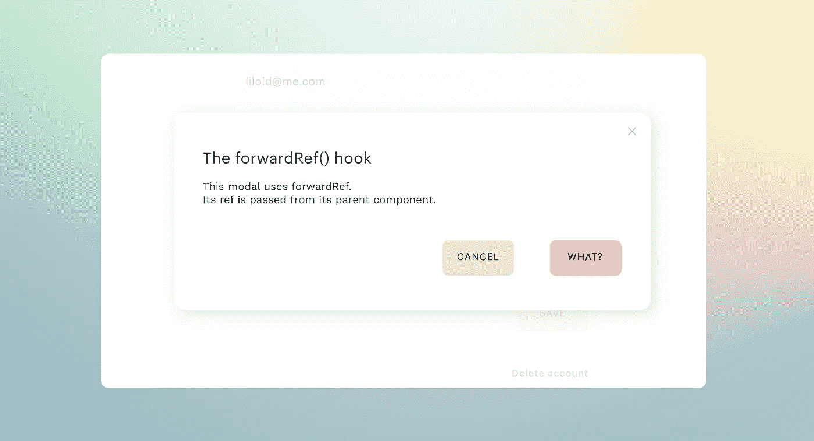

# 使用带有反作用钩子的 forwardRef

> 原文：<https://javascript.plainenglish.io/using-forwardref-with-react-hooks-9d0d096ad810?source=collection_archive---------1----------------------->



forwardRef 钩子允许 React 用户将 Ref 传递给子组件。引用可以通过`useRef`或`createRef`创建和引用，然后传入父组件。当需要在父组件中访问引用时，使用 forwardRef 而不是 useRef 很有用。

# 使用 forwardRef

参考文献**不能作为道具**传递给功能组件。

这将失败:

```
import React, {useRef} from 'react';**//DON'T DO THIS**
export function ParentComponent() {
    const nodeRef = useRef(null);return (
       <ChildComponent ref={nodeRef}
       )}export function ChildComponent(props) {
return (
     <div ref={props.nodeRef}>
         <p>Don't pass refs like this</p>
     </div>
    )
}
```

这会**起作用**:

```
import React, {useRef, forwardRef} from 'react';**//DO THIS**
export function ParentComponent() {
    const nodeRef = useRef(null); return (
       <ChildComponent ref={nodeRef}
       )};export function ChildComponent forwardRef((props, ref) {
    return (
        <div ref={ref}>
           <p>Pass refs like this</p>
        </div>
    )
});
```

*请注意，子组件用括号括起来，并且 ref 与 props 分开使用 forwardRef。*

# forwardRef 代码示例

在这个例子中，我们将在父组件中创建一个引用，这样我们就可以使用它来设置状态，并将该引用转发给子组件。这是 forwardRef 的一个常见用例。

这是一个简单的代码，一个父页面，它有一个打开模态的按钮和两个功能:`toggleModal`，用于使用按钮打开和关闭模态，和`handleOutsideClick`，所以模态可以通过点击它外面来关闭。

## **>母构件**

```
import React, { useRef, useState } from 'react;
import ChildModal from './Child';export function Parent() {
     const [modal, setModal] = useState(false); const modalRef = useRef(null); const toggleModal = () => {
        setModal(!modal);
     } const handleOutsideClick = (e) => {
      if(modalRef.current && !modalRef.current.contains(e.target)) {
        setModal(false);
       }
    } return (
       <div className="page" onClick={() => handleOutsideClick()}>
            <h3>Page title</h3> 
            <p>Generic page with a button to open a modal</p>
            <button type="button" onClick={() => toggleModal()}>
              Open modal
            <button/>
           {modal &&
             <ChildModal ref={modalRef} toggleModal={toggleModal}/>
            }       
       </div>
     )
} 
```

## 子组件

```
import React, { forwardRef } from 'react;export function ChildModal forwardRef((props, ref) {
    return (
        <div className="modal" ref={ref}>
           <p>This is an info modal</p>
           <button type="button" onClick={() => toggleModal()}>
              Close modal
            <button/>
       </div>
    )
});
```

这是`forwardRef`的语法，有一个例子。更多资源可在此处找到:

*   向前反应参考[文档](https://reactjs.org/docs/forwarding-refs.html)和 [API 参考](https://reactjs.org/docs/hooks-reference.html)。
*   [了解反应中的转发参考文献](https://blog.bitsrc.io/understanding-ref-forwarding-in-react-80accd93ed74)。
*   视频:本·阿瓦德的 [forwardRef 教程](https://www.youtube.com/watch?v=p7OCG_osB0E)和 [useRef 教程](https://www.youtube.com/watch?v=W6AJ-gRupCs)。