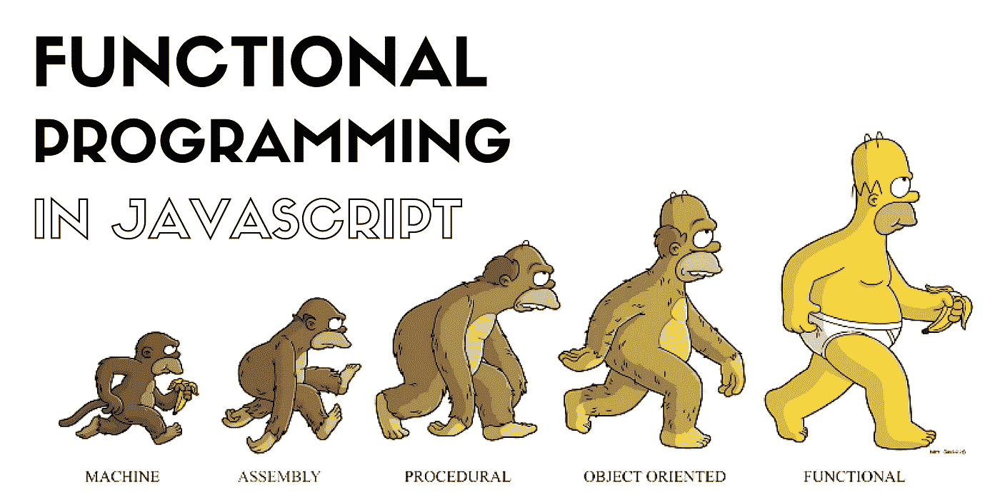

# 使用函数式编程提高 JavaScript 代码的质量

> 原文：<https://javascript.plainenglish.io/using-functional-programming-to-live-your-best-javascript-life-an-example-475f9e3d8b6d?source=collection_archive---------6----------------------->



最近，我一直在学习 Redux，不断看到关于函数式编程的东西。我听说过这些话，我模糊地理解了这些原则，但是我在我的代码中真正应用它们时遇到了一些麻烦。

我的一些其他开发伙伴告诉我函数式编程如何使你的代码更干净、更高效、更抽象，并减少引入错误的可能性。我仍然在努力习惯性地融入这些想法，所以我写了这篇简单的文章来演示函数式编程的基础。

假设我们有一个用户对象数组，大概是这样的:

```
const users = [
{id: 1, username: "cambot", favorite_color: "red"},
{id: 2, username: "gypsy", favorite_color: "purple"},
{id: 3, username: "tom", favorite_color:  "red"},
{id: 4, username: "crow", favorite_color: "gold"},
{id: 5, username: "joel", favorite_color: "red"},
{id: 6, username: "mike", favorite_color: "blue"},
{id: 7, username: "jonah", favorite_color: "yellow"}
]
```

我们想做一个只有最喜欢红色的用户的数组。我们可以为 loop 编写如下代码:

```
let favRed = []
for(let i = 0; i < users.length; i++) {
  if(users[i].favorite_color === 'red')
    favRed.push(users[i])
}
```

这当然是可行的，但是通过应用函数式编程范式，我们可以使代码更简单，更不容易出错。

在函数式编程中，我们努力使用纯函数和不可变数据。纯函数，当给定相同的输入时，总是返回相同的输出。数据的不变性是不让我们的代码实际改变数据状态的概念。坚持这两个概念，我们可以安全地使用高阶函数(将函数作为参数的函数)来简化我们的代码。JavaScript 附带的一个非常常见的高阶函数是 filter:

```
let favRed = users.filter(user => user.favorite_color === 'red');
```

通过将 arrow 函数传递给 filter，上面的代码行获得了与我们之前编写的 for 循环相同的结果，但是使用了更少的代码。

太好了！然而，我们还可以进一步简化这段代码。如果我们通过将 arrow 函数赋给它自己的一个变量来隔离它，我们就有效地将每一个可能的动作减少到它自己的函数中，增加了模块性，使我们更有可能不会重复代码。例如，我们可以使用高阶函数 filter 和 reject 以及我们的隔离箭头函数，将我们的用户分成喜欢红色的用户数组和喜欢不同颜色的用户数组:

```
const isRed = user => user.favorite_color === 'red';
const favRed = users.filter(isRed);
const favOther = users.reject(isRed);
```

# 结论

这就是函数式编程如此强大的原因。不仅代码小而高效，而且可读性也更好。我期待着在本周将这些原则应用到我的代码中！

*更多内容尽在*[*plain English . io*](http://plainenglish.io/)