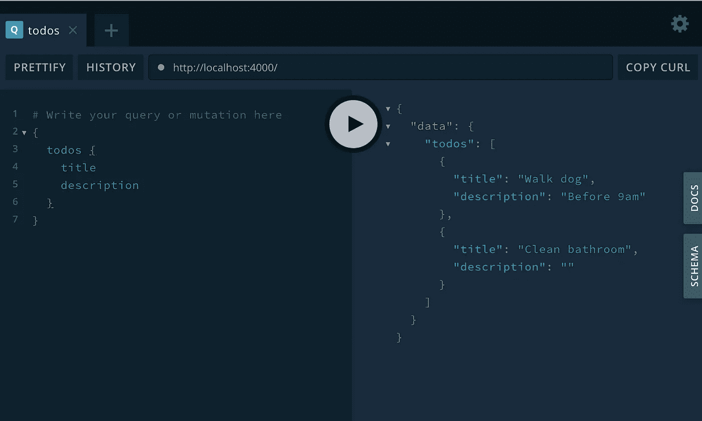
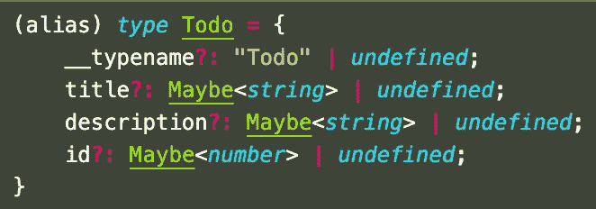
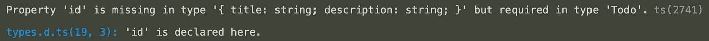

# 带有 TypeScript 和 GraphQL 的代码生成器

> 原文：<https://javascript.plainenglish.io/using-graphql-code-generator-to-create-a-great-developer-experience-with-typescript-and-graphql-30e30261b75?source=collection_archive---------3----------------------->

## 使用 GraphQL 代码生成器创建出色的 TypeScript 和 GraphQL 开发人员体验


如果你和我一样，你最近几乎都是用 TypeScript 写代码，偶尔打开一个. js 文件会让你有点惊慌。您可能还会花时间构建 REST APIs 和 GraphQL 层来与前端应用程序通信。起初，TypeScript 和 GraphQL 似乎是天作之合；它们都是类型化的，所以它们应该可以很好地合作。

然而，当您有两个不同类型的系统，或者关于您的数据应该如何的两个真实来源时(在您甚至包括一个数据库之前)，在构建特性时不可避免地会有挫折，并且当您发布那些特性时会有错误。这一直是我的经验，直到我遇到一个项目，每当我改变我的 GraphQL 模式时，GraphQL 代码生成器就会神奇地为我创建 TS 类型。我不太喜欢在不了解底层工具的情况下使用 magic，所以我想重新创建一个最小的例子来做同样的事情，希望其他人也能发现这很有用！

在本文中，我们将:

*   从头开始创建 TypeScript 项目
*   添加一个非常简单的 GraphQL 服务器
*   添加 GraphQL 代码生成器，以无缝方式将它们集成在一起

如果整件事是 TL；博士，你可以在这里找到最终代码。

# 设置类型脚本

*在本节结束时，您的项目应该类似于* [*这个*](https://github.com/Djangofs/graphql-ts-codegen/commit/5f60f3a821c91e8f60dec9f5c01b9a4fd3bdace0) *。*

我假设如果你正在阅读这篇文章，你已经在你的机器上安装了 Node、npm 和 Yarn，并且对它们的使用相当熟悉。

首先，我们要创建一个空的 npm 项目(默认选项都可以):

```
mkdir my_project && cd my_project && npm init
```

接下来，我们要将 typescript 添加到项目的`devDependencies`中。这是因为我们使用 TypeScript 将我们的代码转换成 Javascript，我们不需要在我们的产品构建中运行它。在这里，我们还要添加 ts-node 和 nodemon，稍后我们将看到如何使用它们。

```
yarn add -D typescript ts-node nodemon
```

现在你想初始化你的 TypeScript 项目。这将创建一个默认的`tsconfig.json`文件。

```
npx tsc --init
```

看看默认情况下没有启用的选项。设置`"outDir": "dist"`和`"sourceMap": true`。这将把你的编译后的代码发送到一个`dist`目录，你不应该把它提交给 Git，这样在出错时可以更容易地调试。

现在我们已经设置了 TS，让我们在`src`文件夹中添加一个`index.ts`文件，并向其中添加以下代码。这是一个非常简单的 Hello World TS 项目:

```
const world = "world";export function hello(word: string): void {
    console.log(`Hello ${word}! `);
}hello(world);
```

您现在可以运行`npx tsc`来传输代码，运行`node dist/index.js`来运行代码，您应该会在控制台上看到输出。虽然这是可行的，但每次修改代码时都必须这样做是很烦人的。相反，我们可以使用`ts-node`同时传输和执行我们的代码。简单地运行`ts-node src/index.ts`，你的 TS 代码将在一个命令中被编译和执行。重要的是要注意，这是一个优化，只有在你的机器上快速迭代和运行代码的时候才有意义。任何生产应用程序都不应使用 ts-node 执行。

我们还可以做得更好。每次我们保存文件时都必须运行这个命令有点痛苦。相反，创建一个`nodemon.json`文件，并包含以下内容:

```
{
  "watch": ["src"],
  "ext": "ts",
  "exec": "ts-node ./src/index.ts"
}
```

这将删除`src`文件夹中扩展名为`.ts`的所有文件，并在其中一个文件发生变化时执行`ts-node`命令。

现在，为了运行这个`nodemon`文件，让我们在`package.json`文件中添加一个 npm 脚本:

```
"scripts": {
  "start": "nodemon",
}
```

我们可以用`yarn start`来执行它，然后更改 index.ts 文件，并立即看到我们的更改被执行🚀

# 添加 GraphQL 服务器

在本节结束时，你的代码应该看起来像 [*这个*](https://github.com/Djangofs/graphql-ts-codegen/commit/9dc1797f68fbeae1a7fa0648f7acdf802f8b1659) *。*

首先，让我们添加我们将在本节中使用的依赖项，我们最终会看到这些依赖项:

```
yarn add apollo-server graphql [@graphql](http://twitter.com/graphql)-tools/load [@graphql](http://twitter.com/graphql)-tools/graphql-file-loader [@graphql](http://twitter.com/graphql)-tools/schema
```

接下来，让我们在`src/types/types.ts`中添加我们的第一批 TS 类型:

```
export interface Todo {
  title: string;
  description: string;
}
```

让我们向使用该类型的`index.ts`文件添加一些数据(您可以从该文件中删除所有旧代码):

```
import { Todo } from "./types/types";*const* todos: Todo[] = [
  {
    title: "Walk dog",
    description: "Before 9am",
  },
  {
    title: "Clean bathroom",
    description: "",
  },
];
```

现在让我们添加一个 GraphQL 模式(在`src/schemas/index.graphql`中)，它允许我们查询待办事项:

```
type Todo {
  title: String
  description: String
}type Query {
  todos: [Todo]
}
```

现在我们有了一个新的文件扩展名，让我们也更新一下`nodemon.json`文件的`ext`部分，这将在`.ts`或`.graphql`文件改变时启用我们的热重载。

```
*"ext"*: "ts,graphql"
```

现在，我们想使用这个模式来设置我们的 GraphQL 服务器。为此，首先让我们将之前安装的依赖项中所需的所有函数添加到`index.ts`文件中:

```
import { loadSchemaSync } from "@graphql-tools/load";
import { GraphQLFileLoader } from "@graphql-tools/graphql-file-loader";
import { addResolversToSchema } from "@graphql-tools/schema";
import { ApolloServer } from "apollo-server";
```

首先，让我们使用`loadSchemaSync`和`GraphQLFileLoader`加载我们之前定义的 GraphQL 模式。这些函数让我们可以导入我们定义的所有 GraphQL 文件，这在 TypeScript 中没有常规的方法。

```
*const* schema = loadSchemaSync("**/*.graphql", {
  loaders: [new GraphQLFileLoader()],
});
```

接下来，让我们定义一些解析器来实现该模式:

```
*const* resolvers = {
  Query: {
    todos: (): Todo[] *=>* todos,
  },
};
```

这将简单地返回我们之前定义的`todos`数据。

最后，我们可以使用`addResolversToSchema`将解析器添加到模式中:

```
*const* schemaWithResolvers = addResolversToSchema({
  schema,
  resolvers,
});
```

现在，我们准备将这个模式提供给我们的 Apollo 服务器(Apollo 是一个流行的 Javascript graph QL 实现):

```
const server = new ApolloServer({ schema: schemaWithResolvers });server.listen().then(({ url }) => {
  console.log(`🚀  Server ready at ${url}`);
});
```

现在，当您保存`index.ts`时，您应该会在控制台中看到服务器就绪日志。现在在浏览器中打开`localhost:4000`，您可以在 GraphQL playground 中尝试这个查询:



Getting Todos data back using GraphQL

此时，我们有了一个 GraphQL 服务器，为我们的 GraphQL 和 TypeScript 文件进行热重载，一个 GraphQL 模式和一些 TS 类型，以及一些要响应的数据。

然而，这有一个相当明显的问题。当我们的数据模型不可避免地改变时，我们必须更新 TS 类型和 GraphQL 模式。在这个简单的例子中，这是微不足道的，但是在任何超出这个范围的情况下都会出错。这也很无聊，不能很好地利用工程师的时间，而工程师的时间是非常宝贵的！当你发布这段代码时，这也是一个非常常见的错误来源。

为了解决这个问题，我们可以利用 [GraphQL 代码生成器](https://graphql-code-generator.com/)。

# 添加 GraphQL 代码生成器

*在这一节的最后，你的代码应该看起来像* [*这个*](https://github.com/Djangofs/graphql-ts-codegen/commit/8784a596e12c1153f11d1a39395ce548e81c30f5) *。*

同样，让我们从添加我们将使用的依赖项开始:

```
yarn add [@graphql](http://twitter.com/graphql)-codegen/cli [@graphql](http://twitter.com/graphql)-codegen/typescript [@graphql](http://twitter.com/graphql)-codegen/typescript-resolvers
```

并创建一个包含以下内容的`codegen.yaml`文件:

```
overwrite: true
schema: src/schemas/**/*.graphql
documents: null
generates:
  src/types/types.d.ts:
    plugins:
      - "typescript"
      - "typescript-resolvers"
```

这将获取`src/schemas`中的所有`.graphql`文件，并在`src/types/types.d.ts`中生成 TypeScript 类型。

为了执行此操作，让我们添加另一个 npm 脚本:

```
*"generate"*: "graphql-codegen"
```

并用`yarn generate`运行。一旦完成，您就可以看到您生成的文件了！现在我们有了这个，我们可以删除旧文件`src/types.types.ts`。

在这一点上，没有什么真正改变，我们的代码仍然运行相同。让我们通过更新`nodemon.json`中的`exec`部分，确保每次修改代码时都运行这个生成命令:

```
*"exec"*: "yarn generate && ts-node ./src/index.ts"
```

现在，当您在`index.graphql`的`Todo`类型中添加一个`id`字段时:

```
type Todo {
  title: String
  description: String
  id: Int
}
```

您应该会看到一些错误，因为我们的数据中没有定义`id`字段…但是我们没有？



如果我们看一下`Todo`类型，我们可以看到所有的字段都是可选的，并且接受未定义的。这不是我们想要的，因为该数据模型要求所有数据始终存在，所以让我们更新 GraphQL 模式以反映这一点:

```
type Todo {
  title: String!
  description: String!
  id: Int!
}
```

现在，当我们保存文件并重新加载服务器时，它崩溃了，我们可以在编辑器中清楚地看到错误:



我们可以通过向 Todos 数据对象添加 id 来修复这个错误，此时我们的服务器将重新启动，我们现在可以查询`id`数据。🎉

现在我们处在一个可爱的地方，我们的 TS 类型完全从我们的 GraphQL 模式生成，每次模式改变时，类型都会重新生成。这极大地简化了开发人员的体验，加快了反馈循环，甚至在我们的代码被编译之前就捕捉到了错误，更不用说测试或部署了。

# 更进一步

如果您想继续从事这项工作，您可以添加一些使用参数的 GraphQL 变体，并查看代码生成器如何为参数和响应对象创建类型。如果你想变得更好，你也可以尝试将这种方法与数据库类型的系统相结合，以实现完全的数据模型同步💆‍♂.

感谢一路读到最后！如果你想听我更多的漫谈，你可以在 [Twitter](https://twitter.com/DjangoFS) 、 [LinkedIn](https://www.linkedin.com/in/django-shelton-99a07aa0/) 和 [GitHub](https://github.com/Djangofs) 上找到我。