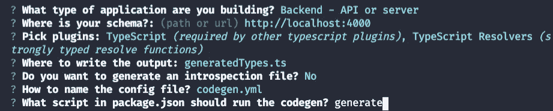
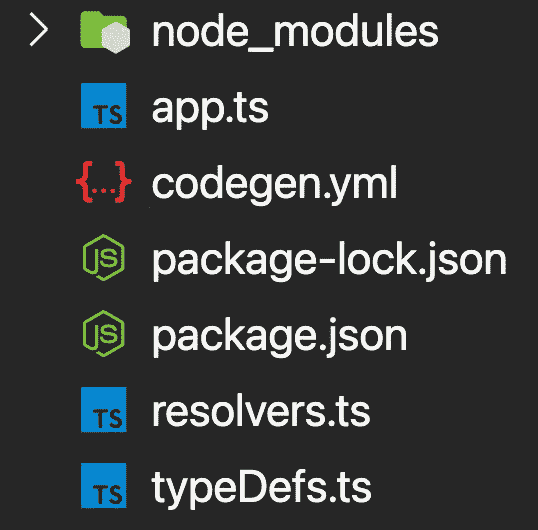
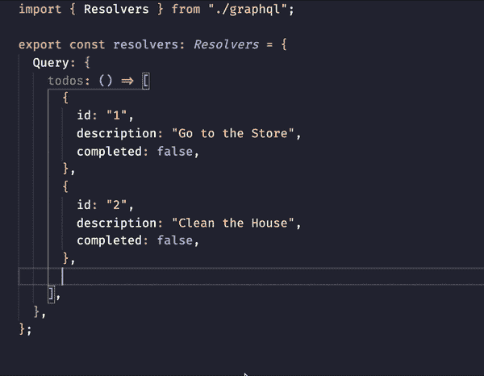
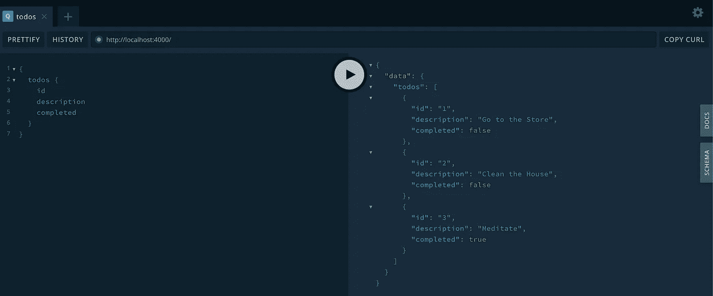

# 将 GraphQL 代码生成器与 Apollo-Server 和 TypeScript 一起使用

> 原文：<https://javascript.plainenglish.io/using-graphql-code-generator-with-apollo-server-and-typescript-37e4201015d1?source=collection_archive---------7----------------------->

GraphQL 代码生成器可以改变您编写 GraphQL 代码的方式。让我们通过在 Apollo 中设置一个基于 TypeScript 的 GraphQL 服务器来看看使用它是多么容易。


GraphQL 代码生成器是编写基于 GraphQL 的代码(包括服务器端和客户端)的真正游戏规则改变者。在本文中，我们将学习如何在 Apollo 中利用 GraphQL 代码生成器。在本文中，我们将通过为我们的解析器生成类型来使用它，使我们能够以最小的努力编写类型安全的解析器。

# 让我们建立我们的项目

我们需要做的第一件事是建立一个新的节点项目。继续操作，打开终端/命令提示符(取决于操作系统)并导航到您希望项目存在的位置。运行以下命令为您的项目创建一个新文件夹。

```
mkdir code-gen-tutorial
```

之后，继续前进并导航到新文件夹。

```
cd code-gen-tutorial
```

一旦进入我们的文件夹，我们将初始化一个新项目。(我将使用 npm 命令，但是如果您愿意，可以随意使用 yarn)。

```
npm init -y
```

现在我们的项目已经初始化，是时候安装我们需要的包了。

```
npm install graphql apollo-server
```

我们还需要安装一些开发依赖。

```
npm install --save-dev @graphql-codegen/cli ts-node-dev typescript
```

随着我们的项目设置和包的安装，现在是时候设置 GraphQL 代码生成器了。

我们将不得不运行下面的命令，并为它选择一些预置。

```
npx graphql-codegen init
```

我们需要确保选择以下预设。



运行该命令后，我们现在必须运行 install 命令来安装添加到 package.json 文件中的附加包。

```
npm install
```

这些设置步骤已经完成，现在是时候在您选择的代码编辑器中打开我们的项目了。我将使用 VS 代码，但是任何支持 TypeScript/JavaScript 的代码编辑器都可以。

# 让我们开始编码吧

我们将向项目的根目录添加三个文件。第一个称为 **app.ts** ，这是我们的服务器将被创建和运行的地方。第二个名为 **typeDefs.ts** ，代码生成器将使用这个文件根据其中的模式生成 TypeScript 类型。第三个文件叫做 **resolvers.ts** ，这是我们的 GraphQL 服务器的解析器所在的地方。下面是迄今为止我们的项目结构应该是什么样子的截图。



## 添加运行代码的脚本

在我们的项目中，我们首先要从 **package.json** 文件开始。我们将添加一个利用 *ts-node-dev* 的脚本，这是我们之前安装的包之一。本质上，它所做的是为 TypeScript 项目创建一个热重装开发服务器。下面是我们在第 7 行添加了 *dev* 脚本后的 **package.json** 文件的样子。

## 设置 Apollo 服务器

既然我们已经添加了运行服务器的脚本，那么我们需要一个服务器来运行也就说得通了。幸运的是， *Apollo-Server* 让这个过程变得非常简单。我们将把下面的代码添加到我们的 **app.ts** 文件中。

这是我们的 **app.ts** 文件所需的全部代码。当然，我们还不能运行，因为**行 3** 上的 typeDefs 和 resolvers 还没有定义。这就是我们接下来要做的，我们将看到 GraphQL 代码生成器的神奇之处。

## 为 GraphQL 代码生成器创建模式

为了简单起见，我们将创建一个超级基本模式。我将制作一个模式，返回一个假的待办事项列表。下面是我的模式的代码看起来会是什么样子，但请随意试验。

有了我们的模式，是时候进入 GraphQL 代码生成器发挥其魔力的部分了。

## 使用 GraphQL 代码生成器

在我们生成文件之前，我们需要对 **codegen.yml** 文件做一些小的修改。我将删除显示( **documents: null** )的行，因为我们在这个项目中没有任何需要查看的文档。此外，我将添加一个配置选项，在使用 Apollo-Server 时需要该选项来正确生成类型(我们需要将 *useIndexSignature* 设置为 true)。下面是 **codegen.yml** 文件的代码。

*请注意，对于 YAML 文件，空白非常重要。*

现在，我们的配置文件已经修改为可以与 Apollo-Server 一起工作，是时候生成我们的 TypeScript 类型了。为此，我们只需运行以下命令。

```
npm run generate
```

如果一切顺利，我们应该会看到在项目的根目录下生成一个名为 **graphql.ts** 的新文件。这个文件将为我们的解析器提供所有类型，允许我们基于我们的 GraphQL 模式编写类型安全的解析器。它应该看起来像下面的代码。

现在已经为解析器生成了类型，我们只剩下最后一件事要做了。

## 为我们的 GraphQL 服务器创建解析器

感谢我们刚刚使用 GraphQL 代码生成器所做的事情，它将使我们的代码更不容易出错，并且由于我们的代码编辑器的自动完成和错误检查，确实更容易编写。下面是我们的解析器的代码。

在**第 3 行，**你会注意到我们将解析器的类型设置为*解析器*。这个类型来自我们生成的名为 **graphql.ts** 的类型文件。在这里将我们的类型设置为*解析器*将确保我们的解析器必须按照我们在模式中描述的方式来构造。如果我们不这样做，TypeScript 将抛出错误，这正是我们想要的。

下面是代码编辑器中自动完成和错误检查的演示。



由于 GraphQL 代码生成器的帮助，我们现在已经成功地创建了解析器，只剩下最后一步了。

## 启动我们的 GraphQL 服务器

随着我们的*解析器*和*类型定义*现在被定义在单独的文件中，代码中唯一要做的事情就是将它们放入我们的 **app.ts** ，如下面的代码所示。

仅此而已。我们现在有了一个工作的 GraphQL 服务器。现在剩下要做的就是在命令行中运行下面的命令，然后在 web 浏览器中导航到[**http://localhost:4000**](http://localhost:4000)来启动它。

```
npm run dev
```

导航到您的服务器后，您应该能够查询我们的假待办事项列表，如下图所示。



# 结论

在编写 API 时，GraphQL 是一个有利的工具。当在 TypeScript 中使用它时，编写起来可能会令人生畏或单调乏味，因为必须编写大量额外的代码(样板文件)，但多亏了 GraphQL Code Generator 这样的工具，编写所有这些额外的代码已经成为过去。

我希望你喜欢这个小教程，并希望听到你的意见。我很乐意在这方面做更多的教程，这样我们可以使用 GraphQL 做更深入的项目。

## 参考

[](https://www.apollographql.com/docs/apollo-server/) [## 阿波罗服务器简介

### Apollo Server 是一个开源的、符合规范的 GraphQL 服务器，它与任何 GraphQL 客户端兼容，包括…

www.apollographql.com](https://www.apollographql.com/docs/apollo-server/)  [## 什么是 GraphQL 代码生成器？GraphQL 代码生成器

### GraphQL 代码生成器是一个 CLI 工具，它可以从 GraphQL 模式中生成类型脚本类型。当我们开发一个…

www.graphql-code-generator.com](https://www.graphql-code-generator.com/docs/getting-started/index)  [## 类型脚本解析器| GraphQL 代码生成器

### 这个插件为 GraphQL API 的解析函数生成类型脚本签名。你可以使用这个插件来…

www.graphql-code-generator.com](https://www.graphql-code-generator.com/docs/plugins/typescript-resolvers#integration-with-apollo-server) 

*更多内容请看*[***plain English . io***](https://plainenglish.io/)