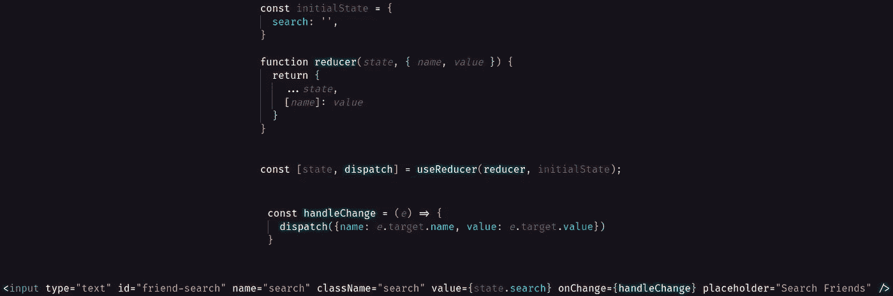

# 使用钩子在 React 中创建一个实时搜索特性

> 原文：<https://javascript.plainenglish.io/using-hooks-to-create-a-live-search-feature-in-react-c667fe9bbc9e?source=collection_archive---------10----------------------->

谁不喜欢漂亮的实时/即时搜索功能呢？它们为用户省去输入完整查询的麻烦，并且在试图从已经填充的列表中查找内容时特别有用。

在本文中，我们将为我们的朋友列表设置一个 live search，以便用户可以更容易地找到特定的朋友。

因此，我们成功地获取了我们的朋友，并且能够向用户显示这些朋友。现在，我们想让用户能够搜索这些朋友，而不必发送另一个获取请求并等待我们后端的另一个响应。让我们从创建一个受控输入开始。

要创建一个受控输入，首先我们要设置状态。因为我们使用的是功能组件，所以我们必须使用钩子来完成这个任务。在这个例子中，我们将使用`useReducer`钩子。我们希望在初始状态下创建一个状态变量来保存我们的搜索查询。在这里，我将状态变量命名为“search ”,并将其设置为一个空字符串。

现在我们可以添加我们的输入。将输入的值设置为等于状态变量“search”是很重要的。这样，用户在搜索栏中看到的内容反映了我们的状态变量中包含的内容。

为了让状态变量以及搜索栏随着每次击键而更新，我们将使用`onChange`事件监听器。这将在输入改变时触发我们的`handleChange`函数。

handleChange 函数用来自`onChange`事件的输入信息更新我们的状态变量。请记住，当我们更新状态时，它会触发组件的重新呈现。因此，每次击键时，搜索栏中的信息都会用更新后的信息重新呈现。在这里，您可以看到它将使用事件目标的名称(事件是变更，目标是我们的输入)，即“search”。它会将名为“search”的变量的值设置为事件目标的值(触发 onChange 事件侦听器的击键)。

现在，当用户输入他们的查询时，我们存储这些信息并显示给用户。有了这些信息，我们可以过滤我们的朋友列表，只向用户显示名字中包含状态变量中的字符串的朋友。为了实现这一点，让我们创建一个`filterFriendsList`函数。

和过滤后的朋友变量。

让我们用`filterFriendsList`函数获取一个朋友，并检查我们朋友的名字是否包含我们存储在 state 中的字符串。如果是的话，让我们把它添加到我们的`filteredFriends`数组中。

太棒了。现在我们只需要给这个函数传递一些信息，渲染我们的朋友。由于我们所有朋友的名字都应该被推送到`filtedFriends`数组，在我们的状态变量中给定一个空字符串，我们应该能够正常地呈现我们的朋友列表，只需要一行额外的代码来处理朋友的过滤。

这将通过`filterFriendsList`函数把每个朋友，符合标准的朋友推到一个数组(所有的朋友给一个空字符串)，并使用该数组创建我们的朋友列表。

就是这样！通过一个简单的受控输入，我们可以使用我们收集的信息来过滤用户的朋友列表，而不必再次调用我们的后端。这种逻辑同样适用于各种问题。开心快乐编码！

[*更多内容看 plainenglish.io*](http://plainenglish.io/)