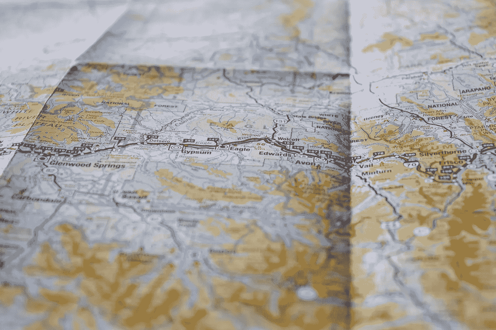
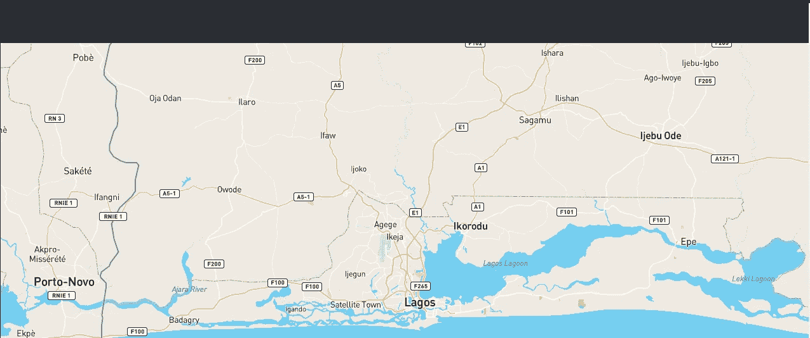
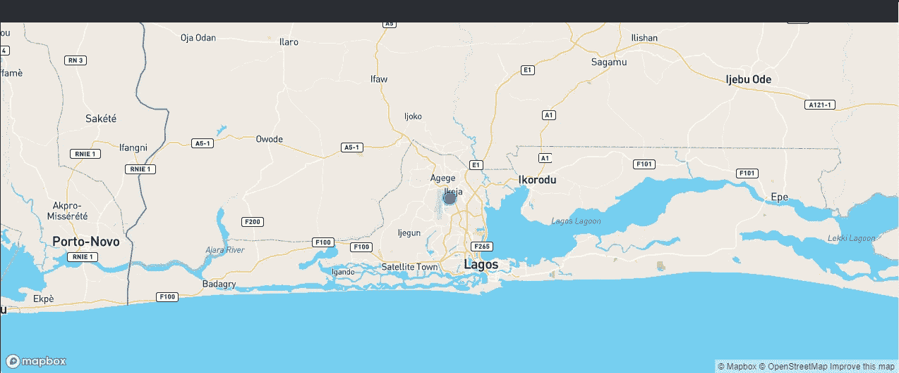

# 使用 Mapbox GL JS，Mapbox 使用 React 进行正向地理编码

> 原文：<https://javascript.plainenglish.io/using-mapbox-gl-js-mapbox-forward-geocoding-with-reactjs-a7099f1c6033?source=collection_archive---------1----------------------->



picture: [https://unsplash.com/photos/yg8Cz-i5U30?utm_source=unsplash&utm_medium=referral&utm_content=creditShareLink](https://unsplash.com/photos/yg8Cz-i5U30?utm_source=unsplash&utm_medium=referral&utm_content=creditShareLink)

我一直是地图框的粉丝。可能因为我发现大多数开发人员都在使用它，我想我喜欢它是因为它的简单和易于设置。除此之外，Mapbox 提供了一个强大的方法来定制你的地图，他们的文档也非常棒。

在本教程中，我将向您展示如何使用 React、React hooks 和 Mapbox GL JS 来构建:

*   带有自定义标记的交互式地图
*   在地图框中正向地理编码

# 入门指南

首先，您需要一个 API 访问令牌来配置 Mapbox GL JS 进行路径选择和地理编码。去[mapbox.com](https://www.mapbox.com/)，创建一个账户。在您的控制面板上，创建一个令牌。请注意，本教程假设您对 React 有基本的了解。

***设置我们的项目***

**步骤 1:** 在您的终端上，运行`npx create-react-app mapbox-demo`来创建我们的 react 项目。一旦安装完成，用`cd mapbox-demo`进入你的项目文件夹。

**第二步:**我们还要安装 Mapbox GL JS 库和 Mapbox SDK，因为我们会用到它们。

`npm install mapbox-gl @mapbox/mapbox-sdk`

**第三步:**在你的 **src** 文件夹中，创建一个 **components** 文件夹。在你刚刚创建的文件夹中，创建一个 **GenerateMap.js** 文件。

您的项目结构应该如下所示

```
...
└── src
    ├── components
    │   └── GenerateMap.js
    │
    ├── App.css
    ├── App.js
...
```

现在让我们从编写一些代码开始😋

# 创建 HTML 页面

打开`public/index.html`文件，将下面的代码粘贴到其中。

这段代码创建了 HTML 页面的结构。这里我们有包含保存页面根的`id`的`div`。我们在`head`标签处也有 `mapbox-gl.css`链接。

# 创建 React 应用

打开`GenerateMap.js`文件。将以下代码添加到其中。

我们决定在这里进口一些东西。Mapbox SDK 为我们提供了地理编码服务。而且不用担心，后面的`<React.Fragment/>`会改的。

接下来，让我们初始化地图。该代码将在页面装载后立即运行。

需要使用`mapContainerRef`将地图呈现为 HTML 元素。

这里我们在一个 React `useEffect` 钩子中添加了 Mapbox 地图。这确保了在 React 尝试创建包含贴图的元素之前，贴图将被渲染。这也需要一组选项:

`container`:这个选项告诉 Map JS 在指定的 DOM 元素中渲染地图。在这里，地图期待着收到`mapContainerRef`。

`style`:这个选项定义了地图将要使用的样式。在这里，我们添加了`mapbox://styles/mapbox/streets-v11`

`Zoom and Center`选项有助于确定地图缩放级别和中心坐标。在这里，我们将缩放级别设置为 9，并将接收经度和纬度的地图中心设置为[3.361881，6.672557]。

请注意，我在这里添加的坐标是针对尼日利亚拉各斯**的。可以改成自己的选择。**

# 渲染地图

现在，让我们渲染地图

`mapContainerRef`指定了地图在页面上呈现的入口点。

地图也需要纠正的样式很少。将以下代码添加到您的`app.css`文件中。

打开`App.js`文件，粘贴以下代码。

这里，我们将我们的`GenerateMap.js`导入到`App.js`。这是为了渲染地图。

如果您很好地遵循了代码，您应该在浏览器上看到下面的内容。



# 地图框地理编码

现在，让我们来谈谈地理编码以及它是如何在 Mapbox 中使用的。

**地理编码**是将一个位置的描述(如一对坐标、一个地址或一个地名)转换为地球表面上的一个位置的过程。

Mapbox 地理编码 API 做两件事:*正向地理编码*和*反向地理编码*。

正向地理编码将位置文本转换为地理坐标，将`Ikeja, Lagos`转换为`3.33333, 6.58333`。

逆向地理编码把地理坐标变成地名，把`3.33333, 6.58333`变成`Ikeja, Lagos`。这些位置名称的具体性可能有所不同，从单个地址到包含给定坐标的州和国家。

好了，让我们回到我们的代码。

您将需要设置地图框地理编码，以允许它转换我们的位置。现在，将以下代码添加到`GenerateMap.js`文件中。

这里，我们将 Mapbox 地理编码 SDK 添加到 React `useCallback`挂钩中。然后我们传入了`accessToken`选项。

由于本教程关注的是正向地理编码，我们决定使用`forwardGeocode` 方法。这也需要一组选项:

*   接收待转换位置的`query`选项。当您进行查询时，您会得到一个*响应*，这是一个 JSON 格式的文档，包含了与您的查询最相关的结果。
*   `countries`选项接受您要查找的国家代码的字符串数组。ng 是尼日利亚的互联网国家代码。
*   `limit`选项用于限制搜索结果。这里，我们用了 2。

[单击此处阅读有关地理编码选项和服务的更多信息。](https://github.com/mapbox/mapbox-sdk-js/blob/master/docs/services.md#geocoding)

# 显示新的几何坐标

现在我们已经能够获取正向地理编码地址，让我们创建一个额外的`useEffect` 钩子来调用这个函数。添加以下代码:

我们做了以下几件事:

*   我们加载新的几何坐标`fetchData()`并在有更新时进行检查。
*   `**new mapboxgl.Marker()**` 创建一个标记并使用`setLngLat()`方法设置一个新坐标。我们使用`setPopup()`方法创建一个弹出窗口，每当点击标记时显示坐标描述。
*   我们编写了一个 Mapbox GL JS `map.on('load')`函数，帮助加载新值，并使用`map.flyTo()`在几何中心发生变化时将地图重新居中到新值。

您可能还注意到，我们用`marker` className 创建了一个新的`div`元素。现在，让我们给我们的标记添加样式。除了之前的样式之外，将以下代码添加到您的`app.css`文件中。

保存您的工作并返回浏览器页面。有一个带波纹效果的标记，指示我们新位置的位置。您可以单击标记查看描述。

# 终于！！！😊

您已经成功创建了使用 Mapbox GL JS 和 Mapbox 正向地理编码的 React 应用程序。如果您已经按照教程进行到这一步，您的最终结果应该是这样的:



相信这篇教程对你有所帮助。请使用“鼓掌”按钮给它尽可能多的掌声，并为任何贡献留下评论。

本教程的完整代码可以在

[](https://github.com/sadewole/Mapbox-Reactjs) [## sadewole/Mapbox-Reactjs

### 此时您不能执行该操作。您已使用另一个标签页或窗口登录。您已在另一个选项卡中注销，或者…

github.com](https://github.com/sadewole/Mapbox-Reactjs) 

感谢您的阅读。

*更多内容看*[***plain English . io***](http://plainenglish.io/)