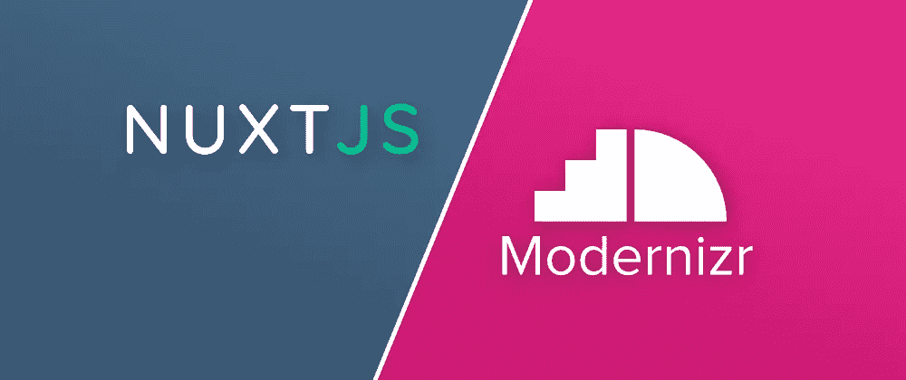

# 使用带有 Nuxt.js 的 Modernizr 来检测浏览器功能

> 原文：<https://javascript.plainenglish.io/using-modernizr-with-nuxt-js-to-detect-browser-features-6bcb845f131a?source=collection_archive---------16----------------------->

[Modernizr](https://github.com/Modernizr/Modernizr) 是一个可以检测浏览器特性的软件包，它可以通过 JavaScript 和 CSS 来查询这些特性。例如，这对于找出支持哪些 CSS 属性非常方便。与使用浏览器供应商和版本相比，该方法更加灵活和稳定。我编写了一个模块，允许将 Modernizr 与 Nuxt.js 一起使用。

# 将 Modernizr 与 Nuxt.js 一起使用

Modernizr 使用基于插件的体系结构，您必须自己构建包，这取决于您需要检测的特性——至少如果您没有使用 Nuxt.js！我已经创建了 [nuxt-modernizr](https://github.com/dword-design/nuxt-modernizr) 模块，可以很容易地将 modernizr 添加到你的 Nuxt.js 应用程序中。将这些特征作为模块选项传递，该模块将创建一个 Modernizr 内部版本并将其放置在`.nuxt`文件夹中。以下是如何对其进行配置:

首先通过`npm install nuxt-modernizr`或`yarn add nuxt-modernizr`安装模块。

然后，在您的`nuxt.config.js`中，添加该模块并传递应该传递给 Modernizr 的选项:

详情请查阅 [Modernizr 文档](https://modernizr.com/docs/)。

现在我们可以使用`Modernizr`变量和 HTML 根元素上生成的 CSS 类来检查浏览器特性。在所有的浏览器功能中，我最喜欢的是 CSS 滚动条，因为不同的浏览器对它的支持有很大的不同。根据浏览器是否可用，你可以调整容器的大小并设置它们的样式。

# 结论

已经这样了！用法相当简单。让我知道如果你觉得它有用或如果有任何东西你是失踪。此外，如果你觉得它有用，在存储库上留下一颗 [GitHub 之星。](https://github.com/dword-design/nuxt-modernizr)

**如果你喜欢我正在做的事情，在** [**推特**](https://twitter.com/seblandwehr) **上跟随我，或者查看我的** [**网站**](https://sebastianlandwehr.com/) **。也可以考虑在** [**为我捐赠一杯咖啡**](https://www.buymeacoffee.com/dword)**[**PayPal**](https://www.paypal.com/paypalme/SebastianLandwehr)**或**[**pat reon**](https://www.patreon.com/dworddesign)**。非常感谢！❤️****

***原为发表于*[*sebastianlandwehr.com*](https://sebastianlandwehr.com/blog/using-modernizr-with-nuxt-js-to-detect-browser-features)**

***更内容见于***