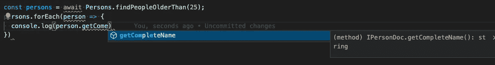
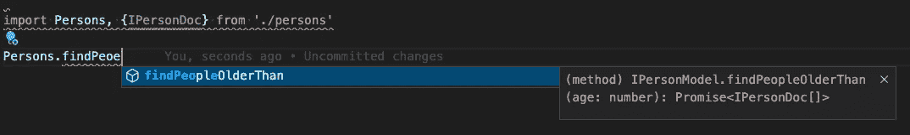
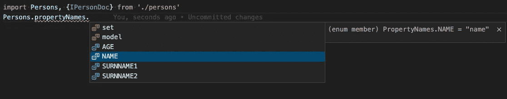
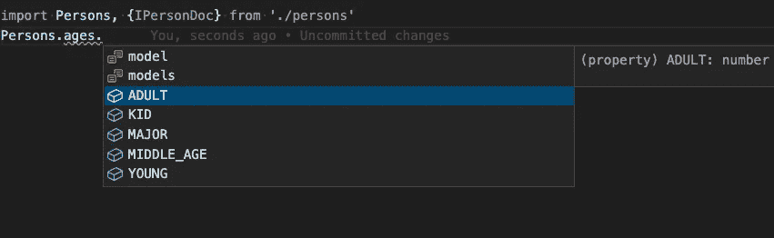

# 如何在 Typescript 中使用 Mongoose

> 原文：<https://javascript.plainenglish.io/using-mongoose-with-typescript-cc1804d7e472?source=collection_archive---------4----------------------->

## 我是如何将一个使用 Mongoose 的 JavaScript 项目迁移到 TypeScript 的

Photo by [AltumCode](https://unsplash.com/@altumcode?utm_source=medium&utm_medium=referral) on [Unsplash](https://unsplash.com?utm_source=medium&utm_medium=referral)

几个月前，我的团队开始将一个 JavaScript 项目转移到使用 TypeScript，该项目专门用于使用 Mongoose 的 Mongo 集合的数据访问对象模块。这种“迁移”的主要原因是为每个模型/文档的每个属性和方法(静态和实例)提供一个定义良好的接口。

为了使这个过程递增，我们没有一次迁移所有集合，而是遵循如下过程:

*   创建正确的脚本，将 TS 代码编译成 JS
*   更改模块的入口点
*   开始迁移文件

一个主要的目标是永远不要在这个过程中破坏一个已定义的接口，因为这个模块被许多其他项目用来访问所需的数据。

在此过程中，我们了解到:

*   如何创建定义良好的模型和文档
*   如何安全地不创建未在导出的接口中定义的新属性或方法

以下是基本步骤:

*   用文档的所有属性定义一个“接口”。在这里，您定义了未来的集合属性，但是使用 ts 类型没有 mongoose 类型(最后，它们应该是“相同的类型”)。
*   定义一个“接口”,扩展前面的接口(具有所需属性的接口)和来自 mongoose 的“文档”接口。在这个接口中，您将定义可用于每个 mongoose 文档的每个方法(这些是实例方法)。
*   为模型定义一个“接口”(这是集合),使用泛型和之前为文档定义的接口来扩展 mongoose 中的“模型”接口。在这个接口中，您将为集合定义可用的方法(静态方法)。
*   为第一个接口(具有模型属性的接口)定义一个使用键类型化的对象。使用此类型定义此对象会强制您在接口中定义每个属性。此对象将用于创建架构。每个属性的类型将是可用的猫鼬类型。
*   创造出“猫鼬”。模式”与先前定义的对象
*   将实例方法和静态方法添加到定义的模式中
*   使用之前为文档和模型定义的接口，使用泛型创建 mongoose 模型

**加分**

您还可以为您的 Mongoose 模型添加静态属性。静态属性应该在模型接口中定义，并使用“statics”属性添加到模式中。

下面是一个完整的例子:

正如您所看到的，现在您可以导入模型并拥有自动完成的属性和方法。

希望这是有帮助的，并让我知道，如果有一些我们可以改善这种方法。

*更多内容尽在*[***plain English . io***](http://plainenglish.io/)