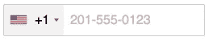

# 在角度模式下使用 ng2-tel-输入包

> 原文：<https://javascript.plainenglish.io/using-ng2-tel-input-in-angular-aa33c3ced92f?source=collection_archive---------4----------------------->


Photo by [Quino Al](https://unsplash.com/@quinoal?utm_source=medium&utm_medium=referral) on [Unsplash](https://unsplash.com?utm_source=medium&utm_medium=referral)

嗨伙计们！

今天，我们将探索 ng2-tel-input 包，看看如何在 Angular 中使用它。此外，我们将研究它提供的一些有用的选项。

这个包赋予了电话号码领域超级权力。我们可以选择包含相应国旗的国家代码。

现在开始，首先通过运行以下命令在 Angular 项目中安装 ng2telinput 包。

```
npm i ng2-tel-input
```

现在将 **intlTelInput.css** 包含在“样式”中，将 **intlTelInput.min.js** 包含在`angular.json file.`处的“脚本”中

```
"styles": [
    ...
    "node_modules/intl-tel-input/build/css/intlTelInput.css",
    ...
  ]"scripts": [
    ...
    "node_modules/intl-tel-input/build/js/intlTelInput.min.js"
    ...
  ]
```

接下来在 AppModule 中导入 Ng2TelInputModule。

```
**import** {Ng2TelInputModule} **from** 'ng2-tel-input';
```

就这样，您可以如下使用 ng2TelInput 指令:

```
<input **type**="text"**ng2TelInput**[**ng2TelInputOptions**]="{initialCountry: 'in'}"(**hasError**)="hasError($event)"(**ng2TelOutput**)="getNumber($event)"(**intlTelInputObject**)="telInputObject($event)"(**countryChange**)="onCountryChange($event)" />
```

现在我们来看看 **ng2TelInputOptions** 提供了哪些选项。

1.  autoHideDialCode

*   类型:`Boolean`默认:`true`
*   这是为了防止表单中只提交一个拨号代码。需要将`nationalMode`设置为`false`。
*   使用:[**ng 2 telinputoptions**]= " { autoHideDialCode:false } "

2.初始国家

*   类型:`String`默认:`""`
*   如果您将`initialCountry`留空，它将默认为列表中的第一个国家
*   使用:[**ng 2 telinputoptions**]= " { initial country:' in ' } "

3.分离代码

*   类型:`Boolean`默认:`false`
*   在所选标志旁边显示国家拨号代码，这样它就不是键入号码的一部分。请注意，这将禁用`nationalMode`,因为从技术上讲，我们处理的是国际号码，但拨号、代码是分开的。
*   使用:[**ng 2 telinputoptions**]= " { separate dialcode:true } "



如果您想使用上面提到的所有三个选项，那么代码应该是这样的

*   [**ng 2 telinputoptions**]= " { autoHideDialCode:false，initialCountry: 'in '，separateDialCode:true} "

这就是我们想要的。我希望你已经发现这是有用的。感谢您阅读

有关完整的文档，请访问以下链接

*   [https://github . com/jacko CNR/intl-tel-input/blob/master/readme . MD](https://github.com/jackocnr/intl-tel-input/blob/master/README.md)
*   [https://github.com/gauravsoni119/ng2-tel-input#readme](https://github.com/gauravsoni119/ng2-tel-input#readme)

你可以在这里查看我的棘手的 javascript 问题

苏吉特·帕蒂尔

[](/12-useful-vs-code-extensions-to-help-make-web-development-easier-6960680c56d4) [## 12 个有用的 VS 代码扩展，帮助简化 Web 开发

### 使用这些 12 VS 代码扩展提高您作为开发人员的生产力

javascript.plainenglish.io](/12-useful-vs-code-extensions-to-help-make-web-development-easier-6960680c56d4) [](/are-you-afraid-to-solve-these-3-javascript-questions-3a7eed176932) [## 你害怕解决这 3 个 JavaScript 问题吗？

### 我也是。

javascript.plainenglish.io](/are-you-afraid-to-solve-these-3-javascript-questions-3a7eed176932) [](/3-note-taking-apps-i-use-for-3-different-purposes-11bb62cadf94) [## 我用 3 个笔记应用程序做 3 种不同的用途

### 学生、专业人士以及介于两者之间的所有人的 3 款最佳笔记应用

javascript.plainenglish.io](/3-note-taking-apps-i-use-for-3-different-purposes-11bb62cadf94) 

*更多内容尽在*[*plain English . io*](http://plainenglish.io/)