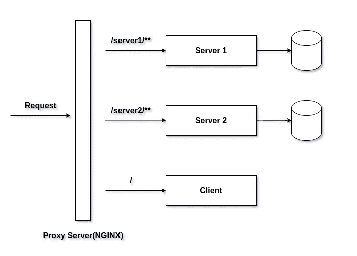
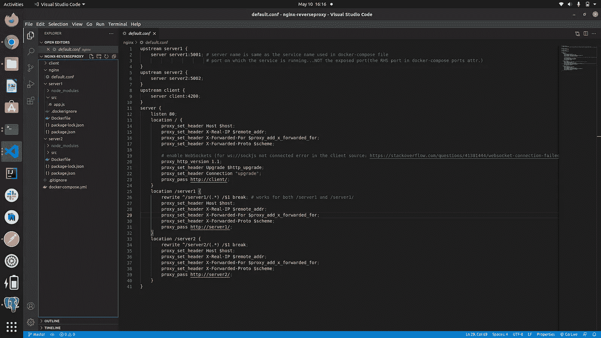
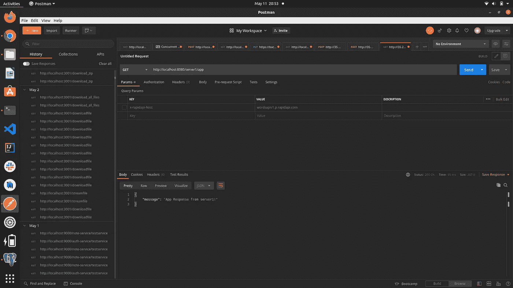
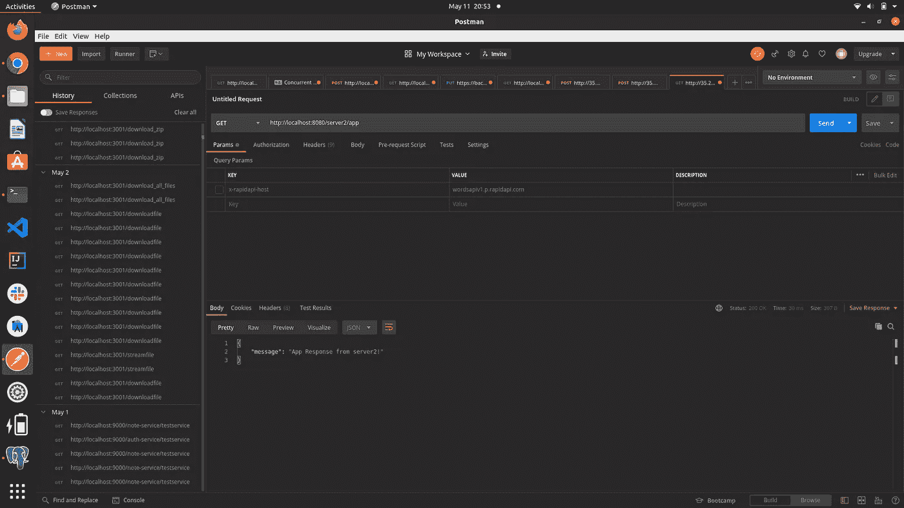
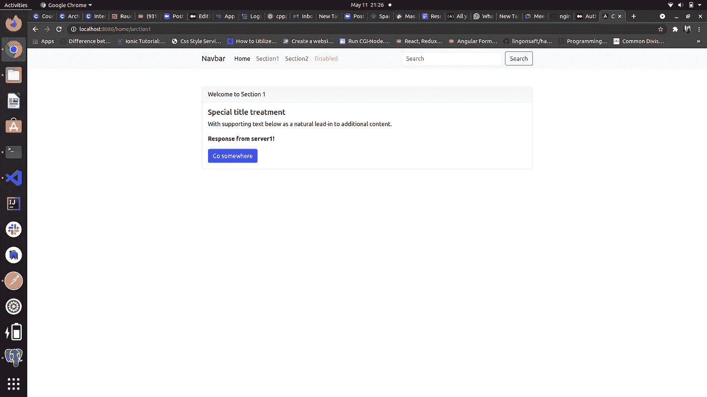
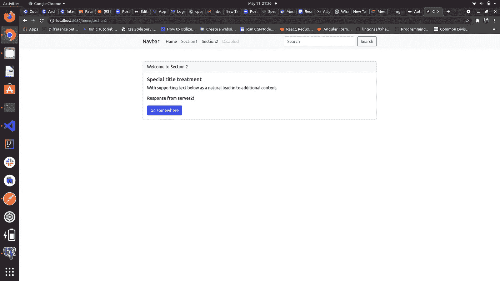

# 使用 Nginx 作为容器化 Node.js 微服务的反向代理

> 原文：<https://javascript.plainenglish.io/using-nginx-as-a-reverse-proxy-for-containerized-node-js-microservices-e7c4800f05a1?source=collection_archive---------2----------------------->



Architechture for this mockup

今天，我将讨论如何使用 Node.js、Nginx、Docker 和 Angular 快速设置微服务架构(你可以使用任何客户端框架/库，如 React.js、Vue.js，但出于简单起见，我选择了 Angular)。

下面是我们今天要做的事情的简要总结:

*   设置 2 个基本的 express.js 服务器，公开非常基本的端点
*   为这些服务器设置 nginx 配置(这里的每个服务器指的是一个微服务)
*   对这些服务器进行 docker 化，包括将 nginx web 服务器设置为 docker 容器，并通过 docker-compose 运行整个工作负载
*   在 postman 中测试我们的端点
*   设置一个 Angular 客户端并将其归档
*   修改 Nginx 配置以包含客户端的配置

但是在开始之前，有人可能会问，什么是反向代理，我们为什么需要它？

****反向代理*** *服务器是一种* ***代理*** *服务器，通常位于专用网络中的防火墙之后，并将客户端请求定向到适当的后端服务器。**

*简单来说，当我们建立微服务架构时，我们希望我们的客户端请求根据路由模式转发到相关的微服务。例如，形式为 **/auth/** 的请求应该被路由到**认证微服务**。类似地，表单/ **支付/** 的请求应该被转发到**支付微服务**等等。因此，通常情况下，根据您使用的技术体系，您有许多选项来设置它。比如说-*

1.  *如果你正在使用 SpringBoot，你可以使用**网飞尤里卡**作为**服务发现**以及 **Spring 云网关**来转发你的请求(然后根据你的需求将这些微服务部署为 docker 容器或 kubernetes pods)。*
2.  *如果你正在实现一个无服务器架构(比如在 AWS 上)，你可以使用 **AWS 服务网格**和**服务发现**。*
3.  *如果您使用的是 **Node.js** ，您可以使用 **Nginx** 设置一个负载平衡器和 revevrse 代理——这就是我们将在本文中做的事情。请注意:*

> *上面提到的方法是一些健壮的方法，我从我的经验中知道它们被用在几个生产系统中。当然，它们不是设置网关/负载平衡器/反向代理的唯一方法。您可以在网上随意探索或寻找适合您的用例的服务。*

*所以事不宜迟，让我们开始第一步:设置两个基本的 express.js 服务器。*

*为此，只需启动您的终端并键入:*

```
*npm init -y*
```

*接下来安装 express.js 和 cors 包(需要 cors，因为我们最终将从 Angular 应用程序发出请求),命令如下:*

```
*npm i --save express cors*
```

*你可以在本文末尾分享的 GitHub repo 中查找确切的文件夹结构。我建议您在阅读本文时仔细阅读资源库，这样会更有意义，因为我不会在这里深入研究编码部分。*

*请注意，我们将在文件夹 server1(代表我们的第一个微服务)和 server2(代表我们的第二个微服务)中运行上述命令两次。我们还将在这些微服务中设置一些基本的' *get'* 路线。*

*这些可以是你想尝试的任何有特色的信息。请根据您自己的要求随意设置。设置这两个微服务后，第一个微服务的 app.js 文件如下所示:*

*类似地，第二个微服务的 app.js 如下所示:*

*如你所见，这里没什么特别的。只有两个简单的服务器，响应消息略有不同。*

*接下来，我们将在项目根目录下创建一个名为 **nginx** 的新文件夹，并在其中创建一个名为 **default.conf** 的文件。*

*这个文件应该包含我们微服务的所有负载平衡和反向代理配置。配置文件如下所示:*

*以上所有配置都是非常基本的，你可以在官网 [***这里***](https://docs.nginx.com/nginx/admin-guide/web-server/web-server/) 找到关于具体语句(或术语)的细节。请注意，这里我们只是配置“反向代理”部分，并没有明确设置任何负载平衡。我故意留下它是因为-*

*   *设置很简单，只需对上面的配置稍加修改。*
*   *在部署我们的容器(尤其是 docker/kubernetes 容器)时，有几种其他方法可以设置负载平衡器，比如云负载平衡器。*

*现在，除了 docker 文件，我们已经完成了后端的配置。*

*让我们很快就把他们安置好。您必须将 docker 文件放在服务器(或微服务)各自的文件夹中，并将 docker-compose.yml 文件放在项目根目录中。*

*最终的文件夹结构如下所示(暂时忽略客户端文件夹):*

**

*Project folder structure*

*以下是 server1 和 server2 的 docker 文件以及 docker-compose 文件。*

*服务器 1 的 Dockerfile:*

*服务器 2 的 Dockerfile:*

*docker-撰写文件:*

*如你所见，这里没有什么新奇/复杂的事情发生。非常基本的东西——如果你了解 docker 和容器的基础知识，你应该一眼就能理解这些文件。现在我们已经设置了文件，我们可以通过在项目根目录下运行以下命令来将服务器作为容器运行:*

```
*docker-compose up --build -d*
```

*这个命令提取图像并触发我们的容器。这可能需要一点时间，取决于您的网络带宽。但是一旦完成，你就可以通过输入`docker container ls`或`docker ps`看到你的容器在运行*

*说到这里，我们打开 Postman，测试一下我们的端点。*

*现在，根据我们的反向代理配置，我们应该能够点击**http://localhost:8080/server 1/app**和**http://localhost:8080/server 2/app**(注意，我们只是根据服务器名称更改了 url，而基本 URL 保持不变)来从我们的两个服务器获得响应。*

**

*Response from server1*

**

*Response from server2*

*耶！我们正在从我们的服务器得到回应，你知道吗？重物完成了！*

*现在我们必须配置一个客户端(实际上它可以是任何客户端)。我个人的偏好是 Angular，但是根据你的选择和需求，你可以有任何其他的库/框架。*

*概念保持不变。但是如果您选择 Angular，请随意浏览存储库，看看我都做了些什么(实际上没有什么……我只是从服务器获取响应，并在不同的组件中显示它们……就这样)。在本文中，我有意跳过这一部分，这样就不会太冗长。*

*不过，我将为客户端共享更新后的 default.conf 文件、docker-compose 文件和 Dockerfile。*

*这是客户的 docker 文件:*

*这里唯一棘手的部分是最后一行，即`ng serve --prod --host 0.0.0.0`，它特定于 Angular，以使客户端容器可以从任何网络访问(在我们的例子中，它帮助从浏览器访问客户端)。如果您使用不同的框架，您可以探索访问客户端的方法。*

*更新后的 default.conf 文件为:*

*最终的 docker-compose.yml 文件是:*

*这就是我们的设置。一旦包含了所有这些内容，就可以再次运行 docker-compose up 命令来启动所有容器。在我的例子中，来自客户端(和正在运行的客户端)的响应如下所示:*

****

## ***2022 年 6 月 26 日更新:***

*我已经更新了 github repo，以包含 kubernetes 以及所有微服务和入口控制器的部署。您可以在“ **k8s** ”分支中找到这些文件。我只有在 minikube 上运行微服务的设置。然而，在不同的云服务提供商如 AWS/GCP/Azure 上运行的实现会有所不同。我让读者去探索。*

## ***2022 年 12 月 26 日更新:***

*修改了 nginx 的 default.conf 文件。只是去掉了一些不必要的头。希望这对你有帮助。*

## *结论*

*这就是所有的人。*

*你看 nginx 和 docker 是如何让一个开发者的生活变得如此轻松的！您可以在此处查看 GitHub repo:*

*[](https://github.com/lakshyajit165/nginx_reverse_proxy) [## lakshyajit 165/nginx _ reverse _ proxy

### 在 GitHub 上创建一个帐户，为 lakshyajit 165/nginx _ reverse _ proxy 开发做贡献。

github.com](https://github.com/lakshyajit165/nginx_reverse_proxy) 

干杯！* 

## *进一步阅读*

*[](https://bit.cloud/blog/component-driven-microservices-with-nodejs-and-bit-l64shurc) [## 具有 NodeJS 和 Bit 的组件驱动的微服务

### 大多数人认为组件是前端的一部分。然而，CBSE(基于组件的软件工程)是…

比特云](https://bit.cloud/blog/component-driven-microservices-with-nodejs-and-bit-l64shurc)* 

**更多内容请看*[***plain English . io***](https://plainenglish.io/)*。报名参加我们的* [***免费周报***](http://newsletter.plainenglish.io/) *。关注我们关于*[***Twitter***](https://twitter.com/inPlainEngHQ)[***LinkedIn***](https://www.linkedin.com/company/inplainenglish/)*[***YouTube***](https://www.youtube.com/channel/UCtipWUghju290NWcn8jhyAw)*[***不和***](https://discord.gg/GtDtUAvyhW) *。对增长黑客感兴趣？检查* [***电路***](https://circuit.ooo/) *。****