# 使用 Node.js + S3 创建、删除、列出存储桶和上传、列出对象—第 1 部分

> 原文：<https://javascript.plainenglish.io/using-node-js-s3-to-create-delete-list-buckets-and-upload-list-objects-part-1-b9943825c666?source=collection_archive---------6----------------------->


Photo by [Caspar Camille Rubin](https://unsplash.com/@casparrubin?utm_source=medium&utm_medium=referral) on [Unsplash](https://unsplash.com?utm_source=medium&utm_medium=referral)

# **简介**

大多数网站需要主机来托管图像、视频等。一个显而易见的方法是将其存储在硬盘上。这看起来不错，但如果所需的存储空间超过硬盘存储限制，该怎么办呢？我们将需要相应地扩展它，这是一个有点乏味的任务。

在这里，像 AWS S3 这样的托管服务进入了画面，因为它可以存储大量的媒体文件和相应的规模。

> 本博客最初发布于[https://www . gyaanibuddy . com/blog/using-nodejs-S3-to-createdeletelist-buckets-and-upload-list-objects-part-1/](https://www.gyaanibuddy.com/blog/using-nodejs-s3-to-createdeletelist-buckets-and-upload-list-objects-part-1/)

**这个博客有两部分:**

第一部分—了解如何设置 AWS S3 并手动使用它。

[第二部分—以编程方式使用 Node.js 在 S3 上执行操作。](https://medium.com/@rugved-bongale/using-node-js-s3-to-create-delete-list-buckets-and-upload-list-objects-part-2-fb1b76da36dc)

# **什么是 AWS S3？**

亚马逊简单存储服务是互联网存储。它旨在使开发人员更容易进行网络规模的计算。

亚马逊 S3 有一个简单的网络服务界面，你可以用它在任何时间从网络上的任何地方存储和检索任何数量的数据。它让任何开发者都可以使用亚马逊用来运行其全球网站网络的高度可扩展、可靠、快速、廉价的数据存储基础设施。该服务旨在最大化规模效益，并将这些效益传递给开发者。

*来源:*[https://docs . AWS . Amazon . com/Amazon S3/latest/dev/welcome . html](https://docs.aws.amazon.com/AmazonS3/latest/dev/Welcome.html)

# **我们在建造什么？**

在这篇博客中，我们将看到 **Node.js 实现**执行以下操作:

> 代码将在第二部分介绍，但在此之前，我们需要做一些设置。因此，在进入第二部分之前，请继续关注这篇博客。

1.  *在 S3 上创建一个桶(就像一个特定的唯一文件夹来存储我们的媒体)*
2.  列出我们制造的所有水桶。
3.  *将图像上传到存储桶。*
4.  *列出桶中的所有对象(图像、视频等)*
5.  *删除桶。*

# 我们开始吧

**设置**

1.  如果没有，创建一个 [AWS](https://aws.amazon.com/) 帐户。登录您的 AWS 帐户。
2.  登录后，在顶栏上，你会看到你的名字和一个下拉标志。点击它。
3.  选择 ***【我的安全凭证】*** 。将出现以下屏幕。

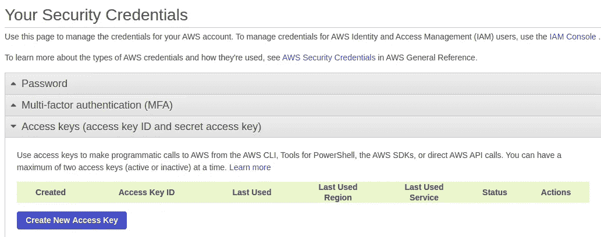

4.点击 ***创建新的访问键*** 按钮。

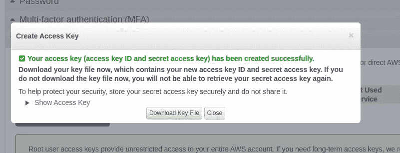

5.点击 ***下载密钥文件*** 或**显示访问密钥**

6.在这两种情况下，您将获得以下
— ***访问密钥 ID***
— ***秘密访问密钥***

把它们记下来，我们以后还会需要它们。

# **访问 S3 控制台**

在顶部的搜索栏中，输入 S3。单击第一个选项。您将被引导至显示当前存储桶列表的页面。如果您是第一次使用它，它将是一个空列表。

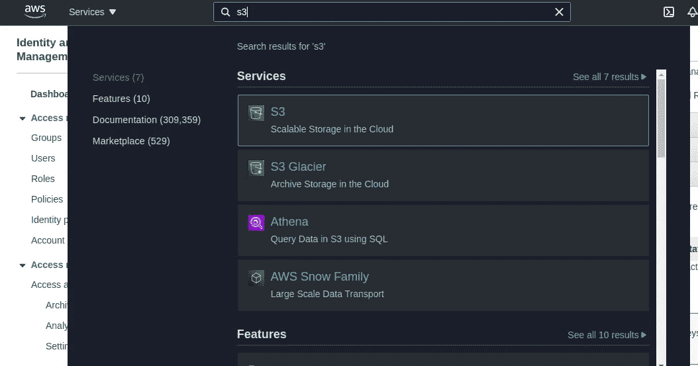

在转到代码之前，让我们手动**做**并且理解什么是 S3。

1.  点击创建存储桶按钮。

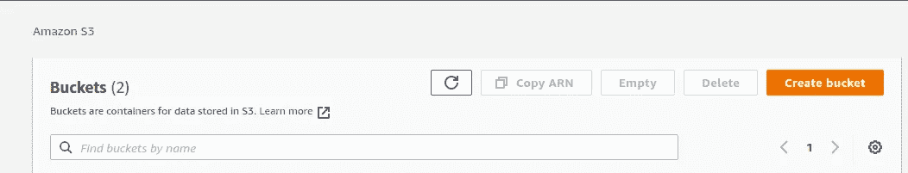

2.为存储桶指定一个唯一的名称。请注意，这应该是一个唯一的名称。

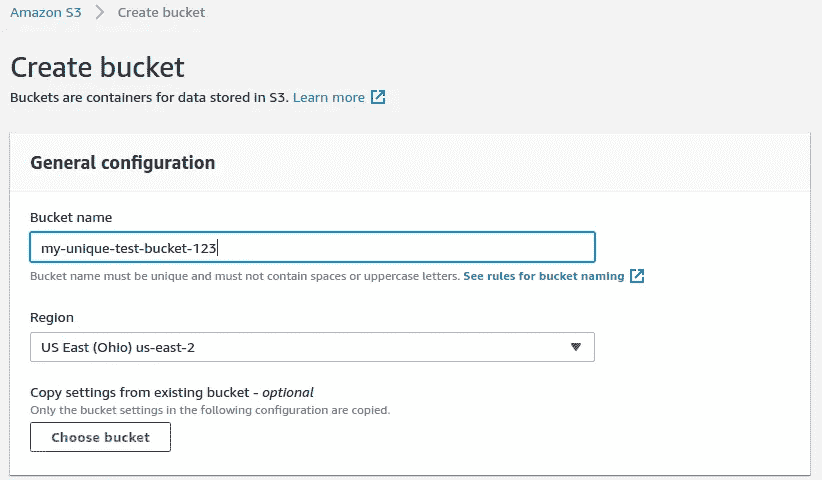

3.取消勾选“ ***阻止所有公共访问*** ”。这不是一个推荐的生产设置，但现在，只是为了了解 S3 如何工作，让我们解开它。

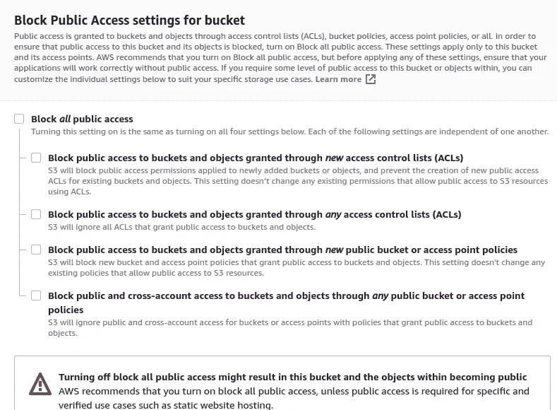

4.滚动到底部，点击 ***创建桶*** 按钮。

5.它会将您重定向到显示您所有存储桶的页面。从列表中单击您刚刚创建的存储桶名称。

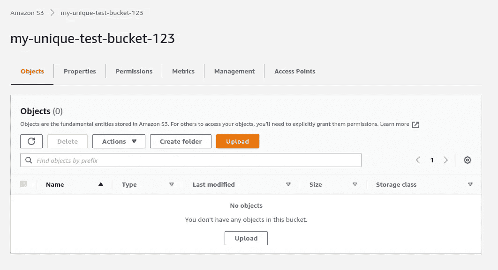

7.点击上传按钮，上传一张图片。现在你会在列表中看到上传的图片。

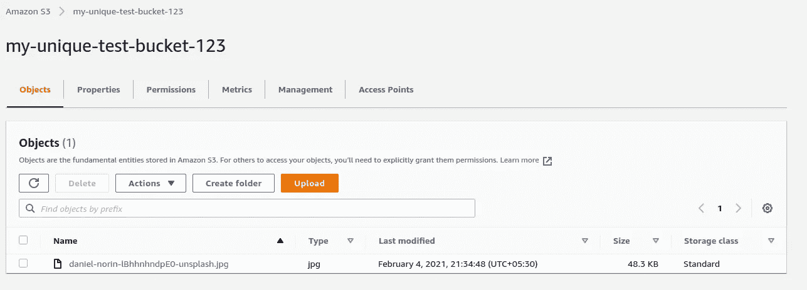

8.点击列表中的图片项，在下一页，您会发现“ ***对象 URL*** ”。这将是图像 url，通过它您可以访问您全局上传的图像。

在我的例子中，对象 url 是[**https://my-unique-test-bucket-123 . S3 . us-east-2 . Amazon AWS . com/Daniel-norin-lbhhnhndpe 0-unsplash . jpg**](https://my-unique-test-bucket-123.s3.us-east-2.amazonaws.com/daniel-norin-lBhhnhndpE0-unsplash.jpg)

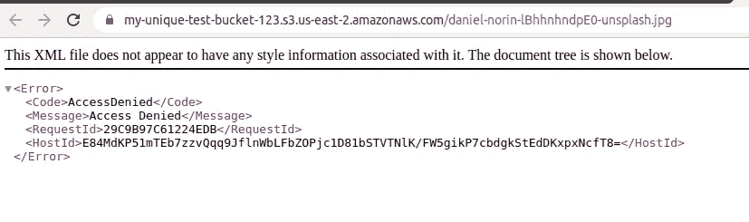

有效吗？？我想不会。别担心。我们需要添加“*”的斗策。*

*9.点击权限。*

*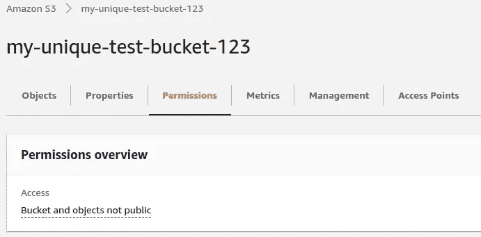*

*10.在 ***下屏蔽公共访问(桶设置)*** 点击**编辑**按钮，取消勾选 ***屏蔽所有公共访问*** 。根据您的要求，您可以勾选/取消勾选选项，但现在取消勾选所有选项，如下所示并保存。*

*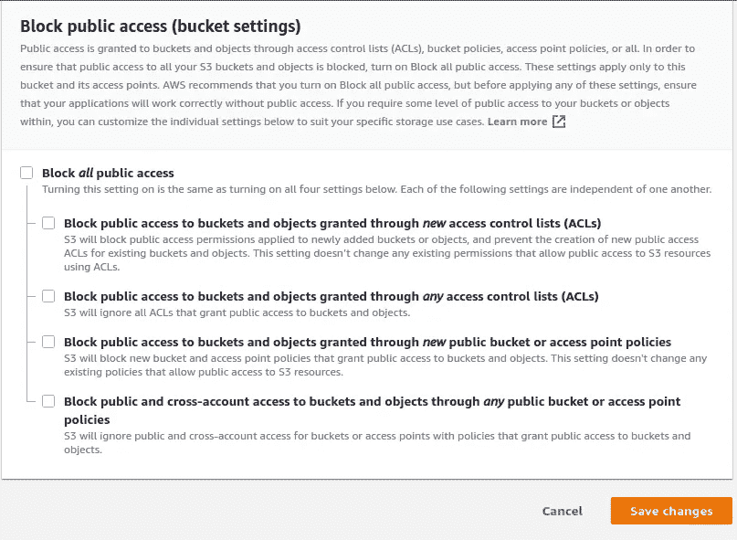*

*11.在“permissions”选项卡中，向下滚动到“ ***Bucket policy*** ”，单击“ ***Edit*** ”按钮，向其中添加以下代码，然后单击“save”。*

```
*{
    "Version": "2008-10-17",
    "Statement": [
s        {
            "Sid": "AllowPublicRead",
            "Effect": "Allow",
            "Principal": {
                "AWS": "*"
            },
            "Action": "s3:GetObject",
            "Resource": "arn:aws:s3:::my-unique-test-bucket-123/*"
        }
    ]
}*
```

***注意:**用您的 bucket 名称替换上面代码片段中的“my-unique-test-bucket”。*

*要了解如何编写存储桶策略，请阅读 [this](https://docs.aws.amazon.com/AmazonS3/latest/dev/example-bucket-policies.html) 。现在，我们将简单地使用上面的代码片段。*

*10.唷，就是它！现在，再次尝试访问图像 URL。我的情况是:*

*[**https://my-unique-test-bucket-123 . S3 . us-east-2 . amazonaws . com/Daniel-norin-lbhhnhndpe 0-unsplash . jpg**](https://my-unique-test-bucket-123.s3.us-east-2.amazonaws.com/daniel-norin-lBhhnhndpE0-unsplash.jpg)*

**

*耶！起作用了！*

*这个博客到此为止。*

*下一篇博客再见，我们将看到如何使用 Node.js 上传文件、创建和列出 buckets 及其内容等。*

***第二部分的链接***

*[](https://rugved-bongale.medium.com/using-node-js-s3-to-create-delete-list-buckets-and-upload-list-objects-part-2-fb1b76da36dc) [## 使用 Node.js + S3 创建、删除、列出存储桶和上传、列出对象—第 2 部分

### 介绍

rugved-bongale.medium.com](https://rugved-bongale.medium.com/using-node-js-s3-to-create-delete-list-buckets-and-upload-list-objects-part-2-fb1b76da36dc) 

## **结论:**

在这篇博客中，我们成功地完成了使用 AWS S3 所需的最小设置。

*更多内容请看*[*plain English . io*](http://plainenglish.io/)*