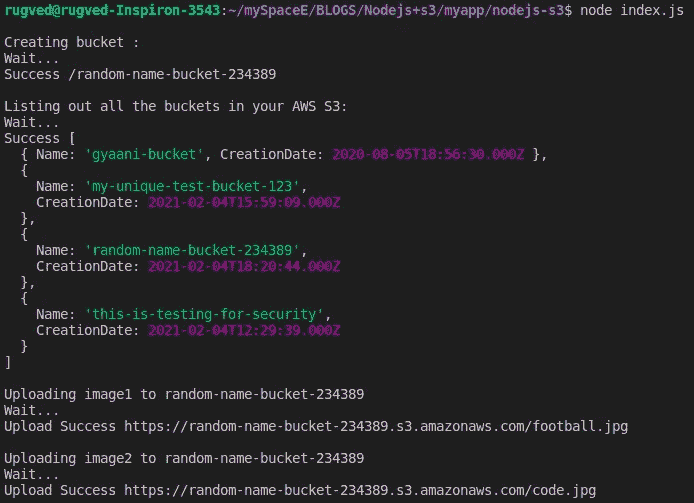
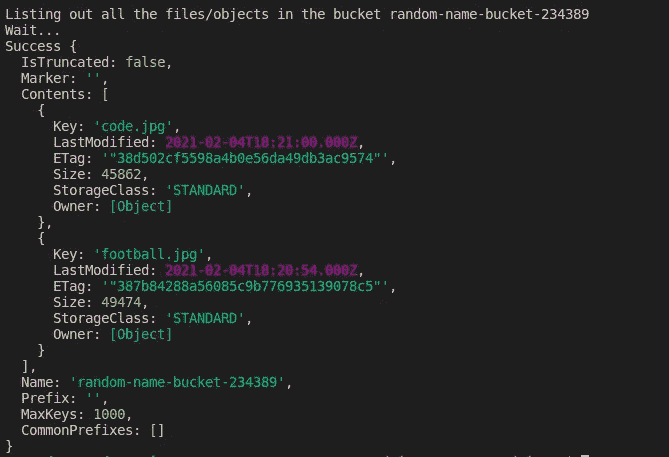

# 使用 Node.js + S3 创建、删除、列出存储桶和上传、列出对象—第 2 部分

> 原文：<https://javascript.plainenglish.io/using-node-js-s3-to-create-delete-list-buckets-and-upload-list-objects-part-2-fb1b76da36dc?source=collection_archive---------1----------------------->


Photo by [Caspar Camille Rubin](https://unsplash.com/@casparrubin?utm_source=medium&utm_medium=referral) on [Unsplash](https://unsplash.com?utm_source=medium&utm_medium=referral)

# 介绍

这是博客的第**第二**部分。接下来，请访问我之前的[博客](https://medium.com/@rugved-bongale/using-node-js-s3-to-create-delete-list-buckets-and-upload-list-objects-part-1-b9943825c666)来设置 AWS S3——存储桶策略、配置等。

**这个博客有两部分:**

[第一部分——了解如何设置 AWS S3 并手动使用它。](https://medium.com/@rugved-bongale/using-node-js-s3-to-create-delete-list-buckets-and-upload-list-objects-part-1-b9943825c666)

**第二部分—以编程方式使用 Node.js 在 S3 上执行操作。**

# 我们在建造什么？

在这篇博客中，我们将看到 **Node.js 实现**做以下事情:

1.  *在 S3 上创建存储桶(就像一个特定的唯一文件夹来存储我们的媒体)*
2.  列出我们制造的所有水桶。
3.  *将图像上传至铲斗。*
4.  *列出桶中的所有对象(图像、视频等)*
5.  *删除桶。*

# **设置**

```
mkdir nodejs-s3
cd nodejs-s3
npm init -y
```

# **安装所需的 npm 软件包**

```
npm i aws-sdk
```

在当前项目目录中创建 index.js 文件。

# **实施**

1.  我们需要做的第一件事是导入 aws-sdk 包

```
const AWS = require('aws-sdk');
```

2.现在，为了连接 AWS S3，我们需要“ **accessKeyId** ”和“ **secretAccessKey** ”。我们在之前的[博客](https://medium.com/@rugved-bongale/using-node-js-s3-to-create-delete-list-buckets-and-upload-list-objects-part-1-b9943825c666)中已经讨论过如何获得。

3.输入我们在之前的[博客](https://medium.com/@rugved-bongale/using-node-js-s3-to-create-delete-list-buckets-and-upload-list-objects-part-1-b9943825c666)中创建的桶名。
在我这里是 ***“我的-唯一-测试-桶-123”***

```
const BUCKET_NAME = 'my-unique-test-bucket-123';
```

I)以编程方式创建存储桶的功能。以铲斗名称为输入
**注:**要设置基本铲斗配置，请参考之前的[博客](https://medium.com/@rugved-bongale/using-node-js-s3-to-create-delete-list-buckets-and-upload-list-objects-part-1-b9943825c666)。

II)现在让我们写一个函数来列出我们在 S3 的所有桶。

此功能将列出您的[**AWS S3**](https://s3.console.aws.amazon.com/s3/home)**仪表盘中的所有存储桶。**

**III)接下来让我们编写上传图像的函数。为此，选择任何图像并将其放在项目目录中。(与 index.js 目录相同)**

**上面的 uploadFile 函数有两个参数:
- **filePath** :要上传到 bucket 的本地文件的路径。
- **桶名**:需要上传文件的桶。**

**IV)为了列出特定存储桶中的所有对象，我们将创建一个函数，该函数将单个参数" **bucketName** "作为输入。**

**v)删除一个桶。将存储桶名称作为输入。**

**现在我们已经准备好了所有的功能，我们可以单独使用它。为了便于演示，我构建了一个函数，它将在 5 秒的时间间隔内一个接一个地运行上面讨论的所有函数。**

# ****完成 index.js 文件****

# ****输出****

********

*****搞定！*** 朋友，这个博客到此为止。**

**如果你觉得这个博客有帮助，请鼓掌，并与你的朋友分享。**

# ****结论:****

**因此，我们已经成功地学习了如何使用 Node.js 来创建 S3 存储桶、上传文件、列出存储桶、列出对象和删除存储桶。**

**对于代码，您可以访问:[https://github.com/RugvedB/Nodejs-s3](https://github.com/RugvedB/Nodejs-s3)**

***更多内容请看*[*plain English . io*](http://plainenglish.io/)**