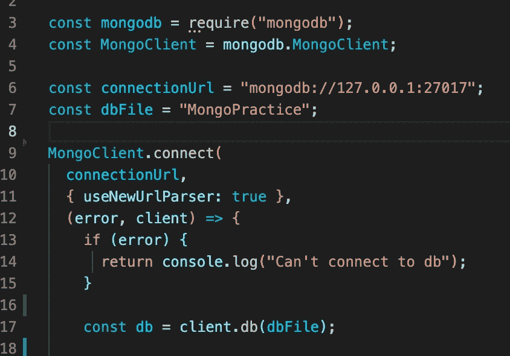
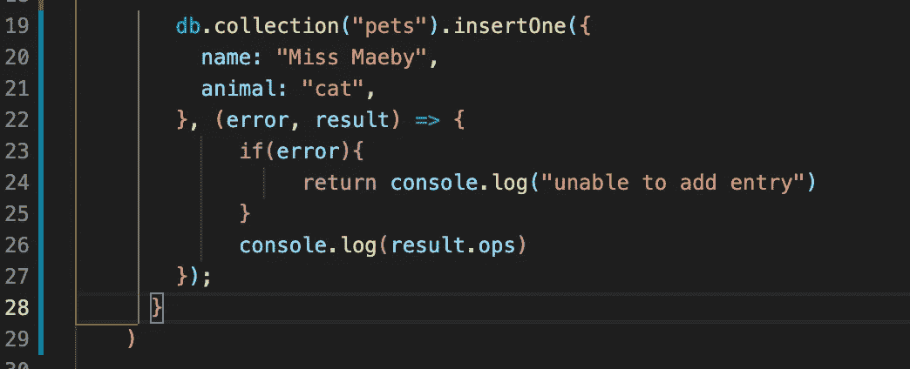
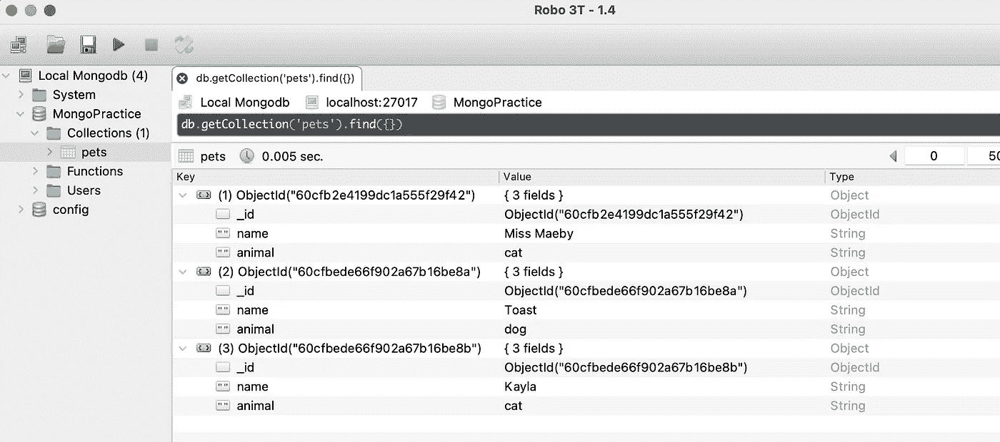

# 在 MongoDB 中使用 Node.js 的介绍:初学者的 CRUD 练习

> 原文：<https://javascript.plainenglish.io/using-node-with-mongodb-a-beginner-crud-exercise-83af468adb3c?source=collection_archive---------11----------------------->

Photo by [Luke Peters](https://unsplash.com/@lukepeters?utm_source=medium&utm_medium=referral) on [Unsplash](https://unsplash.com?utm_source=medium&utm_medium=referral)

随着我继续学习 Node.js，它帮助我探索各种库和服务，这扩展了框架的可能性。本周，我开始熟悉 MongoDB 以及如何将 Mongo 服务器连接到节点应用程序。

当学习一门新的语言或框架时，一个有用的初学者项目是构建一个简单的 CRUD 应用程序——它可以创建、读取、更新和删除。您可以在任何时候扩展您的项目，增强这些基线功能，但是在转移到更复杂的过程之前，首先理解如何实现这些公共特性是很重要的。

出于学习的目的，我开始为 Node 构建一个 CRUD 应用程序，允许我通过服务器与我创建的数据库进行通信。因为这更像是一个学习练习和概念验证，所以我没有做太多。我将使用我和我父母的宠物作为样本案例，演示等式的创建和读取部分的几个示例。

这并不是设置 MongoDB 的完整解释。有许多细节需要考虑，包括您选择的操作系统和编程语言，以及许多其他决策，但是我将提供一个简要的概述。

出于这个项目的目的，我首先导航到 MongoDB 站点上的“软件”选项卡，然后选择了免费选项 Community Server。然后，您可以根据您机器的规格进行下载。

快速提示:在我的 Mac 允许我启动服务器之前，我必须将 MongoDB 添加到我接受的安全和隐私应用程序中。

同样需要注意的是，在启动服务器之前，您需要创建一个存储数据的地方。我只是在我的 MongoDB 文件夹中创建了一个名为 Mongodb-data 的文件夹。

进入 VSCode 后，我在终端中导航到执行脚本所在的文件，以启动 Mongo 服务器，然后为它提供一个放置数据的位置。根据您的个人文件结构，这些代码会有很大的不同。为了设置和连接数据库，我的终端命令是

/Users/Alex foreman/Desktop/Mongodb/bin/mongod-dbpath =/Users/Alex foreman/Desktop/Mongodb/Mongodb-data

有了这个，我的服务器就可以运行了。然后，我创建了一个 JavaScript 文件，我将在第二个终端中运行该文件，以将 Node 与 Mongo 服务器链接起来。

首先，我必须下载蒙戈 NPM 软件包。文件在这里。

像大多数节点应用程序一样，我必须要求“mongodb”。然后我可以连接到客户端。

我用来设置这部分的文档可以在[这里](https://docs.mongodb.com/drivers/node/current/fundamentals/connection/)找到，但是我建立了到本地主机 IP 地址和默认 Mongo 端口 27017 的连接。接下来，我创建一个变量，它允许我告诉 Mongo 我正在创建一个数据库。

Getting Node and your Mongo server connected

下面是我用来创建我的第一个条目并将其添加到我的 pets 数据库中的代码。

Create!! And Read (sort of!)

在上面的代码中，我调用了分配给数据库的变量，并使用 insertOne 方法创建了一个数据库条目。然后我提供一些基本的错误处理。

通过控制台记录 result.ops，我打印出对象的名称和动物类型，以及它在数据库中的 id，从而验证我已经创建了一个成功的数据库条目。然而，有一种更复杂的方法来访问和操作我的数据。

我下载的下一个工具是 Robo 3t，这是一个用于 MongoDB 的 GUI(图形用户界面)管理工具，它允许您清晰地导航您的数据库并操作您的数据。您编写的 JavaScript 允许您在终端中执行节点命令来创建新的数据库条目，然后您可以在 Robo3t 中看到这些条目。

连接到您的服务器还需要一个下载和特定的设置，但是它主要需要创建一个到您的 Mongo 服务器所连接的默认端口的新连接。

我使用了另一种叫做 insertMany 的方法，它允许我创建多个条目，来添加多个宠物。下面是 Robo3t 中的可视化表示。

Robo3t with database entries created using Node

你可以看到三个插入，我已经扩展到更好的注意。需要注意的一些亮点:MongoPractice 是我在 Node 中创建的数据库文件名。里面是一个收藏，包括宠物和我做的条目。

这是对 Node 和 Mongo 的一个非常基本的介绍，但是您可以看到使用几个工具就可以完成很多工作。在以后的博客中，我将进一步深入 Node 和 Mongo，并添加到这个基本的 CRUD 项目中。

*更多内容看*[***plain English . io***](http://plainenglish.io/)