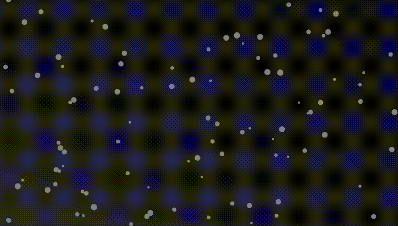
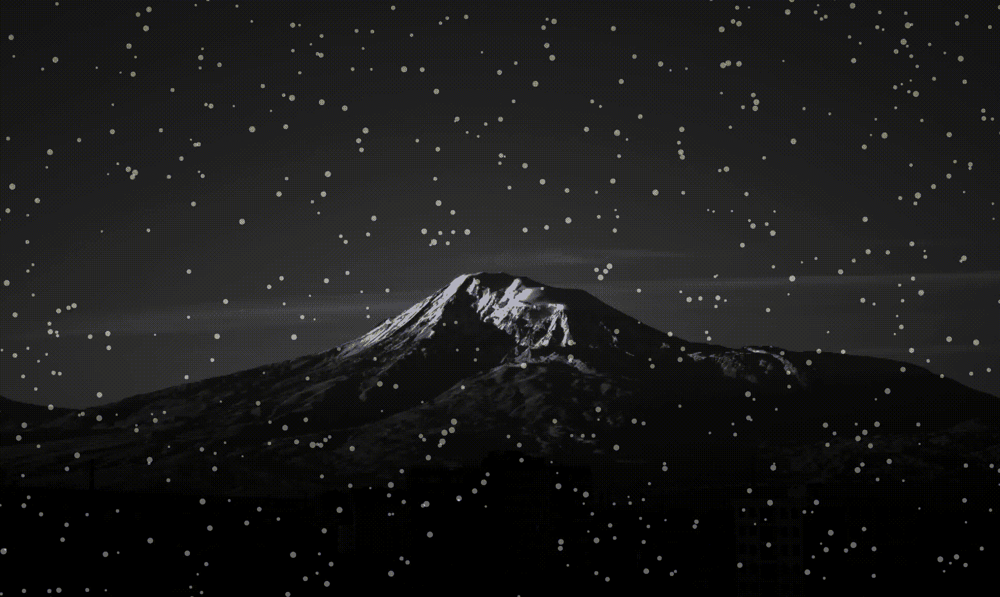
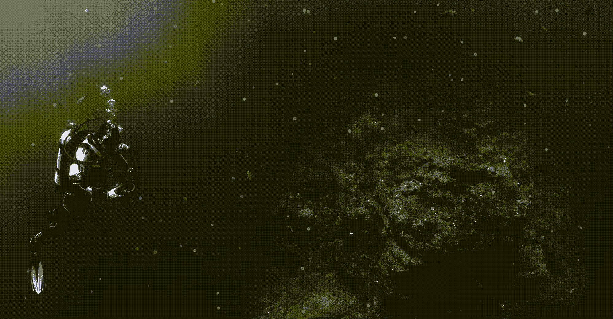
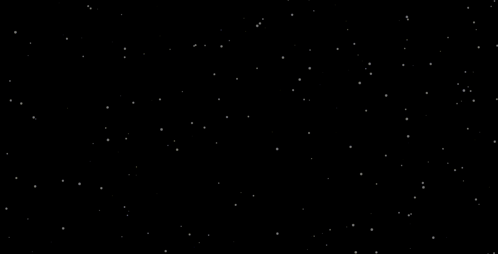
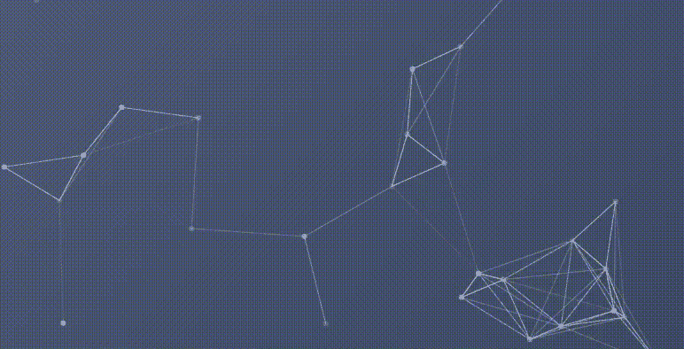
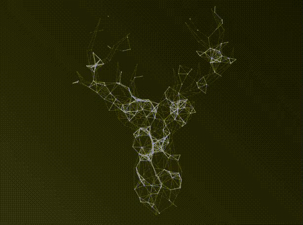

# 使用 Particles.js 在 React 应用程序中制作有趣的效果

> 原文：<https://javascript.plainenglish.io/using-particles-js-to-make-fun-effects-in-your-react-app-acb75de318a2?source=collection_archive---------8----------------------->

## 我将向你展示如何使用 react-particles-js 创建雪、星星和水下效果，这样你就可以在你的 react 应用程序上让访客惊叹。



在进行上一个 React 项目时，我开始尝试使用 Particles.js。我意识到我可以创建非常酷的效果，并开始进行研究。大部分信息都分散在互联网上，所以我决定拿出我最喜欢的效果，与在座的各位分享！

您需要做的第一件事是访问:

[](https://www.npmjs.com/package/react-particles-js) [## 反应-粒子-js

### 粒子与组分反应，使用 ts 粒子。查看演示页面。npm 安装反应粒子-js ||纱线添加…

www.npmjs.com](https://www.npmjs.com/package/react-particles-js) 

在这里，您可以查看所有的信息、文档，最重要的是获得安装 react-particles-js 的代码。

接下来，在你的终端中写`npm i react-particles-js`并安装粒子包。现在你已经准备好了！

# 雪

让我们创造雪的效果。确保按照您自己的喜好来摆弄和调整代码。这是对我有用的。我在 App.js 组件中创建了雪粒子:

```
import './App.css';
import Particles from "react-particles-js";function App() {return (
    <Particles
      *className*="particles-snow"
      *params*={{
        particles: {
          number: {
            value: 300,
            density: {
              enable: true,
              value_area: 800
            }
          },
          color: {
            value: "#ffffff"
          },
          shape: {
            type: "circle",
            stroke: {
              width: 0,
              color: "#B3B3B3"
            },
            polygon: {
              nb_sides: 5
            }
          },
          opacity: {
            value: 0.5,
            random: false,
            anim: {
              enable: false,
              speed: 1,
              opacity_min: 0.1,
              sync: false
            }
          },
          size: {
            value: 3,
            random: true,
            anim: false,
            speed: 40,
            size_min: 0.1,
            syno: false
          },
          line_linked: {
            enable: false,
            distance: 150, 
            color: "#ffffff",
            opacity: 0.4,
            width: 1
          },
          move: {
            enable: true,
            speed: 2,
            direction: "bottom",
            random: false,
            out_mode: "out",
            attract: {
              enable: false,
              rotateX: 600,
              rotateY: 1200
            }
          }
        }
      }}
    />
```

如果你的背景是白色的，你可能看不到任何东西，一定要把背景颜色改成深色，这样你就能看到雪的效果。我添加了一座山作为我的背景图片来增加雪的效果:



# **水下**

让我们利用粒子创建一个水下效果。我想如果粒子看起来像向上移动的气泡，这将产生水下效果。确保按照您自己的喜好来摆弄和调整代码。下面是 App.js 组件中的代码:

```
import './App.css';
import Particles from "react-particles-js";function App() {return (
    <Particles
      *className*="particles-underwater"
      *params*={{
        particles: {
          number: {
            value: 200,
            density: {
              enable: false
            }
          },
          size: {
            value: 3,
            random: true,
            anim: {
              speed: 4,
              size_min: 0.3
            }
          },
          line_linked: {
            enable: false
          },
          move: {
            speed: 1,
            direction: "top",
            random: true,
            out_mode: "out",
          }
        },
      }}
    />
```

就像雪的效果一样，如果你有一个白色的背景，你可能什么也看不见。我选择了一张我在[upsplash.com](https://unsplash.com/)上找到的很酷的水下照片来真实地展现效果:



# 明星

我想展示的最后一个例子是如何创建太空中的星星效果。这次我将增加一点交互性，向您展示它是如何工作的。确保按照您自己的喜好来摆弄和调整代码。下面是 App.js 组件中的代码:

```
import './App.css';
import Particles from "react-particles-js";function App() {return (
    <Particles
      *className*="particles-space"
      *params*={{
        particles: {
          number: {
            value: 600,
            density: {
              enable: true,
              value_area: 800
            }
          },
          color: {
            value: "#ffffff"
          },
          shape: {
            type: "circle",
            stroke: {
              width: 0,
              color: "#B3B3B3"
            },
            polygon: {
              nb_sides: 5
            }
          },
          opacity: {
            value: 0.5,
            random: false,
            anim: {
              enable: false,
              speed: 0.2,
              opacity_min: 0,
              sync: false
            }
          },
          size: {
            value: 2,
            random: true,
            anim: {
              enable: true,
              speed: 2,
              size_min: 0,
              sync: false
            }
          },
          line_linked: {
            enable: false,
            distance: 150, 
            color: "#ffffff",
            opacity: 0.4,
            width: 1
          },
          move: {
            enable: true,
            speed: 0.2,
            direction: "none",
            random: true,
            out_mode: "out",
            attract: {
              enable: false,
              rotateX: 600,
              rotateY: 1200
            }
          }
        },
        interactivity: {
          detect_on: "canvas",
          events: {
            onhover: {
              enable: true,
              mode: "bubble"
            },
            onclick: {
              enable: true,
              mode: "push"
            },
            resize: true
            },
            modes: {
              grab: {
                distance: 400,
                line_linked: {
                  opacity: 1
                }
              },
              bubble: {
                distance: 84,
                size: 1,
                duration: 3,
                opacity: 1,
                speed: 3
              },
              repulse: {
                distance: 200,
                duration: 0.4
              },
              push: {
                particles_nb: 4
              },
              remove: {
                particles_nb: 2
              }
            }
          },
          retina_detect: true
        }}
      />
```

这看起来真的很棒，黑色背景或者已经有星星的深色背景。正如你在上面的代码中看到的，在`move`下面，我添加了`interactivity`，它允许在鼠标悬停、点击等情况下产生效果。一定要带着`interactivity`到处玩，真的可以做很多！下面我选择使用黑色背景，这样你就可以看到我如何使用粒子在太空中创造星星的全部效果:



现在你有三个简单的效果让你开始，但是使用 react-particles-js 可能是无止境的。要有创意，并从中获得乐趣！

您可以创建移动的几何形状:



也可以使用粒子来制作多边形遮罩:



这是一个非常酷的粒子沙盒，向您展示了示例和代码:

 [## 反应粒子-JS -演示

### 编辑描述

rpj.bembi.dev](https://rpj.bembi.dev/) 

来看看，实验一下！

我希望你对粒子有兴趣，我很想看看你创造的东西。请随时与我分享你所做的例子！

*更多内容尽在*[*plain English . io*](http://plainenglish.io/)