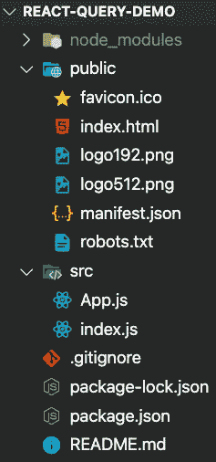
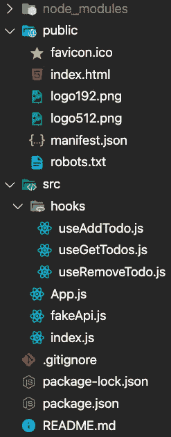

# 使用反应查询在反应中获取和变异数据

> 原文：<https://javascript.plainenglish.io/using-react-query-to-fetch-and-mutate-data-in-react-150b06f7fe04?source=collection_archive---------1----------------------->

React Query 使查询和缓存服务器端数据变得非常容易，在本教程中，我们将学习如何利用这一点。


为了简单起见，我们将构建一个假的 API，它将允许我们从列表中获取、添加和删除 todos。我向您展示的好处是，我们编写的代码可以很容易地转换成从真实的 API 中获取数据。

*我决定不使用真正的 API 是基于这样一个事实，即真正的 API 会引入本教程范围外的额外变量(以学习 reactor-Query)。假 API 的好处是它每次都会为我们工作，不会被问到任何问题，这对于演示目的来说是完美的。*

不用多说，我们开始吧。

# 让我们开始我们的项目

我们要做的第一件事是在命令行中导航到您想要的目录(取决于操作系统的终端或 powershell)。导航到所需目录后，可以运行以下命令。

```
npx create-react-app react-query-demo
```

创建项目后，使用此命令导航到目录。

```
cd react-query-demo
```

现在我们已经导航到该目录，我们需要安装一些软件包。

```
npm i react-query @material-ui/core @material-ui/icons
```

随着软件包的安装，剩下要做的就是清理 **src** 目录。你会想删除除了 App.js 和 index.js 之外的所有在 **src** 目录中的文件。



随着我们的项目现在都清理干净了，我们只需要添加一些新的文件夹和文件。我们将在 **src** 目录中直接添加一个名为 **fakeApi.js** 的文件。接下来，我们将在我们的 **src** 目录中添加一个名为 **hooks 的新文件夹**，我们将向其中添加 3 个文件。这些文件将是**useddtodo . js**、 **useGetTodos.js** 、以及 **useRemoveTodo.js** 。当添加了所有这些文件和文件夹后，我们的项目应该是这样的。



在这之后，现在是时候在您选择的代码编辑器中打开您的项目了。我将使用 VS 代码。下面是一个链接，供那些想尝试一下的人使用(这是免费的)。

[](https://code.visualstudio.com/) [## Visual Studio 代码-代码编辑。重新定义的

### Visual Studio Code 是一个经过重新定义和优化的代码编辑器，用于构建和调试现代 web 和云……

code.visualstudio.com](https://code.visualstudio.com/) 

# 让我们开始编码

我们将把这个教程分成 3 个部分。第 1 部分，我们将编写代码来创建我们的假 API。第 2 部分将为自定义钩子编写代码，这些钩子使用 reactor-Query 与我们的假 API 进行通信。第 3 部分将把 reactor-Query 连接到我们的用户界面(在这个应用程序中，我们将使用 Material-UI 进行样式设计)。让我们开始编码吧！

## 第 1 部分:为我们的假 API 编写代码

如上所述，我们的假 API 将允许我们从列表中获取、添加和删除 todos。您需要将下面的代码添加到您的 **fakeApi.js** 文件中。

这真的很简单，但这就是我们正在做的。我们有我们的列表，它存储在顶部的一个全局变量中，我们有一个名为“*wait”*的函数，这个函数用于通过延迟来模拟我们的 API 调用(因为在现实世界中，API 不是即时的，必须命中服务器才能获得数据)。我们也有从列表中获取、添加和删除待办事项的功能。这些都很简单，只有一个警告。你会注意到在 *getTodos* 函数中，我使用了 spread 操作符来返回 Todos 数组的一个新副本。这是因为，在真正的 API 中，这与它的工作方式相似。当你调用一个 API 时，你每次都会得到新的数据。现在我们的假 API 都设置好了，我们将继续把 React-Query 连接到它。

## 第 2 部分:为使用 React-Query 的定制挂钩编写代码

是时候进入本教程的核心部分了，即学习如何在项目中使用 React-Query 从 API 获取数据并对其进行变异。

让我们先来看看 **useGetTodos.js** 文件的代码。

我们正在使用 React-Query 内置的 *useQuery* 钩子，并将它返回给我们的 useGetTodos 函数。在这个实例中, *useQuery* 钩子接受两个参数。第一个是所谓的*查询键*，稍后当我们需要使查询无效并触发数据重取时，这个键会派上用场。第二个参数只是任何旧的异步函数。React query 使用这个函数来获取数据和管理应用程序的状态。当我们为应用程序设置 UI 时，我们将看到这一点发挥作用。

接下来，让我们看看 **useAddTodo.js** 文件的代码。

*useAddTodo* 钩子与上面的钩子有些不同。它利用了 React Query 中的另一个内置钩子，称为 *useMutation，*，这个钩子用于(顾名思义)在我们的 API 中改变数据。同样，上面的 useMutation 钩子接受两个参数。第一个参数是一个箭头函数，它将数据(在本例中是*到*描述)传递给我们的 API 调用。我们将看到这在我们的 UI 中发挥作用。第二个参数是不同选项的对象，可以传递给 *useMutation* 钩子。在这种情况下，我们只传递一个选项。该选项是在成功解析来自异步函数的承诺时执行的函数。您将在第 9 行**中注意到，在成功解析一个承诺后，我们将调用 query client . invalidate equeries 并向其传递参数 *"todos"* 。基本上，正在发生的事情是，我们使所有带有 todos 的查询关键字*的查询无效。当查询失效时，它会强制调用获取数据的函数。***

最后，让我们看一下 **useRemoveTodo.js** 文件。

这与我们之前创建的文件非常相似。真正值得注意的唯一区别是，我们将索引作为参数传递给它，因为我们需要索引来确定要删除列表中的哪个元素。

现在我们已经创建了自定义的 React-Query 钩子，是时候进行最后一步了，即将这些钩子连接到我们的 UI。

## 第 3 部分:将 React-Query 连接到我们的 UI

正如我在开始时所说的。我们将使用 Material-UI 来设计我们的应用。如果你不熟悉 Material-UI，不要担心，因为它不会影响你理解我们用 React-Query 做什么的能力。事不宜迟，让我们来设置我们的 UI。

第一步是将我们的应用程序包装在 React 查询提供程序中。下面你会看到这有多简单。

您将在第 7 行看到我们正在创建一个新的 QueryClient 实例。这很重要，因为 QueryClient 的这个实例将被馈送到我们的应用程序。一旦我们创建了实例，就可以将它传递给 QueryClientProvider 组件，就这样。是时候开始写我们的 UI 了。

*额外内容:您将在第 13 行看到一个名为 ReactQueryDevTools 的组件。这是因为 React-Query 有一个非常简洁的内置开发工具版本，可以用来调试 React Query。使用我们应用程序中的这个组件，我们将能够单击屏幕左下角的 React Query 徽标，并打开开发工具。此外，不要担心隐藏它，因为它只会出现在开发环境中。在本教程中，我不会深入讨论这个问题，但是我强烈建议阅读相关文档。可以在下面的链接中找到。*

[](https://react-query.tanstack.com/devtools) [## 开发工具

### 在空中挥动你的手并欢呼万岁，因为 React Query 附带了专用的开发工具！🥳当你开始你的…

react-query.tanstack.com](https://react-query.tanstack.com/devtools) 

随着我们的项目现在准备好处理反应查询。让我们为我们的应用程序编写用户界面。下面是我们的 **App.js** 文件的代码。

让我们来谈谈 response-Query 在上面的代码中是如何发挥作用的。您会在**第 25、26 和 27 行**看到，我们正在引入我们在第 2 部分为 reactor-Query 制作的定制钩子。

让我们从谈论**第 25 行**开始。这个钩子负责查询我们的应用编程接口。并返回各种不同的状态和属性，我们可以用它们来确定 UI 的功能(我并没有使用钩子带回的所有属性)。我将使用*数据*、*加载*、以及*蚀刻*属性。顾名思义，data 属性是从我们的查询(在本例中是待办事项列表)中返回的数据。你会在**第 42 行**看到这个动作。 *isLoading* 属性是一个布尔值，当我们进入页面时，当我们的查询最初加载时，该属性被设置为 true。当加载查询时，您会看到在**第 29 行**使用的 isLoading 属性来呈现一个加载微调器。最后，*属性也是一个布尔值，每当我们的查询被再次调用以获取新的数据时，这个值都是真的。这在**第 39 行**中使用，有条件地渲染文本，告诉我们我们正在得到新的数据。*

在**第 26 行**上，我们使用了我们在第 2 部分中制作的自定义 removeTodoHook。你会注意到我不是在破坏物体，类似于我在**第 25 行**所做的。这样做可能会导致由于范围问题而找不到 QueryClient 实例的问题。无论如何，removeTodo 突变是一个对象，它也有一些我们将在 UI 中使用的属性。主要是 mutate 属性，它将采用我们在 useRemoveTodo.js 文件中的 arrow 函数中描述的参数(因此它将采用 index 作为参数)。您可以在我们的 **App.js** 文件的**第 48 行**中看到这个动作。

第 27 行的行为与第 26 行基本相同，除了当我们使用 mutate 属性时，它会调用不同的函数。你可以在**第 70 行**看到这个动作。

我们做到了！！我们现在已经在我们的应用程序中成功地实现了反应查询。

继续运行下面的命令，尝试一下。

```
npm start
```

# 看看代码

下面，我将在我的 GitHub 上附上一个源代码链接，并为那些想在浏览器中摆弄代码的人提供一个交互式代码沙箱。

GitHub 链接如下:

[](https://github.com/13bfrancis/react-query-tutorial-1) [## 13 BF rancis/react-query-tutorial-1

### 在 GitHub 上创建一个帐户，为 13 bfrancis/react-query-tutorial-1 开发做贡献。

github.com](https://github.com/13bfrancis/react-query-tutorial-1) 

下面是代码沙箱:

# 证明文件

下面是 React-Query 文档的链接。

[](https://react-query.tanstack.com/overview) [## 概观

### React Query 经常被描述为 React 缺少的数据获取库，但是用更专业的术语来说，它使……

react-query.tanstack.com](https://react-query.tanstack.com/overview) 

下面是 Material-UI 文档的链接。

[](https://material-ui.com/) [## Material-UI:一个流行的 React UI 框架

### React 组件使 web 开发更快更容易。建立自己的设计体系，或者从材料设计开始。

material-ui.com](https://material-ui.com/) 

# 结论

React-Query 是一个引人注目的库，它使处理服务器端状态变得轻而易举。希望您在本教程中发现了价值，它有助于更好地理解如何使用 React-Query。一如既往，如果你有任何建议，请随时留下评论。

*更多内容看*[***plain English . io***](http://plainenglish.io)