# 让我们用 React+Supabase(Firebase 替代方案)构建一个应用程序

> 原文：<https://javascript.plainenglish.io/using-react-supabase-alternative-to-firebase-a-tutorial-11219c1a2c8c?source=collection_archive---------15----------------------->

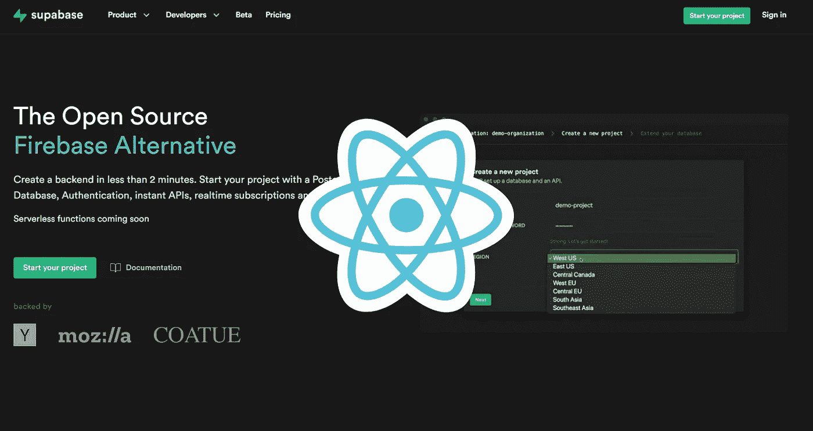

# **什么是 Supabase？**

Supabase 是谷歌 Firebase 的开源替代品。目前可以免费使用，支持 PostgreSQL 数据库和认证工具。

它依赖于现有的开源项目，无服务器解决方案将很快发布。

# **React + Supabase 教程**

**创建超级账户**

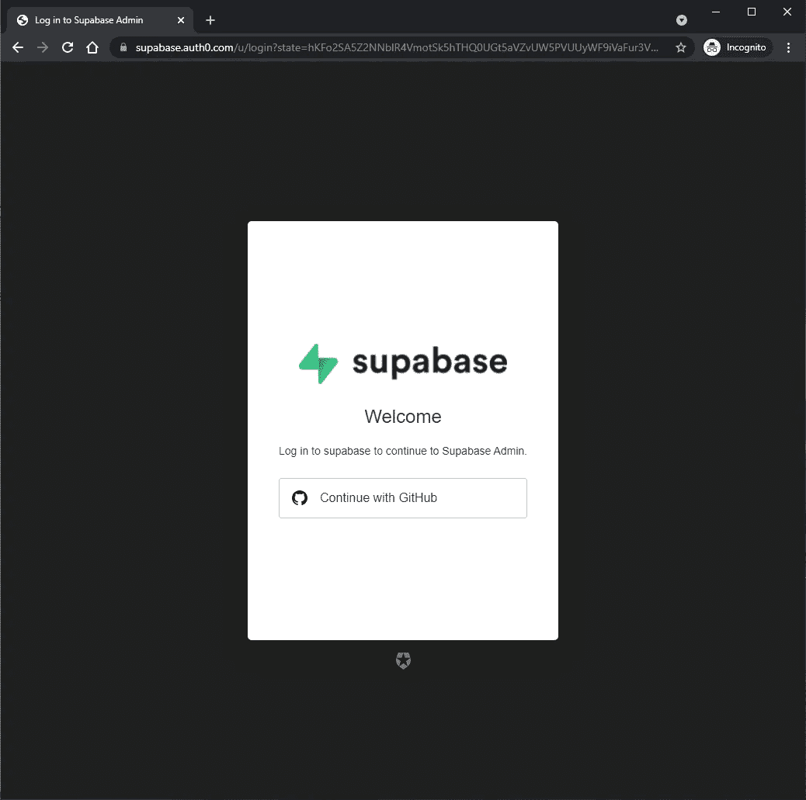

首先，您需要通过连接到 Github 来创建一个 Supabase 帐户。

**创建新项目**

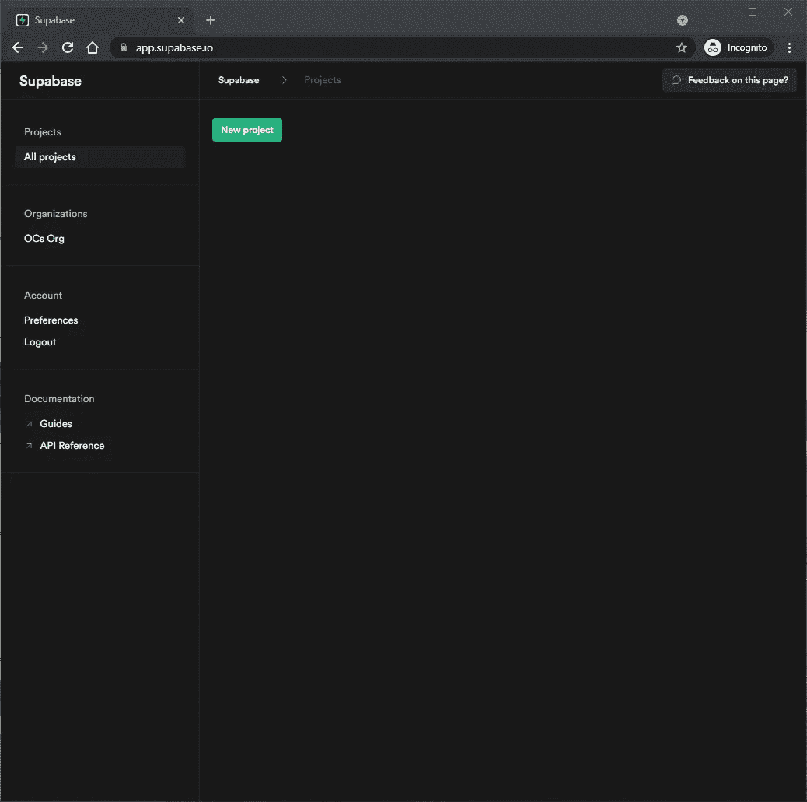

接下来，单击仪表板中的“新建项目”按钮。

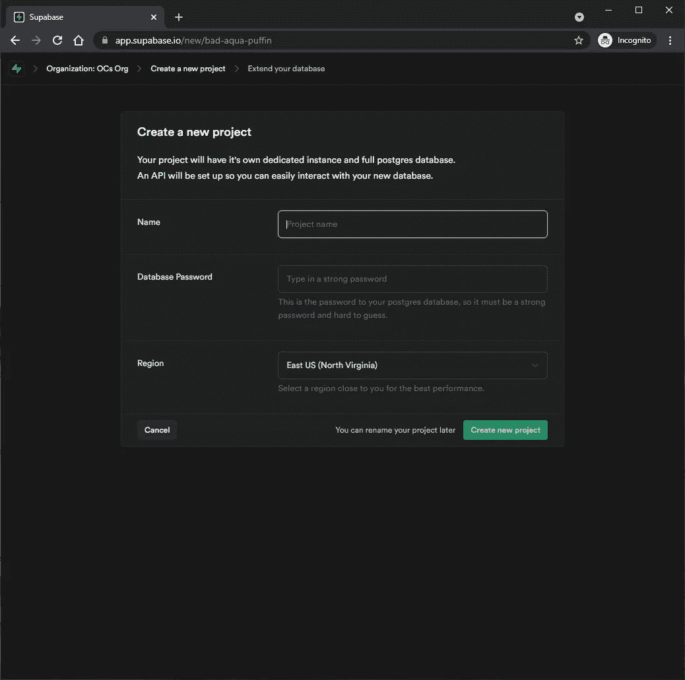

然后输入名称、数据库密码并选择您所在的地区。

现在，您将等待您的数据库启动。大约需要 2 分钟。

**设置数据库模式**

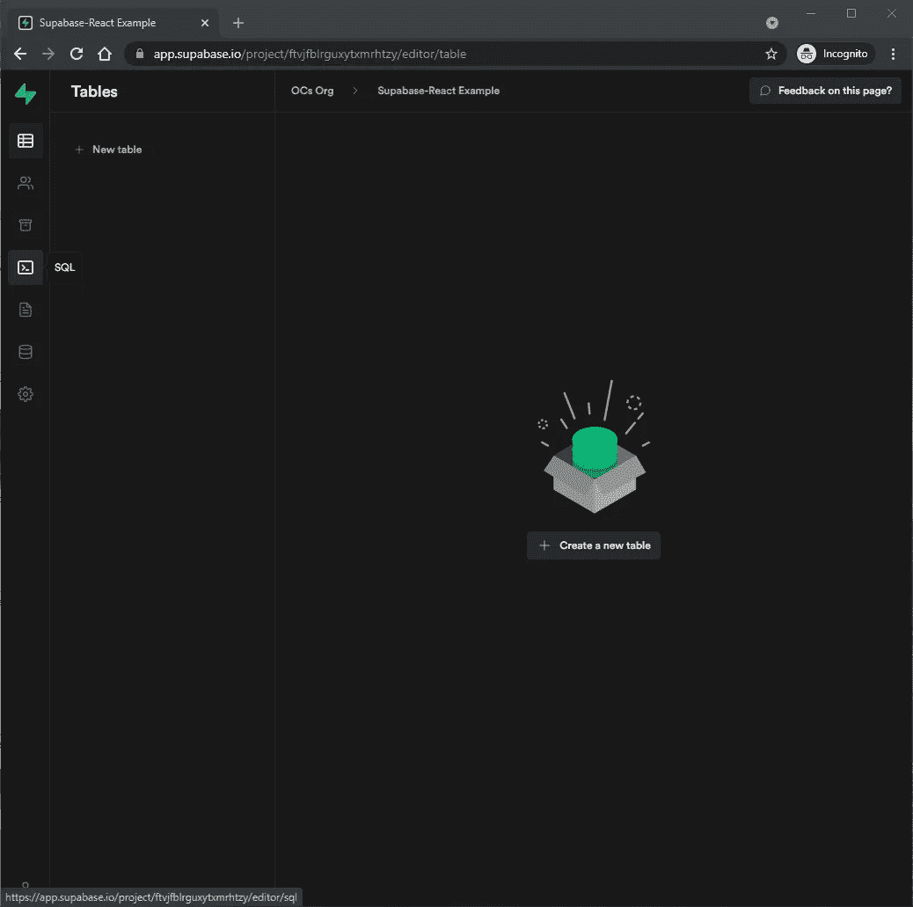

1.单击仪表板导航上的 SQL 选项卡。

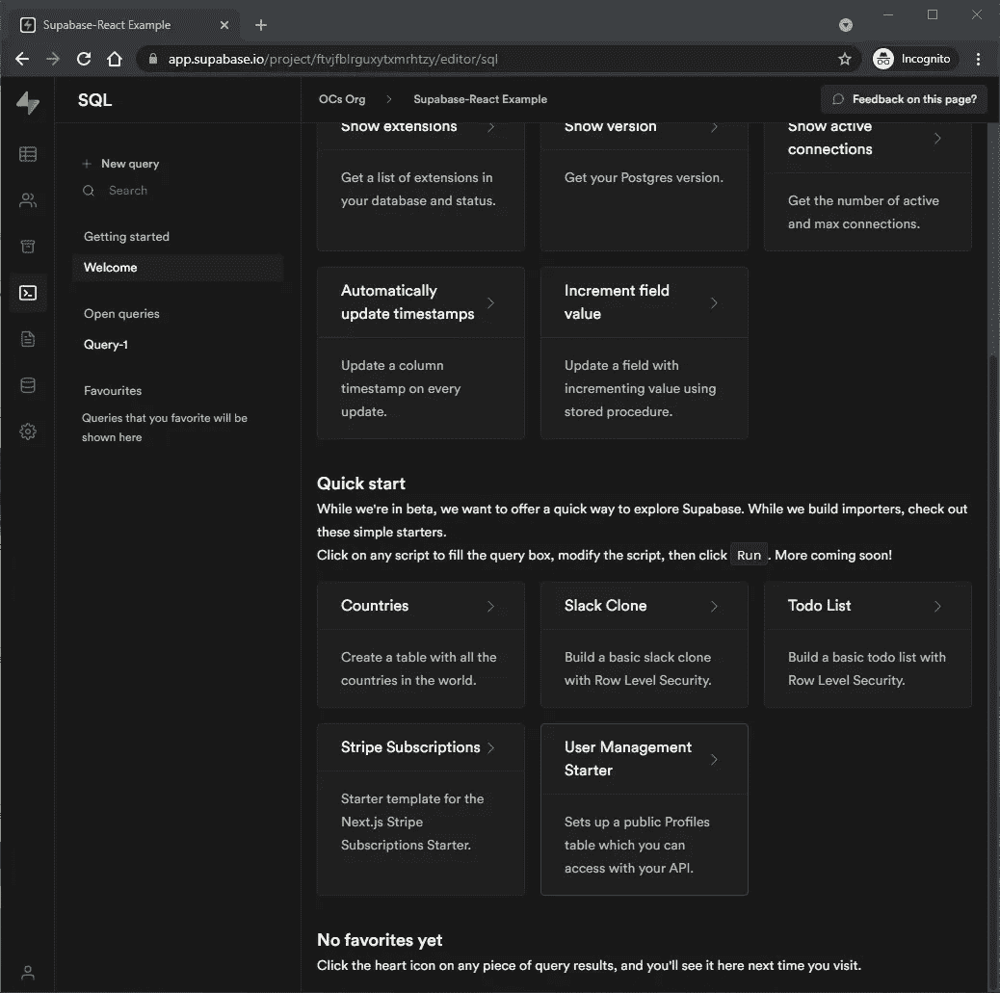

2.向下滚动到“快速启动”启动器部分，并单击“用户管理启动器”脚本。

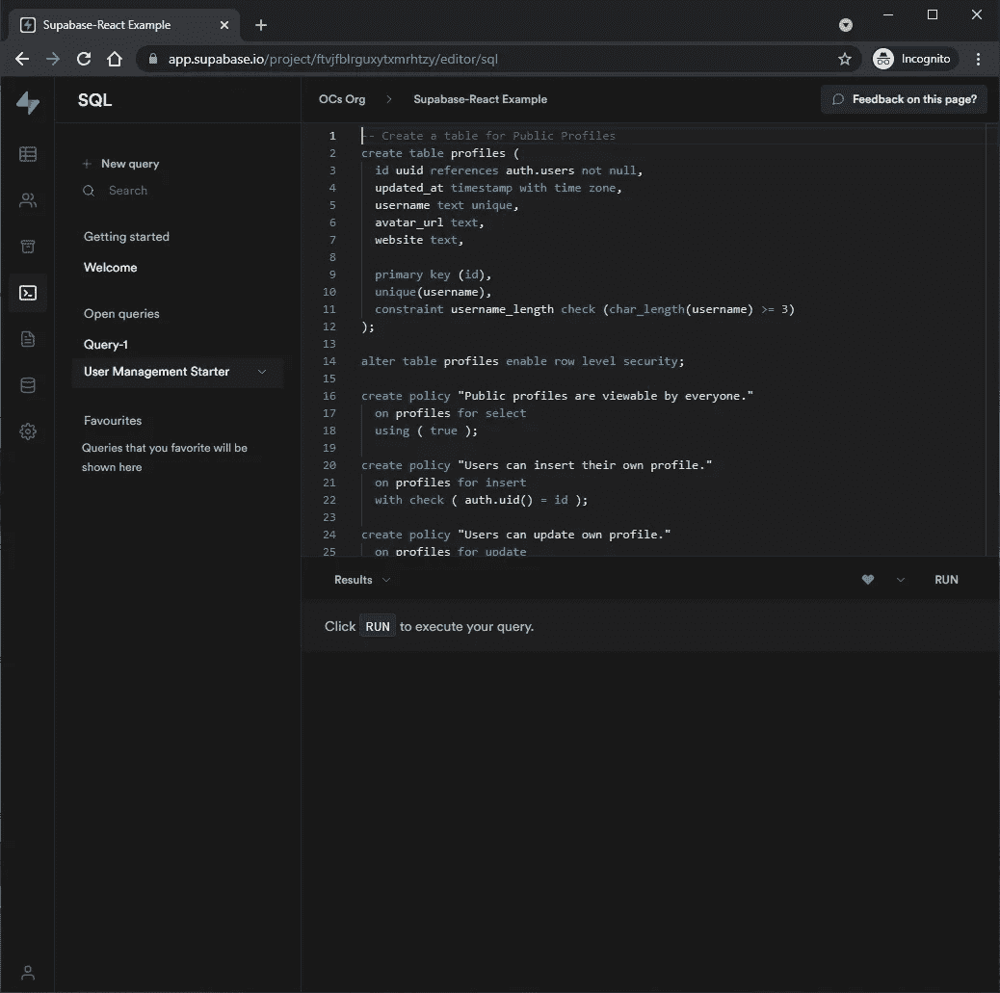

3.点击屏幕右下方右侧的“运行”。完成后，结果将显示“成功。未返回任何行”。

您刚刚为公共概要文件创建了一个数据库表。

**使用 API 插入数据**

现在是时候使用 Supabase 自动生成的 API 插入一些数据了。

1.单击仪表板导航上的设置选项卡。

2.点击菜单中的“API”。

3.找到以下内容:

*   “配置”下的 API URL
*   “API 密钥”下的匿名密钥
*   “API 密钥”下的 service_role 密钥

将 React 应用程序连接到 Supabase 数据库需要这些 API 设置。

**创建一个 React 应用**

*Windows 命令提示符*

```
C:\Users\Owner\desktop\react> npx create-react-app supareact
```

使用脸书的`create-react-app`创建一个名为`supareact`的 React 应用。如果你是新手，请参阅[初学者指南](https://www.ordinarycoders.com/blog/article/reactjs-beginners-tutorial)。

**安装 supabase-js**

*Windows 命令提示符*

```
C:\Users\Owner\desktop\react> cd supareact
C:\Users\Owner\desktop\react\supareact> npm install @supabase/supabase-js
```

安装完成后，进入新创建的项目目录，安装`supabase-js`依赖项。

**添加 Supabase API 证书作为环境变量**

*sup arect>(新文件)。环境*

```
REACT_APP_SUPABASE_URL=YOUR_SUPABASE_URL
REACT_APP_SUPABASE_ANON_KEY=YOUR_SUPABASE_ANON_KEY
```

创建一个名为*的新文件。项目目录`supareact`中的 env* ，并添加 API URL 和 anon 键。

**初始化超级数据库客户端**

*sup arect>src>(新文件)supabaseClient.js*

```
import { createClient } from '@supabase/supabase-js'const supabaseUrl = process.env.REACT_APP_SUPABASE_URL
const supabaseAnonKey = process.env.REACT_APP_SUPABASE_ANON_KEYexport const supabase = createClient(supabaseUrl, supabaseAnonKey)
```

接下来，我们需要一个助手文件来初始化 Supabase 客户端。这是调用环境变量来连接 Supabase 的地方。

在添加的文件中会调用`supabase`常量。

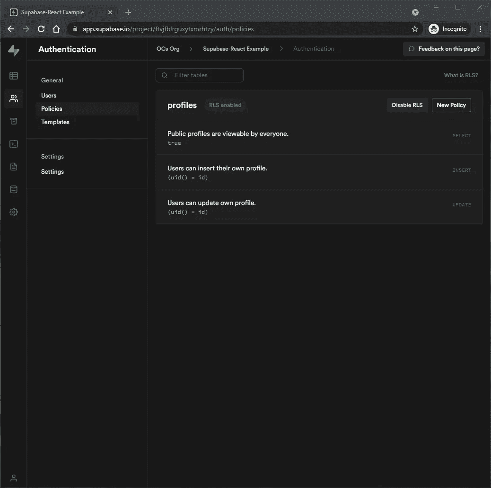

这些环境变量在浏览器上公开，但默认情况下，Supabase 的行级安全性是启用的，允许公共配置文件被所有人查看，但只有用户可以更新和插入他们自己的配置文件。

**更新 CSS 文件**

*sup arect>src>index . CSS*

```
html,
body {
  --custom-font-family: -apple-system, BlinkMacSystemFont, Segoe UI, Roboto, Oxygen, Ubuntu,
    Cantarell, Fira Sans, Droid Sans, Helvetica Neue, sans-serif;
  --custom-bg-color: #101010;
  --custom-panel-color: #222;
  --custom-box-shadow: 0 2px 8px 0 rgba(0, 0, 0, 0.8);
  --custom-color: #fff;
  --custom-color-brand: #24b47e;
  --custom-color-secondary: #666;
  --custom-border: 1px solid #333;
  --custom-border-radius: 5px;
  --custom-spacing: 5px; padding: 0;
  margin: 0;
  font-family: var(--custom-font-family);
  background-color: var(--custom-bg-color);
}* {
  color: var(--custom-color);
  font-family: var(--custom-font-family);
  box-sizing: border-box;
}html,
body,
#__next {
  height: 100vh;
  width: 100vw;
  overflow-x: hidden;
}/* Grid */.container {
  width: 90%;
  margin-left: auto;
  margin-right: auto;
}
.row {
  position: relative;
  width: 100%;
}
.row [class^='col'] {
  float: left;
  margin: 0.5rem 2%;
  min-height: 0.125rem;
}
.col-1,
.col-2,
.col-3,
.col-4,
.col-5,
.col-6,
.col-7,
.col-8,
.col-9,
.col-10,
.col-11,
.col-12 {
  width: 96%;
}
.col-1-sm {
  width: 4.33%;
}
.col-2-sm {
  width: 12.66%;
}
.col-3-sm {
  width: 21%;
}
.col-4-sm {
  width: 29.33%;
}
.col-5-sm {
  width: 37.66%;
}
.col-6-sm {
  width: 46%;
}
.col-7-sm {
  width: 54.33%;
}
.col-8-sm {
  width: 62.66%;
}
.col-9-sm {
  width: 71%;
}
.col-10-sm {
  width: 79.33%;
}
.col-11-sm {
  width: 87.66%;
}
.col-12-sm {
  width: 96%;
}
.row::after {
  content: '';
  display: table;
  clear: both;
}
.hidden-sm {
  display: none;
}@media only screen and (min-width: 33.75em) {
  /* 540px */
  .container {
    width: 80%;
  }
}@media only screen and (min-width: 45em) {
  /* 720px */
  .col-1 {
    width: 4.33%;
  }
  .col-2 {
    width: 12.66%;
  }
  .col-3 {
    width: 21%;
  }
  .col-4 {
    width: 29.33%;
  }
  .col-5 {
    width: 37.66%;
  }
  .col-6 {
    width: 46%;
  }
  .col-7 {
    width: 54.33%;
  }
  .col-8 {
    width: 62.66%;
  }
  .col-9 {
    width: 71%;
  }
  .col-10 {
    width: 79.33%;
  }
  .col-11 {
    width: 87.66%;
  }
  .col-12 {
    width: 96%;
  }
  .hidden-sm {
    display: block;
  }
}@media only screen and (min-width: 60em) {
  /* 960px */
  .container {
    width: 75%;
    max-width: 60rem;
  }
}/* Forms */label {
  display: block;
  margin: 5px 0;
  color: var(--custom-color-secondary);
  font-size: 0.8rem;
  text-transform: uppercase;
}input {
  width: 100%;
  border-radius: 5px;
  border: var(--custom-border);
  padding: 8px;
  font-size: 0.9rem;
  background-color: var(--custom-bg-color);
  color: var(--custom-color);
}input[disabled] {
  color: var(--custom-color-secondary);
}/* Utils */.block {
  display: block;
  width: 100%;
}
.inline-block {
  display: inline-block;
  width: 100%;
}
.flex {
  display: flex;
}
.flex.column {
  flex-direction: column;
}
.flex.row {
  flex-direction: row;
}
.flex.flex-1 {
  flex: 1 1 0;
}
.flex-end {
  justify-content: flex-end;
}
.flex-center {
  justify-content: center;
}
.items-center {
  align-items: center;
}
.text-sm {
  font-size: 0.8rem;
  font-weight: 300;
}
.text-right {
  text-align: right;
}
.font-light {
  font-weight: 300;
}
.opacity-half {
  opacity: 50%;
}/* Button */button,
.button {
  color: var(--custom-color);
  border: var(--custom-border);
  background-color: var(--custom-bg-color);
  display: inline-block;
  text-align: center;
  border-radius: var(--custom-border-radius);
  padding: 0.5rem 1rem;
  cursor: pointer;
  text-align: center;
  font-size: 0.9rem;
  text-transform: uppercase;
}button.primary,
.button.primary {
  background-color: var(--custom-color-brand);
  border: 1px solid var(--custom-color-brand);
}/* Widgets */.card {
  width: 100%;
  display: block;
  border: var(--custom-border);
  border-radius: var(--custom-border-radius);
  padding: var(--custom-spacing);
}.avatar {
  border-radius: var(--custom-border-radius);
  overflow: hidden;
  max-width: 100%;
}
.avatar.image {
  object-fit: cover;
}
.avatar.no-image {
  background-color: #333;
  border: 1px solid rgb(200, 200, 200);
  border-radius: 5px;
}.footer {
  position: absolute;
  max-width: 100%;
  bottom: 0;
  left: 0;
  right: 0;
  display: flex;
  flex-flow: row;
  border-top: var(--custom-border);
  background-color: var(--custom-bg-color);
}
.footer div {
  padding: var(--custom-spacing);
  display: flex;
  align-items: center;
  width: 100%;
}
.footer div > img {
  height: 20px;
  margin-left: 10px;
}
.footer > div:first-child {
  display: none;
}
.footer > div:nth-child(2) {
  justify-content: left;
}@media only screen and (min-width: 60em) {
  /* 960px */
  .footer > div:first-child {
    display: flex;
  }
  .footer > div:nth-child(2) {
    justify-content: center;
  }
}@keyframes spin {
  from {
    transform: rotate(0deg);
  }
  to {
    transform: rotate(360deg);
  }
}.mainHeader {
  width: 100%;
  font-size: 1.3rem;
  margin-bottom: 20px;
}.avatarPlaceholder {
  border: var(--custom-border);
  border-radius: var(--custom-border-radius);
  width: 35px;
  height: 35px;
  background-color: rgba(255, 255, 255, 0.2);
  display: flex;
  align-items: center;
  justify-content: center;
}.form-widget {
  display: flex;
  flex-direction: column;
  gap: 20px;
}.form-widget > .button {
  display: flex;
  align-items: center;
  justify-content: center;
  border: none;
  background-color: #444444;
  text-transform: none **!important**;
  transition: all 0.2s ease;
}.form-widget .button:hover {
  background-color: #2a2a2a;
}.form-widget .button > .loader {
  width: 17px;
  animation: spin 1s linear infinite;
  filter: invert(1);
}
```

在添加任何组件之前，用 Supabase 提供的 [CSS 声明](https://raw.githubusercontent.com/supabase/supabase/master/examples/react-user-management/src/index.css)更新 CSS 文件 *index.css* 。删除文件中最初的默认 CSS 声明。

**创建登录组件**

*sup arect>src>(新文件)Auth.js*

```
import { useState } from 'react'
import { supabase } from './supabaseClient'export default function Auth() {
  const [loading, setLoading] = useState(false)
  const [email, setEmail] = useState('') const handleLogin = async (email) => {
    try {
      setLoading(true)
      const { error } = await supabase.auth.signIn({ email })
      if (error) throw error
      alert('Check your email for the login link!')
    } catch (error) {
      alert(error.error_description || error.message)
    } finally {
      setLoading(false)
    }
  } return (
    <div className="row flex flex-center">
      <div className="col-6 form-widget">
        <h1 className="header">Supabase + React</h1>
        <p className="description">Sign in via magic link with your email below</p>
        <div>
          <input
            className="inputField"
            type="email"
            placeholder="Your email"
            value={email}
            onChange={(e) => setEmail(e.target.value)}
          />
        </div>
        <div>
          <button
            onClick={(e) => {
              e.preventDefault()
              handleLogin(email)
            }}
            className={'button block'}
            disabled={loading}
          >
            {loading ? <span>Loading</span> : <span>Send magic link</span>}
          </button>
        </div>
      </div>
    </div>
  )
}
```

现在让我们添加一个处理用户注册和登录的功能组件。

导入文件顶部的`useState`和`supabase`。

记住`useState`是一个 React 钩子，用来给一个功能组件添加一个 React 状态。`useState`返回当前状态和更新状态的函数。

在`Auth`组件中设置了两种状态:`loading`和`email`。

`email`状态是输入字段的`value`，而`setEmail()`在`onChange`事件上被调用以更新`email`状态。默认情况下，`email`状态设置为空字符串。

在条件(三元)操作符中调用`loading`状态，这是 JavaScript `if`语句的快捷方式。

该语句表示如果`loading`为真，则显示“正在加载”，否则显示“发送神奇链接”按钮。

`handleLogin` arrow 函数接受所提供的`email`状态，并发送一个如下所示的神奇链接:/verify？type = magic link&token = hvoiwebfuiuayggfrerg 发送至注册/登录时输入的电子邮件。当发送神奇链接通知用户时，会出现浏览器警告。

[Magic link](https://magic.link/) 是一种用户无需密码即可进行身份验证的方式。

**创建账户组件**

*sup arect>src>(新文件)Account.js*

```
import { useState, useEffect } from 'react'
import { supabase } from './supabaseClient'export default function Account({ session }) {
  const [loading, setLoading] = useState(true)
  const [username, setUsername] = useState(null)
  const [website, setWebsite] = useState(null)
  const [avatar_url, setAvatarUrl] = useState(null) useEffect(() => {
    getProfile()
  }, [session]) async function getProfile() {
    try {
      setLoading(true)
      const user = supabase.auth.user() let { data, error, status } = await supabase
        .from('profiles')
        .select(`username, website, avatar_url`)
        .eq('id', user.id)
        .single() if (error && status !== 406) {
        throw error
      } if (data) {
        setUsername(data.username)
        setWebsite(data.website)
        setAvatarUrl(data.avatar_url)
      }
    } catch (error) {
      alert(error.message)
    } finally {
      setLoading(false)
    }
  } async function updateProfile({ username, website, avatar_url }) {
    try {
      setLoading(true)
      const user = supabase.auth.user() const updates = {
        id: user.id,
        username,
        website,
        avatar_url,
        updated_at: new Date(),
      } let { error } = await supabase.from('profiles').upsert(updates, {
        returning: 'minimal', // Don't return the value after inserting
      }) if (error) {
        throw error
      }
    } catch (error) {
      alert(error.message)
    } finally {
      setLoading(false)
    }
  } return (
    <div className="form-widget">
      <div>
        <label htmlFor="email">Email</label>
        <input id="email" type="text" value={session.user.email} disabled />
      </div>
      <div>
        <label htmlFor="username">Name</label>
        <input
          id="username"
          type="text"
          value={username || ''}
          onChange={(e) => setUsername(e.target.value)}
        />
      </div>
      <div>
        <label htmlFor="website">Website</label>
        <input
          id="website"
          type="website"
          value={website || ''}
          onChange={(e) => setWebsite(e.target.value)}
        />
      </div> <div>
        <button
          className="button block primary"
          onClick={() => updateProfile({ username, website, avatar_url })}
          disabled={loading}
        >
          {loading ? 'Loading ...' : 'Update'}
        </button>
      </div> <div>
        <button className="button block" onClick={() => supabase.auth.signOut()}>
          Sign Out
        </button>
      </div>
    </div>
  )
}
```

让我们添加一个组件，允许用户更新他们的帐户信息。

`Account`功能组件有四种状态:`loading`、`username`、`website`和`avatar_url`。

两个异步函数也在`Account`中:

`getProfile()`包含一个`fetch()`承诺，当实现时，将响应分配给`data`、`error`和`status`变量。如果提供了`data`，则呈现用户名、网站和头像。

`updateProfile()`设置常量`user`和`updates`。当调用该函数时，用户指定的更新被呈现并保存到 Supabase。

**用账户和登录组件更新 React 应用**

*sup arect>src>app . js*

```
import './index.css'
import { useState, useEffect } from 'react'
import { supabase } from './supabaseClient'
import Auth from './Auth'
import Account from './Account'export default function Home() {
  const [session, setSession] = useState(null) useEffect(() => {
    setSession(supabase.auth.session()) supabase.auth.onAuthStateChange((_event, session) => {
      setSession(session)
    })
  }, []) return (
    <div className="container" style={{ padding: '50px 0 100px 0' }}>
      {!session ? <Auth /> : <Account key={session.user.id} session={session} />}
    </div>
  )
}
```

如果没有认证的会话，那么`<Auth />`组件将显示，否则`<Account />`将返回 Supabase 会话信息。

**启动 React app**

*Windows 命令提示符*

```
C:\Users\Owner\desktop\react\supareact> npm start
```

是时候运行开发服务器了，看看 React + Supabase 的运行情况。

**在浏览器中查看 supa base+React app**

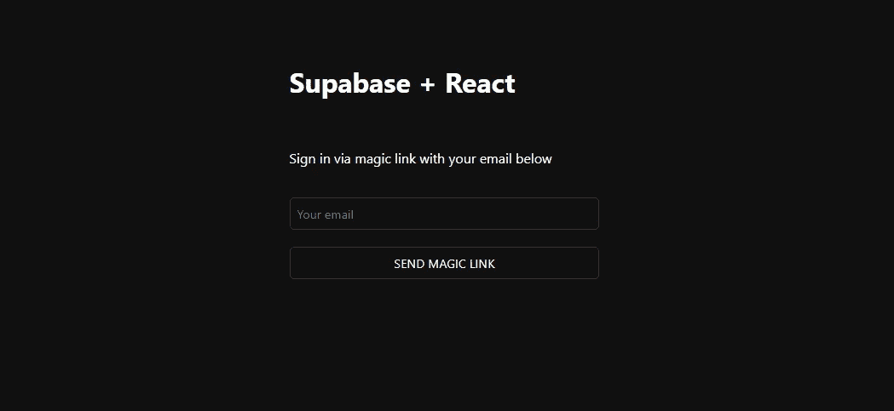

这是登录/注册页面。

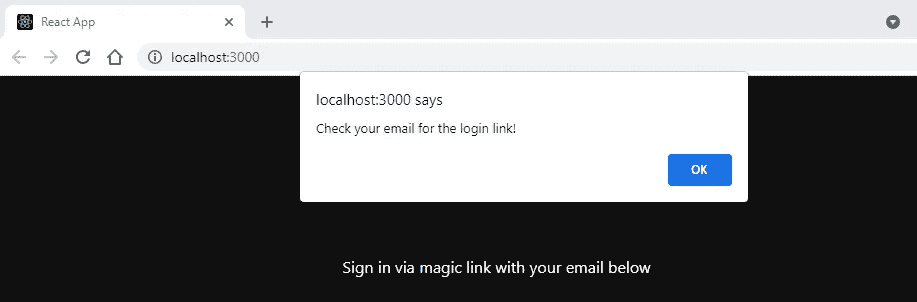

这是浏览器警告。

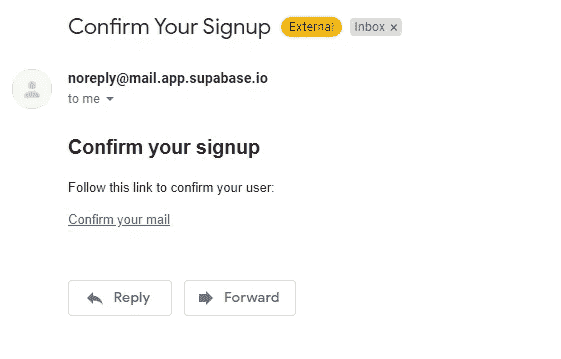

这是 Supabase 使用 Magic link 发送的确认邮件。

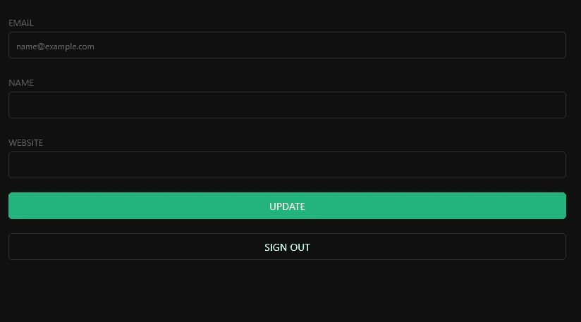

这是认证页面。

**查看 Supabase 中的档案表**

现在是时候在 Supabase 仪表板中看到用户了。

1.单击控制面板导航上的身份验证选项卡。

2.点击菜单中的“用户”。

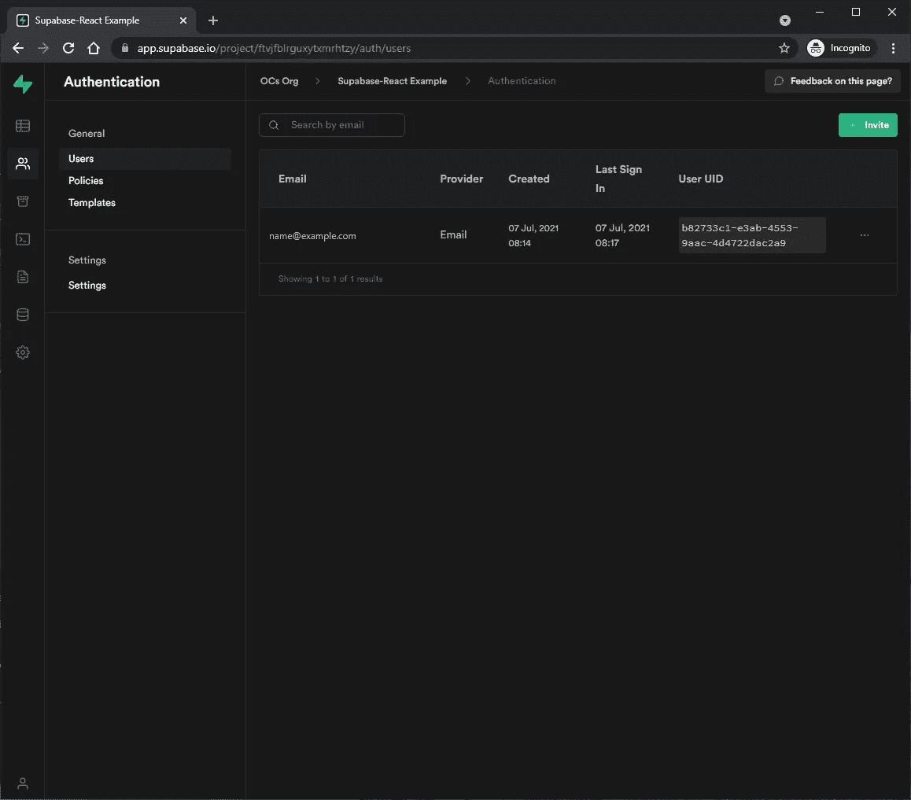

在这里，您可以看到所有注册的认证用户。

如果您点击表编辑器选项卡，并选择“配置文件”，这是你会看到配置文件表和行。

**更新电子邮件模板**

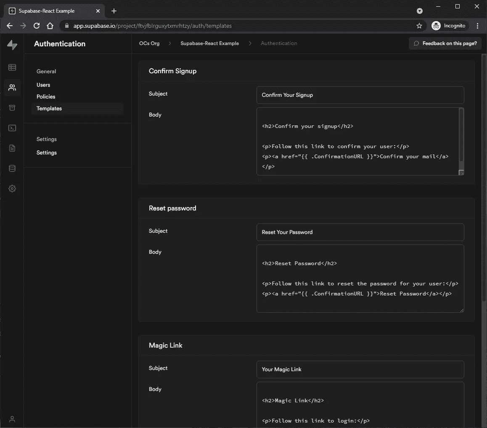

如果您想要更新电子邮件模板，请单击“身份验证”选项卡中的“模板”。

*原载于*[*https://www.ordinarycoders.com*](https://www.ordinarycoders.com/blog/article/supabase-react)*。*

*更多内容请看*[***plain English . io***](http://plainenglish.io/)