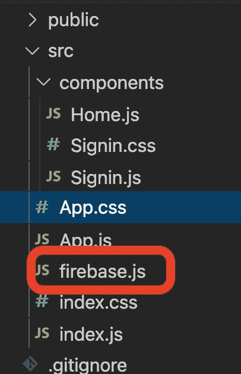
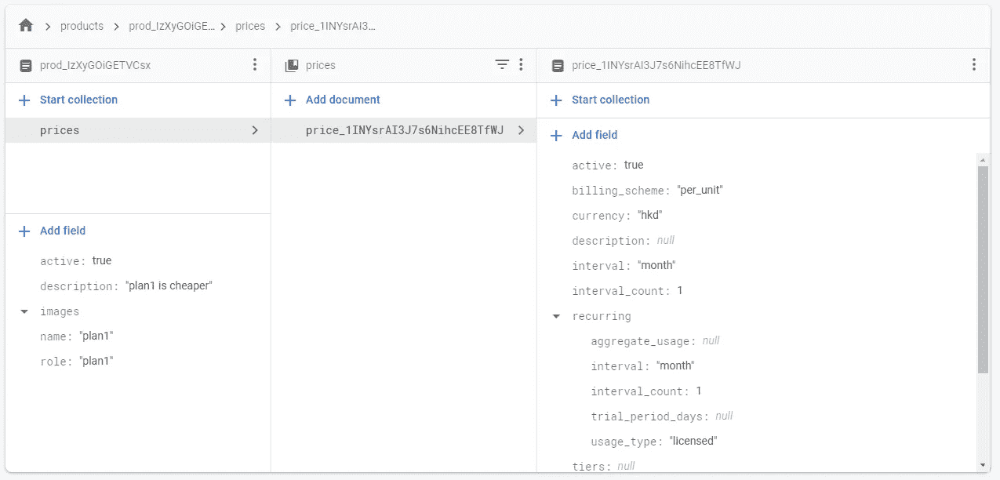
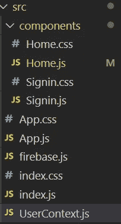
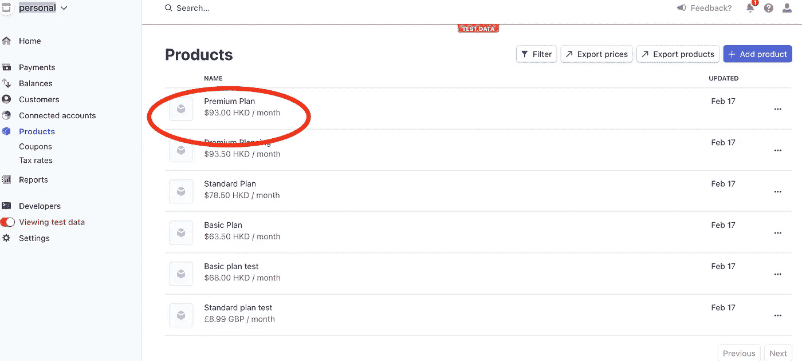

# 如何使用 Firebase 的条纹支付

> 原文：<https://javascript.plainenglish.io/using-stripe-payment-with-firebase-9dc0a7c82080?source=collection_archive---------4----------------------->


Photo by [Christiann Koepke](https://unsplash.com/@christiannkoepke?utm_source=medium&utm_medium=referral) on [Unsplash](https://unsplash.com?utm_source=medium&utm_medium=referral)

## 向 Firebase 项目添加订阅计划

在本文中，我们将演示如何在 Firebase 项目中使用条带扩展。我们将创建一个简化的网飞克隆，列出了计划，用户可以订阅计划，同时，这些数据是同步的。这意味着 Stripe 的客户数据与 Firebase 中的认证数据相同。添加到 Stripe 中的产品也将记录在 Firebase firestore 中。

我们开始吧！

源代码:

[https://www . udemy . com/course/complete-react-course-w-hooks-react-router-redux-use context/？referral code = b 192869617 ade 079536](https://www.udemy.com/course/complete-react-course-w-hooks-react-router-redux-usecontext/?referralCode=B192869617ADE079536F)

## 1.打开条带帐户


我们创建了一个名为“Company1”的帐户。我们在左侧菜单中切换查看测试数据。然后你应该看到获取你的 API 键，这些键用于连接 Firebase 和测试数据。

## 2.创建 Firebase 项目


Turn off the Google Analytics

我们创建一个 Firebase 项目，然后禁用这个项目的谷歌分析。

之后，我们打开电子邮件认证并启动云 Firestore。


## 3.安装 Firebase 条带扩展


我们单击扩展菜单，然后单击安装条带扩展。安装完成后，点击“这个扩展是如何工作的”


在“配置条带 webhooks”的步骤 2 下，我们将此端点复制到条带。


从“配置条带 webhooks”的步骤 3 开始，我们将这些事件添加到端点。

在“配置 Stripe webhooks”的第 4 步中，我们从 Stripe 复制“签名密码”并将其粘贴到 Firebase 的“Stripe webhook 密码”中。

我们还将“测试 API 密钥”的“秘密密钥”复制到“限制访问的条带 API 密钥”中。记得也打开同步功能。

之后，我们单击保存。


## 4.添加产品或计划

接下来，我们将向条带中添加产品或订阅计划。所以我们需要点击侧边菜单上的“产品”，然后点击“+添加产品”。


我们输入产品的名称、描述和价格，如果您只有一个产品，请单击“保存产品”;如果您有多个产品，请单击“保存并添加更多”,这样您就可以继续添加更多产品


example product (plan 1)

输入所有产品信息后，我们单击“设置”，然后单击“客户门户”。


我们打开

"允许客户查看他们的发票历史记录"

"允许客户更新以下帐单信息"

"允许客户取消订阅"

“允许客户切换不同的定价方案”

然后，我们需要将产品添加到“添加的产品”中


我们需要在“服务条款”和“隐私政策”中输入“【https://example.com/terms】T5”和“[https://example.com/privacy T7”。最后，我们点击“保存”。](https://example.com/privacy)

## 5.添加 firebase 配置文件

我们用这个[项目](https://medium.com/swlh/react-firebase-authentication-b68bd0f078a8)继续。如果您在 Firebase 中创建了一个新项目，请记住您需要将配置文件从 Firebase 复制到您的项目中。

点击齿轮图标，然后点击


键入应用程序昵称，然后单击“注册应用程序”。然后将配置文件复制到项目的 firebase.js 中。



## 6.从 Firebase 获取产品和价格

在 Home.js 内部，我们需要添加状态“products”和更新函数“setProducts”。

```
const [products, setProducts] = useState([])
```

由于我们将使用 useState 和 useEffect，所以我们还需要从“react”中导入它们。

```
import React, { useContext, useEffect, useState } from 'react'useEffect(() => {db.collection('products').where('active', '==', true).get().then(snapshot => {console.log('products snapshot',snapshot)const products = {};snapshot.forEach(async productDoc => {products[productDoc.id] = productDoc.data();const priceSnap = await productDoc.ref.collection("prices").get();console.log('rpiceSnap', priceSnap)priceSnap.forEach(priceDoc => {products[productDoc.id].prices = {priceId: priceDoc.id,priceData: priceDoc.data()}})})setProducts(products)console.log('products', products)})}, [])
```

选择那些活动的产品，从快照中，我们可以看到一组数据，这些是产品吗，我们可以看到产品 id


创建一个空的 products 对象，然后从快照中获取文档，设置如下所示的键值对。

```
products[productDoc.id] = productDoc.data();
```

这是因为最后我们要获得 follow products JSON 对象，下面是该对象的一个例子。

```
{
 "prod_IzXyGOiGETVCsx": {
  "active": true,
  "name": "plan1",
  "role": "plan1",
  "images": [],
  "description": "plan1 is cheaper"
 },
 "prod_IzXzUtzeWTYwij": {
  "images": [],
  "description": "plan2 is more expensive",
  "name": "plan2",
  "role": "plan2",
  "active": true
 },
 "prod_IzYUChfToedtdz": {
  "active": true,
  "name": "plan3",
  "images": [],
  "role": "plan3",
  "description": "plan 3"
 }
}
```

因为我们还想从 firestore 获取价格数据，该数据在子集合中。



```
const priceSnap = await productDoc.ref.collection("prices").get();priceSnap.forEach(priceDoc => {products[productDoc.id].prices = {priceId: priceDoc.id,priceData: priceDoc.data()}})
```

首先，我们从子集合“prices”中获取快照。之后，我们获取价格 id 和价格数据，并将其存储在 products 对象中


## 7.呈现产品和订阅按钮

Home.js 内部

```
return (<div><h1>Welcome home</h1><p><button onClick={() => auth.signOut()}>Sign out</button></p>{Object.entries(products).map(([productId, productData]) => {return (<div className="plans" key={productId}><div>{productData.name} - {productData.description}</div><button>subscribe</button></div>)})}</div>)
```

> 什么是 Object.entries？
> `**Object.entries()**`方法返回给定对象自己的可枚举字符串键属性`[key, value]`对的数组，其顺序与`[for...in](https://developer.mozilla.org/en-US/docs/Web/JavaScript/Reference/Statements/for...in)`循环提供的顺序相同。(唯一重要的区别是一个`for...in`循环也枚举了原型链中的属性)。

[](https://developer.mozilla.org/en-US/docs/Web/JavaScript/Reference/Global_Objects/Object/entries) [## Object.entries()

### Object.entries()方法返回给定对象自己的可枚举字符串键属性[key，value]的数组…

developer.mozilla.org](https://developer.mozilla.org/en-US/docs/Web/JavaScript/Reference/Global_Objects/Object/entries) 

我们使用 Object.entries 来获取键(即 productId)和数据(即 productData)。

我们使用 productId 作为列表项的键，并从 productData 中获取产品名称和描述。

最后，我们将 css 添加到 Home.css 中，并将其导入 Home.js

```
import './Home.css';.plans{display:flex;justify-content: space-between;margin-left: auto;margin-right: auto;max-width: 500px;}
```


## 8.加载检验

因为我们将向用户或客户添加数据，所以我们需要获取用户数据。



我们需要在 src 文件夹下创建 UserContext.js。

在 UserContext.js 内部

```
import {createContext} from 'react';export const UserContext = createContext(null)
```

回到 App.js，我们需要导入 UserContext

```
import {UserContext} from './UserContext';
```

之后，我们使用用户上下文。提供者来包装整个内容。提供者将把值“user”传递给组件。

```
return (<div className="App"><UserContext.Provider value={{user}}>{user ? <Home /> : <Signin />}</UserContext.Provider></div>);
```

在 Home.js 中，我们可以通过从 react 导入 useContext 并导入 UserContext 来获得值“user”。

```
import React, { useContext, useEffect, useState } from 'react'import { UserContext } from '../UserContext';const { user } = useContext(UserContext)
```

在我们已经获得用户数据之后，我们可以继续创建 loadCheckout 函数，我们将把这个函数绑定到 subscribe 按钮。因为我们需要在这个函数中使用 stripe 包，所以让我们通过在终端中输入以下命令来安装它。

```
npm i @stripe/stripe-jsconst loadCheckout = async (priceId) => {const docRef = await db.collection("customers").doc(user.uid).collection("checkout_sessions").add({price: priceId,success_url: window.location.origin,cancel_url: window.location.origin})docRef.onSnapshot(async (snap) => {const { error, sessionId } = snap.data()console.log('error sessionId', error, sessionId)if (error) {alert(`An error occured: ${error.message} `)}if (sessionId) {console.log('sessionID', sessionId)const stripe = await loadStripe("pk_test_51INW8eAI3J7s6NihgTfXwK6LckSo4tEJ1WhsoUmWGDftnJOBlXAXCSAqCVkSw89xsgAQjvtpMCTjTMknulKZ2wj900Nus791uw")stripe.redirectToCheckout({ sessionId });}})}
```

首先，我们将向客户添加 priceId、success_url 和 cancel_url

```
const docRef = await db.collection("customers").doc(user.uid).collection("checkout_sessions").add({price: priceId,success_url: window.location.origin,cancel_url: window.location.origin})
```

接下来，当内容发生变化时，它将创建一个签出会话。

如果有签出会话，那么它[将使用可发布的 API 键](https://stripe.com/docs/payments/accept-a-payment)创建条带对象的实例。

```
loadStripe("pk_test_adsfdsafdsafdsafdsafsadfadfdsafasdfsdafsafsad")
```

(我们可以从条带中获得可发布的 API 密钥)


它会将顾客重定向到结帐页面。

```
stripe.redirectToCheckout({ sessionId });
```

最后，我们将该功能绑定到订阅按钮上

```
<button disabled={isCurrentPlan} onClick={() => loadCheckout(productData.prices.priceId)}>subscribe</button>
```

## 9.检查当前计划

为了检查计划是否被订阅，我们需要向计划的元数据添加一个 firebaseRole。

要添加 firebaseRole，我们可以单击产品名称，然后单击“编辑元数据”，将 plan1 的元数据值添加到 plan1，plan2 的元数据值添加到 plan2，plan3 的元数据值添加到 plan3。

如果客户订阅了计划 3，他将在 firestore 中获得一个属性角色，即计划 3，因此稍后我们可以比较该角色和计划的名称，如果它们相同，那么我们可以得出结论，他订阅了该计划，然后禁用相应的“订阅”按钮。



现在，在重新创建新用户并订阅新计划后，如果客户订阅了计划 3，您可以看到现在有一个角色属性“计划 3”。

## 10.检查这是否是当前计划

在这一部分，我们将检查该特定计划是否被客户订阅。

为了检查客户订阅了哪个计划，我们需要比较产品名称和客户角色。

首先，我们需要添加订阅状态。

```
const [subscription, setSubscription] = useState(null);
```

然后，我们需要从“订阅”集合中获取数据

```
useEffect(() => {db.collection('customers').doc(user.uid).collection('subscriptions').get().then(snapshot => {console.log('snapshot', snapshot)snapshot.forEach(subscription => {console.log('subscription', subscription.data())setSubscription({role: subscription.data().role,current_period_start: subscription.data().current_period_start.seconds,current_period_end: subscription.data().current_period_end.seconds})})})}, [])const isCurrentPlan = productData?.name?.toLowerCase().includes(subscription?.role)
```

如果该计划是用户订阅的，那么我们将禁用该按钮。

```
<button disabled={isCurrentPlan} onClick={() => loadCheckout(productData.prices.priceId)}>subscribe</button>
```

如果你喜欢这个故事，你可能也喜欢中等会员。一个月才 5 美元(一杯咖啡的价格！)但是它会在支持你最喜欢的作家的同时，给你无限的接触故事的机会。如果你注册使用[这个链接](https://ckmobile.medium.com/membership)，我会赚一小笔佣金。谢谢！

免费 YouTube 教程:

[](https://www.youtube.com/channel/UCu4-4FnutvSHVo9WHvq80Ww) [## ckmobile

### 无论你是在后台还是前台工作，JavaScript 现在都非常重要。NodeJS、Angular、VueJS 或 React all…

www.youtube.com](https://www.youtube.com/channel/UCu4-4FnutvSHVo9WHvq80Ww) 

关注我们:

【https://www.linkedin.com/company/ckmobi/ 

[https://twitter.com/ckmobilejavasc1](https://twitter.com/ckmobilejavasc1)