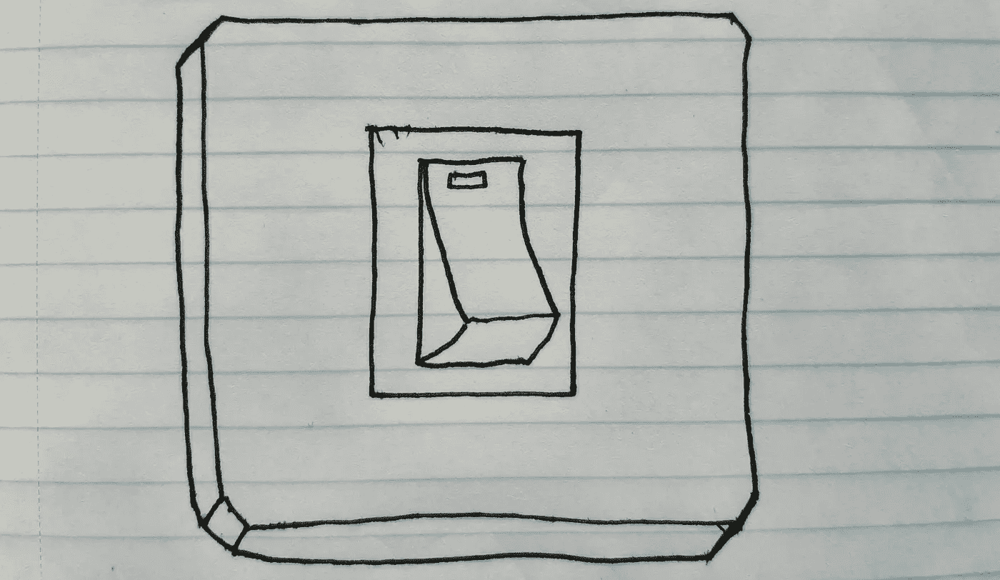
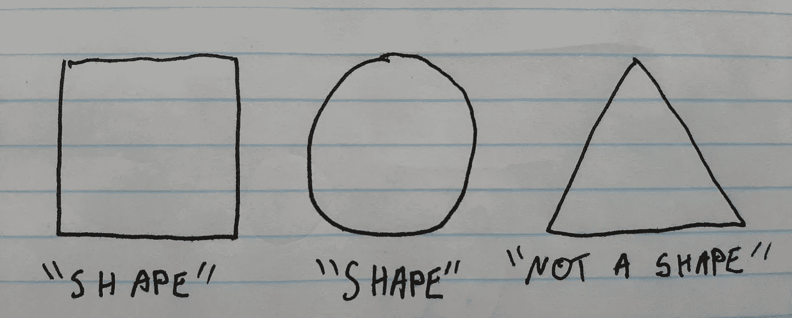
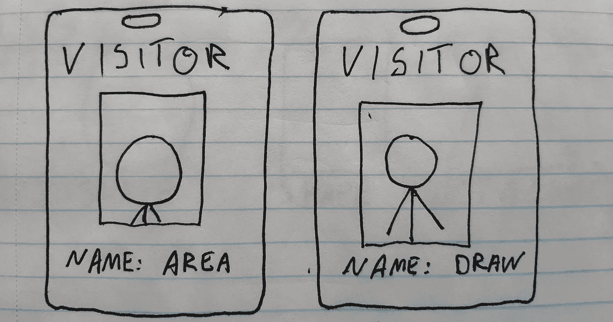

# 使用“开关”不是反模式

> 原文：<https://javascript.plainenglish.io/using-switch-is-not-an-anti-pattern-d8d03ac8ebc3?source=collection_archive---------5----------------------->



It’s a switch. Use it.

# 摘要

*   基本枚举上的 Switch 语句有很多缺点。
*   许多限制可以通过使用动态调度或访问者模式来克服，这取决于您的用例。
*   在本地支持 sum 类型的语言中，考虑使用这些类型而不是 visitor 模式。

# 介绍

我最近看过几篇文章，认为`switch`语句(甚至`if`语句)是面向对象编程最佳实践的反模式。在某种程度上，这种情绪通常是好的，但我不认为这些文章真正讲述了完整的故事。让我们从函数式编程中吸取教训，找出什么时候使用`switch`是可以的。

我将在本文中使用 TypeScript，因为它支持所有必要的语言特性，并且通常非常易于阅读。

# 反对 switch 语句的论点



Trust me, it’s not.

在基本用法中，switch 语句通常非常有限，用于匹配整数，有时是字符串。假设我们有两个函数`draw`和`area`，它们可以取一个单位正方形(边长为 1)或一个单位圆(半径为 1)。使用 switch 语句，代码如下所示:

```
**enum** Shape {
    UnitSquare,
    UnitCircle
}**const** area **=** (shape: Shape) **=>** {
    **switch** (shape) {
        **case** Shape.UnitSquare:
            **return** 1;
        **case** Shape.UnitCircle:
            **return** Math.PI;
        **default**:
            **throw** **new** Error("not a shape");
    }
}**const** draw **=** (shape: Shape) **=>** {
    **switch** (shape) {
        **case** Shape.UnitSquare:
            console.log("drawing a unit square");
            **return**;
        **case** Shape.UnitCircle:
            console.log("drawing a unit circle");
            **return**;
        **default**:
            **throw** **new** Error("not a shape");
    }
}*// usage*
**const** doStuff **=** (shape: Shape) **=>** {
    console.log(area(shape));
    draw(shape);
}
doStuff(Shape.UnitSquare);
doStuff(Shape.UnitCircle);
```

这段代码有许多问题:

*   `enums`只是整数，所以你不能设置正方形的边长或圆的半径。
*   如果添加另一个形状，您必须搜索所有代码，以找到不能涵盖所有情况的 switch 语句。如果您错过了一个，您可能会得到运行时错误。

这段代码不好的原因可能更多。我会不情愿地承认它有一个好处:就其现状而言，代码非常容易阅读。没有魔法，它的布局方式非常清楚它的作用。

目前，我们有两个函数，每个函数都接受两个变量。我们可以交换一下，有两种变体，每种都有两种功能:

```
**interface** Shape {
    **area**: () **=>** **number**;
    **draw**: () **=>** **void**;
}**class** Circle {
    **private** radius: **number**; **constructor** (radius: **number**) {
        **this**.radius **=** radius;
    } area() {
        **return** Math.PI ***** **this**.radius ***** **this**.radius;
    } draw() {
        console.log("drawing a circle");
    }
}**class** Rectangle {
    **private** width: **number**;
    **private** height: **number**; **constructor** (width: **number**, height: **number**) {
        **this**.width **=** width;
        **this**.height **=** height;
    } area() {
        **return** **this**.width ***** **this**.height;
    } draw() {
        console.log("drawing a rectangle");
    }
}*//usage*
**const** doStuff **=** (shape: Shape) **=>** {
    console.log(shape.area());
    shape.draw();
}doStuff(**new** Circle(2));
doStuff(**new** Rectangle(2, 5));
```

我们提供了一个接口，而不是一个`enum`。`Circle`和`Rectangle`类实现了这个接口。这解决了最初提出的两个目标:

*   `Circle`有半径，`Rectangle`现在有高度和宽度。
*   我们可以轻松地添加新类型的形状，而不必到处修改 switch 语句。

所以一切都很好，我们可以收工了，对吗？

# 游客

在我知道第二种形式是编写特定代码的最佳方式之前，我必须问一个关于我的程序的未来的问题: ***我是否更有可能向*** `***Shape***` ***接口添加新方法，或者我是否更有可能添加新类型？对于本文的其余部分，我将假设您更有可能添加新的行为而不是新的类型。如果这不是你的用例，那么你可以停止阅读，使用如上所示的界面，对`switch`说再见。如果你不确定，那么继续阅读，你可能会学到一些新东西。***



I’m just here to fix the elevator.

向一个接口添加更多类型很容易:只需定义一个新类并实现该接口。您不必修改任何现有代码，只需添加新功能即可。但是，如果你想给`Shape`接口添加一个新方法，那么*每一个实现*T3 的类都需要修改。

与我们使用 switch 语句的第一个代码示例相比。添加一个方法很容易，但是添加一个新的类型需要修改所有现有的代码。

与第二个例子相比，第一个例子具有完全相反的好处。然而，为了解决第一个例子的一些其他限制，一个 OO 爱好者可能会认识到我们可以使用访问者模式:

```
**interface** ShapeVisitor**<**T**>** {
    circle: (circle: Circle) **=>** T;
    **rectangle**: (rectangle: Rectangle) **=>** T;
}**interface** Shape {
    **visit**: **<**T**>**(visitor: ShapeVisitor**<**T**>**) **=>** T;
}**class** Circle {
    **radius**: **number**; **constructor** (radius: **number**) {
        **this**.radius **=** radius;
    } visit **<**T**>**(visitor: ShapeVisitor**<**T**>**) {
        **return** visitor.circle(**this**);
    }
}**class** Rectangle {
    **width**: **number**;
    **height**: **number**; **constructor** (width: **number**, height: **number**) {
        **this**.width **=** width;
        **this**.height **=** height;
    } visit **<**T**>**(visitor: ShapeVisitor**<**T**>**) {
        **return** visitor.rectangle(**this**);
    }
}**const** area: ShapeVisitor**<number>** **=** {
    circle: (circle) **=>** Math.PI ***** circle.radius ***** circle.radius,
    rectangle: (rectangle) **=>** rectangle.width ***** rectangle.height
}**const** draw: ShapeVisitor**<void>** **=** {
    circle: (_circle) **=>** console.log("drawing a circle"),
    rectangle: (_rectangle) **=>** console.log("drawing a rectangle")
}*// usage***const** doStuff **=** (shape: Shape) **=>** {
    console.log(shape.visit(area));
    shape.visit(draw);
}doStuff(**new** Circle(2));
doStuff(**new** Rectangle(2, 5));
```

访问者模式相当复杂，但它确实有效。

*   圆有半径，矩形有边长。
*   无需修改现有代码即可添加新功能。
*   (奖金福利！)如果我们添加了一个新的变体(比如说我们添加了一个三角形)，那么编译器会给所有的访问者指出我们需要修改代码的地方，直到我们修复了代码才会编译。

访问者模式实际上是从函数式编程书籍中抽出的一页:它是伪装的 sum 类型的教会编码。这听起来像是胡言乱语，但对我们人类来说，这意味着我们可以更简洁地编写访问者示例。请注意，我不赞成在有用的程序中使用教会编码，但我想把它包括在内，以证明它是多么不可读:

```
**interface** ShapeVisitor**<**T**>** {
    circle: (radius: **number**) **=>** T;
    **rectangle**: (width: **number**, height: **number**) **=>** T;
}**interface** Shape {
    **<**T**>**(visitor: ShapeVisitor**<**T**>**): T;
}**const** Circle **=** (radius: **number**): Shape **=>** 
    ({ circle }) **=>** circle(radius);
**const** Rectangle **=** (width: **number**, height: **number**): Shape **=>** 
    ({ rectangle }) **=>** rectangle(width, height);**const** area: ShapeVisitor**<number>** **=** {
    circle: (radius) **=>** Math.PI ***** radius ***** radius,
    rectangle: (width, height) **=>** width ***** height
}**const** draw: ShapeVisitor**<void>** **=** {
    circle: () **=>** console.log("drawing a circle"),
    rectangle: () **=>** console.log("drawing a rectangle")
}*// usage***const** doStuff **=** (shape: Shape) **=>** {
    console.log(shape(area));
    shape(draw);
}doStuff(Circle(2));
doStuff(Rectangle(2, 5));
```

在这个例子中，我们放弃了类，而是使用闭包。这具有访问者模式的所有优点，但是更不可读。教会编码不是编程的好方法。

# 总和类型

在上面的例子中，我们提到了“求和类型”。sum 类型可以是这样或那样的东西。例如，`boolean`是`true`和`false`的和类型，因为它可以是`true`也可以是`false`。`Shape`也是一个 sum 类型:它可以是`Circle`也可以是`Rectangle`。

在上面的例子中，我们对 sum 类型使用了“教堂编码”。当您的语言本身不支持 sum 类型时，Church 编码是一种可以使用的方法。幸运的是，TypeScript *不支持 sum 类型，所以我们更喜欢:*

```
**type** Shape **=** Circle **|** Rectangle**interface** Circle {
    **variant**: 'circle';
    **radius**: **number**;
}
**const** Circle **=** (radius: **number**): Circle **=>** {
    **return** { variant: 'circle', radius };
}**interface** Rectangle {
    **variant**: 'rectangle';
    **width**: **number**;
    **height**: **number**;
}
**const** Rectangle **=** (width: **number**, height: **number**): Rectangle **=>** {
    **return** { variant: 'rectangle', width, height };
}**const** unreachable **=** (_x: never) **=>** {};**const** area **=** (shape: Shape) **=>** {
    **switch** (shape.variant) {
        **case** 'circle':
            **return** Math.PI ***** shape.radius ***** shape.radius;
        **case** 'rectangle':
            **return** shape.width ***** shape.height;
        **default**:
            **return** unreachable(shape);
    }
}**const** draw **=** (shape: Shape) **=>** {
    **switch** (shape.variant) {
        **case** 'circle':
            console.log("drawing a rectangle");
            **return**;
        **case** 'rectangle':
            console.log("drawing a circle");
            **return**;
        **default**:
            **return** unreachable(shape);
    }
}*// usage***const** doStuff **=** (shape: Shape) **=>** {
    console.log(area(shape));
    draw(shape);
}doStuff(Circle(2));
doStuff(Rectangle(2, 5));
```

有趣的`unreachable`函数被用作静态断言。如果存在到达`unreachable`函数的有效代码路径，程序将不会编译。我们不再需要在切换分支中抛出错误，因为编译器可以静态地确定默认分支永远不会被执行。这意味着如果你添加了一个新的变量(比如一个三角形),程序不会编译，除非你修改了所有相关的`switch`语句。

# 结论

我们又兜了一圈。我们经历了漫长的旅程，但我们又回到了`switch`声明。上面的代码本质上具有原始 visitor 示例的所有优点，因为语义上它们描述的是同一件事。

*   我们从 enum 上的交换机开始，发现它有很多缺点。
*   我们可以通过使用访问者模式来解决这些缺点。
*   visitor 模式是一种在不支持 sum 类型的语言中使用 Church 编码来描述 sum 类型的方法。
*   在支持 sum 类型的语言中，考虑直接使用它们。

第一个和最后一个示例之间的区别是:

*   switch 语句匹配 sum 类型的变量，而不是基本的`enum`。
*   由于`unreachable`功能，switch 语句是详尽的。

因此，如果你的语言支持 sum 类型，并且你认为你更有可能向现有类添加新功能，而不是添加新类型，那么考虑使用`switch`。

# 离别赠言

在本身不支持 sum 类型的语言中，不要害怕使用访问者。毕竟，这是一种公认的设计模式。如果您发现自己需要基于类型进行分支，或者需要使用向下转换，那么可以考虑使用访问者作为替代。

这篇文章最初发表在安德鲁的记事本上