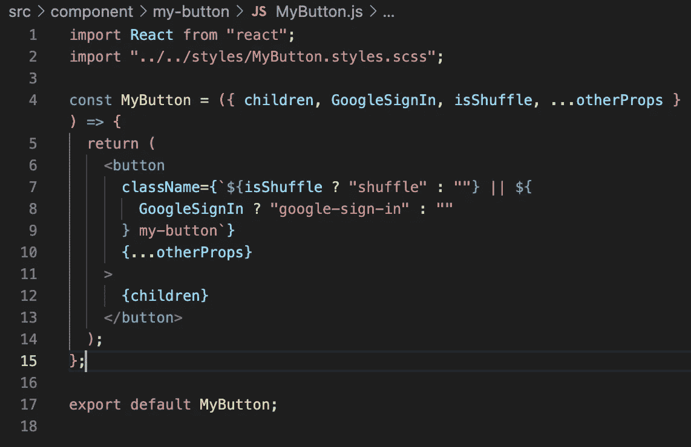
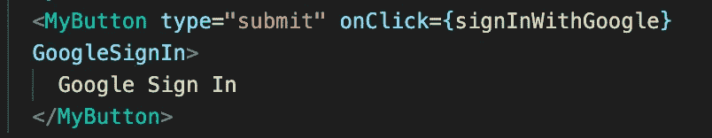

# 使用动态和可重用 React 组件的子道具

> 原文：<https://javascript.plainenglish.io/using-the-children-prop-for-dynamic-and-reusable-components-e079639ac78f?source=collection_archive---------17----------------------->

Photo by [Ferenc Almasi](https://unsplash.com/@flowforfrank?utm_source=medium&utm_medium=referral) on [Unsplash](https://unsplash.com?utm_source=medium&utm_medium=referral)

作为一个相对较新的程序员，保持代码干爽并不总是我的第一本能(不要重复自己)。我希望事情现在就开始运作。但我知道，从长远来看，这种不耐烦会反过来咬我一口。

对我来说，以后再来的心态的问题是，如果我一直推迟重构重复的或混乱的代码，我最终将有一个难以想象的长列表需要重写，并且可能会有更多令人头痛的重新布线，因为我的应用程序随着我的拖延而继续增长。

我现在尝试在计划中更加谨慎，特别是关于我的代码的哪些部分是可重用的。React 应用程序的魅力很大程度上来自于您可以轻松导入和重用组件。

为了演示这种易用性，同时保持执行的动态性，我将展示一个定制的按钮组件。我认为这是展示 React 模块化本质的一个完美例子。几乎所有的应用程序都有按钮，无论是导航、登录还是注销，这只是其中的一小部分。

因为您知道您的应用程序将有许多按钮，所以您可以创建一些通用样式，然后根据特定按钮的需要有条件地呈现类。

如果你使用像 Bootstrap 或 Material UI 这样的库来放入你的按钮，这可能会有点棘手，因为它们通常有自己的类来定义颜色等，但是也有方法来个性化这些功能。

为了演示几个可重用性的实例，下面是我的塔罗牌 React 应用程序中的 MyButton 组件。

根据 [React 文档](https://reactjs.org/docs/composition-vs-inheritance.html)，通过将特殊子属性传递到组件的输出，其他组件可以“通过嵌套 JSX 将任意子属性传递给它们”这个建议来自于 React 创建者对复合而非继承的偏爱。

任何传入 <mybutton>JSX 的东西，例如 GoogleSignIn，都会作为子道具传入 MyButton 组件。现在，由于 MyButton 在按钮内部输出{children}，所以道具出现在最终输出中。</mybutton>

注意:实际上是 props.children，但是我已经将我的道具进行了析构，所以我不必一遍又一遍地写“propes”——为了让事情保持干燥。

现在，这个带有 GoogleSignIn prop 的 MyButton 将通过插值获得“google-sign-in”类名，采用与其他按钮不同的背景和悬停颜色，正如我的样式表所概述的那样。

起初，把孩子当作道具有点难以理解，但这就是 React 的创建者推荐的构造可重用组件的方式。他们说，当你事先不知道内容时，这是特别有用的，例如，侧边栏和对话框会根据页面或用户而变化。

感谢您的阅读，我希望您发现这是有用的。

*更多内容尽在*[*plain English . io*](http://plainenglish.io/)