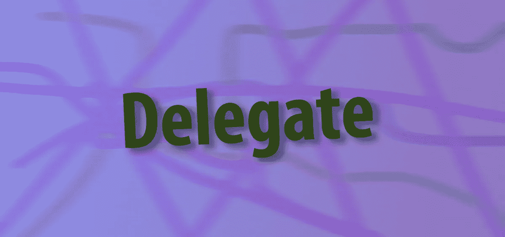
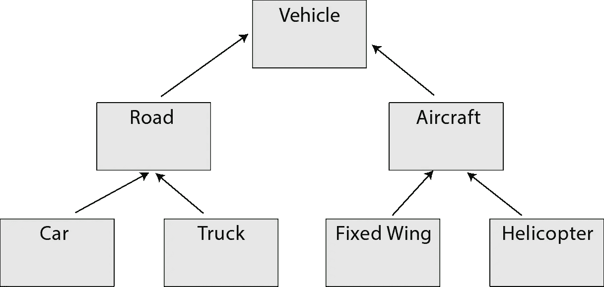
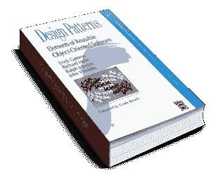

# 在 JavaScript 中使用继承委托模式

> 原文：<https://javascript.plainenglish.io/using-the-delegation-pattern-over-inheritance-in-javascript-e11ec72b2b82?source=collection_archive---------6----------------------->



Photo Illustration by David Fekke

*原发布于*[*https://fek . io*](https://fek.io/blog/using-the-delegation-pattern-over-inheritance-in-java-script/)*。*

实际上，有时您希望在应用程序中使用对象继承。我见过很多通过对象继承来扩展生命周期 API 的应用程序。

继承是软件开发人员扩展现有功能和向现有基类或对象添加属性的一种方式。将数据建模为对象时，创建对象图是很常见的，其中一个对象可能是基本对象的孙或曾孙。



举个例子，我们可能有一个`Person`对象，它是一个父对象。我们可以创建扩展了`Person`对象的`User`对象。我们可能还有一个扩展了`User`对象的`AdminUser`对象。我对`Person`对象所做的任何更改都将被`User`和`AdminUser`对象自动继承。

继承的副作用之一是，如果我们对基本对象的定义进行了更改，它现在就与整个对象链紧密耦合。这可能会产生所谓的脆弱基类问题。另一个问题是，如果我们试图使用继承给我们的对象添加功能，在大多数通用语言中，我们只能从一个对象继承。C++是少数允许开发人员进行多重继承的语言之一。C#、Objective-C、Java、Swift 等语言只允许单一继承。

# 委托模式

当我开始学习 Objective-C 时，我接触到的一种模式是委托模式，这种模式在苹果的很多 API 中都很常见。这类似于四人帮设计模式一书中提到的观察者模式。



Objective-C 是一种由 Next Computer 流行起来的语言，Next Computer 是史蒂夫·乔布斯离开苹果时创办的公司，他在 1996 年将该公司卖回给了苹果。Next 采用 Objective-C 作为他们的默认语言，因为它可以用来创建面向对象的应用程序和框架，但它也允许开发人员使用现有的 C 代码。

因为 Objective-C 只允许单一继承，苹果开发了很多 API 来利用委托模式。这个想法很简单。如果开发人员在程序中编写一个类，并且他们需要消耗网络或数据库服务器资源，他们可以创建 API 类的实例，并使他们的类成为该对象的委托。如果您在单线程上等待响应，进行网络调用可能是一个阻塞过程。通过将线程封装到 API 中，苹果能够抽象出许多进行网络调用的复杂性。消费者所要做的就是在他们的类上实现某些方法来使用来自网络 API 的结果，并将他们的类设置为网络类的`delegate`。

今天，苹果有很多现代的 API，它们使用闭包和块以非阻塞的方式处理网络请求，但是委托模式仍然在它们的很多 API 中使用。

# 继承 JavaScript 中的功能

假设我们有一个正在创建的对象，它需要将一些工作卸载给另一个对象，然后需要在另一个对象完成任务后调用一个函数。一种方法是从父对象继承该功能。在这个例子中，我们创建了两个对象，一个叫做`parent`，另一个叫做`child`。`child`将把它的一些工作卸载给`parent`对象。`parent`对象将具有名为`doWorkForChild`、`setStatus`和`sayHelloToMe`的函数。

`child`对象将继承`parent`对象的方法，但是我们将覆盖`setStatus`函数的功能，并为`start`和`print`添加函数。

然后我们将把`child`的原型设置为`parent`，这样我们就可以继承`parent`的功能。

```
child.prototype = Object.create(parent.prototype);
```

现在我们可以为每个对象定义函数了。

从上面的例子中我们可以看到，我们已经覆盖了子对象上的`setStatus`函数，因此它使用`console.log`打印`status`参数。

为了运行这个例子，我们需要创建一个`child`对象的新实例，并在这个实例上调用`start`函数。

# 使用委托模式解耦对象

让我们将`parent`对象中的功能放入一个名为“worker”的新工厂函数中。

正如你所看到的，这个函数创建了一个对象，其功能与我们之前在`parent`对象中创建的相同。这里的主要区别是我们有一个名为`delegate`的变量，我们用它来存储对委托对象的引用。现在我们需要创建一个对象来观察从`worker`对象发出的调用。

正如你在上面的例子中看到的，我们正在创建一个委托对象的实例变量。然后，我们将这个委托实例分配给 worker 对象中的 delegate 属性。一旦工作者有了这个引用，它现在就可以调用委托对象上的函数。

现在，我们所要做的就是启动代理对象，开始观察来自 worker 对象的响应。

# 替代方法

JavaScript 的奇妙之处在于有多种方法可以达到相同的结果。我们可以通过使用回调或事件监听器来做上面做的事情。很多现代的 JavaScript APIs 你可以结合使用`Promises`和`async/await`来达到同样的效果。

# 结论

委托模式是从基本对象继承功能的一个很好的选择，它允许开发人员同时观察多个对象。如果您需要将许多不同的生命周期事件连接到一个 API，而不需要使用实际的事件监听器，这也是一个很好的模式。

 [## davidfekke/delegate 示例

### 要运行这些示例，请确保安装了 Node.js 14 或更高版本。若要运行继承示例，请使用…

github.com](https://github.com/davidfekke/delegateexample) 

*更多内容请看*[*plain English . io*](http://plainenglish.io/)