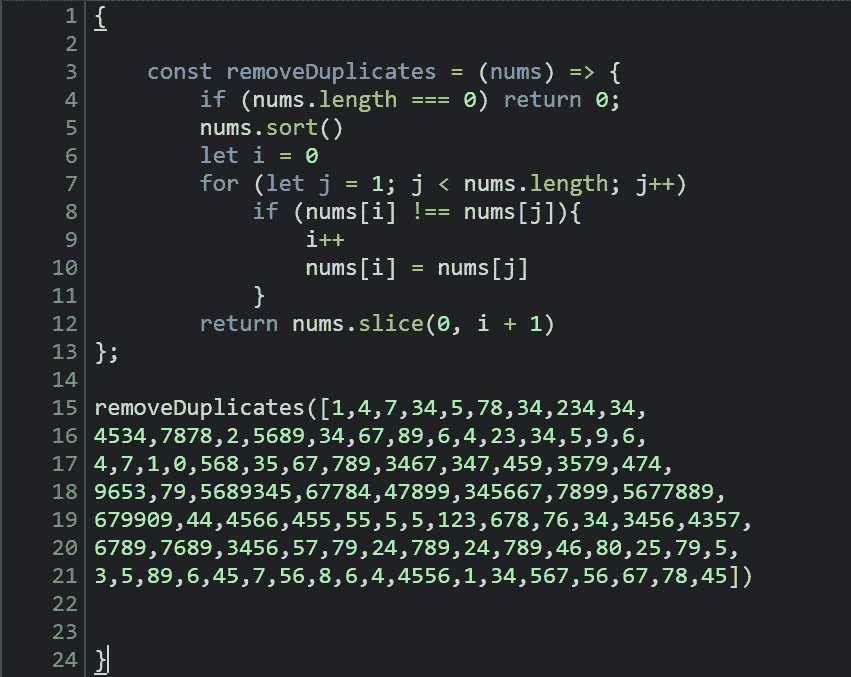
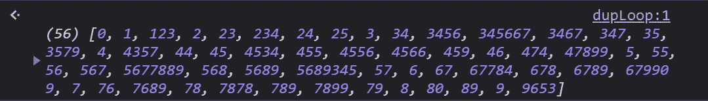
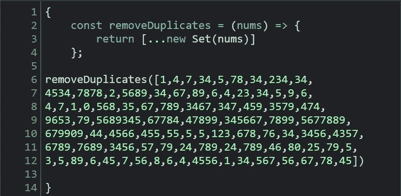
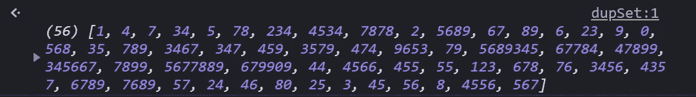
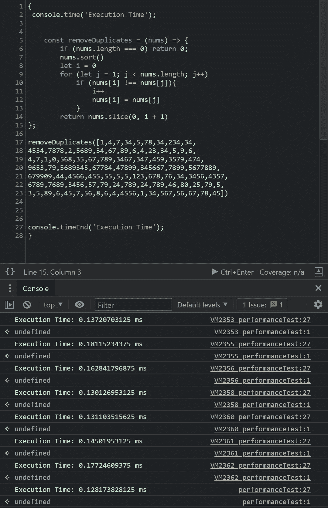
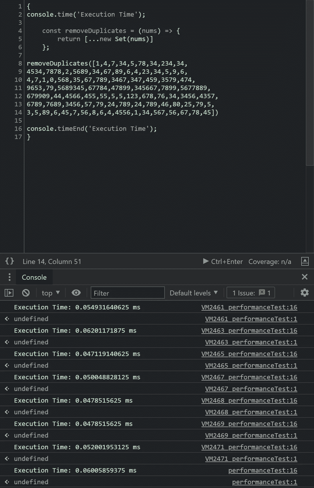

# 使用 JavaScript 集合从数组中返回唯一元素

> 原文：<https://javascript.plainenglish.io/using-the-javascript-set-constructor-to-return-unique-elements-from-an-array-5de697df3882?source=collection_archive---------18----------------------->

## 使用 JavaScript Set 构造函数从数组中返回唯一元素

`Set`是一个可迭代的对象，它保存了一个唯一值的集合。数组也是保存值集合的可迭代对象，但数组中的值不必是唯一的。我们可以使用`Set`构造函数从一个数组创建一个新的`Set`，只返回该数组的唯一值。这种删除重复的方法与迭代循环方法相比如何？让我们仔细看看这两个选项，找出答案。

**问题:**我们只需要一个大数组中的唯一值。

一个非常可靠的解决方案是构建一个多点迭代函数，该函数对数组进行变异，并返回数组中包含唯一元素的部分。类似这样的东西👇

…以及返回值

正如我们所期望的那样，这将返回一个唯一值的数组，并且时间复杂度为 O(n)。这是一个很好的解决方案，可以在各种各样的应用程序中工作，但是让我们看看另一个选项。

如本文开头所述，我们还可以使用`Set`构造函数从数组中创建一个新的`Set`。我们可以使用这个`Set`只返回该数组的唯一值。让我们看看那是什么样子。

…返回值

如你所见，返回值看起来非常相似，唯一的区别是它没有被排序。但是从性能上来说比较怎么样呢？通过检查每个函数运行的时间，我们可以从很高的层面来看这个问题。这可以通过使用`console.time()`和`conlosle.timeEnd()`来完成。让我们看看他们是如何比较的。

首先，我们的循环:

不算太坏。运行该函数几次后，看起来我们的迭代循环需要大约 0.15 毫秒来返回给定数组中的唯一值。

那么使用`Set`构造函数来完成同样的事情呢？

看起来 0.05 毫秒是`Set`构造函数用相同的输入完成相同任务的平均时间。这比我们的迭代循环方法快 300%！

# 结论

使用`Set`构造函数不仅速度快了三倍，而且使用的代码行更少，在我看来，它比迭代循环方法更易读。这在技术面试中可能行不通(完全应该如此)，但是我知道我将在实际应用中使用哪种方法。我希望这能有所帮助，并给你一个学习 JavaScript `Set`的好起点。开心快乐编码！

*更多内容尽在*[***plain English . io***](http://plainenglish.io)