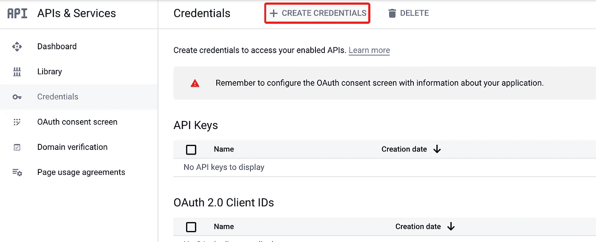

# 使用新的谷歌分析 API 获得最受欢迎的页面

> 原文：<https://javascript.plainenglish.io/using-the-new-google-analytics-api-to-get-most-popular-pages-13e1ce314ddf?source=collection_archive---------13----------------------->

获得你的网站或应用程序上最受欢迎的页面列表通常是有用的，要么用于分析，要么用于构建 UI 元素，向用户显示你最受欢迎的内容是什么。在过去，点击计数器可能被用来跟踪你最受欢迎的网页。

然而，在现代世界中，使用谷歌分析 API 要容易得多。由于谷歌最近将分析更新为“谷歌分析 4”，并改变了 Javascript API，我想我应该在我的网站上写一篇关于我如何做到这一点的指南。在本教程中，我将使用**节点**

**注意:这只适用于新的谷歌分析 4，**，不适用于旧版本的谷歌分析。

# 谷歌分析 API

如上所述，最近谷歌已经将我们所有人升级到新版本的谷歌分析，简称为“谷歌分析 4”。该数据模型与旧版本的谷歌分析完全不同，谷歌利用这一机会对其 API 进行标准化，以与它用于其他服务的 API 保持一致。

这个 API 是有文档记录的，但是它是实验性的，所以它可能会改变。然而，我认为这里使用的高级概念将保持不变，Google Analytics 本身的数据模型也是如此。

# 步骤 1:创建一个谷歌服务账户

许多来自非传统技术背景的程序员或开发人员在想到“服务帐户”时经常害怕地逃避，但它本质上是一个可以登录服务为你做动作的帐户，而不需要人类。要制作一个:

1.  转到[谷歌开发者控制台](https://console.developers.google.com/)创建一个新项目，如果你还没有的话。
2.  在左侧，点击**凭证**，然后**创建凭证**。选择“服务帐户”作为凭据类型。填写详细信息，然后单击完成。

现在返回到“凭据”页面，您应该会看到一个新的服务帐户。点击它，并导航到“钥匙”。**在该页面中，单击“添加密钥”，然后创建一个 JSON 密钥。**

**太好了，现在下载密钥，并妥善保管。我们以后会需要它。**

然后导航回项目主页，在顶部搜索栏中搜索“Google Analytics Data API”。为您的项目启用此服务。请注意，如果您使用的是旧版本的 Analytics，则需要不同版本的 API。小心你选择正确的谷歌分析 4:

Make sure you pick the right API!

最后，将您的服务帐户添加到 Google Analytics 的管理部分的 Google Analytics 属性中。您可以点击“**物业用户管理**，如下图所示，点击蓝色大加号，选择“**添加用户**”。

添加您的服务帐户电子邮件地址。你只需要给它“**读取和分析**的权限。

# 步骤 2:链接到 API

既然我们已经解决了内务，我们需要使用新的谷歌分析测试客户端。如前所述，有一个新的 API，可能会有变化，但现在不会影响到我们。确保你安装了正确的软件包:**NPM I @ Google-analytics/data**

下面的“key.json”文件指的是您将从 Google 服务帐户下载的密钥。

现在我们有了一个经过验证的分析对象，可以用来 ping Google Analytics 和检索数据。对于本教程，我将从 Fjolt 获得上个月最受欢迎的帖子。我写的所有博客文章都以'/article/'开头，所以我们可以很容易地分离出我们想要的。

# 步骤 3:获取分析数据

首先，让我们获取过去 31 天的数据，并将其传递到分析报告对象中。有关更多详细信息，请参见代码中的注释。 ***注意*** 您还需要将下面的 propertyId 更新为您的 ***Google Analytics 属性 ID* 。这可以在谷歌分析的“属性设置”下的管理部分找到。**

当数据进来时，它将在“响应”变量中。我们希望对此进行一些更改，因为:

*   这个数据**将包含不是博客文章的 URL。**
*   **这些数据还将包含从其他网站重定向的 URL，**其中可能包含查询字符串和奇数字符。

因此，我们必须首先**将我们的搜索限制在以“/article/”**开头的 URL，然后**去除 URL 上的任何干扰。**整理这些数据需要一个比我预期的更大的函数，但本质上是将原始分析数据整理成一组按浏览量排序的 **'/article/'** 。我只想要前 7 名，但你可以随意调整。

您可能需要根据自己的需要稍微调整这一点:

# 步骤 4:创建一个用户界面

下一步完全取决于你。根据这些数据，我想创建一个简单的 UI，在我的页面上实时显示最受欢迎的文章。

我的简单 UI 看起来有点像这样，它在 html 变量中返回，以便在您需要的地方使用。

## 第五步:放松

在这之后，我们有了一个基于实时 Google Analytics 4 数据的简单且最受欢迎的小部件。最终的代码可以在这里找到，演示可以在我的网站上找到，T2 Fjolt。

## 结论

如果你喜欢这个，也请考虑在[推特](https://twitter.com/smpnjn)上关注我！