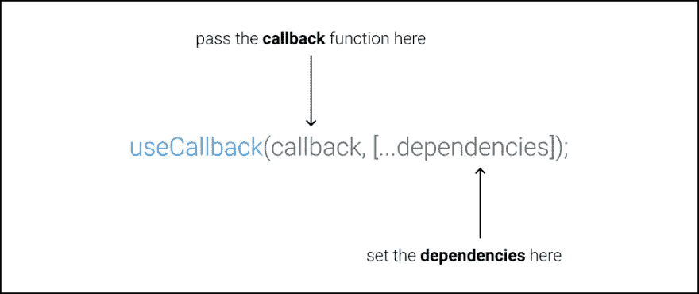

# 使用 useCallback React 挂钩

> 原文：<https://javascript.plainenglish.io/using-the-usecallback-react-hook-1145e957518c?source=collection_archive---------8----------------------->



useCallback React 挂钩是一个有用的挂钩，可以帮助优化我们的函数式 React 组件的呈现性能。它用于记忆函数，这意味着它缓存给定一组输入参数的函数的返回值。

# 语法

```
const memoizedCallback = useCallback(
  () => {
    functionToBeMemoized(arg);
  },
  [arg],
);
```

正如我们所看到的，useCallback React 钩子接受一个内联函数及其依赖项作为参数，并返回该函数的一个记忆版本。只有当传递的依赖项之一发生变化时，返回的记忆化函数才会发生变化。因此，如果输入参数相同，则保证具有相同的参考值。

当我们希望将回调作为道具传递给子组件，并希望优化组件以避免重新渲染时，这很有用，因为 React 依赖于道具的引用相等性。对于给定的一组参数，记忆化的函数将具有相同的引用，从而避免重新呈现。

在我们进入 useCallback React 钩子的应用之前，我们应该知道 React 本身是相当快的，我们应该避免任何过早的优化，并且只在我们需要的时候使用这个钩子。

与 [useEffect](https://www.wisdomgeek.com/development/web-development/react/understanding-the-useref-react-hook/) 依赖项一样，如果我们传入一个空的依赖项数组，那么记忆化的函数只计算一次。它将在组件的整个生命周期中存储相同的引用。

# 使用 useCallback React 挂钩

让我们考虑这样一个组件，它涉及大量的计算，并且重新渲染的成本很高:

```
const ExpensiveToComputeComponent = () => {
 // expensive computation
};
```

如果这个组件接受一个处理函数作为道具，并且父组件在处理函数中提供给它:

```
 const App = () => {
  const handler = () => {
  // do something
  };
  return <ExpensiveToComputeComponent handler = {handler} />;
}
const ExpensiveToComputeComponent = ({handler}) => {
 // expensive computation
};
```

任何时候应用程序被重新渲染，那么昂贵的计算组件也会被重新渲染。这是因为我们以处理程序的形式提供了回调函数。每次重新呈现应用程序时，对它的引用都会改变。

即使我们使用 [React.memo](https://www.wisdomgeek.com/development/web-development/react/using-react-memo-in-react-16-6/) 来记忆昂贵的组件:

```
const ExpensiveToComputeComponent = React.memo(({handler}) => {
 // expensive computation
});
```

结果会是一样的。重新呈现发生是因为处理函数在改变，而 memo 不会改变它。为了保持处理程序回调函数不变，我们需要使用 useCallback React 钩子。

```
const App = () => {
  const handler = useCallback(() => {
  // do something
  }, [dependencies]);
  return <ExpensiveToComputeComponent handler = {handler} />;
}
```

同样需要注意的是，如果依赖项也是动态的(引用类型)，那么 useCallback React 钩子的返回值也将是动态的。所以我们要么想让它们成为值类型，要么再次对它们使用 useCallback。尽管建议避免嵌套回调，并且有更好的方法来处理这个问题。还建议安装 [eslint-plugin-react-hooks 插件](https://www.npmjs.com/package/eslint-plugin-react-hooks)以避免此类问题并实施最佳实践。

总之，useCallback React 钩子在记忆函数中是有用的。获得性能增益是有用的，但应该明智地使用。在开始优化之前，我们应该使用分析器。正如我们所看到的，当与 React Memo API 结合使用时，它会大放异彩。

如果您有任何疑问，或者对我们接下来应该涵盖的内容有任何建议，请在下面留言，让我们知道！

*原载于 2021 年 1 月 28 日*[](https://www.wisdomgeek.com/development/web-development/react/using-the-usecallback-react-hook/)**。**