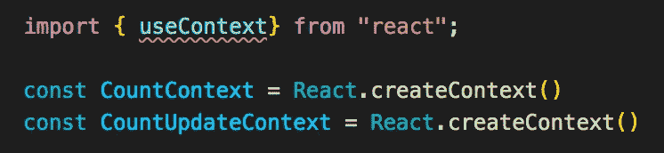
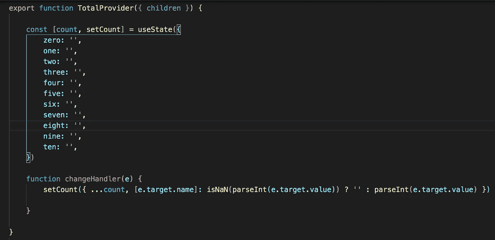
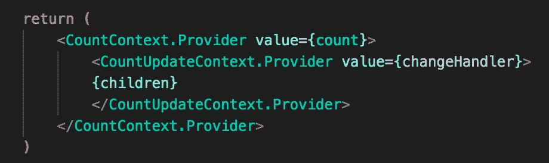
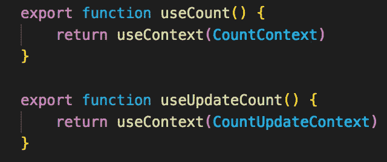
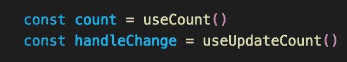
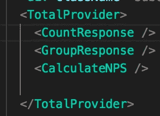

# 在 React 中使用“useContext”钩子:Redux 的一个更简单的替代方法

> 原文：<https://javascript.plainenglish.io/using-the-usecontext-hook-in-react-a-more-simple-alternative-to-redux-519c55536ddb?source=collection_archive---------7----------------------->

## 关于如何在 React 应用程序中使用这个简单而强大的钩子的演练

Photo by [Ferenc Almasi](https://unsplash.com/@flowforfrank?utm_source=medium&utm_medium=referral) on [Unsplash](https://unsplash.com?utm_source=medium&utm_medium=referral)

React hooks 为我们的功能组件提供了更多的能力——与类组件相比，react hooks 成为最近构建应用程序的一种更受欢迎的方法。

useContext 挂钩没有什么不同，但同样重要的是要注意，与一些更常见的 React 挂钩(如 useState 和 useEffect)相比，它的操作稍有不同。

本周，我得到了一个带回家的评估，重新创建一个流行网站的功能和设计，以计算你的 NPS(净推广分数)。

*欣喜的 NPS 计算器:*【https://delighted.com/nps-calculator】T2

正如您在网站上看到的，每一行的输入都依赖于其他行的条目。用户在第一行输入分数，然后在第二行进行分组，最后在第三行进行计算。

基于这种行为，我们可以推断出我们需要一种方法来跟踪状态以及更新我们的状态。虽然我们*可以*从我们的父组件传递道具或者使用 redux 进行状态管理，但是这种类型的应用*要求我们使用所谓的 useContext 钩子。*

在我们在代码编辑器中引入钩子之前，让我们快速回顾一下什么是 useContext 钩子。

# 什么是使用上下文？

useContext 挂钩是我们访问数据的一种更简单的方式，比如我们的函数和状态。

让我们想象一下我在 React 中链接的 web 应用程序的结构。我们有一个父组件，其中包含不同级别的子组件。

现在，想象将数据从最上面的组件一直传递到最后一个子组件。

正如我们所知，我们通过所谓的 props 自上而下地将数据从一个组件传递到另一个组件。

可以想象，在数据到达需要它的组件之前，通过每个组件传递数据会非常麻烦。

您必须通过每个组件传递数据，通过它们的道具，直到到达最后一个子组件。无聊吧？

这就是 ***语境*** 来拯救的地方。

React 上下文 API 允许您轻松地访问组件树不同级别的数据，而不必通过 props 向下传递数据。

这是一种更简单的状态管理方法，特别是对于较小的 React 应用程序，只有少数组件需要访问数据。

因此，让我们来看看如何将它整合到我们的 React 应用程序中！

# useContext 是如何工作的？

***useContext*** 钩子提供了所有与上下文 API 相同的功能，只是打包成一个简单易用的钩子，可以在功能组件内部使用。

通过创建上下文，需要注意的是它提供了消费者和提供者，我们必须传递整个上下文对象。

我们可以通过使用***React . create Context .***在 React 中创建一个上下文对象。如果我们想给它一个初始值，我们可以在创建上下文时将它作为参数传入。如果没有，我们可以将其留空:

Remember to import useContext from react!

接下来，让我们创建我们的包装器组件，它将包装哪些组件可以访问我们的数据。我们称之为 TotalProvider。

我们还将使用 useState 钩子来创建我们的初始状态，并将我们的所有值设置为一个空字符串，以及一个更改处理程序来跟踪我们状态的任何更改。

我们还将创建几个自定义挂钩，并传入两个新创建的上下文:

正如您在上面的代码片段中看到的，我们将计数状态传递给 CountContext，将更改处理函数传递给 CountUpdateContext，这样我们就可以跟踪和更新对状态所做的任何更改。然后，我们创建几个定制挂钩，这样我们就可以在其他组件中访问我们的上下文。

The count variable now holds our count state, and handleChange holds our change handler

最后，不要忘记用我们的 TotalProvider 包装我们的组件，以便它可以访问我们的上下文和数据:

我们现在可以灵活地向我们的 TotalProvider 添加额外的上下文，其中的组件将可以访问数据，因为我们已经设置好了一切，因此我们不需要继续传递额外的 props 或向我们的 Redux 存储添加额外的层。

# 结论

虽然在 React 应用程序中有几种方法可以保存状态，但对于只有一个父组件和多层子组件的小型应用程序来说，useContext 是管理状态的好方法。

在大型应用程序中，传递每一级的属性是非常烦人和混乱的，或者设置 redux store 对于小型应用程序来说是非常复杂的，作为一种替代方法，useContext 允许我们轻松地让我们的组件访问数据，并给我们额外的灵活性来添加更多的数据，而不需要传递额外的属性。所有的跑腿工作基本上都是一扫而空！

在你的下一个项目中尝试一下，看看对你自己有什么好处。

下次见！

# 来源

Upmostly:如何在 React 中使用 useContext 钩子:
https://up mostly . com/tutorials/How-to-Use-the-Use context-Hook-in-React

*更多内容请看*[***plain English . io***](http://plainenglish.io/)