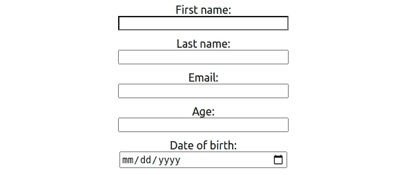
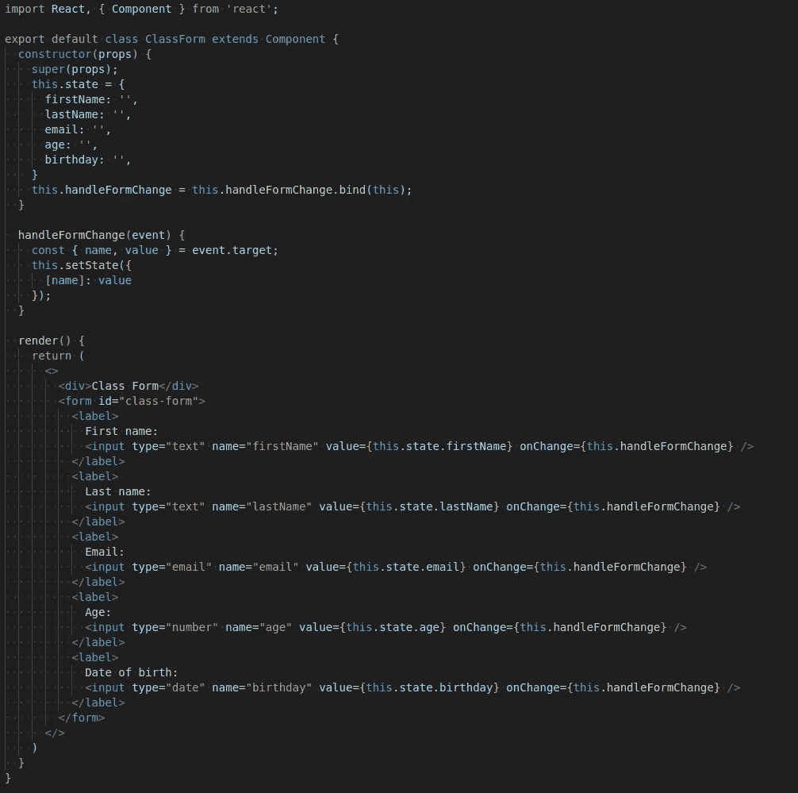
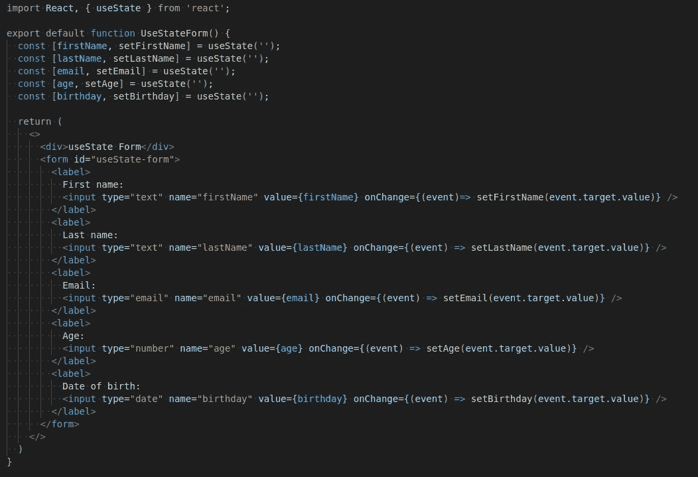
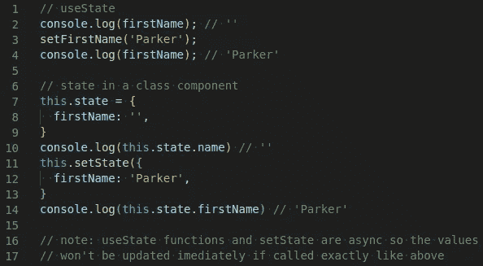
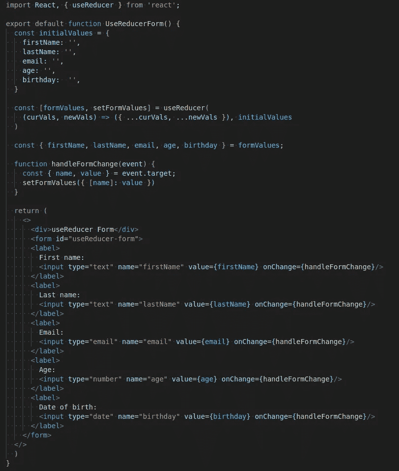

# 在 React 中为表单使用 useReducer

> 原文：<https://javascript.plainenglish.io/using-usereducer-for-forms-in-react-d80f297cfc0a?source=collection_archive---------3----------------------->


Yay hooks!

钩子太棒了。嗯，我想这取决于你说的是哪种挂钩，所以让我澄清一下。React 钩子很牛逼。它们简化了我们的 react 组件，并且极其强大和多样化。你可能已经尝试过使用像*使用状态*和*使用效果*这样的东西，或者你可能是一个老钩子专家！不管怎样，我希望我能和你分享一个新的独特的方法来简化(在我看来)你的表单。你的表单越大越复杂，useReducer 就变得越强大，但是仍然可以帮助你简化小表单中的代码。在本文中，我们将使用它作为示例表单:



Basic form

如果您是 hooks 的新手，请不要担心，在我们开始使用 *useReducer* 之前，我会尽力让您跟上进度。如果你已经是一个寻找新工具的钩子专家，请跳到下面的 *useReducer* 部分。

此演示的回购可在此处找到:

[](https://github.com/Parker-Stafford/useReducer-demo) [## 帕克-斯塔福德/useReducer-演示

### 这个项目是用 Create React App 引导的。在项目目录中，您可以运行:在…中运行应用程序

github.com](https://github.com/Parker-Stafford/useReducer-demo) 

请随意将它分支并克隆到您的本地机器上，并尝试一下！做一些测试，看看你最喜欢什么形式的风格。

# 使用状态与类组件

如果您以前从未使用过钩子，那么您可能正在用有状态类组件编写表单。上述表单的代码可能如下所示:



Class component form

这里，我们将所有表单值保存在 state 中，并使用 handleFormChange 进行跟踪。这一切都很好，但我想你不是来学习 React 中的类组件的。所以，让我们继续钩子！

要使用 *useState* 在功能组件中编写相同的表单，您的代码可能如下所示:



Functional component form with useState

[](https://reactjs.org/docs/hooks-intro.html) [## 介绍钩子-反应

### 钩子是 React 16.8 中的新增功能。它们允许您使用状态和其他 React 特性，而无需编写类。这个…

reactjs.org](https://reactjs.org/docs/hooks-intro.html) 

以上是 React 关于钩子的官方文档的链接。你可以在那里了解挂钩的所有好处。

这看起来比上面的类组件干净多了。让我们来分析一下这里发生了什么。 *useState* 是一个接受一个参数的函数:初始状态。它返回初始状态的值和一个可以更新它的函数。我们可以通过看上面的一个例子来分解它。

```
const [firstName, setFirstName] = useState('')
```

这里，初始状态是一个空字符串，分配给该值的变量名为 **firstName** ，更新该变量的函数名为 **setFirstName** 。为了更清楚地了解这段代码:



useState update vs. setState update

如果你还在跟进，剩下的表格就变得很简单了。不是每次表单改变都调用 *setState* ，而是调用从 *useState* 返回的特定更新函数，更新适当的变量。现在让我们看看如何用 *useReducer* 钩子创建同样的表单。

# 用户教育

下面是如何使用 *useReducer* 钩子创建上面的表单:



Functional component form with useReducer

[](https://reactjs.org/docs/hooks-reference.html#usereducer) [## 钩子 API 参考-反应

### 钩子是 React 16.8 中的新增功能。它们允许您使用状态和其他 React 特性，而无需编写类。这个…

reactjs.org](https://reactjs.org/docs/hooks-reference.html#usereducer) 

以上是 *useReducer* 的官方文档。去那里了解更多！

所以让我们来分析一下上面发生了什么。我们创建了一个 **initialValues** 对象，而不是像使用 *useState* 那样拥有多个状态变量。这是我们的初始状态。 *useReducer* 接受两个参数(可能需要更多的参数，详见上文)。第一个参数是 reducer 函数。二是初始状态。 *useReducer* 返回一对，就像 *useState 一样。*初始状态和一个将调用你的减速器函数的函数。因此， **formValues** 成为我们的状态容器， **setFormValues** 成为我们的更新函数。

**setFormValues** 将使用自动传入的当前状态(即 **formValues)** 以及我们提供的任何参数来调用我们的 reducer 函数。由于在我们的 reducer 函数中使用了 spread 操作符，我们可以简单地从表单中传递 **name** 属性和更新后的 **value** 并更新我们的 **formValues** 对象。使用 *useReducer* 允许我们在一个对象中保存所有的表单值。如果您将表单值发布到一个 API 或将它们传递到不同的组件中，这可能是有益的。你不必使用所有的*使用状态*变量来构建一个新的对象。它还通过在一个中央函数中执行这些更新，简化了对我们的 **formValues** 对象的任何更新。

所以你有它！React 中处理表单的三种可能方式。与代码中的所有东西一样，每一样东西都有优点和缺点。我鼓励你自己测试一下，找出最适合你的。