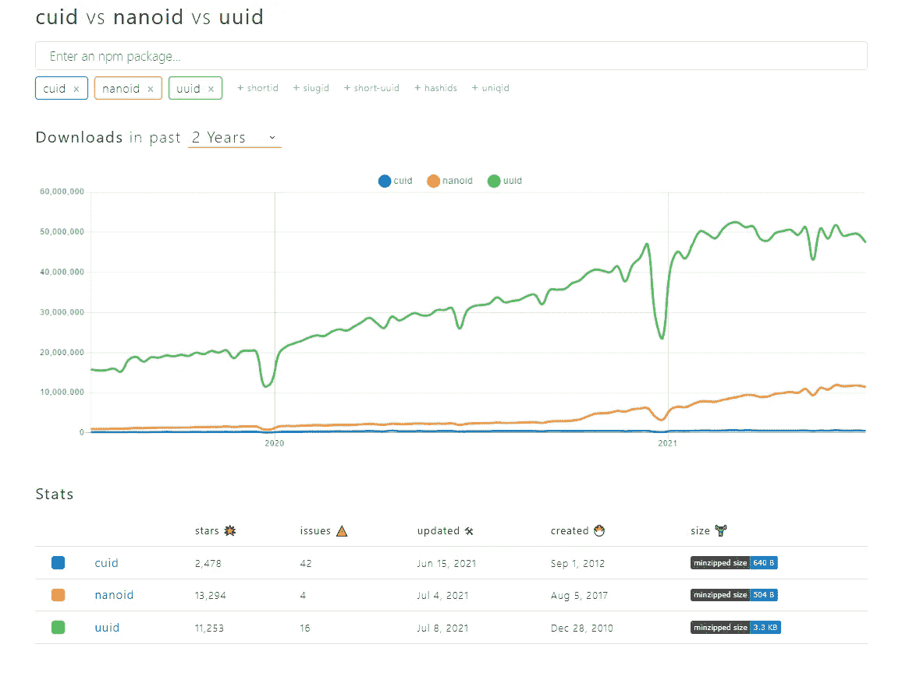

# UUID vs 纳诺德 vs CUID

> 原文：<https://javascript.plainenglish.io/uuid-vs-nanoid-vs-cuid-c4fc1502325b?source=collection_archive---------3----------------------->

## JavaScript 最好的 ID 生成器是什么


通用标识符广泛用于软件开发。它们有助于维护应用程序中记录的唯一性，因此开发人员无需担心重复。

因此，在本文中，我将讨论 JavaScript 中最常用的三种通用标识符。

# 1.UUID

UUID 是目前开发者中使用最多的通用标识符之一。

由于其罕见性和低重复率，UUIDs 被广泛用作数据库中的关联键或组织内部物理设备的 id。

## UUID 的特色

*   尺寸较小— 483 字节。
*   它没有依赖性，并且与“树摇动”打包程序配合得很好。
*   拥有自己的[CLI](https://github.com/uuidjs/uuid#command-line)——可以使用`npx uuid`命令轻松生成 UUIDs。
*   支持 CommonJS、 [ECMAScript 模块](https://github.com/uuidjs/uuid#ecmascript-modules)和 [CDN 构建](https://github.com/uuidjs/uuid#cdn-builds)和 NodeJS。
*   高度安全。
*   很好的文档。

**UUID 图书馆拥有超过 48，902K 的每周 NPM 下载量和 11.3K 的 GitHub stars。**

## 安装和使用

```
// You can easily get started with UUID using NPM:npm install uuid// Creating an ID:import { v4 as uuidv4 } from 'uuid';
uuidv4();
```

# 2.矮小的

Nanoid 是一个小型、安全、URL 友好、唯一的 JavaScript 库，用于生成唯一的 id。

最近，与 UUID 相比，NanoID 的使用急剧增加。大多数开发人员选择 NanoID 而不是 UUID，原因如下:

## 纳米机器人的特征

*   小尺寸 gzipped 后 108 字节。
*   没有依赖。
*   比 UUID 快 60%。
*   使用比 UUID 更大的字母表—因此，ID 的大小从 36 个符号减少到 21 个符号。
*   便携—支持大约 14 种语言。
*   支持自定义字母表。

NanoID 拥有超过 11，754K 的每周 NPM 下载量和 13.3K 的 GitHub stars。

## 安装和使用

```
// You can easily get started with nanoId using NPM:npm i nanoid// Creating an ID:import { nanoid } from 'nanoid';
model.id = nanoid();// Using a Custom Alphabet  
import { customAlphabet } from 'nanoid';
const nanoid = customAlphabet('ABCDEF1234567890', 12);
model.id = nanoid();
```

# 3.CUID

CUID 专注于为 web 应用程序提供唯一标识符，以提高水平伸缩和顺序查找速度。

与前面的两个 ID 相比，CUID 很短，我们可以把它用作 HTML 元素 ID。

## CUID 的特色

*   大小— 1kB。
*   高度可扩展。
*   可以安全地高速同步生成。
*   高度安全。
*   支持节点、浏览器、Ruby。Net，Go，PHP 和 Elixir。

**CUID 拥有超过 55 万的每周 NPM 下载量和 25000 GitHub stars。**

## 安装和使用

```
// You can easily get started with CIUD using NPM:npm install --save cuid// Creating an ID:import cuid from 'cuid';
console.log( cuid() );
```

# 你的项目的最佳解决方案是什么？



[https://www.npmtrends.com/cuid-vs-nanoid-vs-uuid](https://www.npmtrends.com/cuid-vs-nanoid-vs-uuid)

如上图所示，UUID 是这三个库中使用最多的库。

然而，在过去的几个月里，与 UUID 相比，NanoID 的使用有所增加。

这种变化背后有几个原因:

*   纳米机器人的尺寸更小。
*   NanoID 支持自定义字母表。
*   NanoID 使用一个更大的字母表，从而产生简短但唯一的标识符。
*   在 Github 上，Nanoid 版本更多，更新更频繁，开放 bug 更少，开放 pull 请求更少，星级更多。

## 结论

总的来说，UUID 和 NanoID 是最推荐的通用标识符生成库。但是由于上述原因，我建议在你的下一个项目中使用 NanoID，因为它将很快接管 UUID。

感谢您的阅读。

*更多内容看*[***plain English . io***](http://plainenglish.io)