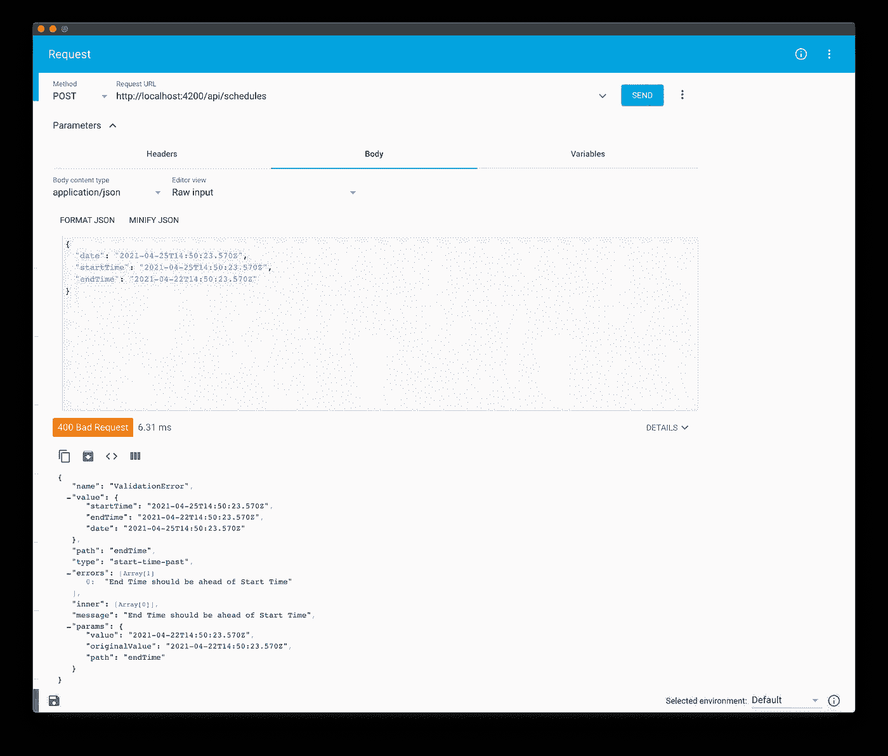
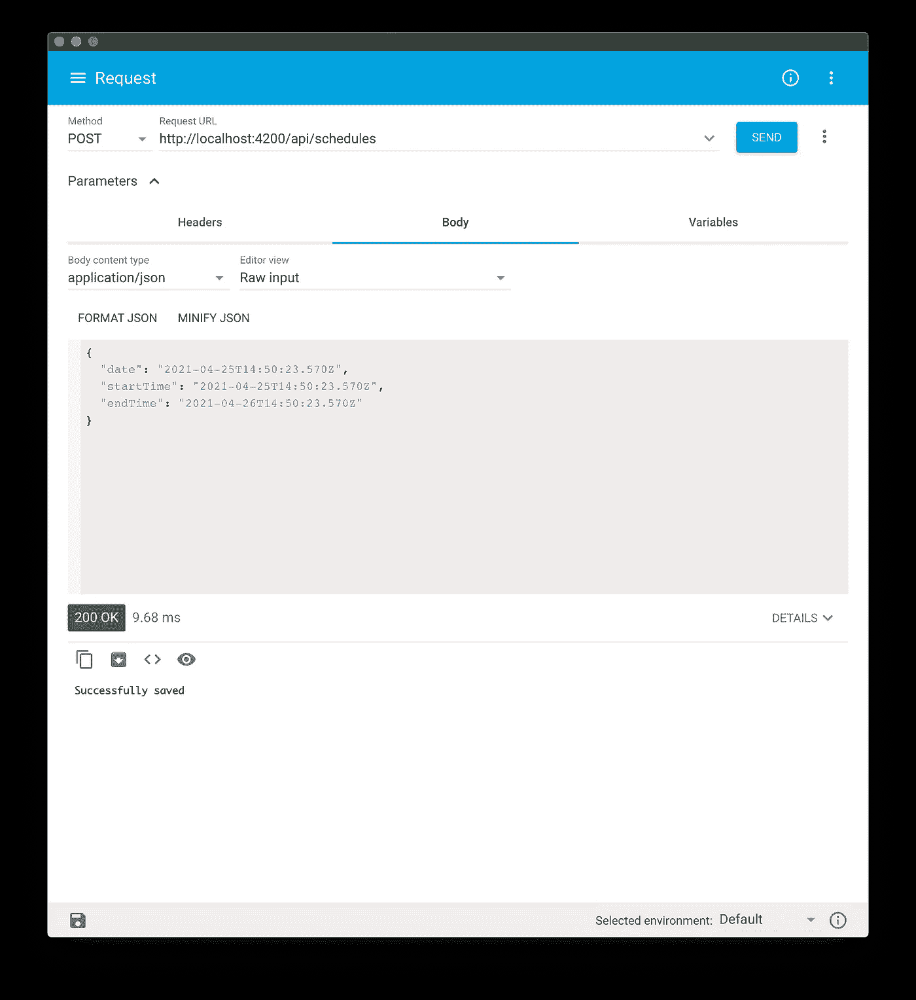

# 用 JavaScript 中的 Yup 验证您的 API 端点

> 原文：<https://javascript.plainenglish.io/validate-your-api-endpoint-with-yup-in-javascript-9b8da3eae12e?source=collection_archive---------11----------------------->

Photo by [Joshua Aragon](https://unsplash.com/@goshua13?utm_source=medium&utm_medium=referral) on [Unsplash](https://unsplash.com?utm_source=medium&utm_medium=referral)

我一直使用 Yup 主要是因为 Formik 在 React 中进行表单验证。除此之外，我过去很少在其他事情上使用它。我不能说够了，但福米克和尤看起来像情侣。

你用过没有 Yup 的 Formik 吗？或者说，你在 Formik 外面用过 Yup 吗？我打赌你没有。

这不是对 Yup 的推广，但出于好奇，我再次使用了 Yup 来验证和转换我的 API 端点，我很喜欢它。

在我给你看例子之前，我想告诉你我为什么来到这里。当处理大量代码时，有一个关于事物如何工作的结构是很有帮助的，这样就可以很容易地导航和找到有用的东西。在验证和转换上使用一些功能性的方法也是有帮助的，而不是命令性的方法，因为它在主题上提供了一个清晰的意图。

Yup 向我提供了表单验证，这就是为什么我开始考虑在 Formik 之外的其他可能性，因为表单值和其他函数(如 API 端点)几乎使用相同的数据结构。

这些是这件事背后的想法。既然我已经与您分享了它，请允许我也分享一下您如何使用它的例子。

# 验证 API 端点

我将讲述处理用户请求和响应的简单 Express API 路由的知识。

假设我们有这个处理程序

简单的要求是确保通过`date`、`startTime`和`endTime`。验证可能是类似的东西，或者可以抽象为一个函数，我们必须手动检查它。

这很好，在简单的情况下有效，但是当事情变得复杂时就失效了，这就是 Yup 提供更好的验证的地方。

比方说，我们如何确定`date`实际上是一个`Date`？我们必须手动检查。如何确定`startTime`在`endTime`之前或者`endTime`在`startTime`之后？

是的，我们可以通过命令式验证轻松做到这一点，但我们需要的是一种功能性的方法来验证对象。拿这个验证，不拿这个，做这个，做这个，做这个验证。

下面是我们如何用 Yup 做更好的验证。

> 如果你对`tryCatch`方法感兴趣，我在这里写了一篇关于它的文章[https://medium . com/weekly-web tips/functional-try-catch-in-JavaScript-8b 9923 C3 e 395](https://medium.com/weekly-webtips/functional-try-catch-in-javascript-8b9923c3e395)

我想在这里与你分享的是我们如何设法将我们的验证超越我们的手动关注，并让 Yup 做它擅长的地方。

我们不必通过强制性的方法手动验证和比较日期，但我们已经通过结构化和功能性的方法做到了这一点，这提供了更好的清晰度和理解。

验证也与应用程序的主流程分离开来，这很好，因为您可以单独关注它，而不用考虑其他流程。还有一件事，验证消息已经由 Yup 给出了，这很方便！

它提供了一个通用的详细验证消息，允许您根据自己的需求以各种可能的方式使用它。

# 将这一切结合在一起

Yup 允许我们以结构化和功能化的方式管理我们的验证需求。还记得 Yup 如何很好地与 Formik 集成来处理它吗？在我们的 API 端点上应该有类似的东西，在更深的层次上也是一样的。

Yup 可能会给你的应用程序带来复杂性，或者以不同寻常的方式处理一个 API 端点，这可能是你的团队不赞成的。但是，如果你有机会尝试，我希望你能找到更好的体验。

我希望这能给你一个新的视角来验证对象或端点，以及你如何不仅在 Formik 中而且在你的 API 端点中利用 Yup！

期待听到你更多的消息。❤️

*更多内容看*[***plain English . io***](http://plainenglish.io)