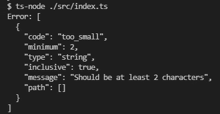
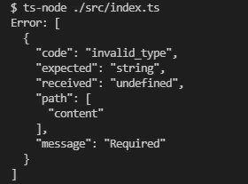

# 在 TypeScript 中用 Zod 验证输入

> 原文：<https://javascript.plainenglish.io/validating-input-with-zod-in-typescript-6d0e04677123?source=collection_archive---------2----------------------->

一个能引起很多讨论的话题:*“在 Node.js 中解析和验证用户输入的最好方法是什么？”*

嗯，根据我的说法，它是 [Zod](https://github.com/colinhacks/zod) ，今天我将向你展示如何开始使用 Zod，以及为什么它是绝对最好的！


Picture by FLY:D ([https://unsplash.com/@flyd2069](https://unsplash.com/@flyd2069))

# 🌱创建您的第一个模式

首先，我们必须安装佐德。你可以用你最喜欢的包管理器来做这件事。

```
npm install zod
// OR
yarn add zod
```

在我们的第一个模式中，我们将为一个简单的字符串创建一个。
不要担心，我们将在本文后面讨论更复杂的验证。

你需要做的就是:

*   导入 Zod
*   创建模式
*   对比！

假设我们想要一个模式来解析一个名字。我们想对这个名字做一些限制。我们希望它:是一个字符串，至少 2 个字符长，最大长度为 20 个字符。

如果我们将这些约束转换成一个模式，它看起来会像这样。

如果您通过用`tsc`或像`ts-node`这样的库构建这段代码来运行它，您会在您的终端中看到一个异常。不要慌，因为这其实是意料之中的结果！

仔细看看输出，您会看到 Zod 抛出了一个错误，因为我们的第二个输入不符合最小长度标准。万岁！



# 🌳更复杂一点的东西

既然您已经创建了您的第一个 Zod 模式，让我们增加难度。让我们创建一个 Zod 模式来验证整个对象。
例如，我们期望来自前端框架的 API 调用将用户的新帖子添加到数据库中。我们期望一个对象有字段:`user`、`content`和`date`。让我们把它变成一个模式！

运行这段代码，您会看到一个不同的错误。这一次让我们知道我们试图解析的对象不包括一个必需的字段！
是不是很神奇？



# 🤔到此为止了吗？

它没有！Zod 有很多你可以在应用程序中使用的特性。你可以在他们自己的[文档](https://github.com/colinhacks/zod)中找到完整的列表，但是我也在这里整理了一个小列表供你探索！

## z.string()。url()

这个在`.string()`之上的额外函数确保了给定的字符串也是一个 URL。

## z.string()。电子邮件()

这个在`.string()`之上的额外函数确保了给定的字符串也是一封电子邮件。

## z.infer

对于打字用户来说，这是一个非常酷的工具。使用 infer，您可以从模式中提取类型。你需要做的就是像这样叫它！

## 严格型()

使用`strict()`可以让 Zod 知道它应该只允许模式中指定的键。如果对象中存在任何未知的键，它将抛出一个 Zod 错误。

# 🙋‍♂️:还有其他选择吗？

是啊！佐德还有很多替代品。其中最受欢迎的是 Joi 和 Yup，这两个已经存在很长时间了。

我更喜欢 Zod 的原因是因为它是为 TypeScript 构建的。如果你不知道，TypeScript 是 JavaScript 的强类型变体。

佐德优越的其他原因！

*   非常小(10kB)
*   没有依赖关系
*   适用于浏览器和 Node.js


Downloads for Joi, Yup and Zod compared

祝你有创意的一天！🧡

*更多内容尽在*[***plain English . io***](http://plainenglish.io/)