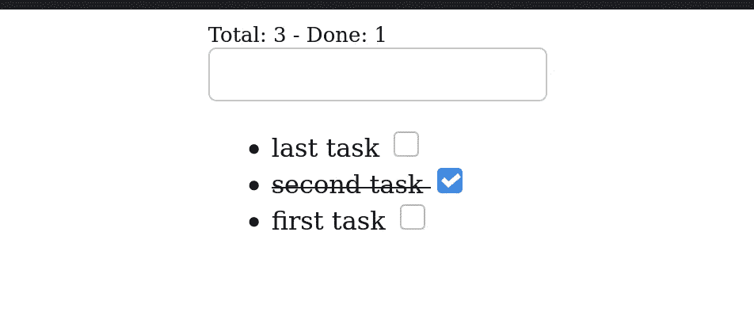

# 香草挂钩(外部反应)

> 原文：<https://javascript.plainenglish.io/vanilla-hooks-outside-react-860471e5f95c?source=collection_archive---------9----------------------->


Photo by [Vishal Jadhav](https://unsplash.com/@vishu_2star?utm_source=unsplash&utm_medium=referral&utm_content=creditCopyText) on [Unsplash](https://unsplash.com/s/photos/hook?utm_source=unsplash&utm_medium=referral&utm_content=creditCopyText)

钩子是一种模式，而不是只能在 React 库中使用的东西，这篇文章将解释并介绍一些有趣的可能性。

# 什么是钩子？

钩子不多也不少，就是一个通用回调的包装。回调本身不是一个钩子，除非它被一个钩子助手处理，在这种情况下是由[钩子](https://github.com/WebReflection/uhooks#readme)库提供的，这是我所知道的最小、最快的库，并且“*它只是工作*”。

举例来说，这是一个内部使用一些钩子辅助程序的通用回调，但是它不会像预期的那样工作，除非它被钩子库辅助程序所包装。

```
// not a hook until wrapped
const callback = (initial) => {
  const [value, update] = useState(initial);
  console.log(value);
  setTimeout(update, 1000, value + 1);
};
```

重要的是要记住，除非作为助手本身使用，回调不能受益于钩子助手，因为这些回调需要被编排。

```
import {hooked, useState} from '//unpkg.com/uhooks?module';// this is now a hook
const incrementalState = hooked(callback);// and it can be initialized as such
incrementalState(0);
```

在这个 [CodePen 示例](https://codepen.io/WebReflection/pen/rNMdJom?editors=0011)中读取控制台日志，会显示一个从 *0* 到 *N* 的递增计数器，这正是我们所期望的。

## 它是如何工作的？

这个故事的简短版本是，每次由`useState`助手提供的`update`函数执行时，被挂钩的回调被再次调用，并且`useState`助手将知道，在运行时，返回的最后更新的值是什么，忽略第一次这样的挂钩被执行时提供的`initial`值。

一个极简的钩子实现和解释也可以在这个要点中找到。

故事的长版本是在我的旧帖子中描述的[，但是没有必要理解所有的内部机制，但是有必要记住每个钩子都需要被处理一部分，这样从零开始并行记录，例如，我们不能再次调用`incrementalState(0)`，因为我们需要通过同一个助手创建一个新的钩子。](https://webreflection.medium.com/demystifying-hooks-f55ad885609f)

```
const parallelState = hooked(callback);
```

数学很简单:一个钩子等于一个回调包装，而且只有一个。

我们可以手动调用钩子任意多次，但是初始化的状态将总是反映它们的当前值，因此调用`incrementalState(123)`将不会记录、重置或启动当前计数或它的值，它只会创建一个新的`setTimeout`，因此现在每件事每秒记录两次。

可以随便玩之前的 CodePen 自己测试一下。

# 钩子和 DOM 元素

我很确定用一个愚蠢的计数器来展示钩子很容易让人厌烦，但是这已经是钩子工作方式的" *ABC* "了，我们可以探索一些其他的助手来创建独立的 DOM 元素，在本例中，`useRef`:

```
const useElement = (name, attributes = {}) => {
  const ref = useRef(null);
  return ref.current || (ref.current = Object.assign(
    document.createElement(name),
    attributes
  ));
};
```

`useRef`是我们一次创造任何需要的好帮手。它的初始值将被存储到一个总是相同的对象引用中，并作为`current`属性。

由于这是一个助手，而不是一个*钩子*本身，所以没有必要将其包装为*钩子*函数，因为它将在钩子函数中使用:

```
const Button = attributes => hooked(text => {
  const element = useElement('button', attributes);
  const [count, update] = useState(0);
  element.textContent = `${text} clicked ${count}`;
  element.onclick = () => update(count + 1);
  return element;
});const simple = Button({className: 'simple'});
const complex = Button({className: 'complex'});document.body.append(
  simple('simple button'),
  complex('complex button')
);
```

这次的[现场演示](https://codepen.io/WebReflection/pen/MWjVVeo?editors=0010)展示了两个计数器(*我知道，还是很无聊…请原谅我*)，需要理解的重要一点是，一旦创建了一个元素，它将始终是完全相同的元素:

```
console.log(
  simple('simple button') ===
  simple('simple button')
); // true
```

我们可以通过`simple('just simple')`更新它的前缀内容，它仍然是完全相同的元素。

# 反应状态

由于我们已经通过钩子引入了组件定义，并且由于计数甚至还不是真实世界的用例，我们已经可以找到一种方法来避免为每个单独的状态写满`useState`,而是处理一个提供状态细节的对象，它能够轻松地更新当前状态:

```
const {defineProperties} = Object;
const useReactive = object => {
  const properties = {};
  for (const key in object) {
    const [value, set] = useState(object[key]);
    properties[key] = {get: () => value, set};
  }
  return defineProperties({}, properties);
};
```

有了上面的助手，`Button`组件工厂可以以更易读的方式进行简化，这也可以扩展到其他属性:

```
const Button = attributes => hooked(text => {
  const element = useElement('button', attributes);
  const state = useReactive({count: 0});
  element.textContent = `${text} clicked ${state.count}`;
  element.onclick = () => state.count++;
  return element;
});
```

[查看这个现场演示](https://codepen.io/WebReflection/pen/abmYYQX?editors=0010)来玩这个模式。

# 处理事件

类似地，由于我们可以轻松地处理更多的状态，我们也可以处理更多的事件，这里有一个小问题:

*   DOM 级事件既容易设置，如`element.onclick = thingy`，也容易处理，因为每个元素只能设置一个 0 级事件，所以我们的组件很容易泄漏它的侦听器，或者由于一些其他脚本事件覆盖而从不反应
*   跟踪以前的侦听器，以便在每次状态更新时删除和替换这些侦听器，这是一项繁琐且容易出错的工作

为了帮助解决这些痛点，有一个伟大的 [*handleEvent*](https://webreflection.medium.com/dom-handleevent-a-cross-platform-standard-since-year-2000-5bf17287fd38) 标准，它将允许我们永远不用关心跟踪以前的侦听器，因为如果处理程序总是相同的，不会发生两次或更多次:

```
const {defineProperties} = Object;
const useHandler = (element, handler) => {
  const ref = useRef(null);
  // update the user handler each time
  if (ref.current)
    ref.current._ = handler;
  // but create the real handler once
  else
    ref.current = {
      _: handler,
      handleEvent(e) {
        this._[e.type](e);
      }
    };
  // so that adding it N times won't result in N events
  for (const key in handler)
    element.addEventListener(key, ref.current);
};
```

有了上面的助手，`Button`工厂现在看起来会是这样:

```
const Button = attributes => hooked(text => {
  const state = useReactive({count: 0});
  const element = useElement('button', attributes);
  useHandler(element, {
    click() {
      state.count++;
    }
  });
  element.textContent = `${text} clicked ${state.count}`;
  return element;
});
```

请随意[播放相关的现场演示](https://codepen.io/WebReflection/pen/abmYYrM?editors=0010)。

# 组合助手

如果经常使用两个助手，并且有办法消除它们的意图的歧义，那么将这些助手放在一起可能是一个好的解决方案，这样可以避免每次都重复相同的代码。

```
const {defineProperties} = Object;
const useReactiveHandler = (element, object) => {
  const ref = useRef(null);
  // create the real handler once
  if (!ref.current)
    ref.current = {
      _: {},
      handleEvent(e) {
        _[`on${e.type}`](e);
      }
    };
  const {_} = ref.current;
  const properties = {};
  for (const key in object) {
    // listeners prefixed via on
    if (/^on/.test(key)) {
      element.addEventListener(key.slice(2), ref.current);
      _[key] = object[key];
    }
    // methods simply copied over
    else if (typeof object[key] === 'function')
      _[key] = object[key];
    // properties made reactive
    else {
      const [value, set] = useState(object[key]);
      properties[key] = {
        configurable: true,
        get: () => value,
        set
      };
    }
  }
  return defineProperties(_, properties);
};
```

有了上面的助手，我们现在可以同时定义处理程序和反应属性，使我们的`Button`工厂看起来像:

```
const Button = attributes => hooked(text => {
  const element = useElement('button', attributes);
  const {count} = useReactiveHandler(element, {
    count: 0,
    onclick(event) {
      this.count++;
    }
  });
  element.textContent = `${text} clicked ${count}`;
  return element;
});
```

再次，[查看现场演示](https://codepen.io/WebReflection/pen/gOwezOL?editors=0010)来看看这是如何工作的。

## 到目前为止，我们学到了什么

到目前为止，主要的收获是，钩子只是能够很好地组合在一起的原语，因此为我们的案例创建特别的助手应该是直接的，只要我们为任务选择正确的钩子。

到目前为止，我们只探索了`useState`和`useRef`，这只是对钩子可能做的事情的皮毛，但是我希望很清楚，我们已经可以用这两个原语做很多事情了。

现在休息一下，散散步，或者再玩一次我们已经做过的，这样一旦你回来，我们就可以讨论更复杂的例子😉

# “待办事项”应用程序

我知道这对许多人来说不会太激动，但是 *X-App* 的要点是将内部组件与整个 *App* 本身联系起来，因为每个组件更新也可能需要一个 *App* 更新，并且拥有嵌套钩子也是值得讨论的事情，因为有各种解决方案可以考虑来组成这个模式。

例如，到目前为止描述的每个按钮都是一个独立的组件，也能够隐式地将一个`click`事件分派给任何外部组件，但是知道如何在钩子内处理委托事件，以及如何共享数据，可能值得这个额外的例子。

## 简而言之…

我们要创建的是一个非常简单的结构，允许用户键入一些项目，通过输入添加它，能够标记每个项目完成，或没有。

这个应用的第一个版本是 CodePen 中的 [live，所以让我们看看它做了什么。](https://codepen.io/WebReflection/pen/qBaogzY?editors=0010)



# 该结构

我们不会过多关注这种结构的正确性(事实并非如此)，而是关注它的功能性。

```
<div>
  <input>
  <ul>
    <li>
      <label>
        {{value}}
        <input type=checkbox>
      </label>
    </li>
  </ul>
</div>
```

像任何其他动态应用程序一样，我们将处理一些数据，在这种情况下表示一个任务或项目的列表，其中每个任务携带最相关的信息:`value`和`done`。

# 任务/项目挂钩

```
const Item = () => hooked(item => {
  const {value, done} = item;
  const li = useElement('li', {
    // class name based on the item state
    className: done ? 'done' : ''
  });
  const label = useElement('label');
  const span = useElement('span', {
    // item value can be edited/updated
    textContent: value + ' '
  });
  const checkbox = useElement('input', {
    // the checked state is handled reactively
    type: 'checkbox'
  });
  useReactiveHandler(checkbox, {
    checked: done,
    onclick() {
      // update the current task/item state
      item.done = !done;
      this.checked = !done;
    }
  });
  // initialize this component once
  if (!li.hasChildNodes()) {
    label.append(span, checkbox);
    li.append(label);
  }
  return li;
});
```

如果我们理解了本文的前一部分，希望这是不言自明的, *Item* 组件是一个独立的`<li>`元素，每当它的状态改变时，它就会改变它的`className`,在更新它的引用值之后，简单地更新它的反应`checked`属性。

## 与前面的例子不同

之前给出的`useElement`只设置了一次元素属性，但是这里的帮助器应该能够在每次发生变化时更新这些属性。

```
const useElement = (name, attributes = {}) => {
  const ref = useRef(null);
  if (!ref.current)
    ref.current = document.createElement(name);
  // update properties each time
  return Object.assign(ref.current, attributes);
};
```

# 待办事项应用程序

此时，我们需要的是一个能够呈现这些项目并创建新项目的容器。

```
const Todo = () => hooked(items => {
  // lazy way to have always same WeakMap ... not ideal
  const {current: references} = useRef(new WeakMap);
  // basic structure
  const app = useElement('div');
  const input = useElement('input');
  const list = useElement('ul');
  // update the list whenever a new task/item is added
  useReactiveHandler(input, {
    count: items.length,
    onkeypress({key}) {
      if (key === 'Enter') {
        const value = input.value.trim();
        if (value && !items.find(({value: v}) => v === value)) {
          // place new tasks on top
          items.unshift({value, done: false});
          input.value = '';
          this.count++;
        }
      }
    }
  });
  // lazy way to update this view ...
  // just re-append everything
  app.append(input, list);
  items.forEach(item => {
    // create new tasks/items once via reference
    if (!references.has(item)) {
      const hook = Item();
      references.set(item, hook(item));
    }
    list.append(references.get(item));
  });
  return app;
});const App = Todo();
```

概括一下:

*   `App`是一个钩子，它通过一个输入字段处理一系列任务/项目，当 *Enter* 键发生时，它能够添加新的任务/项目
*   每次创建新任务时，`App`都会更新其内容，并且它会将每个项目与用作*弱*键的唯一数据点相关联。

```
// create a new App with an empty list
document.body.append(App([]));
```

## 丑陋的部分…

*   项目通过数据突变泄漏其状态，并且这种变化在其闭包之外无法被检测到，除非每个项目也是反应性的，但这种情况很少发生(想想 *JSON* 请求，等等)。如果我们想显示任务的总量，以及已完成任务的数量，改变项目状态而不更新整个视图是不容易缩放的。
*   与 React 和它的 *JSX* 特殊语法相比，很容易让人觉得组件的创建和初始化相当冗长且容易出错
*   每次都无缘无故地创建`WeakMap`，这很容易修复，通过`useRef`使用`.current`技巧，但也更冗长，收益很少

可能还有其他丑陋的部分，但是这三个让我已经想要重写，或者重构这个 *Todo* 项目…但是怎么做呢？

# 引入土地

[land](https://github.com/WebReflection/uland#readme) 模块是一个基于 *hooks* 的库，它试图通过以下方式改进普通 hooks 状态:

*   它是声明性的，这要感谢通过其核心暴露的 html
*   它提供了帮助者来协调开箱即用的容器/组件
*   它需要更少的样板文件、助手

我们的[新版本的 App](https://codepen.io/WebReflection/pen/vYXRMXK?editors=0010) 确实会减少到 45 *LOC* ，其中的 *Item* 组件现在看起来会是这样:

```
const Item = Component(item => {
  const {value, done} = item;
  // used to notify updates, no value needed
  const [_, update] = useState();
  return html`
    <li class=${done ? 'done' : ''}>
      <label>
        ${value}
        <input
          type=checkbox
          .checked=${done}
          onclick=${() => {
            item.done = !done;
            update();
          }}
        >
      </label>
    </li>
  `;
});
```

因此不再需要以前的助手，因为定义元素、它们的属性、事件或特性，使用`.propName`约定，被集成到基于模板文字的引擎中。

不仅*项目*组件更简单，而且*待办事项*组件现在也更短，更易于阅读:

```
const Todo = Component(items => {
  const [count, update] = useState(items.length);
  const done = items.filter(({done}) => done).length;
  return html`
    <div data-info=${`Total: ${count} - Done: ${done}`}>
      <input onkeypress=${({currentTarget: input, key}) => {
        if (key === 'Enter') {
          const value = input.value.trim();
          if (value && !items.find(({value: v}) => v === value)) {
            items.unshift({value, done: false});
            input.value = '';
            update(count + 1);
          }
        }
      }}>
      <ul>
        ${items.map(Item)}
      </ul>
    </div>
  `;
});
```

*Todo* 的`update(count + 1)`将在添加最后一个条目后重新呈现项目列表，而 *Item* 的`update()`将通过最上面的呈现元素传播，因此现在完成的任务也将作为`data-info`反映在主容器中。

```
// bootstrap the Todo App
render(document.body, Todo([]));
```

定义在哪里呈现我们的新应用程序的元素，然后[查看它的实况](https://codepen.io/WebReflection/pen/vYXRMXK?editors=0010)。

## 键控与非键控

如果我们仔细观察当前的演示，会发现有一些问题需要考虑:

```
${items.map(Item)}
```

模板文字引擎足够智能，每次更新所有属性，但是没有引用，我们工作在*无键*模式。

检查当前的 DOM，我们会看到更改可能会应用到多个项目，但是如果我们想确保单个项目代表一个特定的组件，我们仍然需要在 *Todo* 应用程序和每个*项目*中使用一个引用。

为了做到这一点，我们可以使用另一个钩子助手:`useMemo`

```
const Todo = Component(items => {
  const tasks = useMemo(() => new WeakMap, items);
  // ...
  return html`
    <div data-info=${`Total: ${count} - Done: ${done}`}>
      ...
      <ul>
        ${items.map(item => {
          if (!tasks.has(item))
            tasks.set(item, Item(item));
          return tasks.get(item);
        })}
      </ul>
    </div>
  `;
});
```

这种助手仅在其保护改变时执行回调，在这种特定情况下仅创建一个`WeakReference`，与以前每次更新都创建它相反。

现在，dance 可以使用这样的引用，只在需要的时候创建新的组件，并重新排序其他组件，而不是每次都更新整个列表。

在这一点上，另一个变化是以一种独特的方式将这样的条目与它所代表的 DOM 片段相关联:

```
const Item = Component(item => {
  const {value, done} = item;
  const [_, update] = useState();
  return html.for(item, 'todo-item')`
    ...
  `;
});
```

`html.for(ref[, id])`就是要走的路，本例中的`id`帮助我们在页面中重用同一个`item`，而不需要移动同一个节点。

请随意使用这个应用程序的最新版本。

## 仍然失踪…

我们目前的应用程序仍然在从内部变异物品，我已经可以想象所有的“*不可变-数据*”粉丝发誓…

同样值得考虑的是，空的`useState`，仅仅为了传播状态变化而被调用，与其说是一个解决方案，不如说是一个黑客。

相反，我们可以做的是传递应用程序*上下文*，这使得任何组件都能够触发更新，使用相同上下文的其他组件都会收到通知。

```
const Todo = Component(context => {
  const items = useContext(context);
  // no need to useMemo, as items are always new anyway
  // ...
  return html`
    <div data-info=${`Total: ${count} - Done: ${done}`}>
      ...
      <ul>
        ${items.map(item => Item({context, item}))}
      </ul>
    </div>
  `;
});
```

而在 *React* 中，上下文通常被表示为另一个 *JSX* 节点，在 *uhooks* 中，因此在 *uland* 中，也有一个工具来创建一个:

```
render(document.body, Todo(createContext([])));
```

`useContext(context)`将返回上下文携带的任何*值*，但是上下文本身也提供了一种更新其值的方式，自动在应用程序中传播，导致全局更新:

```
const Item = Component(({context, item}) => {
  const items = useContext(context);
  const {value, done} = item;
  return html`
    <li class=${done ? 'done' : ''}>
      <label>
        ${value}
        <input
          type=checkbox
          .checked=${done}
          onclick=${() => {
            const i = items.indexOf(item);
            // provide a new list of items
            // with a new item instead of mutating
            context.provide([
              ...items.slice(0, i),
              {value, done: !done},
              ...items.slice(i + 1);
            ]);
          }}
        >
      </label>
    </li>
  `;
});
```

这个[最后一个例子也是活的](https://codepen.io/WebReflection/pen/bGwvydQ?editors=0010)，这里最重要的要注意的是:

*   没有必要使用`html.for(...)`因为每一项改变都会变成一个新的参考，所以我们只会麻烦一个`WeakMap`来获得不多的收益
*   意图比以前更清晰了，但是节点现在又变得无密钥了

关于最后一点，不仅它不应该真正重要，除非键控结果是绝对强制性的，但如果我们仔细观察，我们最终可以将每个组件关联到它自己的值，并使用这样的值作为唯一的键，因为逻辑不允许我们添加两次相同的任务。

在这种情况下，一个简单的`Map`会更好，如果应用程序被扩展到移除已经完成的项目，唯一需要记住的是，键也应该从这个`Map`中移除，但是我将把这部分留给读者作为练习。

# 结论

我希望你喜欢这个一步一步的 Todo 应用程序创建过程，使用普通的 DOM 和天生的小助手来轻松解决这些任务，所以现在应该很清楚，使用钩子不一定局限在 React 生态系统中，但是通过任何其他标准来说也是一件令人愉快的事情。