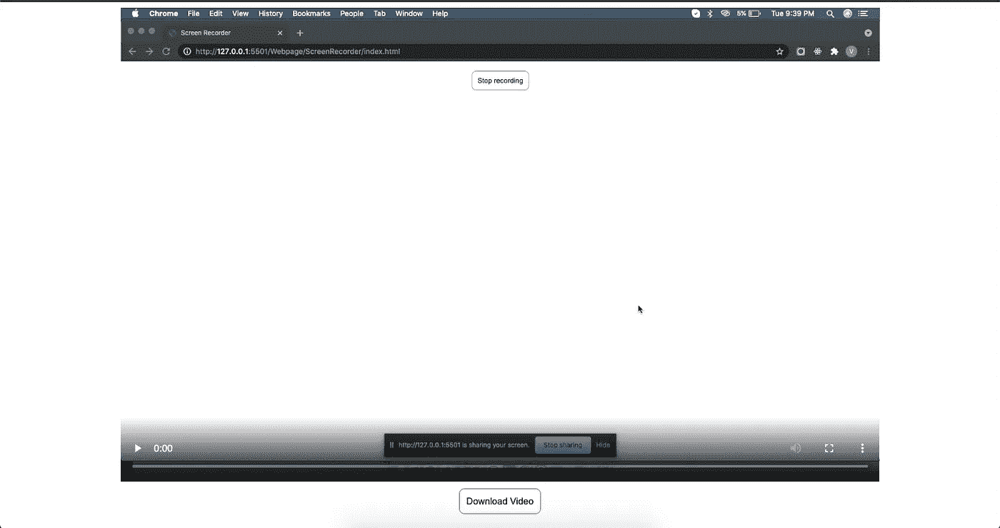

# 如何用普通的 JavaScript 创建一个屏幕记录器

> 原文：<https://javascript.plainenglish.io/vanilla-javascript-based-screen-recorder-29fff1cc7b00?source=collection_archive---------7----------------------->

> 我们将制作一个简单的基于 JavaScript 的网页，该网页将有一个开始屏幕录制的按钮和一个下载录制视频的按钮。

Vanilla JavaScript-based Screen Recorded

# 先决条件:

*   不需要专业知识，JavaScript 的基本知识将足以理解这个项目。
*   我们将会看到如何实现网页，而不需要过多的理论。要了解更多情况，你可以阅读最后给出的参考资料。

## 该项目分为两个主要步骤:

1.  设置 HTML。
2.  实现 JavaScript。

让我们开始吧。

# 步骤 1:设置 HTML

总共有 3 个按钮标签负责这些操作:

1.  开始录音。
2.  停止录音。
3.  下载录制的视频。

我们还有一个视频标签，稍后将用于播放录制的视频。请注意，最初停止录制和下载视频的按钮具有“*display:none”*属性，因为我们希望它们在屏幕录制开始后可见。

# 步骤 2:实现 JavaScript

**a .启动记录功能**

当用户点击开始记录按钮时，浏览器询问必须记录的窗口/标签。一旦提供许可，*【开始录制】*按钮隐藏，*【停止录制】*按钮可见。

*"chunks"* 变量是一个数组，用于在记录停止时存储已记录屏幕的数据。我们将使用这个数组来创建一个视频文件。

**b .停止屏幕功能:**

通过点击*停止记录*按钮，我们简单地调用记录器对象提供的停止功能。我们现在必须将“*停止录制”*按钮设置为隐藏，因此我们添加了*“显示:无”*属性*。*

**b .停止屏幕功能:**

一旦停止录制，就会调用此功能。存储在数组块中的数据用于创建 blob 文件。生成的文件链接到下载按钮/视频标签，并且它们是可见的。

# 结果

Our result page would look something like this

**Github 库:**

 [## manan657/jsScreenRecorder

### 在 GitHub 上创建一个帐户，为 manan657/jsScreenRecorder 的开发做出贡献。

github.com](https://github.com/manan657/jsScreenRecorder) 

**部署环节:**

 [## 屏幕记录器

### 编辑描述

manan657.github.io](https://manan657.github.io/jsScreenRecorder/) 

# 结论

我希望这篇文章对你有用。感谢您的阅读。

*如果想了解更多关于媒体记录仪的信息，可以参考这个* [*链接*](https://developer.mozilla.org/en-US/docs/Web/API/MediaRecorder) *。*

[*更多内容看 plainenglish.io*](http://plainenglish.io/)