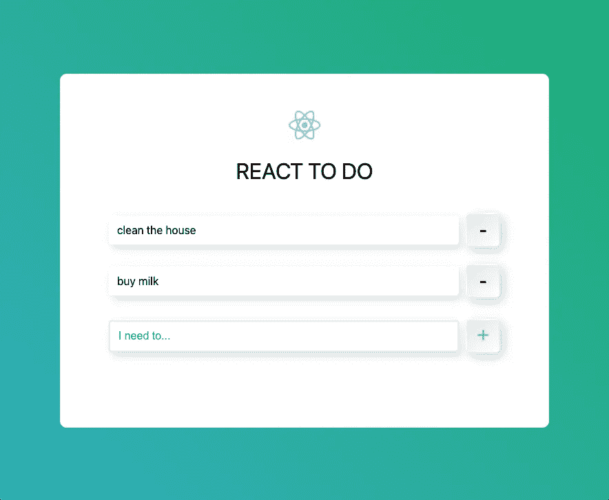
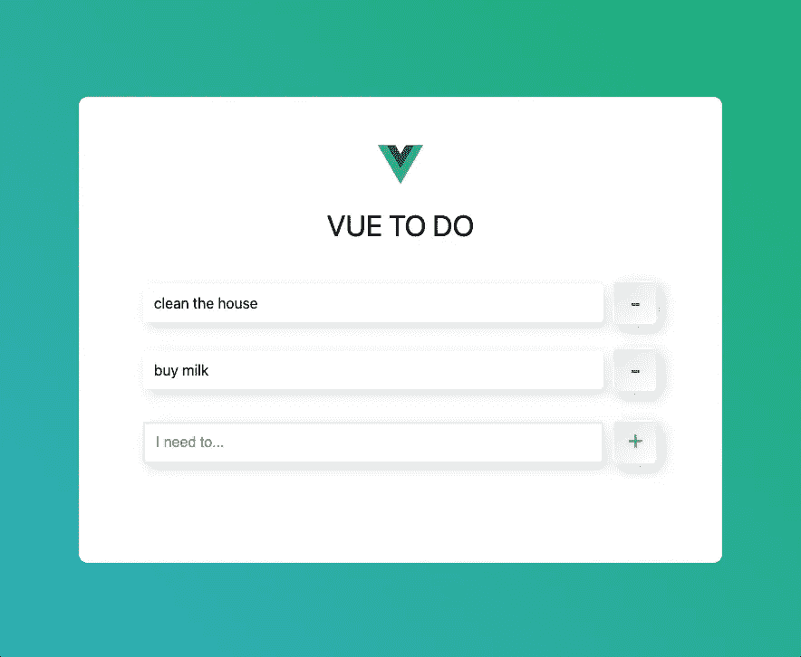
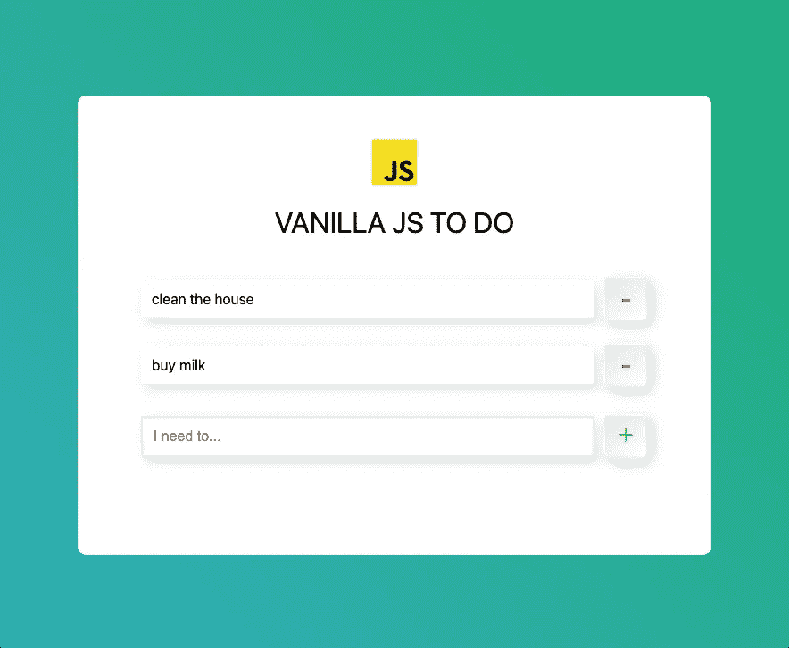
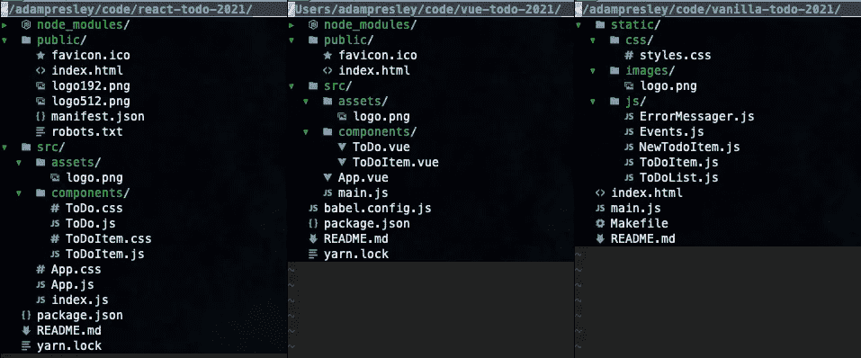
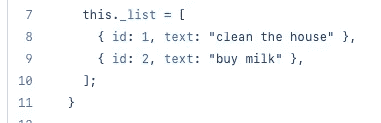
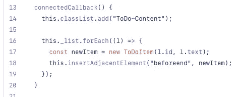
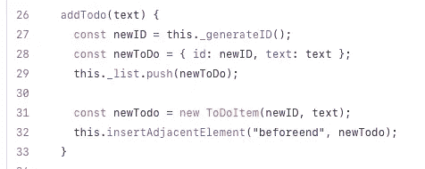
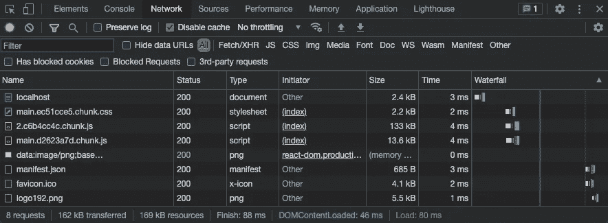
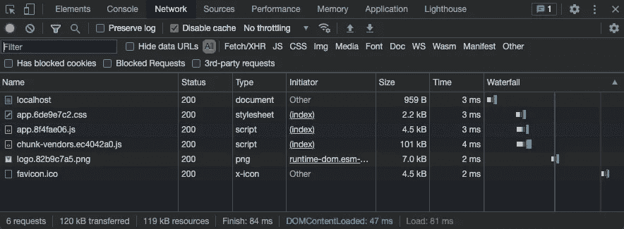
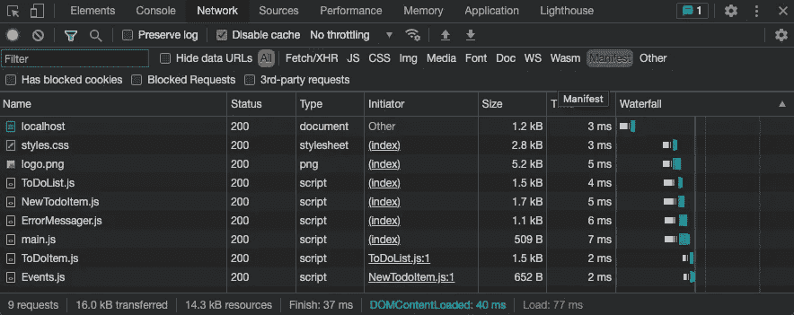

# 我用 JavaScript 创建了完全相同的应用程序(带有 Web 组件)

> 原文：<https://javascript.plainenglish.io/vanilla-javascript-todo-app-160eba391a3d?source=collection_archive---------2----------------------->

## 比较 React、Vue 和带有 Web 组件的普通 JavaScript 中内置的应用程序之间的差异

今天我读了苏尼尔·桑德胡写的一篇相当不错的文章，这篇文章比较了在 [React](https://reactjs.org) 和 [Vue](https://vuejs.org) 中编写 todo 应用程序。在这篇文章中，Sunil 出色地描述了每个代码块，React 和 Vue 之间的区别，以及它们工作的原因。如果您对这些技术中的任何一种都不熟悉，一定要读一读他的文章。

当我读 Sunil 的文章时，我开始怀疑一个普通的 JavaScript 版本是否会如此不同。我最近迷上了“香草 JS ”,并且一直对 JavaScript 及其在浏览器中的支持所取得的进步印象深刻。

因此，在这篇文章中，我将用普通的 JavaScript 和 CSS 构建一个小的 todo 应用程序。你可以在这里找到这篇文章的代码。在我们开始之前，让我们看看 React、Vue 和 Vanilla JS 版本是什么样子的。*剧透预警，他们应该都是一个样子，一个行为！*

Screen shot of React todo application

Screen shot of Vue todo application

Screen shot of Vanilla JavaScript todo application

如你所见，它们看起来几乎一模一样。这个标志是唯一可以识别的区别。事实上，我从 Sunil 的 React 版本的应用程序中取出 CSS，并简单地使用它！谢谢 Sunil！现在让我们来看看文件结构。下面你会看到 React、Vue 和我们的普通 JS 版本生成的文件结构的对比。

**Left**: React, **Middle**: Vue, **Right**: Vanilla JS

由各自的 app 生成器生成的 React 和 Vue 结构非常相似。最大的区别可能是 React 创建单独的 CSS 文件，而 Vue 将 CSS 包含在单个文件组件中。应用程序的普通 JS 版本也有一个 CSS 文件。我选择将所有的 CSS 合并到一个文件中。

继续看代码，让我们从最合理的地方开始，HTML 文件**index.html**。

如您所见，这里没有什么值得兴奋的。这是一个非常无聊的 HTML 文件，上面有一个图片和标题。至少在到达 *ToDo-Container* div 之前，它是很无聊的。查看 div 内部，您可能会注意到一些定制元素: **todo-list** 、 **new-todo-item** 和 **error-messager** 。再往下看，您会看到与这些新元素相对应的脚本。您可能还注意到那些脚本包含了一个名为 **type** 的属性，其值为 **module** 。*那个*是告诉你的浏览器像现代 ES6 JavaScript 一样加载和解析 JavaScript 文件的秘方。我们将逐一检查。

在我们进入每个 JavaScript 文件之前，我想先说这些 JavaScript 文件包含了 [Web 组件](https://developer.mozilla.org/en-US/docs/Web/Web_Components)。对于未入门的 Web 组件，JavaScript 类可以让您构建定制的、可重用的 HTML 元素。而且……他们很酷。所以我们先来看看 **ErrorMessager** 组件。

Web 组件有四个部分(主要):扩展什么元素，构造函数，元素初始化时的函数，元素销毁时的函数。Web 组件基本上是定制的 HTML 元素，因此您实际上可以扩展任何现有的 HTML 元素(比如 div 或 select)。在上面的例子中，我们只是扩展了 **HTMLElement** 来制作一个基本的自定义元素。

下一个需求是构造函数。要求你在构造函数中调用 *super()* ，仅此而已。在构造函数中，你可以初始化一些变量，甚至可以接受参数。

Web 组件需要一个名为 **connectedCallback()** 的函数。这是您需要做任何渲染和事件监听器的地方。在我们的函数中，你会注意到我们做了两件事。首先，我们通过调用`this.classList.add()`向自定义元素添加一个 CSS 类。然后我们调用另一个函数，我们在顶部导入了这个函数，来监听一个告诉我们想要显示错误消息的事件。稍后我会谈到活动的内容。

最后，您将看到一个名为 **disconnectedCallback()** 的函数。这里是您需要执行任何关闭活动的地方。如果你的元素从 DOM 中移除，这个函数会自动被调用，所以这是一个分离事件监听器的好地方，这就是我们正在做的。

现在，回到我们设置事件监听器的第 13 行，你会看到我们引用了一个名为 **_display()** 的函数。当一个自定义事件触发时，这个函数被调用。在这个函数中，我们做两件事。首先，我们创建一个段落元素，包含我们想要显示的消息，并将它作为子元素添加到我们的自定义元素中。然后我们设置一个超时，3 秒钟后删除该段落。

您会注意到的最后一件事是，我们在这个 JavaScript 文件的底部注册了自定义元素。这告诉浏览器我们的新元素的名称，现在我们可以在我们的 HTML 中使用它。

现在，如果您还记得，我提到过我们正在触发一些自定义事件(见第 13 行，我们正在监听这个自定义事件)。让我们来看看这段代码。

这个文件非常简单。我们已经设置了函数来调度一个自定义事件，监听该事件，并删除该事件。注意，我们正在调度和监听*窗口*对象。我这样做是为了简化我的生活。您也可以从 Web 组件调度事件。

现在让我们来看一个表示 todo 的组件。todo 基本上是一个包含 todo 文本和用于删除 todo 项的按钮的段落。

由于结构相同，我不会像前面的组件那样详细介绍。在 **connectedCallback()** 函数中，我们设置我们的元素并渲染东西。在其中，我们创建了段落元素，并将 todo 文本分配给它。然后我们制作一个按钮用来删除这个待办事项。对于该按钮的 click 事件，我们希望首先调度一个事件，告诉其他人我们删除了自己。然后我们调用`this.remove()`从 DOM 中删除整个 todo 项目定制元素。

现在让我们来看一个创建新 todo 的组件。新的 todo 基本上是一个文本框和一个按钮。当这个按钮被点击时，我们将从组件调度一个事件来提醒我们的父节点我们想要创建一个新的 todo。

这是你所期望的。我们创建元素，然后将它们作为子元素添加到自定义元素中。我们还设置了事件侦听器，当添加按钮被按下时，它将调度一个事件，并将 todo 文本作为事件的详细信息。

让我们来看看最后一个组件， **ToDoList** 。这是将呈现待办事项列表并跟踪该列表的组件。

我们来分析一下。我想指出的第一件事是，我们设置了一个项目数组来组成我们的 todo 列表，你可能会注意到它已经有两个项目了。

Screen shot of the list array

Sunil 的 React 和 Vue 例子用两个 todos 初始化 app，所以我也这样做了。每个待办事项都有一个 ID 和文本。

在 **connectedCallback()** 函数中，我们将遍历该列表并创建新的 **ToDoItem** 元素(hurray Web Components！)并将它们添加为我们的 todo list 组件的子组件。

Screen shot of creating initial todo items

接下来我们有一个名为 **addTodo** 的函数，它完全按照你的想法来做。它首先生成一个 ID，创建 todo 对象并将其添加到我们的内部列表中。然后，它创建一个 **ToDoItem** 元素，并将其添加到我们的组件 DOM 中。

Screen shot of the function to add a todo

现在，如果你回头看看 index.html 的**，你会注意到我们还包含了一个 *main.js* 。让我们看看那个。**

在这最后一段代码中，我们希望监听**new doitem**元素触发的 *new-todo* 事件。当该事件触发时，我们获取对 **ToDoList** 元素的引用，然后调用 *addTodo* 方法，向其传递自定义事件的详细信息，这恰好是 Todo 文本。

然后，我们设置一个监听器，用于删除 todo。在那个监听器中，我们做同样的事情。我们获取对 **ToDoList** 元素的引用，并调用 *deleteTodo* 方法。

# 比较起来怎么样？

那么，这一切与 React 或 Vue 版本相比如何？React 和 Vue 都有一些初始化组件和设置状态的概念。Web 组件不具有与框架相同的状态管理概念，但是 Web 组件具有基本的生命周期功能，用于处理组件被呈现和销毁的情况。

此外，因为 Web 组件没有真正内置状态管理系统，所以您需要负责手动添加和删除 DOM 元素。例如，在 Vue 和 React 版本中，当列表数组改变时，DOM 会自动为该部分重新呈现。在普通的 JS 版本中，我们必须手动删除和添加 DOM 元素。

另一个区别是事件侦听器的处理方式。在 React 和 Vue 事件中，侦听器被附加在标记中并引用一个函数。在 Vanilla JS 中，我们在创建和添加元素时在 JavaScript 中附加那些处理程序。

# 最后🎉

我希望这种对普通 JavaScript 的研究能有所启发。现代浏览器变得比以往更加强大，并提供了复杂的 JavaScript 和 CSS 特性。框架很棒，可以节省很多时间，但是我相信随着 web 技术的发展，老式的 JavaScript 将会继续发展，成为你工具箱中的一个有价值的工具。

干杯，编码快乐！

# 作为题外话

我拍了几张传递给浏览器的有效载荷大小的截图。尺寸当然不是一切，但我忍不住注意到香草版本是多么小。

React payload size

Vue payload size

Vanilla payload size

# 链接

此存储库:

 [## GitHub-adampresley/vanilla-todo-2021:Medium 上的一篇文章的代码，该文章介绍了如何在…

### 我写这篇文章是为了回应苏尼尔·桑德胡的一篇关于媒介的文章。在这篇文章中，他在比较如何写作方面做得非常出色…

github.com](https://github.com/adampresley/vanilla-todo-2021) 

Sunil 的文章:

 [## 我在 React 和 Vue 中创建了完全相同的应用程序。以下是不同之处。[2021 版]

### React vs Vue。Vue 和 React 的并列代码对比！🎉

javascript.plainenglish.io](/i-created-the-exact-same-app-in-react-and-vue-here-are-the-differences-2021-edition-a7ebfc19a9d)