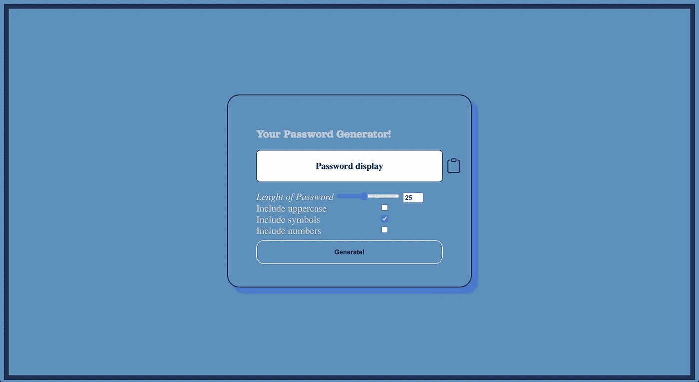
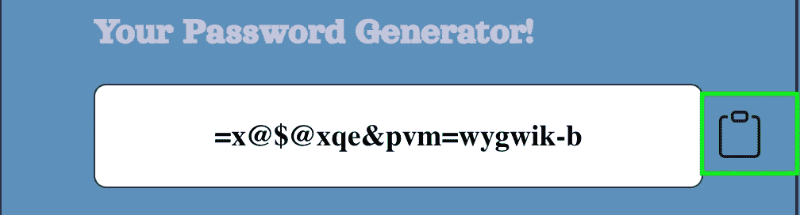
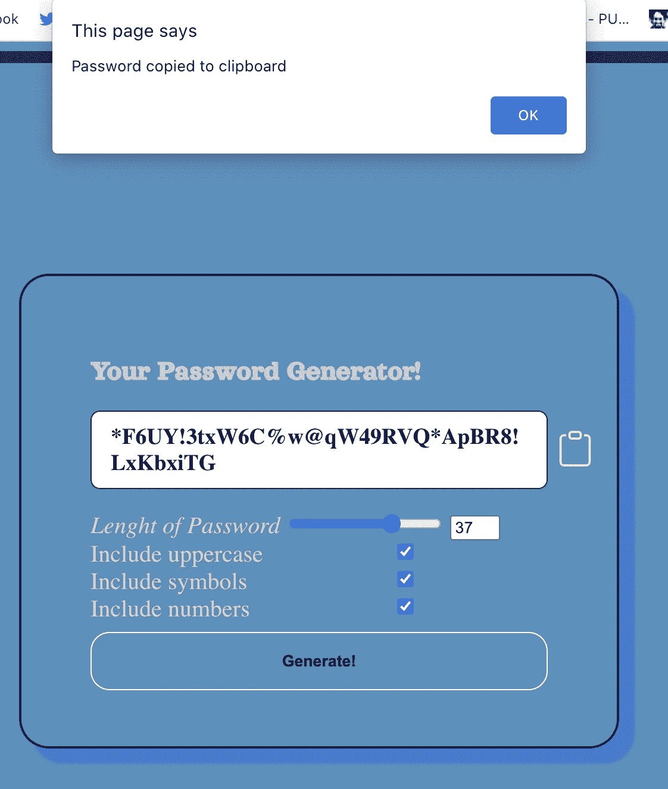
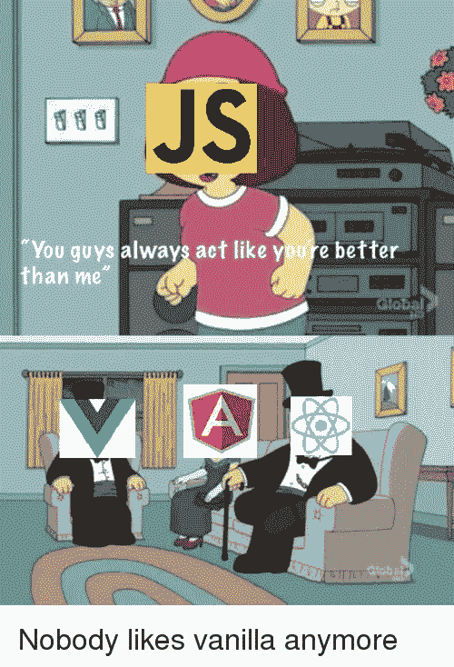

# 普通 JavaScript 简单密码生成器

> 原文：<https://javascript.plainenglish.io/vanilla-js-simple-password-generator-87e02e5c506a?source=collection_archive---------6----------------------->


创建密码生成器项目是学习 JavaScript 的最好方法之一。显然，它可以用 React/Vue/Angular 进行优化，但是如果你没有掌握普通 JavaScript，我强烈建议你在选择 JavaScript 框架之前先关注基础。

# 创建项目

由于我们不会使用任何框架，该项目将只包含**index.html**、 **styles.css** (这里不会涉及，但可以在博客末尾的 GitHub repo 中找到)，以及 **script.js** 。

# HTML 模板/文件

按照标准的方法，我们将从建立 index.html 骨架开始。

我们首先从 https://fonts.google.com/[导入一种字体，为这个项目使用一种更吸引人的字体。此后在 **<主体>** 中，创建一个 **<节>** 和一个标准的 **div "container"** 类来使容器居中。](https://fonts.google.com/)

导入的 **SVG** (可缩放矢量图形)是为了剪贴板图标的出现，以便以后复制生成的密码。

接下来是“range”类，它将包含一个标签，创建一个**滑动范围**来选择密码的长度。


在 div 类“include”中，如果你想添加大写、小写或符号，我们将添加输入类型**复选框**。


HTML 的其余部分非常明显。按下按钮后，我们将根据长度和包含的复选框生成密码。



It may not look alluring but it does its job ❤ ;)

如前所述，CSS 将不包括在内。但是你可以看看下面的 GitHub repo(如果你看了我会很惊讶)。


# 密码生成器背后的逻辑

典型的开始方式是在开始时命名你的 **const** 变量，这就是我们将要做的。

## 命名变量

```
const characterUppercase = document.getElementById('uppercase');
const characterSymbols = document.getElementById('symbols');
const characterNumbers = document.getElementById('numbers');
const passwordDisplay = document.getElementById("passwordDisplay");
// copy to clipboardconst copyClipboard = document.getElementById("CopyToClipBoard");// charactersconst lowercase = "abcdefghijklmnopqrstuvwxyz";
const uppercase = "ABCDEFGHIJKLMNOPQRSTUVWXYZ";
const numbers = "0123456789";
const symbols = "!@#$%^&*_-+=";
```

## 生成密码

我们继续获取按钮“generate-password”的 id，并向其添加事件监听器。

**e.preventDefault()** 是一个相当标准的过程，因此页面不会在我们每次生成新密码时重新加载， **let characters** 将保存初始小写字母作为密码生成器的默认。

**const characterAmount** 将始终读取我们希望密码拥有的字符长度

上面有一个字符***。选中将添加其他符号，如果他们被选中！

const password 将通过运行 **generatePassword** 函数生成实际的密码，该函数带有传入***character amount+characters 的两个属性。***

在此结束**addevent listener**add password display . innertext = password 以显示在 **h3** 标签的密码区域。

功能相当简单。作为起点，创建一个空的 **let 密码**变量。接下来是一个 for 循环，它将遍历所需的字符长度。

在每个字符处，密码变量将使用 **Math.floor** 方法添加一个字符，从 **characters.length.** 中添加一个随机字符

通过返回密码来结束它

## 复制到剪贴板

像往常一样，我们喜欢在按下按钮时复制文本，而不是突出显示整个文本！所以为什么不加呢？



On clipboard when hovering pointer will appear as well background color brighters(those are my CSS skills :P)

和以前一样——**copy clipboard**也有“click”**addevent listener**会创建一个及时的文本区域。如果 none 返回 nothing，则获取密码。textareas 值将是密码值。在 body DOM 中，我们使用 **appendChild** () **方法**来添加 textarea 值。

我们使用 **execComand('copy')** 方法完成它，然后删除它已经被复制的内容，然后提醒用户它已经被复制了。



# 结论

普通 JavaScript 可以做很多事情，强烈建议您提高自己的普通 JavaScript 技能。即使在学习作为我选择的 JavaScript web 框架的 VueJS 时，我仍然在提高我的技能。



Me rushing on learning a JS framework…

仅仅快进到一个框架可能是诱人的，但它可能会在很大程度上适得其反。尽管如此，我希望你学到了很多，并随时给出建议或留下评论！GitHub 回购如下:

[](https://github.com/Mozes721/Password_Generator_JS) [## Mozes721/Password_Generator_JS

### 在 GitHub 上创建一个帐户，为 Mozes721/Password_Generator_JS 开发做贡献。

github.com](https://github.com/Mozes721/Password_Generator_JS) 

*更多内容请看*[***plain English . io***](http://plainenglish.io/)