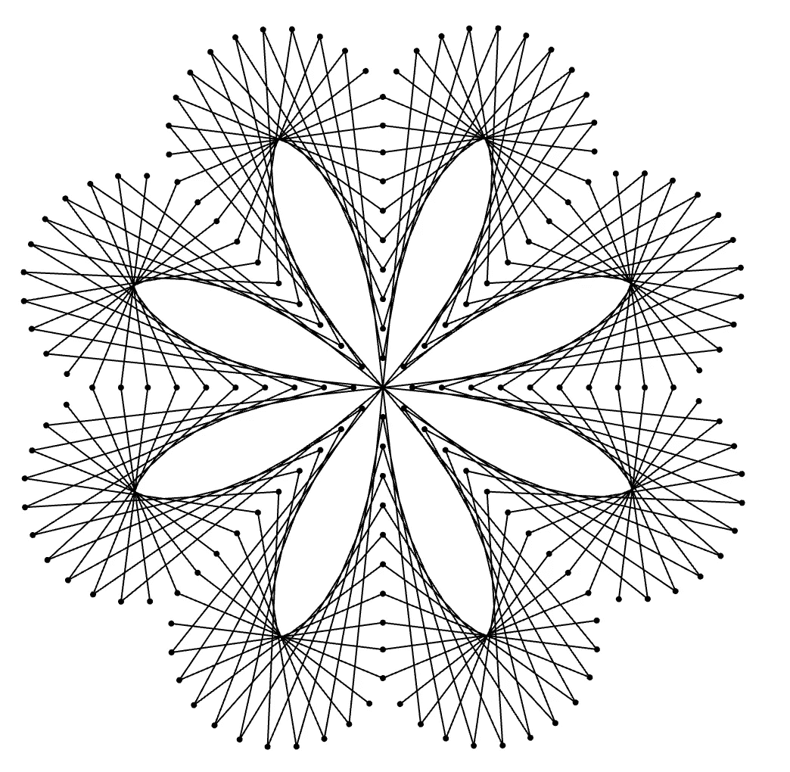

# 用 PixiJS 对 SVG 内容进行矢量渲染

> 原文：<https://javascript.plainenglish.io/vector-rendering-of-svg-content-with-pixijs-6f26c91f09ee?source=collection_archive---------3----------------------->

## 介绍基于 WebGL 的最丰富、最快速的 SVG 解决方案之一



By Jooja — This file was derived from: Fonalgrafika virag minta hurok varras.jpg:, CC BY-SA 3.0, [https://commons.wikimedia.org/w/index.php?curid=96183982](https://commons.wikimedia.org/w/index.php?curid=96183982)

SVG 是存储矢量内容的实际解决方案，能够在 2D WebGL 内容中使用它非常有用。这是渲染设计中所需的小图标的最佳解决方案！在这里，我将介绍一个新的 SVG 库，它支持更广泛的特性集，并针对高性能渲染进行了调整。

# 介绍@pixi-essentials/svg

[@pixi-essentials/svg](https://github.com/SukantPal/pixi-essentials/tree/master/packages/svg) 提供了一个简单易用的 API，用于在 PixiJS 中构建 svg 场景:

```
import { SVGScene } from '@pixi-essentials/svg';const svgMarkup = await fetch("<svg_url>")
  .then((data) => data.json());
const svgDOM = new DOMParser().parseFromString(svgMarkup, "image/svg+xml");
const svgEl = svgDOM.documentElement;// Here's the fun
const scene = new SVGScene(svgEl);
```

这个 SVG 场景是一个简单的`DisplayObject`,可以安装在应用程序主场景的任何地方。

以前的解决方案，如 pixi-svg、pixi-svg-graphics、pixi5-svg 和 svgatlas 都是较小的库，具有较少的功能集支持或更多的错误。我需要完整的 SVG 原生规范和更好的性能——这正是@pixi-essentials/svg 所能提供的。

最大的特点是变换、文本、蒙版、渐变、<use>和。这个库也被设计成可扩展的 SVGScene 保存了一个显示对象图，这些对象与每个 SVG 元素有一对一的映射。这允许您覆盖每个 SVG 元素的建模方式。</use>

@pixi-essentials/svg 中使用的关键优化是内置剔除和共享纹理。当在可平移和可缩放的相机中使用时，SVGScene 可以比基于 DOM 的解决方案快得多。这是因为浏览器不会针对 DOM 上使用的任意转换进行优化。

Rendering a diagram from Wikipedia using @pixi-essentials/svg

*一个人在家无聊的编码？检出一个* [*虚拟工作区*](https://www.kumospace.com/blog/virtual-workspace) *并聚在一起。*

# 场景结构

1.0 版本以同步方式立即填充场景图形。每个 SVG 元素都被映射并“嵌入”到一个 SVG 呈现“节点”中。

在自定义场景图形之前，您需要了解它是如何生成的:

*   `populateScene` —这是整个过程开始的地方。如果需要的话，它将拆除场景图形的任何先前状态。
*   `populateSceneRecursive` —这最初是对根`SVGSVGElement`的调用，随后贯穿整个 SVG DOM。
*   `createNode`为传递的元素创建一个节点，然后`embedIntoNode`将调用适当的特定于节点的 API 来嵌入元素。

灵活性最大的点是`createNode`。对于特定的元素，您可以覆盖它并返回您的自定义节点。当您想要添加交互或动画时，这可能会很有用。

以下示例旋转图标元素，并使用[变形器](https://api.pixijs.io/@pixi-essentials/transformer/Transformer.html)使其可拖动。

Customizing a SVG scene graph to add animations and interactivity

# 特征

## 梯度

渐变被实现为“画图服务器”，它懒洋洋地为纹理提供栅格化的渐变。

## 面具

遮罩被实现为“渲染服务器”，这是绘画服务器的一个更一般化的变体。该场景在顶层保留了一个可以由节点共享的“服务器场”。

遮罩服务器通过 L2R 滤镜过滤嵌入遮罩的内容，该滤镜将输入的亮度存储到输出的红色通道中。生成的纹理被用作带有像素的精灵遮罩滤镜。

然而，我不得不承认，面具现在有点参差不齐。

## 文本

<text>和<tspan>元素被排除在 SVG 本地规范之外。但是，@pixi-essentials/svg 仍然支持它们，因为它们被广泛使用。</tspan></text>

Hello world! svg

内置的文本引擎使用 Canvas2D API 来栅格化字形。您可以通过实现 [SVGTextEngine](https://api.pixijs.io/@pixi-essentials/svg/SVGTextEngine.html) 接口并将其设置为 [defaultEngine](https://api.pixijs.io/@pixi-essentials/svg/SVGTextNode.html#defaultEngine) 来插入您自己的文本解决方案。

# 最佳化

@pixi-essentials/svg 采用了三大优化，使其速度超快:

*   剔除:内部场景图形剔除每一帧，这样屏幕外的任何内容都不会被渲染。这对于较大的 SVG 文件非常重要。
*   纹理图集:节点共享一个[canvastexturelocator](https://api.pixijs.io/@pixi-essentials/texture-allocator/CanvasTextureAllocator.html)来存储静态光栅化内容。当您的 SVG 文件中有多个<图像>元素时，这很有用。
*   惰性转换更新:默认情况下，PixiJS 在所有显示对象上调用`updateTransform`。然而，SVG 场景图对此是“屏蔽的”,只有在转换无效时才会更新。这发生在一个节点触发一个`nodetransformdirty`事件时(这又在场景本身上触发一个`transformdirty`事件)。

因为 SVG 场景图是相对静态的，所以它的边界随着它的变换而更新。这意味着你可以依赖`node._bounds`有效，完全跳过`getBounds()`！这在对 SVG 场景进行自定义点击测试时非常有用。

# 进一步发展

@pixi-essentials/svg 还很年轻，在很多情况下可能会产生不正确的结果。请随意在 [GitHub 库](https://github.com/SukantPal/pixi-essentials/issues)上报告这些。

未来的版本可能还包括在空闲期间异步填充场景图形，更好的遮罩和文本质量。

本文展示的也是一个 SVG！

*嘿大家好，我是*[*PixiJS Essentials Kit*](https://github.com/SukantPal/pixi-essentials)*的作者，也是 pix ijs 项目的维护者。在 Twitter 上关注我，获取更多我的内容！*

[https://twitter.com/ShukantP](https://twitter.com/ShukantP)