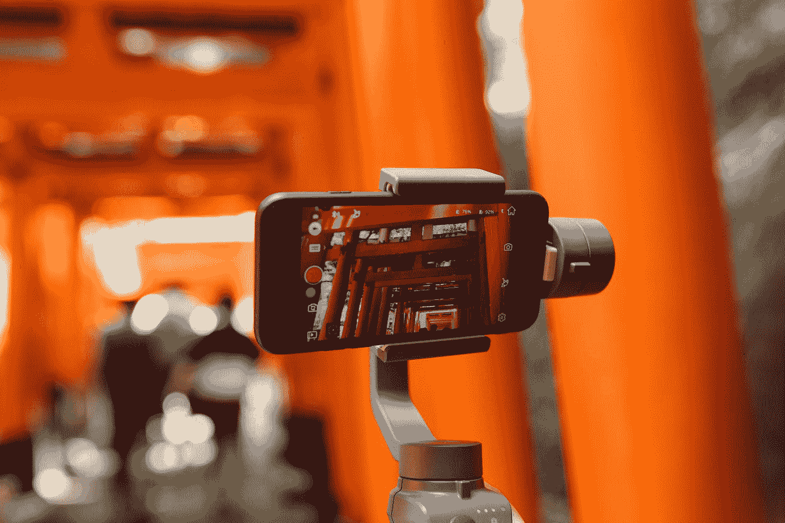
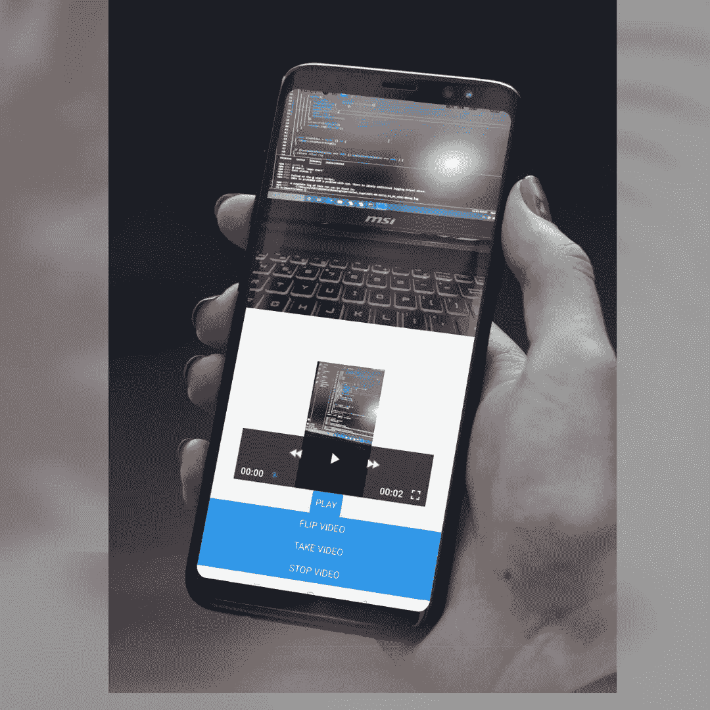

# 在 React Native Expo 中构建视频录制和播放应用程序(Android 和 IOS)

> 原文：<https://javascript.plainenglish.io/video-recording-and-playback-app-in-react-native-expo-android-ios-f6390bab65e8?source=collection_archive---------0----------------------->

## 如何使用 JavaScript 代码构建一个适用于 Android 和 IOS 设备的视频录制应用程序？

各位原生开发者好！

当您开始学习 React Native 时，您会经历不同的讲座、教程和文章，以构建不同的项目和学习内容。录音应用就是这样一个应用。对于一个录制应用程序，你必须知道相机应用程序如何工作，如何管理视频质量，比特率，持续时间等等。如何停止视频录制或视频播放？还有更多的东西需要了解。所以，让我们先来一杯咖啡。



Photo by [Joey Huang](https://unsplash.com/@onice?utm_source=medium&utm_medium=referral) on [Unsplash](https://unsplash.com?utm_source=medium&utm_medium=referral)

如果你喜欢视频教程，那么它就在这里:

# 设置和安装

使用命令:`expo init videoRec`在您的首选目录中启动一个 **expo-CLI** 项目(您可以根据自己的选择将其命名为)。选择空白模板并完成 JavaScript 依赖项的安装。之后，使用命令在父目录中安装以下软件包:

```
npm install expo-cameranpm install expo-av
```

`expo-camera`用于操作 React 原生应用程序中的摄像头功能，`expo-av`用于显示应用程序中的视频。借助 expo-av 软件包，您可以在应用程序中播放、停止和转发视频。

我们已经完成了安装部分。让我们现在开始黑吧。

# 视频录制应用程序代码(React Native)

## App.js

从各自的包中导入以下组件，因为我们将在我们的项目中使用它们。

```
import React, { useState, useEffect } from 'react';
import { StyleSheet ,Text, View, Button,} from 'react-native';
import { Camera } from 'expo-camera';
import { Video } from 'expo-av';
```

首先，我们要设置摄像机进行录像。然后我们将切换到显示该视频。现在，对于视频录制，您需要从用户那里访问两件东西。一个是摄像头，另一个是用于音频目的的麦克风接口。

```
const [hasAudioPermission, setHasAudioPermission] = useState(null);
const [hasCameraPermission, setHasCameraPermission] =useState(null);
const [camera, setCamera] = useState(null);
const [record, setRecord] = useState(null);
const [type, setType] = useState(Camera.Constants.Type.back);
```

我们将对音频、视频、相机许可、类型和记录使用 react-hook。因为我们请求用户允许访问，然后将我们的状态从 null 更改为其他字段。

```
useEffect(() => {
    (async () => {
      const cameraStatus = await Camera.requestPermissionsAsync();
      setHasCameraPermission(cameraStatus.status === 'granted');const audioStatus = await Camera.requestMicrophonePermissionsAsync();
      setHasAudioPermission(audioStatus.status === 'granted');})();
  }, []);
```

上述代码用于访问用户设备的摄像头和麦克风的权限。一旦用户给予许可，那么摄像机和麦克风的无效状态将被更新的状态所取代。

```
const takeVideo = async () => {
    if(camera){
        const data = await camera.recordAsync()
        setRecord(data.uri);
        console.log(data.uri);
    }
  }
```

这个箭头功能将负责您的视频记录，我们将视频的 URI 设置为数据。只需控制台日志这个 URI 如上所述，你会看到视频网址链接在您的内部存储。

```
const stopVideo = async () => {
    camera.stopRecording();
  }
```

要停止录像，我们需要上面的箭头功能。

```
if (hasCameraPermission === null || hasAudioPermission === null ) {
    return <View />;
  }
if (hasCameraPermission === false || hasAudioPermission === false) {
    return <Text>No access to camera</Text>;
  }
```

如果用户拒绝访问权限，那么我们将在屏幕上显示“禁止访问摄像机”。

```
<View style={styles.cameraContainer}>
     <Camera 
      ref={ref => setCamera(ref)}
      style={styles.fixedRatio} 
      type={type}
      ratio={'4:3'} />
 </View>
```

上面的代码是用来显示摄像头的。我们想要一个 4:3 比例的摄像机屏幕。您可以相应地自定义它们。

```
<Button
   title="Flip Video"
   onPress={() => {
   setType(
     type === Camera.Constants.Type.back
     ? Camera.Constants.Type.front
     : Camera.Constants.Type.back
     );
     }}>
</Button>
<Button title="Take video" onPress={() => takeVideo()} />
<Button title="Stop Video" onPress={() => stopVideo()} />
```

这些是我们将要使用的基本按钮。第一个是翻转摄像头，这意味着您可以从前置或后置摄像头录制视频。另外两个是记录视频和停止视频。

现在我们可以拍摄视频了。我们要怎么玩呢？

# 使用 React Native 播放视频

为了播放视频，我们需要两个新的 react 挂钩。

```
const video = React.useRef(null);
const [status, setStatus] = React.useState({});
```

现在添加视频播放屏幕和播放按钮。

```
<Video
   ref={video}
   style={styles.video}
   source={{
     uri: record,
   }}
   useNativeControls
   resizeMode="contain"
   isLooping
   onPlaybackStatusUpdate={status => setStatus(() => status)}
/>
<View style={styles.buttons}>
  <Button
    title={status.isPlaying ? 'Pause' : 'Play'}
    onPress={() =>
       status.isPlaying ? video.current.pauseAsync() : video.current.playAsync()
    }
   />
</View>
```

要播放视频，您需要该视频的 URI。我们已经制作了录制视频的 URI，并将其保存在录制状态。我们只需要在这里使用它。

现在，您也可以自定义您的视频。怎么做呢？

# 使用 React Native Expo 定制视频质量、时长、比特率

```
const takeVideo = async () => {
    if(camera){
        const data = await camera.recordAsync({
          VideoQuality:['2160p'],
          maxDuration:10,
          maxFileSize:200,
          mute:false,
          videoBitrate:5000000
        })
        setRecord(data.uri);
        console.log(data.uri);
    }
  }
```

记住这一点:我们正在使用摄像机录制视频。现在根据您的选择添加变量。这里我们将视频质量设置为 2160p，最大持续时间以秒计算。文件大小以字节计算。静音字段为布尔型。我们已经将视频比特率设置为 5mbps。根据您的选择和要求进行设置。

因为我们主要关注这些东西的功能而不是样式。您可以相应地设计它们的样式。现在，在终端窗口中运行这个应用程序，并在您的设备上运行 expo 应用程序。您将在设备屏幕上看到类似这样的输出。



Video Record using React Native Expo

本文到此为止。如果你在某个地方迷路了或者需要完整的代码访问，那么 **Github 代码**就是这里的。

感谢阅读！而且如果这篇文章对你有帮助，那就尽情鼓掌吧。

*更多内容尽在*[***plain English . io***](http://plainenglish.io/)